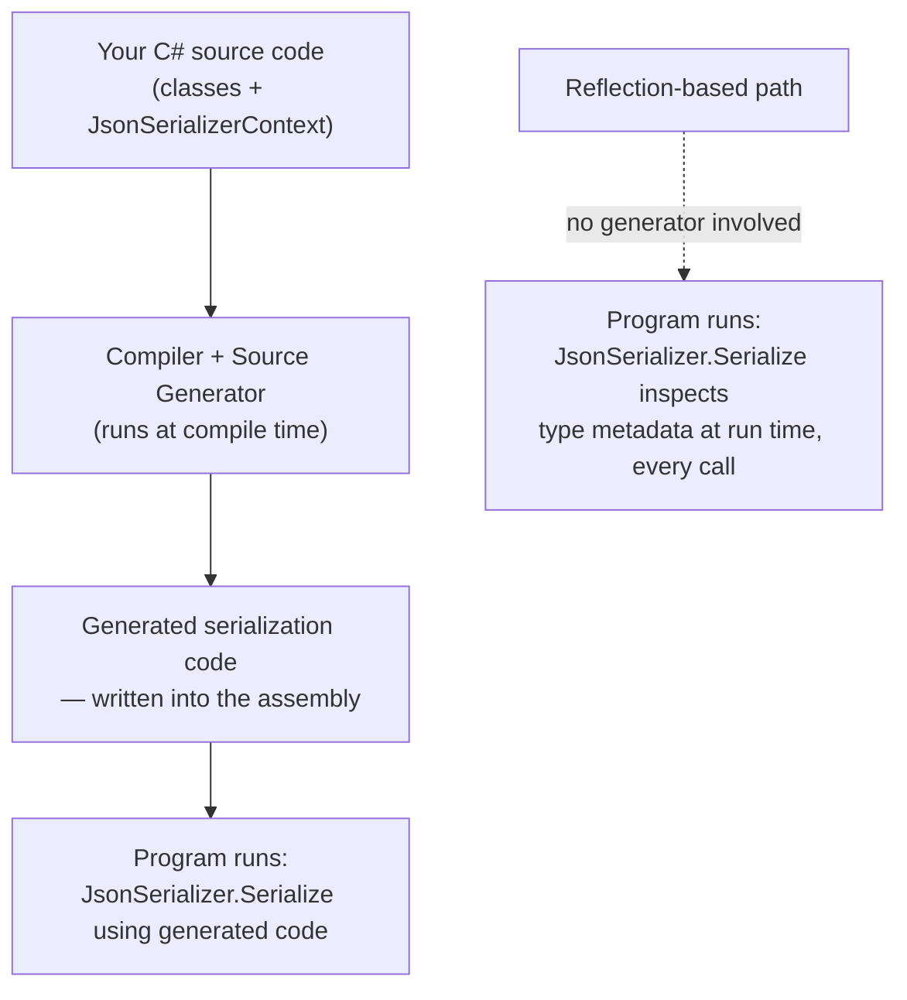
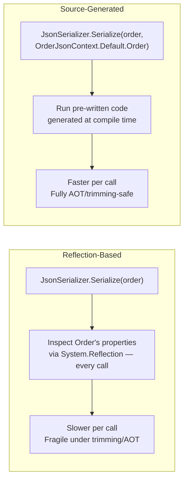

# Source Generators for Performance

## Introduction

Before reading this lesson, you should already be comfortable with **[JIT vs Native AOT Compilation](../12-advanced-concepts/12-33-jit-vs-native-aot.md)**, especially the idea that Native AOT compiles your program to a native executable ahead of time, with no JIT and no runtime code generation available once it ships. That constraint raises an obvious problem: a lot of .NET's convenience — JSON serialization, dependency injection, object-relational mapping — has traditionally leaned on **reflection**, inspecting types and their members at runtime. Reflection is slow relative to hand-written code, and some of its more dynamic tricks don't work at all under Native AOT's trimming and ahead-of-time model. **Source generators** are the answer: components that run during compilation, inspect your code, and emit additional C# source files that get compiled right alongside it — turning what used to be a runtime lookup into code that already exists before the program ever runs. This lesson previews source generators specifically through the lens of performance; a full deep-dive into writing your own generators arrives in Module 13.

By the end of this lesson, you will be able to:

- Explain what a source generator is and when it runs, relative to your own code
- Explain why reflection is comparatively slow and why it's restricted under Native AOT
- Enable System.Text.Json's source-generated serializers with `JsonSerializerContext` and `[JsonSerializable]`
- Compare reflection-based and source-generated serialization on performance and AOT-compatibility grounds
- Recognize where else in .NET source generators already replace reflection-heavy patterns

## Source Generators for Performance — A Layman's Perspective

Imagine two ways a translator could handle a stack of documents that need converting from English to French every single day. The first translator has no advance knowledge of what the documents will say. Each morning, a fresh stack of documents arrives, and the translator opens each one, reads through it word by word, figures out its structure and vocabulary on the spot, and only then produces the French version. This happens *every single day*, from scratch, no matter how many times an identical document has already been translated before. This is reflection: inspecting a type's shape — its properties, their names, their types — over and over, at the exact moment the program needs it, every single time.

The second translator works completely differently. Before any documents ever need translating for real, this translator sits down once, in advance, and studies the handful of document *templates* the business actually uses — the invoice template, the receipt template, the shipping label template. For each one, they write out a complete, word-for-word translation script: "when you see an invoice, the customer name always goes here, the total always goes there, translate it exactly like this." That script gets written once and filed away. From that point forward, translating any invoice is just running the pre-written script — no re-reading, no re-figuring-out, no wasted analysis, because all of the thinking already happened ahead of time, back when there was no deadline pressure at all.

That upfront, one-time preparation is exactly what a source generator does, except the "preparation" happens during your program's *compilation*, not at some vague earlier point in time. A source generator is handed your actual code — the real classes you wrote, with their real property names and types — while the compiler is still working, and it writes brand-new, fully spelled-out source code in response: "for this exact class, reading this exact property is done exactly like this." That generated code is compiled together with the rest of your program, so by the time your program actually runs, there's no on-the-spot figuring-out left to do — just running code that was already fully written out in advance, exactly like the second translator's pre-written scripts.

The performance win follows directly from that difference. The first translator's approach costs real time on every single document, forever, because the analysis never stops repeating. The second translator's approach pays that analysis cost exactly once, long before it matters, and every day after that is just cheap, mechanical execution of an already-known script. A program that leans on source generators instead of reflection is making that same trade: pay the cost once, at compile time, when nobody's waiting on it, instead of paying it over and over, at runtime, when somebody is.

## Source Generators for Performance — A Programming Language Perspective

A **source generator** is a compiler plugin implementing Roslyn's `IIncrementalGenerator` interface that participates directly in the compilation pipeline: it receives the syntax and semantic model of the code currently being compiled, analyzes whatever it's configured to look for (a marked class, an attribute, a partial method), and produces additional C# source files that the compiler then compiles as if you had written them by hand. This all happens at **compile time**, before the assembly exists — in sharp contrast to reflection (`System.Reflection`), which inspects `Type`, `PropertyInfo`, and similar metadata objects at **run time**, after the assembly is already loaded. Because a source generator's output is ordinary, statically-known C# baked into the assembly, it requires no runtime type inspection, works cleanly with trimming, and is fully compatible with Native AOT — whereas unconstrained reflection-based code generation (`System.Reflection.Emit`) is one of the patterns Native AOT cannot support at all. Source generators are consumed today primarily as library authors' output — System.Text.Json's `JsonSerializerContext`, regex's `[GeneratedRegex]`, and ASP.NET Core's minimal API route generation all ship pre-built generators you opt into.

## How to Use a Source-Generated JSON Serializer in C#

System.Text.Json (introduced back in Module 9) supports two serialization modes: the default **reflection-based** mode, which inspects your types at run time every time you serialize, and a **source-generated** mode, which you opt into by declaring a partial class that inherits `JsonSerializerContext` and annotating it with `[JsonSerializable]` for each type you need. The source generator sees those attributes at compile time and emits fully-written serialization code for exactly those types — no runtime reflection involved.


*Figure 1: Source-generated serialization does its type analysis once, at compile time; reflection-based serialization repeats it on every call at run time.*

```csharp
// Program.cs — .NET 10 / C# 14
using System.Text.Json;
using System.Text.Json.Serialization;

var product = new Product("Wireless Mouse", 24.99m, InStock: true);

// Uses the source-generated context — no reflection at run time.
string json = JsonSerializer.Serialize(product, ProductJsonContext.Default.Product);
Console.WriteLine(json);

Product? roundTripped = JsonSerializer.Deserialize(json, ProductJsonContext.Default.Product);
Console.WriteLine($"Deserialized: {roundTripped?.Name}, In stock: {roundTripped?.InStock}");

record Product(string Name, decimal Price, bool InStock);

[JsonSerializable(typeof(Product))]
internal partial class ProductJsonContext : JsonSerializerContext
{
}
```

**Console Output:**

```text
{"Name":"Wireless Mouse","Price":24.99,"InStock":true}
Deserialized: Wireless Mouse, In stock: True
```

`ProductJsonContext` is declared as an empty `partial class` — you never write its body. The `[JsonSerializable(typeof(Product))]` attribute is the signal the source generator looks for at compile time; in response, it generates the rest of `ProductJsonContext`'s partial definition, containing hand-written-equivalent serialization logic specifically for `Product`. `ProductJsonContext.Default.Product` hands `JsonSerializer` that pre-built logic directly, bypassing the reflection-based path entirely — the same `JsonSerializer.Serialize`/`Deserialize` API you already know from Module 9, just pointed at generated code instead of runtime type inspection.

## Real-Time Example: AOT-Ready Order Serialization in E-Commerce Order Processing

We continue the E-Commerce Order Processing domain, extending the `Order` and `OrderLine` records used throughout Module 9 and Module 11. A real order-processing service publishing to a message queue or an HTTP API serializes orders constantly — on every checkout, every status update, every webhook delivery — making serialization one of the hottest code paths in the whole system. If that service is also published as a Native AOT executable (the subject of the previous lesson) for faster startup and a smaller container image, source-generated serialization isn't just faster — reflection-heavy serialization can silently misbehave or throw under aggressive trimming, so the source-generated path is the only fully supported option.

```csharp
// Program.cs — .NET 10 / C# 14 — Real-Time Example (E-Commerce Order Processing)
using System.Text.Json;
using System.Text.Json.Serialization;

var order = new Order(
    OrderId: "ORD-88231",
    CustomerName: "Priya Nair",
    Lines:
    [
        new OrderLine("USB-C Hub", 2, 39.50m),
        new OrderLine("Laptop Stand", 1, 45.00m)
    ]);

string json = JsonSerializer.Serialize(order, OrderJsonContext.Default.Order);
Console.WriteLine(json);

decimal total = order.Lines.Sum(line => line.Quantity * line.UnitPrice);
Console.WriteLine($"Order total: {total:C}");

record OrderLine(string ProductName, int Quantity, decimal UnitPrice);
record Order(string OrderId, string CustomerName, List<OrderLine> Lines);

[JsonSerializable(typeof(Order))]
internal partial class OrderJsonContext : JsonSerializerContext
{
}
```

**Console Output:**

```text
{"OrderId":"ORD-88231","CustomerName":"Priya Nair","Lines":[{"ProductName":"USB-C Hub","Quantity":2,"UnitPrice":39.50},{"ProductName":"Laptop Stand","Quantity":1,"UnitPrice":45.00}]}
Order total: $124.50
```

Every field of `Order` and its nested `Lines` collection was serialized entirely through code the source generator wrote at compile time — no `PropertyInfo` lookups, no runtime attribute scanning. For an order-processing service handling thousands of checkouts per minute, that difference compounds directly into lower CPU usage per request and a service that serializes correctly under Native AOT trimming rather than failing unpredictably in production.

## Reflection-Based Serialization vs. Source-Generated Serialization

Reflection-based serialization is the more familiar default: call `JsonSerializer.Serialize(order)` with no context, and System.Text.Json inspects `Order`'s properties through `System.Reflection` at the moment it runs, every single call. It requires zero setup and works everywhere the reflection APIs are available, but that per-call inspection cost is real, and reflection-heavy paths are exactly what Native AOT's trimmer struggles to reason about safely, since it can't always prove ahead of time which members reflection will touch. Source-generated serialization moves that entire analysis to compile time: the generator inspects `Order`'s shape once, while compiling, and writes explicit, non-reflective code for exactly the members that exist — code the trimmer can see and preserve with total confidence, and code the CPU executes with no metadata lookup at all.


*Figure 2: Reflection repeats its analysis on every call; a source generator performs the equivalent analysis once, at compile time.*

| Aspect | Reflection-Based | Source-Generated |
|---|---|---|
| When type is analyzed | Every call, at run time | Once, at compile time |
| Per-call overhead | Higher — metadata lookups each time | Lower — pre-built code runs directly |
| Native AOT compatibility | Partial — trimmer may not see all reflected members | Full — generated code is statically visible |
| Setup required | None — works out of the box | Declare a `JsonSerializerContext` with `[JsonSerializable]` |
| Startup/JIT cost | Reflection metadata still loaded lazily | Generated code is ready immediately |

## Types of Source-Generator-Powered Performance Features in .NET

Source generators already power several performance-sensitive corners of .NET, beyond System.Text.Json:

1. **`JsonSerializerContext` (System.Text.Json)** — this lesson's flagship example, generating reflection-free serialization code per type.
2. **`[GeneratedRegex]`** — generates a compiled, source-level regular expression engine at compile time instead of building one at first use.
3. **`LoggerMessage` source generator** — generates strongly-typed, allocation-minimal logging methods from `[LoggerMessage]`-attributed partial methods.
4. **ASP.NET Core minimal API route generation** — generates request-handling glue code at compile time for AOT-published minimal APIs.
5. **Writing custom source generators (Module 13)** — the full `IIncrementalGenerator` deep dive, building your own generator rather than consuming a built-in one.
6. **[JIT vs Native AOT Compilation](../12-advanced-concepts/12-33-jit-vs-native-aot.md)** — this lesson's prerequisite, covering the broader compilation model source generators are designed to fit into.

## What You've Learned & What's Next

Source generators move work that reflection would otherwise repeat at run time into a one-time step at compile time, producing ordinary C# code that's both faster to execute and fully visible to Native AOT's trimmer — System.Text.Json's `JsonSerializerContext` is the clearest, most immediately usable example of that trade. Reducing runtime overhead by moving work earlier is one lever for a faster program; the next lesson turns to a different one, tuning the garbage collector itself.

Continue your learning journey with **[GC Tuning](../12-advanced-concepts/12-35-gc-tuning.md)**, where we revisit Module 8's garbage collection lessons and look at server vs. workstation GC, tiered PGO, and why reducing allocations is usually the single highest-leverage performance change you can make.

---
*Applies to: .NET 10 / C# 14. Last reviewed 2026-08-16.*
