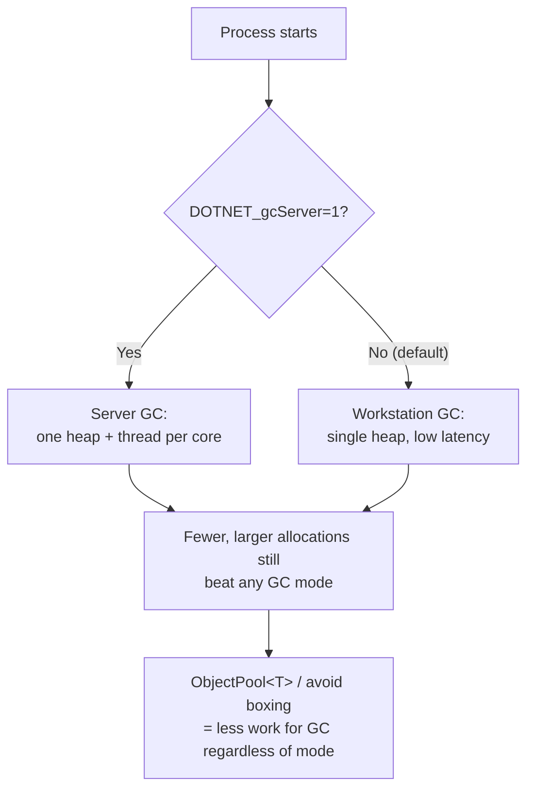
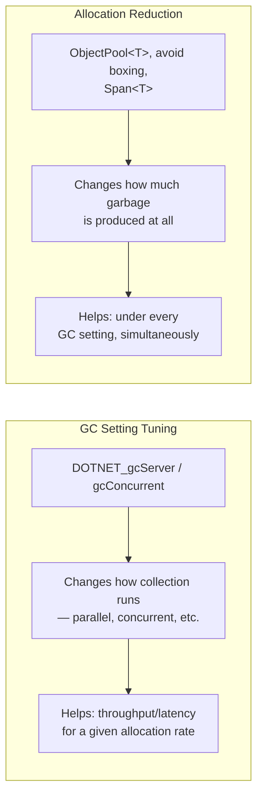

# GC Tuning

## Introduction

Before reading this lesson, you should already be comfortable with **[Source Generators for Performance](../12-advanced-concepts/12-34-source-generators-for-performance.md)**, and with Module 8's garbage collection lessons — generations, `GC Server vs. Workstation`, and boxing's hidden allocations. This lesson revisits that ground with a sharper, tuning-focused lens: not just *what* the garbage collector does, but how you configure it for a specific workload, and — more importantly — how you write code that gives it less work to do in the first place. Tuning the collector's settings can help; reducing how much garbage your program creates helps far more, and this lesson treats that as its central point rather than an afterthought.

By the end of this lesson, you will be able to:

- Configure Server GC and Concurrent GC via the `DOTNET_gcServer` and `DOTNET_gcConcurrent` environment variables
- Explain what TieredPGO is and how it lets the JIT specialize hot code paths based on observed runtime behavior
- Identify allocation reduction as the single highest-leverage GC performance technique, ahead of any collector setting
- Use `ObjectPool<T>` to reuse objects instead of repeatedly allocating and discarding them
- Recognize how avoiding boxing (Module 8, Lesson 7) fits into the same allocation-reduction strategy

## GC Tuning — A Layman's Perspective

Picture a busy office with one overworked filing clerk whose job is to periodically walk the floor, gather every piece of paper nobody needs anymore, and clear it away so desks don't disappear under clutter. There are two very different ways to make that clerk's job easier. The first way is to change *how the clerk works* — give them a faster cart, let them work in short bursts between other tasks instead of one long sweep, or even hire a second clerk so clearing paper happens in parallel with everyone still working. That's real, and it helps. But it's still fundamentally reacting to a mess that's already been made.

The second way is to change *how much paper gets generated in the first place*. If every employee in that office, instead of grabbing a brand-new sticky note for every single passing thought and then immediately throwing it away, kept one reusable whiteboard on their desk and wiped it clean when they were done with a thought — the clerk would have dramatically less to clean up on every single sweep, no matter how the sweeping itself is organized. Fewer things get created and discarded, so there's less to collect, full stop.

Tuning the .NET garbage collector's settings — Server GC, Concurrent GC, and similar switches — is the first kind of change: making the clerk's *process* faster or better suited to the office's shape, whether that's a single small desk (a workstation app) or a sprawling building with many simultaneous teams (a many-core server handling concurrent requests). Those settings genuinely matter, and picking the wrong one for your workload costs real throughput. But reducing allocations — reusing objects instead of constantly creating short-lived ones, avoiding the kind of hidden allocation boxing quietly introduces — is the second kind of change, and it dwarfs the first in most real applications. An office that generates almost no disposable paper barely needs a clerk at all; a program that allocates sparingly barely feels the garbage collector's presence, no matter which settings it's running under.

The honest takeaway an experienced office manager would give you: don't spend all your effort perfecting the clerk's schedule if the real problem is that everyone's handing out sticky notes for no reason. Fix the habit that generates the mess before fine-tuning how the mess gets cleaned.

## GC Tuning — A Programming Language Perspective

.NET's garbage collector exposes two configuration axes most directly relevant to throughput tuning: **Server GC** (`DOTNET_gcServer=1`), which dedicates one GC heap and one collection thread per core — trading higher memory usage for parallel collection well-suited to multi-core server workloads — versus **Workstation GC** (the default, `DOTNET_gcServer=0`), which uses a single heap tuned for low latency on client-style, single-user applications; and **Concurrent GC** (`DOTNET_gcConcurrent`), which allows most of a full (generation 2) collection to run on a background thread concurrently with your application code, reducing pause times at some throughput cost. Separately, **TieredPGO** (Tiered Profile-Guided Optimization, enabled by default since .NET 8) lets the JIT compile methods first quickly and unoptimized, then re-compile genuinely hot methods later using data observed from actual execution — branches actually taken, types actually seen — producing more aggressively optimized native code than a single ahead-of-time compilation could justify. None of these settings change *how much* garbage your code produces; that remains entirely a function of your own allocation patterns, which is why `System.Buffers.ArrayPool<T>` and `Microsoft.Extensions.ObjectPool.ObjectPool<T>` — reusing existing object instances rather than allocating new ones — routinely outperform any collector configuration change.

## How to Configure GC Settings and Reduce Allocations in C#

GC mode is set through environment variables (or the equivalent `runtimeconfig.json`/project file settings) read once at process startup — there's no API call mid-run to flip Server GC on. Allocation reduction, by contrast, is an everyday coding decision: reusing a rented object via `ObjectPool<T>` instead of calling `new` repeatedly for short-lived objects that follow a predictable rent/return lifecycle.


*Figure 1: GC mode is a process-wide configuration choice; reducing allocations helps under every mode.*

```csharp
// Program.cs — .NET 10 / C# 14
using Microsoft.Extensions.ObjectPool;

// A pool of reusable StringBuilder instances instead of "new StringBuilder()" every time.
var provider = new DefaultObjectPoolProvider();
ObjectPool<System.Text.StringBuilder> pool = provider.CreateStringBuilderPool();

for (int i = 0; i < 3; i++)
{
    System.Text.StringBuilder sb = pool.Get(); // reuse, don't allocate
    sb.Append("Message #").Append(i);
    Console.WriteLine(sb.ToString());
    pool.Return(sb); // clears and hands it back for reuse
}

// Boxing example (see Module 8, Lesson 7): this line allocates on the heap
// every time, because the int is being treated as an object.
object boxedCount = 3;
Console.WriteLine($"Boxed value: {boxedCount}");
```

**Console Output:**

```text
Message #0
Message #1
Message #2
Boxed value: 3
```

The pooled `StringBuilder` is rented, used, and returned three times without ever calling `new StringBuilder()` more than once behind the scenes — the pool keeps the underlying instance alive and reuses its internal buffer instead of discarding it for garbage collection. The final line is a deliberate contrast: `boxedCount` forces the `int` onto the heap because it's being stored as `object`, producing exactly the kind of small, avoidable allocation that Module 8's boxing lesson warned about, and that no GC setting can undo after the fact — it can only be avoided in the code that creates it.

## Real-Time Example: Reducing Allocations in a Banking Transaction Processor

We extend the Banking/ATM domain's `Account` and `Transaction` types with a high-throughput transaction processor — the kind of component a real bank's core ledger service runs continuously, processing thousands of deposits and withdrawals per minute. Rather than reaching for a GC setting first, we apply this lesson's central lesson directly: an `ObjectPool<T>` for the mutable `TransactionResult` buffer used during processing, avoiding a fresh heap allocation for every single transaction that passes through.

```csharp
// Program.cs — .NET 10 / C# 14 — Real-Time Example (Banking/ATM)
using Microsoft.Extensions.ObjectPool;

var pool = new DefaultObjectPool<TransactionResult>(new TransactionResultPolicy());

var account = new Account("ACC-4471", Balance: 500.00m);
decimal[] withdrawals = [50.00m, 120.00m, 400.00m];

foreach (decimal amount in withdrawals)
{
    TransactionResult result = pool.Get(); // reused buffer, not a fresh allocation
    result.Reset(account.Id, amount);

    if (amount <= account.Balance)
    {
        account = account with { Balance = account.Balance - amount };
        result.Approved = true;
    }
    else
    {
        result.Approved = false;
    }

    Console.WriteLine(result.Approved
        ? $"[{result.AccountId}] Withdrew {amount:C} — new balance {account.Balance:C}"
        : $"[{result.AccountId}] Declined {amount:C} — insufficient funds (balance {account.Balance:C})");

    pool.Return(result); // hand the buffer back instead of discarding it
}

record Account(string Id, decimal Balance);

class TransactionResult
{
    public string AccountId { get; private set; } = "";
    public decimal Amount { get; private set; }
    public bool Approved { get; set; }

    public void Reset(string accountId, decimal amount)
    {
        AccountId = accountId;
        Amount = amount;
        Approved = false;
    }
}

class TransactionResultPolicy : PooledObjectPolicy<TransactionResult>
{
    public override TransactionResult Create() => new();
    public override bool Return(TransactionResult obj) => true;
}
```

**Console Output:**

```text
[ACC-4471] Withdrew $50.00 — new balance $450.00
[ACC-4471] Withdrew $120.00 — new balance $330.00
[ACC-4471] Declined $400.00 — insufficient funds (balance $330.00)
```

Across three withdrawals, exactly one `TransactionResult` instance is ever created — the pool hands out the same reused object each time, and `Reset` overwrites its fields instead of `new` allocating a replacement. Scaled up to a real bank processing millions of transactions a day, this single change removes millions of short-lived heap allocations that would otherwise all become the garbage collector's problem — regardless of whether that collector is running in Server or Workstation mode.

## Tuning GC Settings vs. Reducing Allocations

Tuning GC settings changes how the collector behaves *given* whatever garbage your program produces — Server GC parallelizes collection across cores, Concurrent GC overlaps collection with running code, and both are legitimate, workload-dependent choices a production service should make deliberately rather than by accident of the default. But neither setting reduces the *amount* of garbage created; they only change how efficiently it's cleaned up after the fact. Reducing allocations — object pooling, avoiding boxing, favoring `Span<T>`/`ReadOnlySpan<T>` (Module 8, Lesson 6) over intermediate copies — changes the input to that whole process, and a program that allocates less benefits under every GC configuration simultaneously, which is exactly why it's the higher-leverage lever.


*Figure 2: GC settings optimize collection of existing garbage; allocation reduction shrinks how much garbage exists to collect.*

| Aspect | GC Setting Tuning | Allocation Reduction |
|---|---|---|
| What it changes | How/when collection runs | How much garbage is created |
| Configured via | Environment variables / runtime config, at startup | Everyday code decisions (pooling, avoiding boxing) |
| Typical technique | `DOTNET_gcServer=1`, `DOTNET_gcConcurrent=1` | `ObjectPool<T>`, `ArrayPool<T>`, avoiding `object` boxing |
| Benefit scope | Depends on workload shape (server vs. client) | Universal — helps regardless of GC mode |
| Effort-to-impact | Moderate effort, workload-specific gain | Often the single highest-leverage change available |

## Types of GC Tuning Techniques in .NET

Several techniques make up a complete GC tuning strategy, some already covered and some pointing ahead:

1. **Server GC vs. Workstation GC (`DOTNET_gcServer`)** — this lesson's primary collector mode setting, revisited from Module 8's [GC Server vs. Workstation](../08-memory-management/08-10-gc-server-vs-workstation.md).
2. **Concurrent GC (`DOTNET_gcConcurrent`)** — overlapping most of a full collection with running application code to reduce pause times.
3. **TieredPGO** — profile-guided JIT recompilation of hot methods based on observed runtime behavior, enabled by default.
4. **`ObjectPool<T>` / `ArrayPool<T>`** — reusing object and array instances instead of repeatedly allocating and discarding them, this lesson's primary allocation-reduction tool.
5. **Avoiding boxing** — the Module 8, Lesson 7 technique of keeping value types unboxed to prevent unnecessary heap allocations.
6. **[Diagnostic Tools: dotnet-trace and dotnet-counters](../12-advanced-concepts/12-36-dotnet-trace-and-counters.md)** — the next lesson's CLI tools for actually observing GC behavior and allocation rates in a running process.

## What You've Learned & What's Next

GC settings like Server GC, Concurrent GC, and TieredPGO shape how the runtime collects garbage and executes hot code, and picking the right ones for your workload matters — but reducing allocations in the first place, through object pooling and avoiding boxing, remains the change that helps under every configuration at once, which is why it deserves to be your first instinct rather than your last resort. Knowing *what* to tune is only half the job; the next lesson covers *how to observe* GC behavior, allocation rates, and CPU usage in a real running process.

Continue your learning journey with **[Diagnostic Tools: dotnet-trace and dotnet-counters](../12-advanced-concepts/12-36-dotnet-trace-and-counters.md)**, where we cover the CLI tools that let you see exactly what the garbage collector — and the rest of the runtime — is doing in production.

---
*Applies to: .NET 10 / C# 14. Last reviewed 2026-08-16.*
