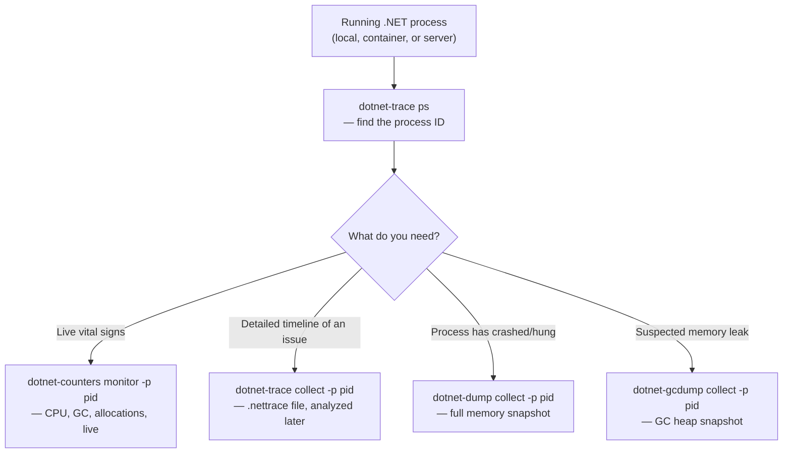
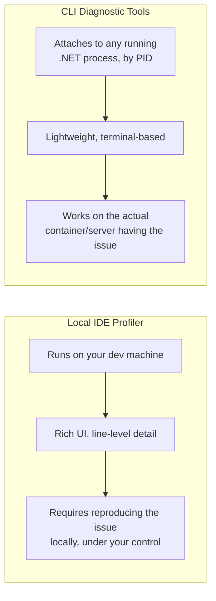

# Diagnostic Tools: dotnet-trace and dotnet-counters

## Introduction

Before reading this lesson, you should already be comfortable with **[GC Tuning](../12-advanced-concepts/12-35-gc-tuning.md)** and, ideally, with this entire "Performance & Diagnostics" sub-area: JIT vs. Native AOT compilation, source generators, and reducing allocations. Every one of those earlier lessons assumed you could inspect your own code and reason about it directly. Production incidents rarely afford you that luxury — a containerized service running on a server you can't attach a debugger to, at 2 AM, with customers affected, is a completely different diagnostic situation than a local IDE profiler session at your desk. This lesson is the capstone of the sub-area: the global .NET CLI diagnostic tools — `dotnet-trace`, `dotnet-counters`, `dotnet-dump`, and `dotnet-gcdump` — built specifically for that situation, and how they fit into a real production-incident workflow.

By the end of this lesson, you will be able to:

- Explain what each of `dotnet-trace`, `dotnet-counters`, `dotnet-dump`, and `dotnet-gcdump` is for
- Install and run these tools against a live .NET process by process ID
- Contrast a local IDE profiler with CLI diagnostic tools, and explain why containerized/server environments need the latter
- Describe a realistic production-incident diagnostic workflow using these tools together
- Recap how this sub-area's seven lessons — JIT/AOT, source generators, GC tuning, and this lesson — fit together as one coherent performance story

## dotnet-trace and dotnet-counters — A Layman's Perspective

Imagine a car mechanic who normally diagnoses engine trouble with the car up on a lift in their own garage — hood open, every part visible and touchable, engine off, all the time in the world to poke around. That's a comfortable, controlled diagnostic setting, and it's genuinely the best way to understand a car deeply when you can arrange it.

Now imagine instead that the "engine trouble" is happening on a delivery truck that's still out on its route, in traffic, right now, and pulling it into a garage isn't an option — stopping the truck *is* the emergency you're trying to avoid, not a step toward fixing it. What this situation needs isn't a mechanic's full garage — it's a small toolkit of instruments that can be clipped onto a moving vehicle from the outside, read live, without ever stopping the engine: a thermometer clipped to the engine block reading its temperature continuously, a diagnostic recorder that captures a short window of everything the engine did seconds before a warning light flickered, and — for the worst case, if the truck actually breaks down anyway — a way to pull a complete snapshot of everything the moment it happened, so the failure can be studied afterward exactly as it occurred, rather than guessed at.

That's the difference this lesson is about. A local IDE profiler is the garage with the lift — rich, deep, comfortable, and available when you can bring the "vehicle" to a controlled stop on your own machine. `dotnet-counters` is the thermometer clipped on from outside, streaming live vital signs — CPU, memory, request rate — without pausing anything. `dotnet-trace` is the diagnostic recorder, capturing a detailed window of what actually happened over a stretch of time, for you to study afterward. `dotnet-dump` and `dotnet-gcdump` are the last-resort snapshot tools — a complete freeze-frame of a process's memory, taken exactly when something's gone wrong, so the failure itself becomes something you can examine directly rather than something you can only hypothesize about after the truck's already been towed away.

## dotnet-trace and dotnet-counters — A Programming Language Perspective

`dotnet-trace`, `dotnet-counters`, `dotnet-dump`, and `dotnet-gcdump` are cross-platform global .NET CLI tools (installed via `dotnet tool install --global`) that attach to a running .NET process by process ID, using the runtime's built-in `EventPipe` diagnostics infrastructure — the same underlying mechanism ETW (Event Tracing for Windows) and LTTng expose on their respective platforms, but accessible identically on Windows, Linux, and macOS without any platform-specific setup. `dotnet-counters monitor -p <pid>` streams a live, continuously refreshing view of published `EventCounter`/`Meter` values — CPU usage, GC heap size, allocation rate, thread pool queue length — directly in the terminal. `dotnet-trace collect -p <pid>` captures a structured `.nettrace` file over a chosen time window, containing detailed CPU and event data later opened in Visual Studio, Perfview, or the cross-platform `speedscope`-compatible viewers. `dotnet-dump collect -p <pid>` captures a full process memory dump for offline analysis of managed state — object graphs, thread stacks, exceptions in flight — while `dotnet-gcdump collect -p <pid>` captures a lighter-weight, GC-heap-specific snapshot purpose-built for diagnosing managed memory growth and leaks without the overhead of a full memory dump.

## How to Use dotnet-trace and dotnet-counters in C#

None of these tools require changing your application's code — no attribute, no library reference, no rebuild. They attach externally to an already-running process, identified by its process ID, which you find with `dotnet-trace ps` or the platform's own process listing.


*Figure 1: All four tools attach externally, by process ID, to an already-running .NET process — no code changes required.*

```csharp
// Program.cs — .NET 10 / C# 14
// A small worker with a deliberately allocation-heavy loop, run first so a
// separate terminal can attach the diagnostic tools while it's executing.
var random = new Random();
long total = 0;

for (int i = 0; i < 5; i++)
{
    // Simulates allocation-heavy work: a new array every iteration.
    int[] batch = new int[50_000];
    for (int j = 0; j < batch.Length; j++)
    {
        batch[j] = random.Next(1, 100);
    }
    total += batch.Sum();

    Console.WriteLine($"Batch {i + 1} processed. Running total: {total}");
    await Task.Delay(1000); // pause so the process stays observable
}

Console.WriteLine("Worker finished.");
```

**Console Output:**

```text
Batch 1 processed. Running total: 2498112
Batch 2 processed. Running total: 4995817
Batch 3 processed. Running total: 7492659
Batch 4 processed. Running total: 9990233
Batch 5 processed. Running total: 12488410
```

*(Exact running totals vary between runs, since `Random` is seeded differently each time; the batch structure and pacing are what matter here.)*

**Terminal Output (separate session, run while the program above is executing):**

```text
$ dotnet-trace ps
   12345  dotnet     D:\demos\worker\bin\Debug\net10.0\worker.dll

$ dotnet-counters monitor -p 12345
Press p to pause, r to resume, q to quit.
    Status: Running
[System.Runtime]
    % Time in GC since last GC (%)              0
    Allocation Rate (B / 1 sec)                 205,000
    Gen 0 GC Count (Count / 1 sec)               0.4
    ThreadPool Thread Count                      4
```

`dotnet-trace ps` lists every .NET process the tool can attach to, alongside its process ID — the same ID `dotnet-counters` and `dotnet-trace collect` both target. The `dotnet-counters monitor` output above shows the allocation-heavy loop's effect live: a visible, nonzero allocation rate and Gen 0 collections occurring as each 50,000-element array gets created and discarded, exactly the kind of allocation pressure the previous lesson's `ObjectPool<T>` technique exists to reduce — now made directly observable instead of merely theoretical.

## Real-Time Example: Diagnosing a Slow Search in Library/Inventory Management

We extend the Library/Inventory Management domain's `Catalog` and `Book` types with a production incident: a library system's catalog search endpoint has started responding slowly under load, and the on-call engineer has only SSH access to the container running it — no debugger, no IDE profiler, nothing but the CLI tools this lesson covers. The code below is the catalog search being investigated; the workflow after it is what a real incident response looks like.

```csharp
// Program.cs — .NET 10 / C# 14 — Real-Time Example (Library/Inventory Management)
var catalog = new List<Book>
{
    new("Clean Code", "Robert C. Martin", Available: true),
    new("The Pragmatic Programmer", "Andrew Hunt", Available: false),
    new("Design Patterns", "Erich Gamma", Available: true),
};

string query = "pattern";

// Deliberately inefficient: allocates a new lowercase string for every book,
// on every search, instead of comparing case-insensitively without allocating.
List<Book> results = catalog
    .Where(book => book.Title.ToLower().Contains(query.ToLower()))
    .ToList();

foreach (Book book in results)
{
    Console.WriteLine($"Found: \"{book.Title}\" by {book.Author} (Available: {book.Available})");
}

record Book(string Title, string Author, bool Available);
```

**Console Output:**

```text
Found: "Design Patterns" by Erich Gamma (Available: True)
```

**Incident Workflow (terminal commands, run against the deployed container):**

```text
$ dotnet-trace ps
   30112  dotnet     /app/library-service.dll

$ dotnet-counters monitor -p 30112
   Allocation Rate (B / 1 sec)     18,400,000     <- unusually high, confirms suspicion

$ dotnet-trace collect -p 30112 --duration 00:00:30
Trace file written: library-service_20260816_120500.nettrace

$ dotnet-gcdump collect -p 30112
GC dump written: library-service_20260816_120530.gcdump
```

`dotnet-counters` is the first stop — it confirms the allocation rate is genuinely abnormal without collecting anything heavyweight. `dotnet-trace collect` then captures 30 seconds of detailed timeline data, which — opened later in Visual Studio's trace viewer — would point straight at `ToLower()` being called on every book's title, on every search, exactly the kind of per-call string allocation Module 8's boxing lesson and this sub-area's GC tuning lesson both warned about. `dotnet-gcdump` captures the heap shape itself, confirming exactly what's accumulating. None of this required stopping the container or attaching a debugger — the entire diagnosis happened against a live, otherwise-undisturbed production process.

## Local IDE Profiler vs. CLI Diagnostic Tools

A local IDE profiler — Visual Studio's built-in profiler, JetBrains dotTrace, and similar tools — offers the richest diagnostic experience available: line-by-line hot path attribution, easy re-running of the exact same workload, and a polished visual UI, all while the application runs directly under your development machine's control. That richness comes at a cost: it assumes you can run the exact code, on your machine, under conditions close enough to reproduce the problem — an assumption that simply doesn't hold for a bug that only appears under real production load, in a container you can't attach a full IDE to, on infrastructure you may not even have interactive access to. The CLI tools this lesson covers trade some of that UI richness for something a profiler can't offer at all: the ability to attach to the *actual* process having the *actual* problem, wherever it's actually running, with a lightweight enough footprint that you can point them at a live production incident without making it worse. This is exactly the gap Modules 15 and 16 build on further — containerized deployments and Azure-hosted services are precisely the environments where "just attach a profiler" stops being an option.


*Figure 2: A local profiler needs the problem reproduced under your control; CLI tools attach directly to the process actually experiencing it.*

| Aspect | Local IDE Profiler | CLI Diagnostic Tools |
|---|---|---|
| Where it runs | Your development machine | Any host, including containers/servers |
| Setup required | IDE + profiler installed | `dotnet tool install --global` only |
| Visual richness | High — graphical, line-level | Lower — terminal output, files analyzed later |
| Best suited for | Reproducing and drilling into a known issue locally | Live production incidents, containerized environments |
| Interruption to the running process | Often requires a debug/profiling session | Attaches to an already-running process non-invasively |

## Types of .NET Diagnostic CLI Tools

Four global CLI tools make up this lesson's core toolkit, each suited to a different diagnostic question:

1. **`dotnet-counters`** — live, streaming vital signs (CPU, GC, allocation rate, thread pool) for an already-running process.
2. **`dotnet-trace`** — captures a detailed timeline of runtime events over a chosen window, for offline analysis of CPU and execution flow.
3. **`dotnet-dump`** — captures a full managed memory snapshot for offline analysis of object graphs, threads, and in-flight exceptions.
4. **`dotnet-gcdump`** — a lighter, GC-heap-focused snapshot purpose-built for diagnosing managed memory growth and leaks.
5. **`dotnet-trace ps`** — the process-discovery command every workflow in this lesson starts from, listing attachable .NET processes and their IDs.
6. **[Clean Architecture in .NET](../12-advanced-concepts/12-37-clean-architecture-in-dotnet.md)** — the next lesson, shifting from diagnosing an existing system's performance to structuring a new one so it stays maintainable as it grows.

## What You've Learned & What's Next

This lesson closes out the "Performance & Diagnostics" sub-area, and it's worth recapping the whole arc: it began with [JIT vs. Native AOT Compilation](../12-advanced-concepts/12-33-jit-vs-native-aot.md) establishing how your code actually becomes machine code, moved through [Source Generators for Performance](../12-advanced-concepts/12-34-source-generators-for-performance.md) as a compile-time alternative to reflection, then [GC Tuning](../12-advanced-concepts/12-35-gc-tuning.md) established that reducing allocations beats tuning the collector — and this lesson supplied the tools, `dotnet-trace`, `dotnet-counters`, `dotnet-dump`, and `dotnet-gcdump`, to actually observe whether any of that is working in a real, running process, especially one you can't attach a debugger to. Together, these seven lessons form a complete loop: understand how your code executes, reduce the work it creates for the runtime, and know how to measure the result under real conditions.

Continue your learning journey with **[Clean Architecture in .NET](../12-advanced-concepts/12-37-clean-architecture-in-dotnet.md)**, which begins the "Microservices & Clean Architecture" sub-area — shifting focus from performance and diagnostics to how a .NET application's structure itself should be organized to stay maintainable as it grows.

---
*Applies to: .NET 10 / C# 14. Last reviewed 2026-08-16.*
