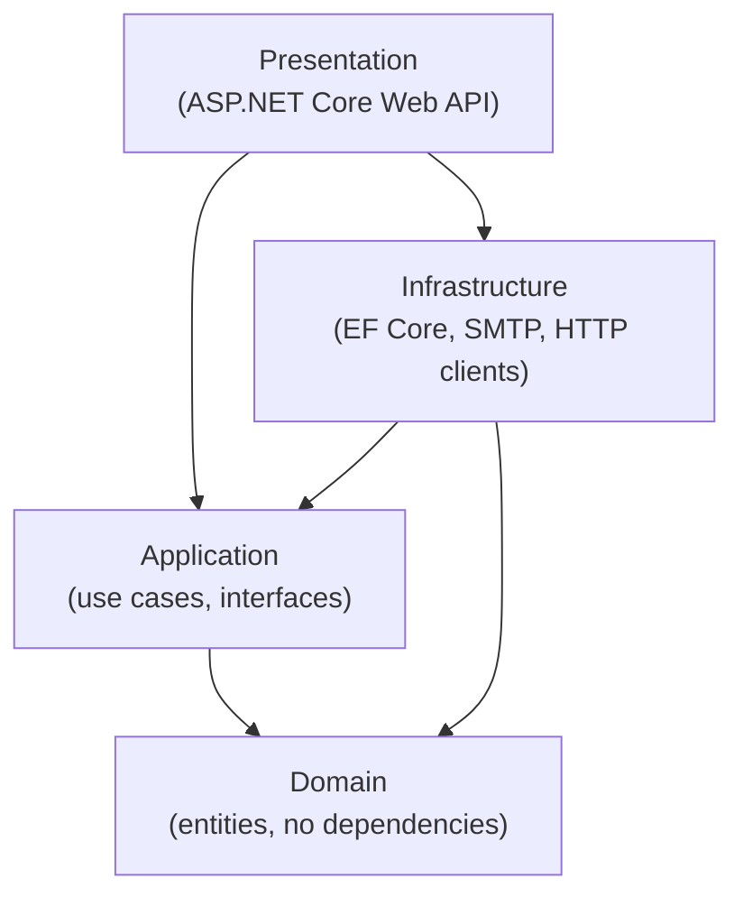
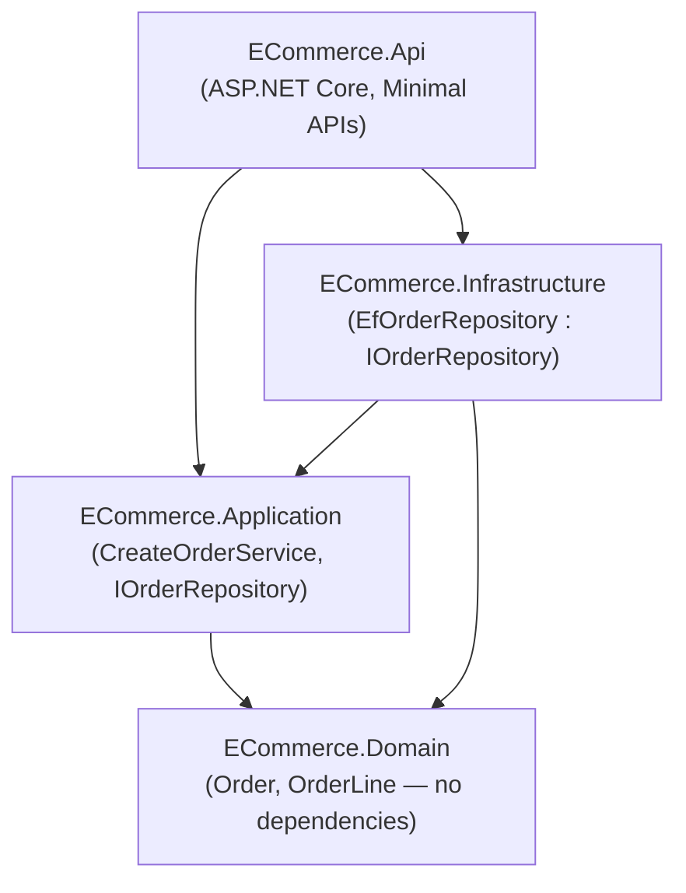
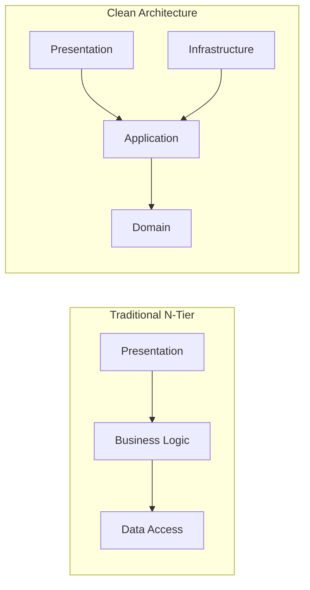

# Clean Architecture in .NET

## Introduction

Before reading this lesson, you should already be comfortable with **[Diagnostic Tools: dotnet-trace and dotnet-counters](../12-advanced-concepts/12-36-dotnet-trace-and-counters.md)** and, more importantly, with the SOLID principles from earlier in this module — especially the **Dependency Inversion Principle (DIP)**. This lesson opens Module 12's "Microservices & Clean Architecture" sub-area, and it starts with **Clean Architecture**: an arrangement of an entire solution's projects and folders that takes DIP, which you've so far applied one class at a time, and applies the exact same idea at the scale of a whole application.

By the end of this lesson, you will be able to:

- State the Dependency Rule and explain which direction source code dependencies are allowed to point
- Name Clean Architecture's four typical layers and what each one is responsible for
- Explain why the Domain layer has no dependencies on anything else in the solution
- Recognize how Clean Architecture is just the Dependency Inversion Principle applied to project references instead of constructor parameters
- Sketch a Clean Architecture solution structure for a real application and justify each project's dependencies

## Clean Architecture in .NET — A Layman's Perspective

Picture a retail chain with one head office and dozens of franchise branches scattered across the country. Head office writes the company's core policies: what counts as a valid discount, what a loyalty tier actually means, when a return is allowed. Those policies are written once, in plain language, and they say nothing whatsoever about *which* branch enforces them, what brand of point-of-sale terminal a branch uses, or whether a particular branch is a physical storefront or a phone-order desk. Head office's policy manual doesn't know any of that, and it doesn't need to — its entire job is to state what's true about running this business, independent of anywhere in particular it gets carried out.

Every branch, on the other hand, depends heavily on head office. A branch manager keeps a copy of the policy manual on the shelf and follows it; the manual never keeps a copy of any one branch's floor plan. That's the only direction the dependency is allowed to run. If head office swapped its policy on returns tomorrow, every branch would need to update how it behaves. But if one branch decided to switch cash register vendors, replace its phone system, or move to a bigger building across the street, head office's policy manual wouldn't need a single word changed — none of that was ever any of its business in the first place.

Now add one more detail that makes this analogy actually complete rather than just "core rules matter more." Head office's policy manual sometimes needs something a branch has to provide — say, "look up whether this customer has hit their loyalty threshold." Head office doesn't reach into a branch's specific customer database to get that answer. Instead, head office writes down, in its own manual, the exact *question* it needs answered — a fill-in-the-blank form titled "Loyalty Lookup Request" — and it's each branch's job to supply a filled-in answer using whatever system that branch actually runs internally. Head office defines the *shape of the question*; the branch supplies the *answer*, using its own machinery. Head office never needs to know or care how the answer was produced.

That last piece is the whole trick behind Clean Architecture. The innermost part of a system — its core business rules — defines what it needs from the outside world as plain interfaces, the software equivalent of that fill-in-the-blank form. Everything further out — databases, web frameworks, email providers, third-party APIs — exists purely to fill in those forms, and depends inward on the core to know what shape the form is even in. The core never depends outward on any of them. Change the database technology, the web framework, or the UI, and the core business rules don't need to change a single line — exactly like head office's policy manual never needing to know which cash register a branch just bought.

## Clean Architecture in .NET — A Programming Language Perspective

Clean Architecture, popularized by Robert C. Martin, arranges a solution's projects into concentric layers — typically **Domain**, **Application**, **Infrastructure**, and **Presentation** — governed by a single rule: the **Dependency Rule**. Source code dependencies may only point *inward*, toward the Domain. In C#, this is enforced structurally, not just by convention: it's a project-reference graph. `Domain` is a class library with no project references at all — just entities, value objects, and domain logic. `Application` references only `Domain`, and defines interfaces (`IOrderRepository`, `IEmailSender`) for anything it needs from the outside world, plus use-case classes that depend on those interfaces, never on concrete implementations. `Infrastructure` references `Application` and `Domain` so it can *implement* those interfaces against real technology — EF Core, an SMTP client, an HTTP client. `Presentation` (an ASP.NET Core Web API project, for instance) references all three and acts as the **composition root**, where a dependency injection container is told which concrete `Infrastructure` class to hand out whenever `Application` code asks for an interface.

## How to Structure a Clean Architecture Project in C#

The mechanics come down to two things: which projects reference which, and where interfaces are declared versus implemented. The Domain layer owns entities and, often, no interfaces at all. The Application layer owns the interfaces describing what it needs, plus the use cases that consume them. The example below collapses all four layers into one file purely for runnability — in a real solution, each region shown would be its own class library project, and the comments call out exactly which project each block belongs to.


*Figure 1: The Dependency Rule — every arrow points inward, toward Domain. Presentation depends on Infrastructure only to wire it up at startup.*

```csharp
// Program.cs — .NET 10 / C# 14 — one file standing in for four projects
using Microsoft.Extensions.DependencyInjection;

// --- Domain project: no dependencies on anything else ---
namespace Domain;
public class Product(string sku, decimal price)
{
    public string Sku { get; } = sku;
    public decimal Price { get; } = price;
}

// --- Application project: references Domain only ---
namespace Application;
using Domain;

public interface IProductCatalog
{
    Product? FindBySku(string sku);
}

public class PriceLookupService(IProductCatalog catalog)
{
    public decimal? GetPrice(string sku) => catalog.FindBySku(sku)?.Price;
}

// --- Infrastructure project: implements Application's interface ---
namespace Infrastructure;
using Application;
using Domain;

public class InMemoryProductCatalog : IProductCatalog
{
    private readonly Dictionary<string, Product> _products = new()
    {
        ["SKU-100"] = new Product("SKU-100", 49.99m)
    };

    public Product? FindBySku(string sku) => _products.GetValueOrDefault(sku);
}

// --- Presentation project: the composition root ---
var services = new ServiceCollection();
services.AddSingleton<Application.IProductCatalog, Infrastructure.InMemoryProductCatalog>();
services.AddSingleton<Application.PriceLookupService>();

using var provider = services.BuildServiceProvider();
var lookup = provider.GetRequiredService<Application.PriceLookupService>();

Console.WriteLine($"Price for SKU-100: {lookup.GetPrice("SKU-100"):C}");
Console.WriteLine($"Price for SKU-999: {lookup.GetPrice("SKU-999")?.ToString() ?? "not found"}");
```

**Console Output:**

```text
Price for SKU-100: $49.99
Price for SKU-999: not found
```

`PriceLookupService`, in the Application layer, never mentions `InMemoryProductCatalog` anywhere — it only knows about the `IProductCatalog` interface it declared itself. The Presentation layer is the only place that ever names both sides and wires them together. Swap `InMemoryProductCatalog` for an EF Core-backed one tomorrow, and `PriceLookupService` doesn't change at all.

## Real-Time Example: A Clean Architecture Solution for E-Commerce Order Processing

We restart this curriculum's E-Commerce Order Processing thread as a proper multi-project solution, the way a real storefront backend would actually be laid out: `ECommerce.Domain`, `ECommerce.Application`, `ECommerce.Infrastructure`, and `ECommerce.Api`, each a separate class library (or, for `ECommerce.Api`, an ASP.NET Core project) with project references only ever pointing inward.


*Figure 2: `ECommerce.Domain` sits at the center with zero outbound references; every other project's arrows ultimately point back to it.*

```text
ECommerce.sln
├── src/
│   ├── ECommerce.Domain/            (references: none)
│   │   └── Order.cs
│   ├── ECommerce.Application/       (references: ECommerce.Domain)
│   │   ├── IOrderRepository.cs
│   │   └── CreateOrderService.cs
│   ├── ECommerce.Infrastructure/    (references: ECommerce.Application, ECommerce.Domain)
│   │   └── EfOrderRepository.cs     — implements IOrderRepository using the
│   │                                  DbContext/DbSet patterns from Module 11
│   └── ECommerce.Api/               (references: all three of the above)
│       └── Program.cs               — the composition root: registers
│                                       EfOrderRepository against IOrderRepository
```

```csharp
// ECommerce.Application/IOrderRepository.cs and CreateOrderService.cs — illustrative excerpt
namespace ECommerce.Application;
using ECommerce.Domain;

public interface IOrderRepository
{
    Task SaveAsync(Order order);
}

public class CreateOrderService(IOrderRepository repository)
{
    public async Task<Order> PlaceOrderAsync(string customerId, IReadOnlyList<OrderLine> lines)
    {
        var order = new Order(Guid.NewGuid().ToString(), customerId, lines);
        await repository.SaveAsync(order);
        return order;
    }
}
```

`CreateOrderService` never references `ECommerce.Infrastructure` — it can't, because `ECommerce.Application`'s `.csproj` has no reference to it. Only `ECommerce.Api`'s composition root, at startup, ever writes `services.AddScoped<IOrderRepository, EfOrderRepository>()` and connects the two. If a second `ECommerce.Api`-equivalent were built later — a background worker, a gRPC service, a console tool — it could reuse `ECommerce.Application` and `ECommerce.Domain` unchanged, wiring up its own Infrastructure implementations however it needs to. That reusability, not just tidiness, is the practical payoff of keeping the Dependency Rule enforced at the project-reference level rather than as a suggestion.

## Clean Architecture vs. Traditional N-Tier (Layered) Architecture

Traditional N-Tier architecture — Presentation, Business Logic, Data Access — looks superficially similar, and many teams believe they're already doing Clean Architecture because they have three layers. The difference is the direction of the *compile-time* dependency, not just how many folders exist. In N-Tier, the Business Logic layer typically references the Data Access layer directly, and the "domain" entities are often the same classes the ORM maps straight to a table — meaning a business rule and a database column are welded together. In Clean Architecture, the direction is inverted: Application defines the interface, Infrastructure (which *is* the data access code) depends on Application to implement it, never the other way around, and Domain entities are free to look nothing like a database row.


*Figure 3: N-Tier's Business Logic depends outward on Data Access; Clean Architecture's Application layer is depended *on*, never depends out.*

| Aspect | Traditional N-Tier | Clean Architecture |
|---|---|---|
| Dependency direction | Business Logic → Data Access | Infrastructure → Application (inverted) |
| Domain entities | Often mirror database tables directly | Independent of any persistence technology |
| Swapping the database | Touches Business Logic too, in practice | Touches only Infrastructure |
| Testing business rules | Often needs a real or mocked database | Domain/Application tested with no database at all |
| Learning curve | Familiar, matches how many teams already think | Requires understanding the Dependency Rule up front |

## Types of Clean Architecture-Adjacent Approaches

Clean Architecture isn't the only name for this idea, and it connects directly to concepts covered elsewhere in this module:

1. **[Dependency Inversion Principle](../12-advanced-concepts/12-05-dependency-inversion-principle.md)** — the single-class-level version of the exact same rule Clean Architecture applies to an entire solution.
2. **[Onion and Hexagonal Architecture](../12-advanced-concepts/12-38-onion-and-hexagonal-architecture.md)** — two closely related layouts covered next, drawn differently but built on the same dependency-direction idea.
3. **[Microservices Architecture Patterns](../12-advanced-concepts/12-39-microservices-architecture-patterns.md)** — Clean Architecture describes the inside of one service; this pattern describes how many such services relate to each other.
4. **[CQRS and MediatR](../12-advanced-concepts/12-41-cqrs-and-mediatr.md)** — a common companion inside the Application layer, splitting use cases into separate command and query handlers.
5. **[Domain-Driven Design Basics](../12-advanced-concepts/12-42-domain-driven-design-basics.md)** — the modeling discipline that usually informs what actually goes inside the Domain layer.

## What You've Learned & What's Next

The Dependency Rule says source code dependencies point inward only, toward the Domain — and Clean Architecture's four layers (Domain, Application, Infrastructure, Presentation) exist purely to make that rule visible as project references you can check with your eyes, not just something you have to remember while writing a class. Domain and Application never depend outward; Infrastructure and Presentation always depend inward, and only Presentation is allowed to know about everything at once, because it's the composition root.

Continue your learning journey with **[Onion and Hexagonal Architecture](../12-advanced-concepts/12-38-onion-and-hexagonal-architecture.md)**, where we look at two other well-known ways of drawing this exact same idea — and make the case that, underneath different diagrams and different vocabulary, they're all telling you the same thing.

---
*Applies to: .NET 10 / C# 14. Last reviewed 2026-08-16.*
