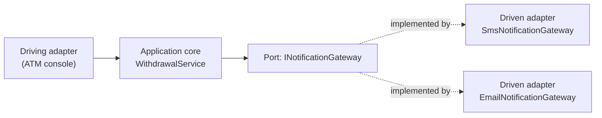
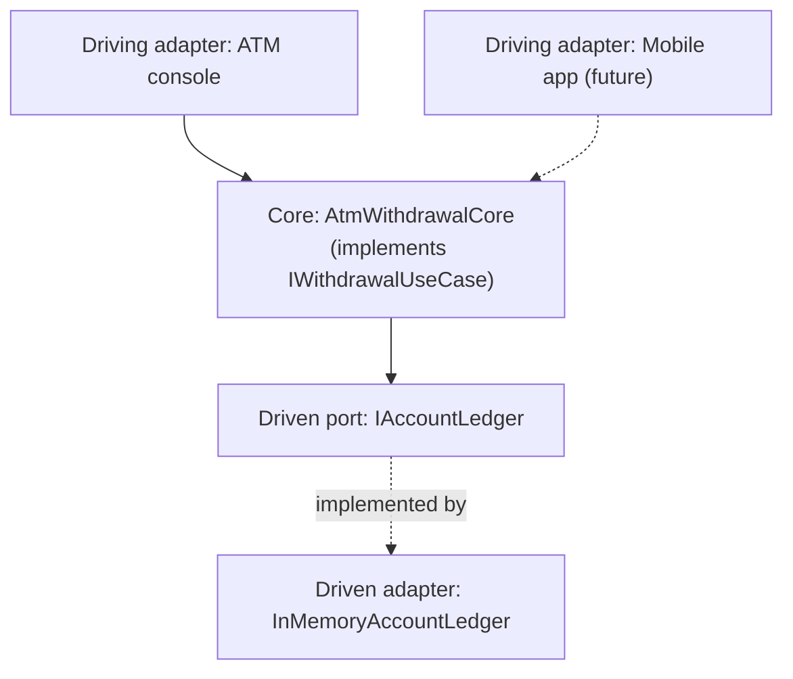
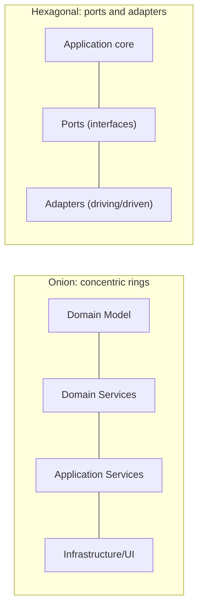

# Onion and Hexagonal Architecture

## Introduction

Before reading this lesson, you should already be comfortable with **[Clean Architecture in .NET](../12-advanced-concepts/12-37-clean-architecture-in-dotnet.md)** — specifically, the Dependency Rule and the idea that inner layers define interfaces which outer layers implement. This lesson looks at two older architectural styles, **Onion Architecture** and **Hexagonal Architecture** (also called **Ports and Adapters**), that predate Clean Architecture and inspired it. The honest takeaway, stated up front: these are not three competing architectures to choose between. They're the same underlying idea, drawn as three different pictures.

By the end of this lesson, you will be able to:

- Describe Onion Architecture's concentric-circle layout and where the domain sits within it
- Describe Hexagonal Architecture's ports-and-adapters vocabulary, including primary and secondary adapters
- Recognize that all three architectures (Clean, Onion, Hexagonal) enforce the identical dependency direction
- Implement a port-and-adapter pair in C# using nothing but an interface and two implementing classes
- Choose diagram/vocabulary based on team familiarity rather than treat the choice as technically significant

## Onion and Hexagonal Architecture — A Layman's Perspective

Think about a single electrical appliance — a laptop charger, say — that you take with you when you travel internationally. The charger itself never changes: it takes the same input voltage range, does the same internal conversion, and delivers the same power out the other end to your laptop, regardless of which country you're standing in. What changes from country to country is only the wall socket. In the UK it's one shape; in the US it's a completely different shape; in much of Europe it's a third shape again. You don't redesign your charger for each country — you carry a small adapter plug that matches whichever socket is on the wall, and your charger plugs into the adapter, which plugs into the wall.

Notice what your charger actually depends on here. It doesn't depend on "a UK socket" or "a US socket" — it depends on a single, fixed connector shape of its own, and it's each *adapter's* job to bridge from that fixed shape to whatever socket happens to be on the wall in a given country. Your charger would work identically in a hotel room, an airport lounge, or a friend's house, because none of those environments are things it was ever built to know about. The adapter is disposable and swappable; the charger, and the plug shape it expects, is not.

Now picture a completely different scene: an old farmhouse with a stone wall built with a distinctive, historic outward face, and successive owners over the decades have added a kitchen extension, then a garage, then a sunroom, each one built directly onto the *outside* of that original stone wall, layer after layer, like the rings inside a tree trunk when you slice it open. Cut the house in half and you'd see the original stone wall dead center, untouched by any renovation, with each newer addition wrapped concentrically around it. The people who built the sunroom didn't get to change the shape of the original stone wall to suit their sunroom's needs — they built *around* it, conforming to what was already there at the center.

Both stories are describing the exact same rule from two different angles. Hexagonal Architecture is the traveler's charger: a core with a fixed shape of its own, and swappable adapters bridging it to whatever's actually out there — a database, a UI, a message queue, a test harness. Onion Architecture is the farmhouse: a domain core sitting dead center, with every later addition wrapped around it, closer additions more tightly bound to the core's rules, later ones more free-standing. Neither story changes what actually has to be true underneath: something at the center stays fixed and ignorant of the outside world, and everything outside it adapts to the center, never the reverse.

## Onion and Hexagonal Architecture — A Programming Language Perspective

**Onion Architecture**, coined by Jeffrey Palermo, draws a solution as concentric rings: the **Domain Model** at the very center, wrapped by **Domain Services**, then **Application Services**, then an outermost ring of **Infrastructure and UI**. As in Clean Architecture, dependencies may only point inward — an outer ring can reference an inner one, never the reverse — and interfaces needed by an inner ring are implemented by an outer one.

**Hexagonal Architecture** (Ports and Adapters), coined by Alistair Cockburn, uses different vocabulary for the identical structure. The **application core** exposes **ports** — plain C# interfaces — describing what it needs (a **driven/secondary port**, like `IOrderRepository`) or what it offers (a **driving/primary port**, like a use-case interface an API controller calls into). **Adapters** are the concrete implementations plugged into those ports: a **driven adapter** like an EF Core repository, or a **driving adapter** like an ASP.NET Core controller or a test harness, both of which "plug into" the core from outside, exactly as the charger analogy described.

## How to Implement a Port and Adapters in C#

Building a Hexagonal-style core comes down to defining the port as an interface owned by the core, then writing one or more adapters that implement it — no framework or NuGet package required, just an interface and its implementers.


*Figure 1: The core depends only on the `INotificationGateway` port it defines; either adapter can be plugged in without the core changing.*

```csharp
// Program.cs — .NET 10 / C# 14
// Port: owned by the application core, describes what the core needs
interface INotificationGateway
{
    void Notify(string accountId, string message);
}

// Core: depends only on the port, never on a concrete adapter
class WithdrawalService(INotificationGateway gateway)
{
    public void Withdraw(string accountId, decimal amount)
    {
        Console.WriteLine($"Withdrawal of {amount:C} approved for {accountId}.");
        gateway.Notify(accountId, $"Your account was debited {amount:C}.");
    }
}

// Adapter #1: plugs into the port
class SmsNotificationGateway : INotificationGateway
{
    public void Notify(string accountId, string message) =>
        Console.WriteLine($"[SMS to {accountId}] {message}");
}

// Adapter #2: a different adapter, same port, core code untouched
class EmailNotificationGateway : INotificationGateway
{
    public void Notify(string accountId, string message) =>
        Console.WriteLine($"[Email to {accountId}] {message}");
}

var smsService = new WithdrawalService(new SmsNotificationGateway());
smsService.Withdraw("ACC-4471", 200.00m);

var emailService = new WithdrawalService(new EmailNotificationGateway());
emailService.Withdraw("ACC-4471", 50.00m);
```

**Console Output:**

```text
Withdrawal of $200.00 approved for ACC-4471.
[SMS to ACC-4471] Your account was debited $200.00.
Withdrawal of $50.00 approved for ACC-4471.
[Email to ACC-4471] Your account was debited $50.00.
```

`WithdrawalService` — the application core — never changed between the two calls; only the adapter plugged into its `INotificationGateway` port changed. That's the entire mechanism Hexagonal Architecture is naming: swap the adapter, keep the core.

## Real-Time Example: A Hexagonal Core for Banking/ATM Withdrawals

We extend this curriculum's Banking/ATM domain by treating the withdrawal use case as a Hexagonal application core with two ports: one **driven port**, `IAccountLedger`, for reading and updating balances, and one **driving port** that an ATM's console UI calls into. The ATM console itself, and any future channel — a mobile app, a call-center tool — is just another driving adapter calling the same core through the same interface.


*Figure 2: Two driving adapters could call the same core through the same `IWithdrawalUseCase` port; the core never references either one directly.*

```csharp
// Program.cs — .NET 10 / C# 14 — Real-Time Example (Banking/ATM)
interface IAccountLedger
{
    decimal GetBalance(string accountId);
    void Debit(string accountId, decimal amount);
}

interface IWithdrawalUseCase
{
    (bool Approved, string Message) Withdraw(string accountId, decimal amount);
}

class AtmWithdrawalCore(IAccountLedger ledger) : IWithdrawalUseCase
{
    public (bool Approved, string Message) Withdraw(string accountId, decimal amount)
    {
        var balance = ledger.GetBalance(accountId);
        if (amount > balance)
        {
            return (false, $"Declined: requested {amount:C} exceeds balance {balance:C}.");
        }

        ledger.Debit(accountId, amount);
        return (true, $"Approved: dispensed {amount:C}. New balance {ledger.GetBalance(accountId):C}.");
    }
}

class InMemoryAccountLedger : IAccountLedger
{
    private readonly Dictionary<string, decimal> _balances = new() { ["ACC-4471"] = 300.00m };

    public decimal GetBalance(string accountId) => _balances.GetValueOrDefault(accountId);

    public void Debit(string accountId, decimal amount) => _balances[accountId] -= amount;
}

// "ATM console" — a driving adapter calling the core through IWithdrawalUseCase
IWithdrawalUseCase core = new AtmWithdrawalCore(new InMemoryAccountLedger());

var (approved1, message1) = core.Withdraw("ACC-4471", 250.00m);
Console.WriteLine(message1);

var (approved2, message2) = core.Withdraw("ACC-4471", 100.00m);
Console.WriteLine(message2);
```

**Console Output:**

```text
Approved: dispensed $250.00. New balance $50.00.
Declined: requested $100.00 exceeds balance $50.00.
```

`AtmWithdrawalCore` implements `IWithdrawalUseCase` (the driving port) and depends on `IAccountLedger` (the driven port) — it never mentions an ATM, a database, or a specific bank's ledger technology anywhere in its code. Swapping `InMemoryAccountLedger` for one backed by the `DbContext`-based repositories from Module 11 requires touching only the driven adapter, never `AtmWithdrawalCore` itself — the same guarantee the previous lesson's `IOrderRepository` example demonstrated for Clean Architecture.

## Onion/Hexagonal vs. Clean Architecture — Same Philosophy, Different Diagrams

It's worth being direct about this rather than pretending each name describes something structurally distinct: Onion, Hexagonal, and Clean Architecture all enforce the identical rule — dependencies point toward a core that knows nothing about the outside world, and interfaces owned by that core are implemented by adapters/infrastructure outside it. Where they genuinely differ is presentation and vocabulary. Onion draws concentric rings and talks about "domain services" wrapping a "domain model." Hexagonal draws a hexagon and talks about "ports" and "adapters," with an explicit primary/secondary adapter distinction Onion and Clean don't usually name. Clean Architecture draws four labeled quadrant-like rings — Domain, Application, Infrastructure, Presentation — and is arguably the most concrete about naming exactly four layers rather than leaving the ring count open-ended. Picking one is mostly a matter of which vocabulary your team already recognizes; none of the three unlocks a technical capability the others lack.


*Figure 3: Different shapes, same rule — a core stays independent, everything else adapts to it.*

| Aspect | Onion Architecture | Hexagonal Architecture | Clean Architecture |
|---|---|---|---|
| Author | Jeffrey Palermo | Alistair Cockburn | Robert C. Martin |
| Diagram shape | Concentric circles | Hexagon | Four-quadrant circle |
| Core vocabulary | Domain Model, Domain/Application Services | Application core, ports, adapters | Domain, Application, Infrastructure, Presentation |
| Distinctive naming | Layer count often left flexible | Explicit primary vs. secondary adapters | Explicit four named layers |
| Underlying rule | Same: dependencies point inward | Same: dependencies point inward | Same: dependencies point inward |

## Types of Ports-and-Adapters-Style Patterns in C#

A handful of related ideas round out this lesson, several covered elsewhere in this curriculum:

1. **[Clean Architecture in .NET](../12-advanced-concepts/12-37-clean-architecture-in-dotnet.md)** — the previous lesson's four-layer take on this exact same dependency rule.
2. **[Adapter Pattern](../12-advanced-concepts/12-11-adapter-pattern.md)** — the class-level design pattern that shares its name with, and is a natural fit inside, a Hexagonal adapter.
3. **[Dependency Inversion Principle](../12-advanced-concepts/12-05-dependency-inversion-principle.md)** — the SOLID principle underlying every architecture covered in this and the previous lesson.
4. **Driving vs. driven ports** — Hexagonal's own internal split between ports the core exposes to be called (driving) and ports the core calls out through (driven), both shown in this lesson's Real-Time Example.
5. **[Microservices Architecture Patterns](../12-advanced-concepts/12-39-microservices-architecture-patterns.md)** — the next lesson, where the same isolated-core idea gets applied at the scale of an entire service rather than one class.

## What You've Learned & What's Next

Onion Architecture's concentric rings and Hexagonal Architecture's ports and adapters are different diagrams and different vocabularies describing the same rule Clean Architecture already gave you: a core stays ignorant of the outside world, and everything outside it depends inward, implementing whatever interfaces the core defines. `AtmWithdrawalCore` never needed to know whether it was being called by an ATM console or reading balances from an in-memory dictionary or a real database — that's the payoff, regardless of which of the three names you reach for on a given team.

Continue your learning journey with **[Microservices Architecture Patterns](../12-advanced-concepts/12-39-microservices-architecture-patterns.md)**, where this lesson's single, isolated core becomes one independently deployable service among several — and where the tradeoffs finally extend beyond one codebase's internal structure.

---
*Applies to: .NET 10 / C# 14. Last reviewed 2026-08-16.*
