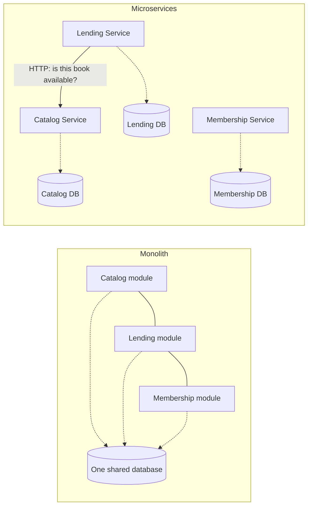
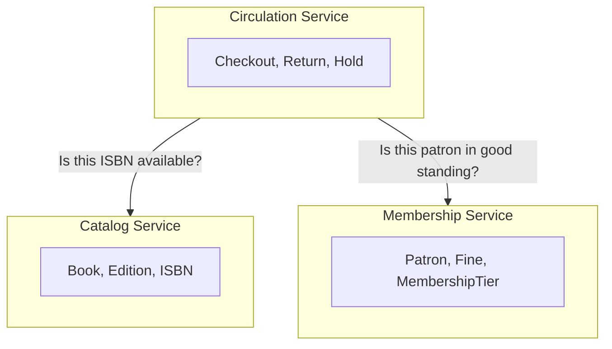
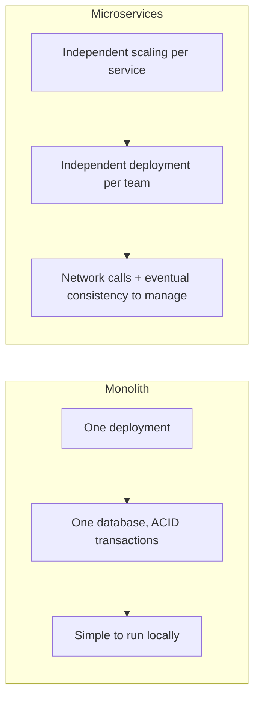

# Microservices Architecture Patterns

## Introduction

Before reading this lesson, you should already be comfortable with **[Onion and Hexagonal Architecture](../12-advanced-concepts/12-38-onion-and-hexagonal-architecture.md)** — the idea of an isolated application core with a clear boundary around it. This lesson takes that same idea of "a clear boundary" and applies it at a much larger scale: instead of one core inside one codebase, we now consider drawing that boundary around an entire, independently deployable service. That's a microservice, and this lesson gives it a balanced treatment — the genuine benefits it offers, the genuine operational cost it demands, and why it is not a default best practice to reach for.

By the end of this lesson, you will be able to:

- Define a microservice and explain what "independently deployable" actually requires
- List the organizational and scaling benefits microservices offer over a monolith
- List the operational complexity costs microservices introduce that a monolith doesn't have
- Explain bounded contexts and why they, rather than technical layers, are the right basis for a service boundary
- Make a reasoned case for or against splitting a given system into microservices, rather than defaulting to either answer

## Microservices Architecture Patterns — A Layman's Perspective

Picture two very different ways a city block could be organized to sell groceries, hardware, and prepared food. The first arrangement is one enormous department store: a single building, a single manager, a single set of employees who can be reassigned between departments as needed, a single loading dock where every delivery truck arrives, and a single set of front doors customers walk through no matter what they're buying. Everything is under one roof, coordinated by one management structure. If the store needs to close for a day — say, to repaint the whole building — every department closes with it, whether or not the hardware section actually needed any paint at all.

The second arrangement is a strip of independently owned shops sharing the same block: one grocer, one hardware store, one bakery, each with its own manager, its own staff, its own hours, its own cash register, its own supplier relationships, and its own decision about when to repaint *just their own storefront*. A busy Saturday at the bakery doesn't require hiring more staff at the hardware store, and a plumbing problem in the grocer's back room doesn't force the bakery to close. Each shop can grow, shrink, remodel, or even change owners entirely, on its own schedule, without asking permission from the shop next door.

But look closely at what the second arrangement actually costs to keep running smoothly. When a customer wants to buy bread and also needs a hammer, there's no single register that rings up both — they have to walk between two separate buildings, and if the bakery is unexpectedly closed for a health inspection, that has to somehow be communicated to the hardware store's staff too, in case a shared customer asks. Coordinating a single block-wide sale event now means getting four separate business owners to agree on dates, pricing, and signage, instead of one manager just deciding it. Something as simple as "what's our current total foot traffic across the block" now requires calling four separate shopkeepers and adding up four separate answers, rather than reading one number off one till.

Neither arrangement is simply "better." The department store trades independence for coordination — one loading dock, one register, one decision-maker, at the cost of every department being forced to scale, deploy, and change together whether they need to or not. The strip of independent shops trades that coordination away for genuine independence — each shop scales, changes, and even fails on its own — but it pays for that independence with real, ongoing coordination overhead that the department store never had to think about at all, because it never had more than one of anything to coordinate between.

A monolith is the department store: one deployable application, one shared codebase, one shared database, everything scaling and deploying together. Microservices are the strip of independent shops: many small, independently deployable services, each owning its own data, each scaling on its own schedule — at the real, recurring cost of now having to coordinate across all of them.

## Microservices Architecture Patterns — A Programming Language Perspective

A **microservice** is an independently deployable unit of software that owns its own process, its own data store, and a narrow, well-defined piece of business capability, communicating with other services over a network — typically HTTP/JSON, gRPC, or asynchronous messaging — rather than through in-process method calls or a shared database. This is the defining technical difference from a **monolith**, where every module runs inside one process, shares one database, and is deployed as a single unit. In C# terms, a monolith is usually one ASP.NET Core solution with several class libraries (potentially even structured with the Clean Architecture layers from earlier lessons); a microservices system is *several separate solutions*, each its own ASP.NET Core project with its own `DbContext` pointed at its own database, deployed and versioned independently of the others.

## How to Recognize a Service Boundary

Choosing where one microservice ends and another begins is the hardest and most consequential decision in this style of architecture — get it wrong, and services end up needing constant, chatty communication with each other just to do routine work, which erases most of the independence they were supposed to provide. The right basis for a boundary is a **bounded context**: a specific business capability with its own vocabulary and its own rules, covered in depth in this module's Domain-Driven Design lesson.


*Figure 1: The same three capabilities, once sharing one process and one database, split into three independently deployable services, each owning its own data.*

```csharp
// Illustrative structure — two independent ASP.NET Core minimal API projects,
// each with its own DbContext, communicating only over HTTP.

// --- CatalogService/Program.cs (its own process, its own database) ---
var app = WebApplication.CreateBuilder(args).Build();

app.MapGet("/books/{isbn}/available", (string isbn) =>
{
    // Looks up availability in the Catalog service's OWN database only.
    var copiesAvailable = isbn == "978-0-13-468599-1" ? 2 : 0;
    return Results.Ok(new { isbn, copiesAvailable });
});

app.Run();

// --- LendingService/Program.cs (a separate process, a separate database) ---
var lendingApp = WebApplication.CreateBuilder(args).Build();
var catalogClient = new HttpClient { BaseAddress = new Uri("https://catalog-service/") };

lendingApp.MapPost("/checkouts", async (CheckoutRequest request) =>
{
    // Lending never touches Catalog's database directly — only its HTTP API.
    var response = await catalogClient.GetFromJsonAsync<AvailabilityResponse>(
        $"/books/{request.Isbn}/available");

    return response?.CopiesAvailable > 0
        ? Results.Ok("Checkout approved.")
        : Results.BadRequest("No copies available.");
});

lendingApp.Run();

record CheckoutRequest(string Isbn, string MemberId);
record AvailabilityResponse(string Isbn, int CopiesAvailable);
```

**Illustrative Output** *(representative of two services running as separate processes on separate ports — not a single `dotnet run` trace, since a real microservices system by definition isn't one process)*:

```text
[Lending Service] Checking availability for 978-0-13-468599-1...
[Catalog Service] Responded: 2 copies available
[Lending Service] Checkout approved.
```

The two services above don't share a database, a process, or even a deployment schedule — the Lending Service only ever knows Catalog through its HTTP contract. That contract, not a shared table, is now the thing both teams have to agree on and avoid breaking.

## Real-Time Example: Bounded Contexts in a Library/Inventory Management System

We apply this lesson's boundary question to a Library/Inventory Management system, splitting what might have started as one monolithic "Library" application into services aligned with genuinely distinct bounded contexts: a **Catalog Service** (book metadata, ISBNs, editions — the vocabulary of "what books exist"), a **Circulation Service** (checkouts, returns, holds, due dates — the vocabulary of "who currently has what"), and a **Membership Service** (patrons, fines, membership tiers — the vocabulary of "who is allowed to borrow, and under what standing"). Each of these has its own rules, its own staff who understand it, and its own natural rate of change — the Catalog barely changes day to day, while Circulation changes constantly.


*Figure 2: Circulation depends on both Catalog and Membership over the network; neither of the other two depends back on Circulation.*

The word "book" itself means something subtly different in each context — Catalog cares about a book's ISBN and edition; Circulation cares about *which physical copy* is currently checked out and to whom; Membership doesn't model a book at all. Trying to force one single, shared `Book` class to satisfy all three contexts is exactly the trap a bounded-context boundary exists to avoid — it's the same reasoning this module's Domain-Driven Design lesson develops in full. Splitting along these lines means the Circulation team can change checkout-duration rules on their own release schedule without coordinating a deployment with the Catalog team at all, at the ongoing cost of Circulation now needing a resilient HTTP call (with retries, timeouts, and a sensible fallback) every time it needs to ask Catalog or Membership a question it used to answer with a single in-process method call.

## Monolith vs. Microservices

Neither style is a strictly better engineering default; each answers a different set of pressures. A monolith is simpler to run, test, and deploy for a small team and a system that isn't yet under real organizational strain — one build, one deployment, one database transaction spanning everything, and no network calls between your own modules to reason about. Microservices earn their cost when different parts of a system genuinely need to scale independently, or when the *organization* itself has grown past the point where one team can safely own the whole codebase — Conway's Law, informally, catching up with the architecture. Reaching for microservices before either pressure actually exists usually just imports distributed-systems problems (network failures, data consistency across services, deployment coordination) without the corresponding benefit.


*Figure 3: The same system's tradeoffs, viewed from each side.*

| Aspect | Monolith | Microservices |
|---|---|---|
| Deployment | One unit, deployed together | Each service deployed independently |
| Scaling | Whole application scales together | Each service scales to its own load |
| Data consistency | Single database, ACID transactions | Data spread across services, often eventual consistency |
| Team ownership | Works well for one team, or a few tightly coordinated ones | Lets separate teams own separate services independently |
| Operational cost | Low — one thing to build, test, deploy, monitor | High — service discovery, network resilience, distributed tracing, many things to monitor |
| Good default for | Most new systems, small-to-mid teams | Systems under genuine, demonstrated scaling or organizational strain |

## Types of Microservices-Related Concerns in C#

A handful of concerns come up as soon as a system is split into services, several of which get their own dedicated treatment in this module:

1. **[Bounded contexts](../12-advanced-concepts/12-42-domain-driven-design-basics.md)** — the Domain-Driven Design concept that gives a service its boundary, covered in full in this module's next-but-one lesson.
2. **[API Gateway Pattern](../12-advanced-concepts/12-40-api-gateway-pattern.md)** — the next lesson, addressing how clients talk to many services through one front door instead of many separate ones.
3. **[CQRS and MediatR](../12-advanced-concepts/12-41-cqrs-and-mediatr.md)** — a pattern that shows up inside individual services just as often as it does inside a monolith.
4. **Service-to-service communication** — synchronous HTTP/gRPC calls, as shown in this lesson, versus asynchronous messaging/event buses for looser coupling between services.
5. **The Saga pattern** — a way of coordinating a business process (like a checkout) that spans multiple services without a single shared database transaction to fall back on.

## What You've Learned & What's Next

A microservice is an independently deployable service owning its own data, aligned to a bounded context — and splitting a system this way trades a monolith's simplicity for independent scaling and independent team ownership, at the real, ongoing cost of network calls, data consistency challenges, and operational overhead a monolith never has to think about. Neither is a default best practice; the right choice depends on whether your system and your organization are actually under the kind of strain that microservices exist to relieve.

Continue your learning journey with **[API Gateway Pattern](../12-advanced-concepts/12-40-api-gateway-pattern.md)**, where we look at how a system built this way gives clients one single, coherent front door instead of forcing them to talk to every one of these independent services directly.

---
*Applies to: .NET 10 / C# 14. Last reviewed 2026-08-16.*
