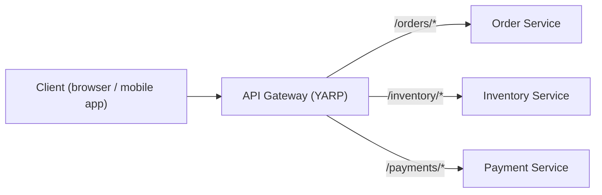
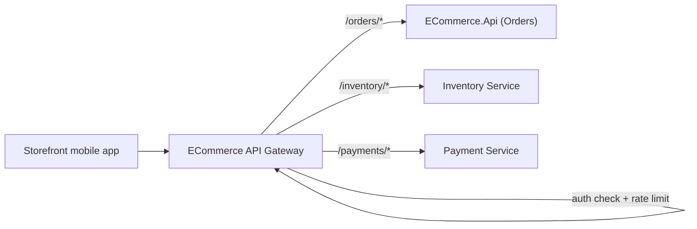
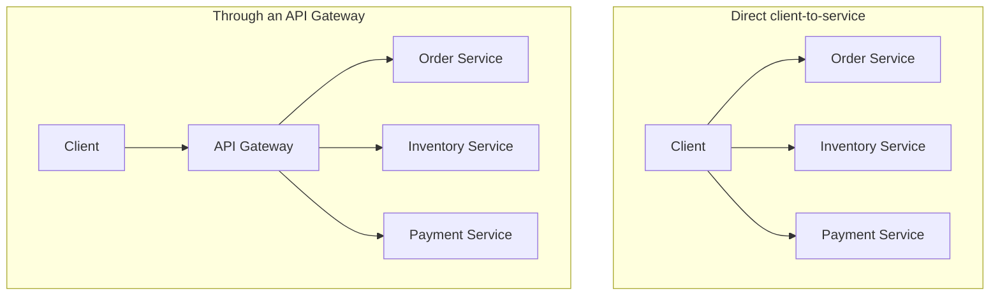

# API Gateway Pattern

## Introduction

Before reading this lesson, you should already be comfortable with **[Microservices Architecture Patterns](../12-advanced-concepts/12-39-microservices-architecture-patterns.md)** — specifically, the fact that a microservices system is made up of several independently deployable services, each reachable over the network. This lesson addresses the question that naturally follows: if a client needs data from three or four different services to render one screen, does it really have to know about, call, and handle failures from every single one of them directly? The API Gateway pattern says no — put one well-designed front door in front of all of them instead.

By the end of this lesson, you will be able to:

- Explain what an API Gateway is and the problem it solves for clients of a microservices system
- Identify cross-cutting concerns — authentication, rate limiting, routing — that belong at the gateway rather than duplicated in every service
- Configure a basic reverse-proxy gateway in .NET using YARP
- Recognize the tradeoffs an API Gateway introduces, including the single-point-of-failure risk
- Understand how this lesson foreshadows Azure API Management as a managed alternative, covered later in this curriculum

## API Gateway Pattern — A Layman's Perspective

Picture a large office building shared by a dozen different departments — accounting, legal, HR, IT support, facilities — each occupying its own floor, each with its own staff, its own hours, and its own way of doing things. Now imagine a visitor arriving at this building for the first time, needing help from three different departments to get one thing done. Without a reception desk, that visitor would need to already know exactly which floor accounting is on, which floor legal is on, show ID separately to whichever security guard happens to be posted at each floor, and figure out on their own which department to even ask for first. Every visitor, for every purpose, would need to independently learn the entire building's internal layout before they could get anything done.

A reception desk in the lobby changes all of that. The visitor walks in one door, tells the receptionist what they need, shows their ID exactly once, and the receptionist — who genuinely does know the building's internal layout — routes them (or their paperwork) to whichever floor or floors are actually relevant, sometimes to more than one department for a single request. If the building later renovates and legal moves from the third floor to the fifth, the visitor never notices or cares; only the receptionist's internal directory needed updating. If security wants everyone entering the building to be checked at the door instead of trusting a badge-check on every individual floor, that's a policy the reception desk enforces once, for everyone, rather than a policy each of the twelve departments would otherwise have needed to separately implement, and probably implement twelve slightly different, inconsistent ways.

The reception desk also becomes the natural place to notice something a single department, working alone, never could: if the exact same visitor tries to make forty requests in one minute, something is clearly wrong, and it's far easier for the one desk watching every visitor enter the building to notice that pattern than it would be for twelve separate, uncoordinated department floors to each independently notice their own small slice of the same visitor's suspicious behavior.

There's an honest cost buried in this convenience, though, and it's worth naming plainly: if the reception desk itself is ever unstaffed, or its one entrance gets blocked, *nobody* can get into *any* department, even the ones that are otherwise open and fully staffed. Concentrating the building's one point of entry into a single desk is precisely what makes it so useful for enforcing shared policy consistently — and precisely what makes it the one thing the whole building can least afford to have fail.

## API Gateway Pattern — A Programming Language Perspective

An **API Gateway** is a reverse proxy that sits between clients and a system's backend microservices, exposing a single, stable entry point that routes incoming requests to whichever backend service actually owns the requested capability. Structurally, it's a server-side HTTP process, distinct from any one backend service, configured with a set of **routes** (URL patterns matched against incoming requests) mapped to **clusters** (the backend service instances a matched route is proxied to). Because every request already passes through this one process before reaching any backend, it's the natural place to implement **cross-cutting concerns** once instead of duplicating them in every service: authentication/authorization, rate limiting (both covered for a single ASP.NET Core app in Module 10), request logging, and response aggregation. In .NET, **YARP** (Yet Another Reverse Proxy), a Microsoft-built library, is the .NET-native way to build one: it's added to an ASP.NET Core project like any other middleware, configured largely through `appsettings.json` route/cluster definitions, and requires no separate infrastructure product to stand one up.

## How to Configure a Reverse Proxy Gateway with YARP

Building a YARP gateway is mostly configuration: define which incoming path patterns should match which backend cluster, then let YARP's middleware do the proxying. **The example below is illustrative rather than something you can `dotnet run` and see traffic flow through** — it requires real backend services actually listening at the configured addresses, which aren't available here, so the configuration shape is exactly correct, but no live request is actually being proxied.


*Figure 1: One client-facing address; YARP routes each path prefix to the correct backend service.*

```csharp
// Program.cs — .NET 10 / C# 14 — illustrative; requires real backend services to actually proxy traffic
var builder = WebApplication.CreateBuilder(args);

builder.Services
    .AddReverseProxy()
    .LoadFromConfig(builder.Configuration.GetSection("ReverseProxy"));

var app = builder.Build();
app.MapReverseProxy();
app.Run();
```

```json
// appsettings.json — illustrative route/cluster configuration
{
  "ReverseProxy": {
    "Routes": {
      "ordersRoute": {
        "ClusterId": "ordersCluster",
        "Match": { "Path": "/orders/{**catch-all}" }
      }
    },
    "Clusters": {
      "ordersCluster": {
        "Destinations": {
          "destination1": { "Address": "https://order-service.internal/" }
        }
      }
    }
  }
}
```

**Illustrative Output** *(representative of the gateway's request log with a real Order Service behind it — not a literal execution trace)*:

```text
[Gateway] GET /orders/4471 -> proxied to https://order-service.internal/orders/4471 (200 OK, 42ms)
```

`AddReverseProxy().LoadFromConfig(...)` and `MapReverseProxy()` are the only two lines of C# this setup needs — the actual routing behavior lives entirely in the `ReverseProxy` configuration section, which is exactly why YARP is popular for this pattern: adding a new backend service to the gateway is a configuration change, not a code change.

## Real-Time Example: An E-Commerce API Gateway Fronting Order, Inventory, and Payment Services

We extend this curriculum's E-Commerce Order Processing thread by fronting the `ECommerce.Api` service from this module's Clean Architecture lesson — along with an Inventory service and a Payment service — behind one gateway. The gateway is where authentication and rate limiting (Module 10's `10-14-rate-limiting.md` topic) are enforced exactly once, rather than separately inside all three backend services.


*Figure 2: Authentication and rate limiting happen once, at the gateway, before any request reaches Orders, Inventory, or Payments.*

```json
// appsettings.json — illustrative gateway configuration for the E-Commerce services
{
  "ReverseProxy": {
    "Routes": {
      "ordersRoute": {
        "ClusterId": "ordersCluster",
        "AuthorizationPolicy": "RequireAuthenticatedUser",
        "RateLimiterPolicy": "PerCustomerLimit",
        "Match": { "Path": "/orders/{**catch-all}" }
      },
      "inventoryRoute": {
        "ClusterId": "inventoryCluster",
        "RateLimiterPolicy": "PerCustomerLimit",
        "Match": { "Path": "/inventory/{**catch-all}" }
      },
      "paymentsRoute": {
        "ClusterId": "paymentsCluster",
        "AuthorizationPolicy": "RequireAuthenticatedUser",
        "RateLimiterPolicy": "PerCustomerLimit",
        "Match": { "Path": "/payments/{**catch-all}" }
      }
    },
    "Clusters": {
      "ordersCluster":    { "Destinations": { "d1": { "Address": "https://orders.internal/" } } },
      "inventoryCluster": { "Destinations": { "d1": { "Address": "https://inventory.internal/" } } },
      "paymentsCluster":  { "Destinations": { "d1": { "Address": "https://payments.internal/" } } }
    }
  }
}
```

**Illustrative Output** *(representative gateway request log)*:

```text
[Gateway] POST /orders            -> auth OK, rate limit OK  -> Orders Service    (201 Created)
[Gateway] GET  /inventory/SKU-100  -> rate limit OK           -> Inventory Service (200 OK)
[Gateway] POST /payments/charge    -> auth OK, rate limit OK  -> Payment Service   (200 OK)
[Gateway] POST /orders            -> rate limit EXCEEDED      -> 429 Too Many Requests (never reached Orders Service)
```

Notice the last line: the fourth request never reached the Order Service at all — it was rejected at the gateway, meaning the Order Service's own code never had to implement its own rate-limiting logic, and never even paid the cost of handling a request that was always going to be rejected. Every one of the three backend services in this example can stay focused purely on its own business logic, trusting that authentication and rate limiting have already been handled before a request ever reaches them.

## API Gateway vs. Direct Client-to-Service Communication

Without a gateway, a client talks to each backend service directly — which is simpler to reason about for a system with only one or two services, but becomes a real burden once there are several: the client needs to know every service's address, implement retry/authentication logic once per service instead of once total, and any cross-cutting policy change (a new auth requirement, a new rate limit) means updating every service individually rather than one shared configuration. The gateway centralizes that cost into one process, at the price of that process now being a single point of failure and an added network hop on every request.


*Figure 3: The gateway adds one hop and one shared point of policy enforcement, replacing three separate client-to-service relationships with one.*

| Aspect | Direct client-to-service | Through an API Gateway |
|---|---|---|
| Client complexity | Must know every service's address | Knows one address only |
| Cross-cutting concerns (auth, rate limiting) | Duplicated in every service | Centralized once, at the gateway |
| Latency | No added hop | One added network hop |
| Failure blast radius | One service failing affects only its own callers | Gateway failing affects every service behind it |
| Change management | Policy changes touch every service | Policy changes touch gateway configuration only |

## Types of API Gateway Approaches in .NET

Several concrete options and related ideas round out this lesson:

1. **YARP** — the .NET-native reverse proxy library used throughout this lesson, added directly to an ASP.NET Core project.
2. **Azure API Management** — a fully managed gateway service, covered in depth later in this curriculum's Azure module, for teams who'd rather not operate the gateway process themselves.
3. **Backend-for-Frontend (BFF)** — a variant where each type of client (mobile, web) gets its own tailored gateway, rather than one gateway serving every client identically.
4. **[Rate Limiting](../10-aspnetcore/10-14-rate-limiting.md)** — the ASP.NET Core middleware this lesson's gateway applies once, centrally, instead of once per backend service.
5. **[Microservices Architecture Patterns](../12-advanced-concepts/12-39-microservices-architecture-patterns.md)** — the previous lesson, describing the multi-service systems an API Gateway exists to sit in front of.

## What You've Learned & What's Next

An API Gateway gives clients one stable entry point in front of a system's many backend microservices, and centralizes cross-cutting concerns — authentication, rate limiting, routing — so they're enforced consistently once instead of duplicated, and possibly inconsistently reimplemented, inside every service. YARP is the .NET-native way to build one, configured mostly through routes and clusters rather than custom proxy code, at the honest cost of a new single point of failure and an added network hop on every request.

Continue your learning journey with **[CQRS and MediatR](../12-advanced-concepts/12-41-cqrs-and-mediatr.md)**, where we move from how requests reach a service to how that service organizes its own internal handling of them, once they've arrived.

---
*Applies to: .NET 10 / C# 14. Last reviewed 2026-08-16.*
