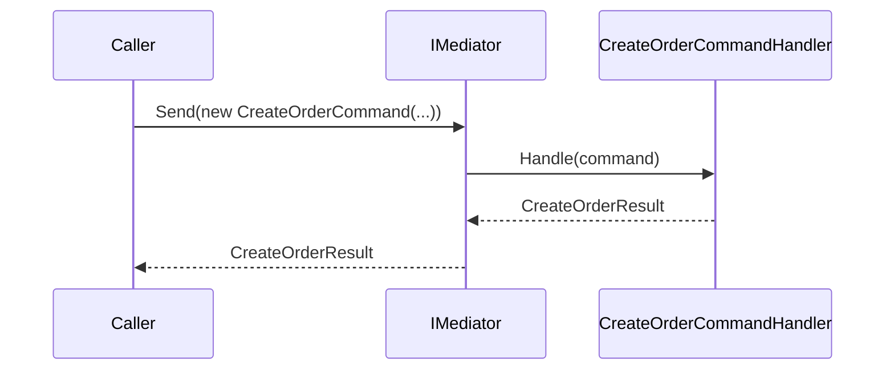
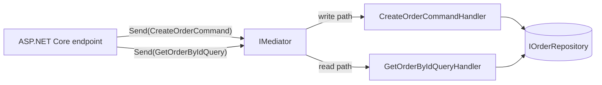
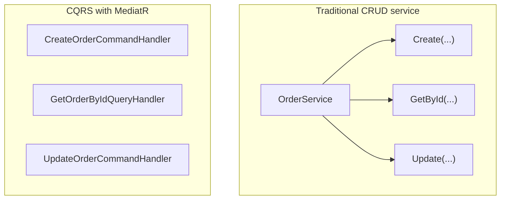

# CQRS and MediatR

## Introduction

Before reading this lesson, you should already be comfortable with **[API Gateway Pattern](../12-advanced-concepts/12-40-api-gateway-pattern.md)**, and with this module's earlier architecture lessons more broadly — a request has now made it past the gateway and arrived at a specific service. This lesson asks how that service should organize its *own* internal handling of requests, and introduces two ideas that are almost always seen together in .NET codebases: **Command Query Responsibility Segregation (CQRS)**, a way of splitting write operations from read operations, and **MediatR**, the library most .NET teams reach for to implement it.

By the end of this lesson, you will be able to:

- State the Command Query Responsibility Segregation principle and distinguish a command from a query
- Explain how MediatR implements the Mediator pattern in-process, decoupling a caller from the class that actually handles its request
- Define a command and its handler, and register both with MediatR's dependency injection integration
- Build a minimal `CreateOrderCommand`/`CreateOrderCommandHandler` pair and dispatch it through `IMediator.Send()`
- Recognize when CQRS's separation is worth its added structure, and when it's unnecessary ceremony

## CQRS and MediatR — A Layman's Perspective

Picture a busy post office with two entirely separate service windows, even though both windows technically deal with "your mail." The first window is the **information window** — fast, low-stakes, and staffed by several clerks at once, because all it ever does is answer questions: "has my package arrived," "what's the price to mail this to another city," "is this address in your delivery zone." None of those questions ever change anything about the post office's actual records; the clerk looks something up and tells you the answer, and the post office is in exactly the same state after the question as it was before.

The second window is the **processing window** — slower, staffed by fewer people, and it's the *only* place you're allowed to actually hand over a parcel to be mailed, request a change of address, or file a claim for a lost package. Every one of those actions genuinely changes something: a parcel enters the mail system, an address on file gets updated, a claim gets opened and logged. Because these actions actually change the post office's official records, they're handled more carefully, sometimes require a signature, and the post office keeps a much more deliberate record of exactly what happened and when.

Now notice what would go wrong if the post office tried to force both kinds of work through one single window, staffed by one clerk, using one single procedure for everything. A quick "has my package arrived yet" question would get stuck in the same line as someone filing a formal lost-parcel claim, even though the question could have been answered in five seconds by literally anyone glancing at a shelf. Worse, if that one overloaded clerk's procedure book doesn't clearly separate "just tell them the answer" from "actually change the official record," it becomes disturbingly easy for what should have been a harmless question to accidentally trigger a real change to someone's mail — the two very different kinds of work were never supposed to share a procedure in the first place.

Splitting the post office into two windows fixes both problems at once. The information window can be staffed by many clerks, scaled up during a rush, and never risks accidentally changing anything, because it's structurally incapable of doing anything but answering. The processing window handles fewer requests, but each one gets the careful, deliberate treatment an actual change to your official records deserves. Nothing about a question you ask at the information window is ever confused with an action you take at the processing window, because they were never the same procedure to begin with.

That's Command Query Responsibility Segregation: questions (queries) and actions that change something (commands) are deliberately handled through separate paths, each shaped for what it actually needs to do, rather than forced through one shared, one-size-fits-all procedure.

## CQRS and MediatR — A Programming Language Perspective

**Command Query Responsibility Segregation (CQRS)** is the practice of modeling **commands** (requests that change state and typically return little or no data) and **queries** (requests that return data and never change state) as distinct types, each handled by its own dedicated handler, rather than routing both through one shared service class with mixed responsibilities. This is a direct descendant of the older **Command-Query Separation** principle applied at the method level, scaled up to whole request/handler pairs.

**MediatR** is a widely used, open-source .NET library implementing the **Mediator pattern** — covered in this curriculum's Mediator Pattern lesson — as an in-process request dispatcher. A command or query is defined as a plain C# class or record implementing `IRequest<TResponse>`; a corresponding handler implements `IRequestHandler<TRequest, TResponse>`, containing the actual logic. Calling code never references a handler class directly; instead, it calls `IMediator.Send(request)`, and MediatR's dependency injection integration (`services.AddMediatR(...)`) resolves and invokes whichever handler is registered for that exact request type. This is precisely the Mediator pattern's decoupling: the caller and the handler never know about each other, only about the shared request type and the mediator sitting between them.

## How to Define and Dispatch a Command with MediatR

Using MediatR requires adding the `MediatR` NuGet package (`dotnet add package MediatR`) and registering it in dependency injection; from there, defining a new command is just a request type plus a handler type, with no changes needed anywhere else in the application.


*Figure 1: The caller only ever talks to `IMediator`; it never references `CreateOrderCommandHandler` directly.*

```csharp
// Program.cs — .NET 10 / C# 14 — requires: dotnet add package MediatR
using MediatR;
using Microsoft.Extensions.DependencyInjection;

var services = new ServiceCollection();
services.AddMediatR(cfg => cfg.RegisterServicesFromAssembly(typeof(Program).Assembly));
using var provider = services.BuildServiceProvider();

var mediator = provider.GetRequiredService<IMediator>();

var result = await mediator.Send(new PingCommand("hello"));
Console.WriteLine(result);

record PingCommand(string Message) : IRequest<string>;

class PingCommandHandler : IRequestHandler<PingCommand, string>
{
    public Task<string> Handle(PingCommand request, CancellationToken cancellationToken) =>
        Task.FromResult($"Pong: {request.Message}");
}
```

**Console Output:**

```text
Pong: hello
```

`mediator.Send(new PingCommand("hello"))` is the only line calling code ever needs — it has no idea `PingCommandHandler` exists, only that *some* handler registered for `PingCommand` will produce a `string`. Adding a second, unrelated command tomorrow means adding one more request/handler pair; nothing about this dispatch line changes.

## Real-Time Example: CreateOrderCommand and CreateOrderCommandHandler in E-Commerce Order Processing

We extend this curriculum's E-Commerce Order Processing thread — the same `Order` and `ECommerce.Application` types from this module's Clean Architecture lesson — by routing order creation through a MediatR command, and looking up an existing order through a separate MediatR query, keeping the write path and the read path as two distinct types with two distinct handlers.


*Figure 2: One `IMediator`, two separate request types, two separate handlers — the write path and the read path never share a class.*

```csharp
// Program.cs — .NET 10 / C# 14 — Real-Time Example (E-Commerce Order Processing)
// requires: dotnet add package MediatR
using MediatR;
using Microsoft.Extensions.DependencyInjection;

var services = new ServiceCollection();
services.AddMediatR(cfg => cfg.RegisterServicesFromAssembly(typeof(Program).Assembly));
services.AddSingleton<IOrderRepository, InMemoryOrderRepository>();
using var provider = services.BuildServiceProvider();

var mediator = provider.GetRequiredService<IMediator>();

// Command: changes state, returns just enough data to confirm the result
var createResult = await mediator.Send(
    new CreateOrderCommand("CUST-1001", ["4K Monitor"], 320.00m));
Console.WriteLine($"Created order {createResult.OrderId} for {createResult.CustomerId}.");

// Query: returns data, changes nothing
var order = await mediator.Send(new GetOrderByIdQuery(createResult.OrderId));
Console.WriteLine($"Lookup: order {order?.Id} contains {order?.Items.Count} item(s), total {order?.Total:C}.");

record Order(string Id, string CustomerId, IReadOnlyList<string> Items, decimal Total);

interface IOrderRepository
{
    void Save(Order order);
    Order? FindById(string orderId);
}

class InMemoryOrderRepository : IOrderRepository
{
    private readonly Dictionary<string, Order> _orders = [];
    public void Save(Order order) => _orders[order.Id] = order;
    public Order? FindById(string orderId) => _orders.GetValueOrDefault(orderId);
}

// --- Command (write path) ---
record CreateOrderCommand(string CustomerId, IReadOnlyList<string> Items, decimal Total)
    : IRequest<CreateOrderResult>;

record CreateOrderResult(string OrderId, string CustomerId);

class CreateOrderCommandHandler(IOrderRepository repository) : IRequestHandler<CreateOrderCommand, CreateOrderResult>
{
    public Task<CreateOrderResult> Handle(CreateOrderCommand request, CancellationToken cancellationToken)
    {
        var order = new Order(Guid.NewGuid().ToString("N")[..8], request.CustomerId, request.Items, request.Total);
        repository.Save(order);
        return Task.FromResult(new CreateOrderResult(order.Id, order.CustomerId));
    }
}

// --- Query (read path) ---
record GetOrderByIdQuery(string OrderId) : IRequest<Order?>;

class GetOrderByIdQueryHandler(IOrderRepository repository) : IRequestHandler<GetOrderByIdQuery, Order?>
{
    public Task<Order?> Handle(GetOrderByIdQuery request, CancellationToken cancellationToken) =>
        Task.FromResult(repository.FindById(request.OrderId));
}
```

**Console Output:**

```text
Created order a1b2c3d4 for CUST-1001.
Lookup: order a1b2c3d4 contains 1 item(s), total $320.00.
```

`CreateOrderCommandHandler` is the only place order creation logic lives, and `GetOrderByIdQueryHandler` is the only place order lookup logic lives — an ASP.NET Core minimal API endpoint calling `mediator.Send(new CreateOrderCommand(...))` for a `POST /orders` request, and a separate endpoint calling `mediator.Send(new GetOrderByIdQuery(...))` for a `GET /orders/{id}` request, never need to reference either handler class directly, or each other. Note that both handlers still share the same `IOrderRepository` here for simplicity — CQRS doesn't *require* separate read and write databases, though larger systems sometimes take that further step.

## CQRS vs. Traditional CRUD Service Methods

A traditional CRUD-style service class typically exposes `Create`, `Read`, `Update`, and `Delete` methods side by side on one class, all sharing the same dependencies and the same general shape, regardless of how different their actual concerns are — a `Create` that validates and enforces business rules sitting right next to a `GetById` that does nothing but fetch and shape data. CQRS pulls those apart into distinct request/handler pairs, each shaped for exactly what it needs: a command handler can afford to be more careful and heavyweight (validation, business rule enforcement, side effects), while a query handler stays lean and side-effect-free, sometimes reading from a differently-optimized model entirely. The cost is more types and more files for what a single CRUD service class used to do in one place — worthwhile once a service's write-side and read-side genuinely diverge in complexity, unnecessary ceremony for a small service where they don't.


*Figure 3: One shared service class with mixed responsibilities, versus one dedicated handler per operation.*

| Aspect | Traditional CRUD service | CQRS with MediatR |
|---|---|---|
| Structure | One class, several methods | One request type + one handler per operation |
| Read/write coupling | Reads and writes share one class's dependencies | Reads and writes can evolve completely independently |
| Adding a new operation | Adds a method to an existing, growing class | Adds one new, self-contained request/handler pair |
| Caller coupling | Caller depends on the concrete service class | Caller depends only on `IMediator` and the request type |
| Added ceremony | Minimal | More types/files for the same behavior |

## Types of MediatR and CQRS-Related Concepts in C#

Several related ideas round out this lesson, some covered elsewhere in this curriculum:

1. **Mediator Pattern** — the general-purpose design pattern MediatR implements specifically for in-process request dispatch, covered as its own lesson earlier in this module.
2. **`INotification`/`Publish()`** — MediatR's separate, one-to-many notification mechanism, distinct from the one-to-one `IRequest`/`Send()` shown in this lesson.
3. **Pipeline behaviors (`IPipelineBehavior<TRequest, TResponse>`)** — MediatR's cross-cutting hook for logging or validation that runs around every command/query, without touching individual handlers.
4. **CQRS with separate read/write data stores** — a further step some systems take, giving queries their own denormalized, read-optimized model entirely separate from the write-side database.
5. **[Domain-Driven Design Basics](../12-advanced-concepts/12-42-domain-driven-design-basics.md)** — the next lesson, whose modeling concepts (aggregates, bounded contexts) frequently shape exactly what a command handler is allowed to change in one operation.

## What You've Learned & What's Next

CQRS separates commands (which change state) from queries (which return data and change nothing), and MediatR is the in-process Mediator-pattern library most .NET teams use to implement that separation: a request type, a matching handler, and one shared `IMediator.Send()` call that decouples every caller from every handler. `CreateOrderCommandHandler` and `GetOrderByIdQueryHandler` never reference each other or the endpoint that dispatched them — only the request types they were each built to handle.

Continue your learning journey with **[Domain-Driven Design Basics](../12-advanced-concepts/12-42-domain-driven-design-basics.md)**, where we look at the modeling discipline — bounded contexts, aggregates, ubiquitous language — that this module's architecture lessons have been quietly assuming all along.

---
*Applies to: .NET 10 / C# 14. Last reviewed 2026-08-16.*
