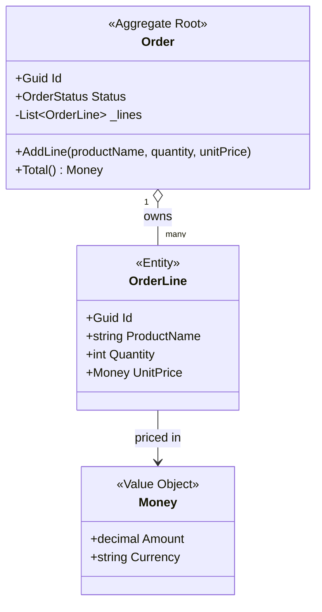
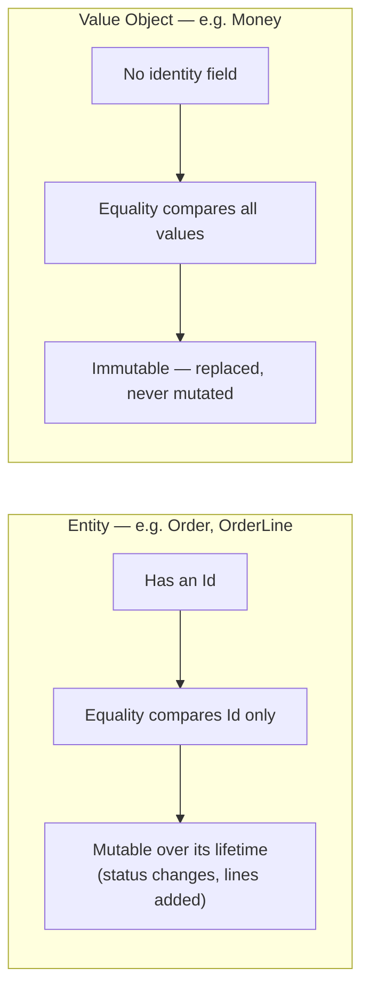

# Domain-Driven Design Basics

## Introduction

Before reading this lesson, you should already be comfortable with **[CQRS and MediatR](../12-advanced-concepts/12-41-cqrs-and-mediatr.md)** — splitting reads from writes so that commands express business intent instead of raw data mutations. Domain-Driven Design (DDD) is the modeling discipline that decides what those commands actually operate on: not anemic data bags, but a small vocabulary of building blocks — Entities, Value Objects, Aggregates, and Bounded Contexts — that keep a business's rules attached to the objects that own them.

By the end of this lesson, you will be able to:

- Distinguish an **Entity** (identity-based equality, ties back to [Equality: Equals, ==, and IEquatable\<T\>](../02-oop/02-33-equality-equals-iequatable.md)) from a **Value Object** (value-based equality)
- Model an immutable Value Object such as `Money` using a C# `record`
- Explain what an **Aggregate** is, why it has exactly one **Aggregate Root**, and why that root defines a consistency boundary
- Explain **Bounded Contexts** and why the same word can mean different things in different parts of a system
- Explain **Ubiquitous Language** and why it matters as much as any line of code
- Model an `Order` aggregate root with `OrderLine` entities and a `Money` value object

## Domain-Driven Design Basics — A Layman's Perspective

Take two things out of your wallet: your passport and a twenty-dollar bill. Your passport has a number, and that number matters — it is *your* passport, not a copy, not an equivalent one, and if the number ever changed you'd still have the same underlying you, tracked across renewals. Two passports with the same name and photo are still two different documents unless the number matches. That twenty-dollar bill is nothing like that. Nobody checks the serial number before accepting it at a coffee shop — one twenty is exactly as good as any other twenty, and two twenties in your pocket are worth the same whether they're the same physical bill or not. Software has an equivalent split. Some things in a business are like passports: a specific `Order` a specific customer placed is *that* order, forever, tracked by an ID, even as its status changes from placed to shipped to delivered. Other things are like the twenty-dollar bill: a price of $49.99 is just $49.99 — two `Money` values with the same amount and currency are simply equal, full stop, with no hidden identity to compare.

Now picture a legal contract binding together several attachments — a cover page, a schedule of terms, a signature page — stapled as one package. You don't sign each attachment separately; you sign the cover page, and that signature governs the whole stapled bundle. If someone tried to swap out just the schedule of terms without going through the cover page's signing process, the whole contract's integrity would be broken — nobody outside the transaction is allowed to reach in and modify one page without the cover page's consent. That stapled bundle, with one designated page controlling all changes to it, is what DDD calls an Aggregate: a cluster of related objects (an `Order` and its `OrderLine` items) that must change together, consistently, and that outside code is only ever allowed to touch through the one object at the front — the Aggregate Root.

Finally, imagine two different departments in the same company both using the word "customer." In the sales department, a customer is a lead with a name, a phone number, and a pipeline stage. In the billing department, a customer is an account with a tax ID, a payment method, and an outstanding balance. Neither department is wrong — they simply don't need to agree, because they're solving different problems with different vocabularies scoped to their own department. DDD calls that scoped vocabulary a Bounded Context, and it calls the shared, precise vocabulary that developers and domain experts agree to use *within* one of those departments the Ubiquitous Language — so that when a business analyst says "the order is placed," the code has a method that says exactly that, not a repurposed `status = 1`.

## Domain-Driven Design Basics — A Programming Language Perspective

An **Entity** is a class distinguished by identity, not by the values of its fields: two `Order` instances with the same `Id` are the same order even if every other property differs across two loads from the database, so `Equals`/`GetHashCode` should compare only the `Id`, exactly as covered in [Equality: Equals, ==, and IEquatable\<T\>](../02-oop/02-33-equality-equals-iequatable.md). A **Value Object** is distinguished purely by its data: two instances with identical property values *are* interchangeable, which is precisely the structural equality a C# `record` (or `readonly record struct`) gives you for free, plus the immutability DDD expects from a Value Object. An **Aggregate** is a cluster of one or more Entities and Value Objects, treated as a single consistency boundary; its **Aggregate Root** is the one Entity through which every external mutation must pass, so invariants (business rules that must always hold) live in the root's methods rather than being scattered across setters. A **Bounded Context** is a modeling boundary — often a microservice boundary — within which a Ubiquitous Language applies consistently.

## How to Model Entities, Value Objects, and Aggregates in C#

Building this vocabulary in C# starts with picking the right type for each role: a `class` with an `Id`-based `Equals` override for an Entity, and an immutable `record` for a Value Object. The Aggregate Root then wraps its internal Entities and Value Objects behind methods that enforce invariants — no public setter ever lets outside code put the aggregate into an invalid state directly.


*Figure 1: `Order` is the Aggregate Root; `OrderLine` is an Entity owned by it; `Money` is an immutable Value Object with no identity of its own.*

```csharp
// Program.cs — .NET 10 / C# 14
var order = new Order(Guid.NewGuid());
order.AddLine("USB-C Cable", quantity: 2, unitPrice: new Money(9.99m, "USD"));
order.AddLine("Wireless Mouse", quantity: 1, unitPrice: new Money(24.99m, "USD"));

Console.WriteLine($"Order {order.Id}: {order.Lines.Count} line(s), total {order.Total()}");

// Value equality: two Money instances with the same data are equal, no identity involved.
var priceA = new Money(9.99m, "USD");
var priceB = new Money(9.99m, "USD");
Console.WriteLine($"priceA == priceB: {priceA == priceB}");

public readonly record struct Money(decimal Amount, string Currency)
{
    public static Money operator +(Money left, Money right)
    {
        if (left.Currency != right.Currency)
            throw new InvalidOperationException("Cannot add Money in different currencies.");
        return new Money(left.Amount + right.Amount, left.Currency);
    }

    public override string ToString() => $"{Amount:F2} {Currency}";
}

public sealed class OrderLine
{
    public Guid Id { get; } = Guid.NewGuid();
    public string ProductName { get; }
    public int Quantity { get; }
    public Money UnitPrice { get; }

    public OrderLine(string productName, int quantity, Money unitPrice)
    {
        ProductName = productName;
        Quantity = quantity;
        UnitPrice = unitPrice;
    }

    public Money LineTotal() => new(UnitPrice.Amount * Quantity, UnitPrice.Currency);

    public override bool Equals(object? obj) => obj is OrderLine other && Id == other.Id;
    public override int GetHashCode() => Id.GetHashCode();
}

public enum OrderStatus { Draft, Placed }

public sealed class Order(Guid id)
{
    private readonly List<OrderLine> _lines = [];

    public Guid Id { get; } = id;
    public OrderStatus Status { get; private set; } = OrderStatus.Draft;
    public IReadOnlyList<OrderLine> Lines => _lines;

    public void AddLine(string productName, int quantity, Money unitPrice)
    {
        if (Status != OrderStatus.Draft)
            throw new InvalidOperationException("Cannot add lines to an order that has already been placed.");
        if (quantity <= 0)
            throw new ArgumentOutOfRangeException(nameof(quantity), "Quantity must be positive.");

        _lines.Add(new OrderLine(productName, quantity, unitPrice));
    }

    public Money Total() =>
        _lines.Aggregate(new Money(0m, "USD"), (running, line) => running + line.LineTotal());

    public override bool Equals(object? obj) => obj is Order other && Id == other.Id;
    public override int GetHashCode() => Id.GetHashCode();
}
```

**Console Output:**

```text
Order a3f2c1d4-7b6e-4e21-9c8a-1f5d6e2b9a01: 2 line(s), total 44.97 USD
priceA == priceB: True
```

`Order.Id` is generated once per run, so your own GUID will differ, but the shape holds: `AddLine` is the *only* way to grow `_lines`, which is exactly the "sign the cover page, not the attachments" rule from the analogy above — no code outside `Order` can append an `OrderLine` directly. `Money` being a `readonly record struct` means `priceA == priceB` compares values, not references, confirming it behaves as a true Value Object.

## Real-Time Example: Enforcing Aggregate Invariants in E-Commerce Order Processing

We continue building on the `Order`, `OrderLine`, and `Customer` types from earlier modules' E-Commerce Order Processing thread, now reframed through a DDD lens: `Order` is the Aggregate Root, `OrderLine` is an Entity that only exists in the context of an order, `Money` is a Value Object, and the `Customer` is referenced by ID only — not embedded — because `Customer` belongs to its own Aggregate in its own Bounded Context (the customer-management part of the system), and one Aggregate should never directly own another Aggregate's Entities. The invariant this example enforces is a real business rule: an order cannot be placed once its total exceeds a configured maximum without manager approval, and once placed, no more lines can be added — both rules live inside `Order`, not scattered across a controller or a service class.

```csharp
// Program.cs — .NET 10 / C# 14 — Real-Time Example (E-Commerce Order Processing)
var customerId = Guid.Parse("c1a5b8e0-1111-4a2b-9c3d-000000000001");
var approvalLimit = new Money(500.00m, "USD");

// Scenario 1: total exceeds the auto-approve limit — Place() rejects it, order stays Draft.
var bigOrder = new Order(Guid.NewGuid(), customerId);
bigOrder.AddLine("Mechanical Keyboard", quantity: 1, unitPrice: new Money(129.00m, "USD"));
bigOrder.AddLine("27-inch Monitor", quantity: 2, unitPrice: new Money(310.00m, "USD"));

try
{
    bigOrder.Place(approvalLimit);
}
catch (InvalidOperationException ex)
{
    Console.WriteLine($"Order not placed automatically: {ex.Message}");
}
Console.WriteLine($"Big order status: {bigOrder.Status}");

// Scenario 2: total is within the limit — Place() succeeds, order becomes immutable.
var smallOrder = new Order(Guid.NewGuid(), customerId);
smallOrder.AddLine("USB-C Cable", quantity: 1, unitPrice: new Money(9.99m, "USD"));
smallOrder.Place(approvalLimit);
Console.WriteLine($"Small order status: {smallOrder.Status}");

try
{
    smallOrder.AddLine("Extra Cable", quantity: 1, unitPrice: new Money(5.00m, "USD"));
}
catch (InvalidOperationException ex)
{
    Console.WriteLine($"Cannot modify order: {ex.Message}");
}

public sealed class Order(Guid id, Guid customerId)
{
    private readonly List<OrderLine> _lines = [];

    public Guid Id { get; } = id;
    public Guid CustomerId { get; } = customerId; // reference by ID — Customer is a separate Aggregate
    public OrderStatus Status { get; private set; } = OrderStatus.Draft;
    public IReadOnlyList<OrderLine> Lines => _lines;

    public void AddLine(string productName, int quantity, Money unitPrice)
    {
        if (Status != OrderStatus.Draft)
            throw new InvalidOperationException("order has already been placed");
        _lines.Add(new OrderLine(productName, quantity, unitPrice));
    }

    public void Place(Money maxAutoApproveTotal)
    {
        var total = Total();
        if (total.Amount > maxAutoApproveTotal.Amount)
            throw new InvalidOperationException(
                $"total {total} exceeds auto-approve limit of {maxAutoApproveTotal} — requires manager approval");

        Status = OrderStatus.Placed;
    }

    public Money Total() =>
        _lines.Aggregate(new Money(0m, "USD"), (running, line) => running + line.LineTotal());
}

public enum OrderStatus { Draft, Placed }

public sealed class OrderLine(string productName, int quantity, Money unitPrice)
{
    public Guid Id { get; } = Guid.NewGuid();
    public string ProductName { get; } = productName;
    public int Quantity { get; } = quantity;
    public Money UnitPrice { get; } = unitPrice;

    public Money LineTotal() => new(UnitPrice.Amount * Quantity, UnitPrice.Currency);
}

public readonly record struct Money(decimal Amount, string Currency)
{
    public static Money operator +(Money left, Money right) =>
        new(left.Amount + right.Amount, left.Currency);

    public override string ToString() => $"{Amount:F2} {Currency}";
}
```

**Console Output:**

```text
Order not placed automatically: total 749.00 USD exceeds auto-approve limit of 500.00 USD — requires manager approval
Big order status: Draft
Small order status: Placed
Cannot modify order: order has already been placed
```

The big order's `Place()` call throws before it ever sets `Status = Placed`, so it correctly stays `Draft` — it can still be edited or resubmitted after manager approval. The small order's total is within the limit, so `Place()` succeeds and its status flips to `Placed`; the moment that happens, `AddLine` refuses any further changes. Every one of these rules — the approval threshold, the "no lines after placing" rule — is enforced by `Order` itself, not by whichever controller or handler happens to call it, so it is architecturally impossible to bypass them by calling the wrong method.

## Entities vs. Value Objects

The single question that tells you which one you're modeling is: "if I swap this for an identical copy, does anything change?" For an Entity, yes — a second `Order` with the same lines and the same total is still a *different* order if its `Id` differs, because identity is what a business tracks across time (status changes, edits, cancellations). For a Value Object, no — a second `Money` with the same amount and currency is completely interchangeable with the first, which is exactly why Value Objects are made immutable: nothing is lost by replacing one with an equal one, so there is no reason to ever mutate one in place.


*Figure 2: Entities are tracked by identity and change over time; Value Objects are compared by value and replaced, never mutated.*

| Aspect | Entity | Value Object |
|---|---|---|
| Equality | By `Id` (identity-based) | By all property values (structural) |
| Mutability | Typically mutable across its lifecycle | Immutable — a new instance replaces the old |
| C# implementation | `class` with `Id`-based `Equals`/`GetHashCode` | `record` / `readonly record struct` |
| Example | `Order`, `OrderLine`, `Customer` | `Money`, an address, a date range |
| Lifecycle | Tracked and persisted individually | Owned by, and lives inside, an Entity |

## Types of DDD Building Blocks

DDD's tactical patterns extend beyond what this lesson covers directly, several of which shape the rest of this module and beyond:

1. **Entities** — objects distinguished by identity, equal only when their `Id` matches, as covered above.
2. **Value Objects** — immutable objects distinguished by their data, such as this lesson's `Money`.
3. **Aggregates & Aggregate Roots** — a consistency boundary with one designated Entity controlling every mutation, illustrated by `Order` owning `OrderLine`.
4. **Bounded Contexts** — the modeling boundary within which one Ubiquitous Language applies, which the next few lessons treat as natural service boundaries.
5. **Ubiquitous Language** — the shared, precise vocabulary between code and domain experts that this lesson's method names (`AddLine`, `Place`) are written to honor.
6. **Domain Events** — an Aggregate announcing "something happened" to the rest of the system without knowing who's listening, which is exactly where the next lesson picks up.

## What You've Learned & What's Next

Domain-Driven Design gives a small, precise vocabulary — Entities, Value Objects, Aggregates, Bounded Contexts, Ubiquitous Language — for keeping business rules attached to the objects that own them, rather than scattered across services that merely push data around. The `Order` aggregate built here enforces its own invariants and exposes them through methods, not setters, which is the foundation the rest of this module's remaining lessons build on directly.

Continue your learning journey with **[Event-Driven Architecture](../12-advanced-concepts/12-43-event-driven-architecture.md)**, where the `Order` aggregate you just built starts announcing what happened to it — via events — instead of other services reaching in to ask.

---
*Applies to: .NET 10 / C# 14. Last reviewed 2026-08-16.*
