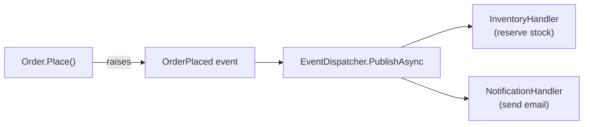
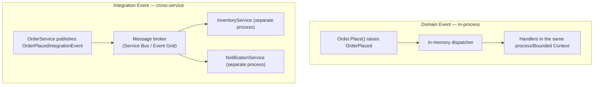

# Event-Driven Architecture

## Introduction

Before reading this lesson, you should already be comfortable with **[Domain-Driven Design Basics](../12-advanced-concepts/12-42-domain-driven-design-basics.md)** — specifically, the `Order` Aggregate Root that enforces its own invariants through methods like `Place()`. This lesson asks a follow-up question: once `Order.Place()` succeeds, how does the rest of the system find out — how does inventory get reserved, and how does the customer get an email — without `Order` itself knowing anything about inventory or email? The answer is event-driven architecture: `Order` publishes a fact ("this happened"), and anything interested subscribes to react, with neither side aware the other exists.

By the end of this lesson, you will be able to:

- Explain how publishing events decouples services in both space (*who* reacts) and time (*when* they react)
- Distinguish a **domain event** (in-process, within one Bounded Context) from an **integration event** (cross-service, over a message broker)
- Raise a domain event from inside an Aggregate and dispatch it to independent handlers
- Model two subscribers reacting to the same event without referencing each other
- Recognize how this foreshadows Module 16's Azure Service Bus and Event Grid coverage

## Event-Driven Architecture — A Layman's Perspective

Picture a fire alarm going off in an office building. The alarm doesn't personally walk to every desk, tap each employee on the shoulder, and give them individual instructions — it just makes one loud, public announcement: "there is a fire." What happens next is entirely up to whoever is listening. The security desk hears it and locks down the elevators. Facilities hears it and shuts off the gas lines. Employees hear it and evacuate. The fire alarm has no idea any of those three things happen — it doesn't call security, it doesn't email facilities, it doesn't know evacuation procedures exist. It just announces a fact, loudly, to the whole building, and whoever cares takes their own action based on their own responsibilities.

Compare that to a manager personally phoning each department one by one: "security, please lock the elevators; facilities, please shut off the gas; everyone else, please evacuate." That works too, but now the manager has to know about every single department that might care, has to phone them in some order, and if a new department gets added next year — say, a data center team that needs to spin down servers — the manager's phone list has to be updated by hand. The alarm-based approach doesn't have that problem: the data center team just starts listening for the same alarm, and nothing about the alarm itself, or any other listener, has to change.

That's the core trade being made here. A direct phone call is *tightly coupled*: the caller must know exactly who to call and must wait for each call to complete before moving to the next. An alarm is *loosely coupled* in two separate ways at once. It's decoupled in space — the alarm doesn't know or care who's listening, so new listeners can be added or removed freely. And it's decoupled in time — the alarm doesn't wait around for security to finish locking the elevators before facilities starts shutting off gas; all of them react independently, on their own schedule, the moment they hear the announcement. If facilities is on a coffee break and doesn't react for ninety seconds, the alarm doesn't hang waiting — it already did its job the instant it sounded.

The one thing this trade costs you is a guarantee. A manager on the phone gets instant confirmation the elevators are locked before hanging up. An alarm gets no such confirmation — it just has to trust that whoever needed to hear it, heard it, and did the right thing. Software systems built around published events make exactly this same trade, deliberately, because at scale — with dozens of services, not three departments — a growing phone list becomes the actual bottleneck, and a loud, well-defined announcement scales better than an ever-growing list of direct calls.

## Event-Driven Architecture — A Programming Language Perspective

An **event** is an immutable record of something that already happened, named in the past tense (`OrderPlaced`, not `PlaceOrder`) — a command asks for something to happen; an event states that it already did. A **domain event** is raised by an Aggregate as a side effect of a state change and is typically handled *in-process*, within the same Bounded Context, often via an in-memory dispatcher or the same MediatR `INotification`/`IPublisher` pipeline introduced for CQRS in the prerequisite lesson. An **integration event** crosses a process or service boundary entirely — published to a message broker (Azure Service Bus, Event Grid, RabbitMQ) so that a *different* microservice, potentially owned by a different team, can react without a direct network call. The two often go hand-in-hand: a domain event raised inside one service is translated into an integration event published outward, keeping the internal domain model decoupled from the external message contract other services depend on.

## How to Raise and Dispatch a Domain Event in C#

The pattern has three moving pieces: an event record describing what happened, an Aggregate that raises it as a side effect, and a dispatcher that hands the event to every registered handler after the triggering operation completes.


*Figure 1: `Order` raises one event; the dispatcher fans it out to independent handlers that don't know about each other.*

```csharp
// Program.cs — .NET 10 / C# 14
var dispatcher = new EventDispatcher();
dispatcher.Subscribe<OrderPlaced>(new InventoryHandler());
dispatcher.Subscribe<OrderPlaced>(new NotificationHandler());

var order = new Order(Guid.NewGuid());
order.AddLine("Desk Lamp", quantity: 1);
order.Place();

foreach (var domainEvent in order.DequeueEvents())
{
    await dispatcher.PublishAsync(domainEvent);
}

public sealed record OrderPlaced(Guid OrderId, DateTime PlacedOnUtc);

public sealed class Order(Guid id)
{
    private readonly List<string> _lines = [];
    private readonly List<object> _events = [];

    public Guid Id { get; } = id;

    public void AddLine(string productName, int quantity) => _lines.Add(productName);

    public void Place()
    {
        _events.Add(new OrderPlaced(Id, DateTime.UtcNow));
    }

    public IReadOnlyList<object> DequeueEvents()
    {
        var events = _events.ToList();
        _events.Clear();
        return events;
    }
}

public interface IEventHandler<in TEvent>
{
    Task HandleAsync(TEvent domainEvent);
}

public sealed class InventoryHandler : IEventHandler<OrderPlaced>
{
    public Task HandleAsync(OrderPlaced domainEvent)
    {
        Console.WriteLine($"[Inventory] Reserving stock for order {domainEvent.OrderId}");
        return Task.CompletedTask;
    }
}

public sealed class NotificationHandler : IEventHandler<OrderPlaced>
{
    public Task HandleAsync(OrderPlaced domainEvent)
    {
        Console.WriteLine($"[Notification] Sending confirmation email for order {domainEvent.OrderId}");
        return Task.CompletedTask;
    }
}

public sealed class EventDispatcher
{
    private readonly Dictionary<Type, List<object>> _handlers = [];

    public void Subscribe<TEvent>(IEventHandler<TEvent> handler)
    {
        if (!_handlers.TryGetValue(typeof(TEvent), out var list))
            _handlers[typeof(TEvent)] = list = [];
        list.Add(handler);
    }

    public async Task PublishAsync<TEvent>(TEvent domainEvent)
    {
        if (!_handlers.TryGetValue(typeof(TEvent), out var list)) return;
        foreach (IEventHandler<TEvent> handler in list.Cast<IEventHandler<TEvent>>())
        {
            await handler.HandleAsync(domainEvent);
        }
    }
}
```

**Console Output:**

```text
[Inventory] Reserving stock for order 7e3a1b2c-5d4f-4a1e-9b0c-1234567890ab
[Notification] Sending confirmation email for order 7e3a1b2c-5d4f-4a1e-9b0c-1234567890ab
```

`Order.Place()` never mentions inventory or email — it only records that `OrderPlaced` happened. The `EventDispatcher` is what fans that single event out to two handlers, and each handler could be added, removed, or fail independently without `Order` changing a single line. That's the loose coupling from the fire-alarm analogy, expressed in code: one announcement, any number of independent reactions.

## Real-Time Example: OrderPlaced Triggering Inventory and Notification Reactions

We continue building on the `Order` Aggregate Root from the previous lesson, now wired so that a successful `Place()` call raises a real `OrderPlaced` domain event carrying enough data — the order ID and the line items — for two genuinely independent services to react: an `InventoryService` that decrements stock, and a `NotificationService` that queues a confirmation email. In a production system, these would likely be two separate microservices, each subscribing to `OrderPlaced` as an *integration* event delivered over Azure Service Bus rather than an in-process dispatcher — Module 16 covers that transport in depth — but the reaction logic and the decoupling it enables are identical either way.

```csharp
// Program.cs — .NET 10 / C# 14 — Real-Time Example (E-Commerce Order Processing)
var dispatcher = new EventDispatcher();
dispatcher.Subscribe<OrderPlaced>(new InventoryService());
dispatcher.Subscribe<OrderPlaced>(new NotificationService());

var order = new Order(Guid.NewGuid());
order.AddLine("Wireless Keyboard", quantity: 2);
order.AddLine("USB Hub", quantity: 1);
order.Place();

foreach (var domainEvent in order.DequeueEvents())
{
    await dispatcher.PublishAsync(domainEvent);
}

public sealed record OrderLineSnapshot(string ProductName, int Quantity);
public sealed record OrderPlaced(Guid OrderId, IReadOnlyList<OrderLineSnapshot> Lines);

public sealed class Order(Guid id)
{
    private readonly List<OrderLineSnapshot> _lines = [];
    private readonly List<object> _events = [];

    public Guid Id { get; } = id;

    public void AddLine(string productName, int quantity) =>
        _lines.Add(new OrderLineSnapshot(productName, quantity));

    public void Place() => _events.Add(new OrderPlaced(Id, _lines.ToList()));

    public IReadOnlyList<object> DequeueEvents()
    {
        var events = _events.ToList();
        _events.Clear();
        return events;
    }
}

public interface IEventHandler<in TEvent>
{
    Task HandleAsync(TEvent domainEvent);
}

public sealed class InventoryService : IEventHandler<OrderPlaced>
{
    public Task HandleAsync(OrderPlaced domainEvent)
    {
        foreach (var line in domainEvent.Lines)
            Console.WriteLine($"[Inventory] Decrementing {line.Quantity}x '{line.ProductName}'");
        return Task.CompletedTask;
    }
}

public sealed class NotificationService : IEventHandler<OrderPlaced>
{
    public Task HandleAsync(OrderPlaced domainEvent)
    {
        Console.WriteLine($"[Notification] Queuing confirmation email for order {domainEvent.OrderId} ({domainEvent.Lines.Count} line(s))");
        return Task.CompletedTask;
    }
}

public sealed class EventDispatcher
{
    private readonly Dictionary<Type, List<object>> _handlers = [];

    public void Subscribe<TEvent>(IEventHandler<TEvent> handler)
    {
        if (!_handlers.TryGetValue(typeof(TEvent), out var list))
            _handlers[typeof(TEvent)] = list = [];
        list.Add(handler);
    }

    public async Task PublishAsync<TEvent>(TEvent domainEvent)
    {
        if (!_handlers.TryGetValue(typeof(TEvent), out var list)) return;
        foreach (IEventHandler<TEvent> handler in list.Cast<IEventHandler<TEvent>>())
            await handler.HandleAsync(domainEvent);
    }
}
```

**Console Output:**

```text
[Inventory] Decrementing 2x 'Wireless Keyboard'
[Inventory] Decrementing 1x 'USB Hub'
[Notification] Queuing confirmation email for order 4f9c2d1a-6e8b-4c3d-8a1f-0987654321cd (2 line(s))
```

Notice `InventoryService` and `NotificationService` never reference each other, never share a base class beyond the generic handler interface, and could be deployed, scaled, or replaced independently of one another — the exact property that made the fire alarm analogy work. If `NotificationService` were temporarily down, `InventoryService` would still reserve stock correctly; the two are not each other's dependency, only the dispatcher's.

## Domain Events vs. Integration Events

Both kinds of events describe "something happened," but they operate at different scopes and carry different obligations. A domain event lives entirely inside one Bounded Context — it's allowed to reference internal domain types freely, because both the publisher and every subscriber compile against the same codebase. An integration event crosses a Bounded Context (or service, or team) boundary, so it must be a stable, serializable, versioned contract — internal domain types should never leak directly onto the wire, because the moment another team's service depends on your internal shape, you've lost the freedom to refactor it.


*Figure 2: A domain event stays inside one process; an integration event travels over a broker to independently deployed services.*

| Aspect | Domain Event | Integration Event |
|---|---|---|
| Scope | Within one Bounded Context / process | Across services, teams, or processes |
| Transport | In-memory dispatcher (e.g. MediatR `INotification`) | Message broker (Azure Service Bus, Event Grid, RabbitMQ) |
| Contract stability | Can change freely alongside the domain model | Must be a stable, versioned, serializable schema |
| Delivery guarantee | Typically synchronous within the same request | Asynchronous, at-least-once, often with retries |
| Failure handling | An unhandled exception can fail the current request | Dead-lettering, retries — covered further in Module 16 |

## Types of Event-Driven Building Blocks

A handful of related concepts round out the event-driven picture, several of which the next few lessons and Module 16 build on directly:

1. **Domain events** — in-process facts raised by an Aggregate, as demonstrated by `Order.Place()` raising `OrderPlaced`.
2. **Integration events** — the cross-service equivalent, carried over a message broker rather than an in-memory dispatcher.
3. **Event dispatcher / publisher** — the in-process mechanism (often MediatR's `INotification`) that fans one event out to many handlers.
4. **Event sourcing** — a more advanced pattern where events *are* the system of record, rather than a side effect of it — out of scope here, but worth knowing by name.
5. **Message brokers** — Azure Service Bus and Event Grid, the transport this lesson foreshadows and Module 16 covers directly.
6. **The Saga pattern** — coordinating a multi-step process across several event-driven reactions, which is exactly where the next lesson picks up.

## What You've Learned & What's Next

Event-driven architecture replaces direct, tightly-coupled service calls with published facts that any number of independent subscribers can react to, on their own schedule, without knowing about each other. `Order.Place()` raising `OrderPlaced` — with `InventoryService` and `NotificationService` reacting independently — is the in-process rehearsal for what Module 16's Azure Service Bus and Event Grid lessons do for real, across actual service boundaries.

Continue your learning journey with **[The Saga Pattern](../12-advanced-concepts/12-44-the-saga-pattern.md)**, where you'll see what happens when a business process needs *several* of these event-driven reactions to succeed in sequence — and what to do when one of them fails partway through.

---
*Applies to: .NET 10 / C# 14. Last reviewed 2026-08-16.*
