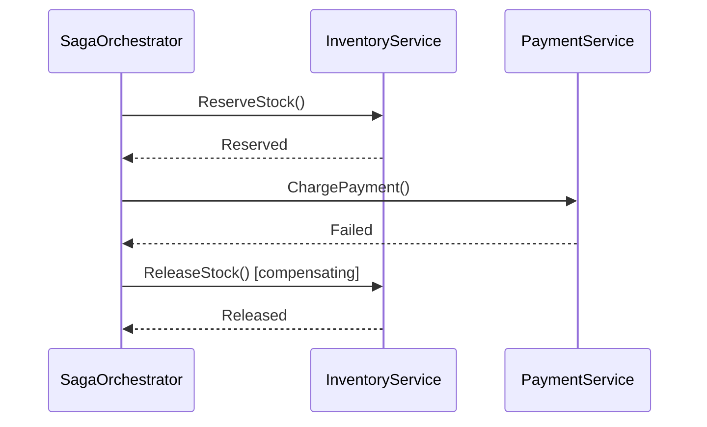
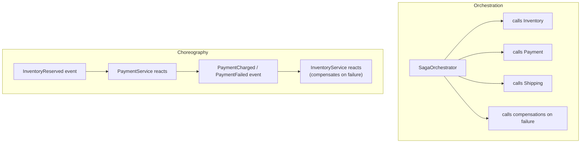

# The Saga Pattern

## Introduction

Before reading this lesson, you should already be comfortable with **[Event-Driven Architecture](../12-advanced-concepts/12-43-event-driven-architecture.md)** — `InventoryService` and `NotificationService` reacting independently to a single `OrderPlaced` event. That lesson conveniently assumed every reaction succeeds. This lesson asks what happens when a *business process* needs several steps to succeed **in sequence**, across several services and their own separate databases, and one of those steps fails partway through — because there is no single database transaction spanning all of them to simply roll back.

By the end of this lesson, you will be able to:

- Explain why a multi-service business process can't rely on a single ACID transaction
- Define a **compensating action** and explain why it undoes a step's *effect*, not its data
- Distinguish **orchestration** sagas (one coordinator directs each step) from **choreography** sagas (each service reacts to the previous step's event)
- Implement an orchestrated saga in C# that reserves inventory, charges payment, and confirms shipment
- Trigger a compensating action when a later step fails, leaving the overall system consistent

## The Saga Pattern — A Layman's Perspective

Imagine planning a wedding that requires three separate bookings, each with a different vendor: the venue, the caterer, and the band. You book the venue first — deposit paid, date confirmed. Then you call the caterer, who confirms availability for that date. Then you call the band, and they tell you they're already booked that evening. Now what? There's no single "undo everything" button that spans three separate businesses with three separate calendars — nobody at the venue and the caterer even knows the band exists, let alone that the whole wedding just fell through. What you actually have to do is call the caterer back and cancel, then call the venue back and cancel the deposit. Each cancellation is a deliberate, separate action — a *compensating* booking that undoes the *effect* of the original booking, placed with the same vendor who made the original commitment. Nobody erases a calendar entry from history; the venue's calendar still shows you called and booked, then called again and canceled. The net effect, once all the compensations are done, is that nobody involved is left holding a commitment that doesn't make sense anymore — but getting there took real, visible, additional steps, not a silent rewind.

This is the situation every multi-service checkout faces. Reserving inventory, charging a payment, and confirming shipment typically happen in three different services, each with its own database — there is no single transaction log spanning all three that a database engine can atomically commit or roll back. If payment fails after inventory was already reserved, the system needs a genuine "release the inventory" action — a compensating step, placed explicitly, that undoes the *business effect* of the reservation, the same way calling the caterer back to cancel undoes the business effect of having booked them.

There are two ways to organize who makes those follow-up calls. One approach is to hire a wedding planner: a single coordinator who calls the venue, then the caterer, then the band, in order, and who personally calls back to cancel anything already booked the moment one booking fails. The planner holds the entire plan in their head and directs every step. The other approach is looser: each vendor, upon confirming their own booking, simply notifies the *next* vendor directly — the venue tells the caterer "we're confirmed, your turn," and the caterer tells the band. There's no single planner holding the whole picture; the process moves forward (or backward, when something fails) purely through each participant reacting to the previous one's news. Both get the wedding booked when everything goes right — they differ in who's accountable for noticing when something goes wrong, and in how easy it is to look at the whole process at a glance versus needing to interview every vendor separately to reconstruct what happened.

## The Saga Pattern — A Programming Language Perspective

A **saga** is a sequence of local transactions, each owned by a single service, coordinated so that if any step fails, previously completed steps are undone by explicit **compensating transactions** rather than a database-level rollback. There are two implementation styles. An **orchestrated** saga has a single coordinator class (a "saga orchestrator") that calls each participant directly, in a defined order, and is responsible for invoking the corresponding compensating action for every step it already completed if a later step throws. A **choreographed** saga has no central coordinator at all — each participant publishes a domain/integration event on success, and the next participant subscribes to that event to know when to act, exactly as covered in the previous lesson. .NET has no built-in "saga" type; a saga is an architectural pattern you implement using ordinary classes, `try`/`catch`, and (for choreography) the event-dispatching machinery from the previous lesson.

## How to Implement an Orchestrated Saga in C#

An orchestrator holds an explicit list of completed steps as it goes, so that if any step throws, it can walk that list backward and call each one's matching compensating action, in reverse order, before the exception is allowed to propagate.


*Figure 1: When `ChargePayment` fails, the orchestrator calls `ReleaseStock` — the compensating action for the step that already succeeded.*

```csharp
// Program.cs — .NET 10 / C# 14
var orchestrator = new SagaOrchestrator(new InventoryService(), new PaymentService(succeeds: false));

try
{
    await orchestrator.RunAsync(sku: "SKU-1001", quantity: 2, amount: 59.98m);
    Console.WriteLine("Saga completed successfully.");
}
catch (Exception ex)
{
    Console.WriteLine($"Saga failed and compensations ran: {ex.Message}");
}

public sealed class InventoryService
{
    public Task ReserveStockAsync(string sku, int quantity)
    {
        Console.WriteLine($"[Inventory] Reserved {quantity}x {sku}");
        return Task.CompletedTask;
    }

    public Task ReleaseStockAsync(string sku, int quantity)
    {
        Console.WriteLine($"[Inventory] Compensating: released {quantity}x {sku}");
        return Task.CompletedTask;
    }
}

public sealed class PaymentService(bool succeeds)
{
    public Task ChargeAsync(decimal amount)
    {
        if (!succeeds)
            throw new InvalidOperationException("card declined");

        Console.WriteLine($"[Payment] Charged {amount:C}");
        return Task.CompletedTask;
    }
}

public sealed class SagaOrchestrator(InventoryService inventory, PaymentService payment)
{
    public async Task RunAsync(string sku, int quantity, decimal amount)
    {
        await inventory.ReserveStockAsync(sku, quantity);

        try
        {
            await payment.ChargeAsync(amount);
        }
        catch
        {
            await inventory.ReleaseStockAsync(sku, quantity);
            throw;
        }
    }
}
```

**Console Output:**

```text
[Inventory] Reserved 2x SKU-1001
[Inventory] Compensating: released 2x SKU-1001
Saga failed and compensations ran: card declined
```

The orchestrator reserved stock first; the payment step then threw, and the `catch` block immediately called the *inventory* service's compensating action — `ReleaseStockAsync`, hence the `[Inventory]` label on both lines — before re-throwing. The result is a consistent system (no stock reserved, no payment charged) even though nothing here used a distributed transaction.

## Real-Time Example: An Orchestrated Checkout Saga in E-Commerce Order Processing

We continue building on the `Order` Aggregate Root and the inventory/payment services introduced in this module's recent lessons, now coordinated as a three-step checkout saga: reserve inventory, charge payment, confirm shipment. Each step is owned by a different service with its own database in a real deployment; the orchestrator here holds the sequence and the compensating logic so that no single step's failure leaves stock reserved with no payment behind it.

```csharp
// Program.cs — .NET 10 / C# 14 — Real-Time Example (E-Commerce Order Processing)
var saga = new CheckoutSagaOrchestrator(
    new InventoryService(),
    new PaymentService(succeeds: false),
    new ShippingService());

var result = await saga.CheckoutAsync(orderId: Guid.Parse("9f1e2d3c-4b5a-4c6d-8e7f-000000000099"), sku: "SKU-2002", quantity: 1, amount: 129.00m);

Console.WriteLine($"Checkout result: {(result ? "confirmed" : "rolled back")}");

public sealed class InventoryService
{
    public Task<bool> ReserveAsync(string sku, int quantity)
    {
        Console.WriteLine($"[Inventory] Reserving {quantity}x {sku}");
        return Task.FromResult(true);
    }

    public Task ReleaseAsync(string sku, int quantity)
    {
        Console.WriteLine($"[Inventory] Compensating: releasing {quantity}x {sku}");
        return Task.CompletedTask;
    }
}

public sealed class PaymentService(bool succeeds)
{
    public Task<bool> ChargeAsync(Guid orderId, decimal amount)
    {
        if (!succeeds)
        {
            Console.WriteLine($"[Payment] Charge failed for order {orderId}");
            return Task.FromResult(false);
        }

        Console.WriteLine($"[Payment] Charged {amount:C} for order {orderId}");
        return Task.FromResult(true);
    }
}

public sealed class ShippingService
{
    public Task ConfirmAsync(Guid orderId)
    {
        Console.WriteLine($"[Shipping] Confirmed shipment for order {orderId}");
        return Task.CompletedTask;
    }
}

public sealed class CheckoutSagaOrchestrator(
    InventoryService inventory,
    PaymentService payment,
    ShippingService shipping)
{
    public async Task<bool> CheckoutAsync(Guid orderId, string sku, int quantity, decimal amount)
    {
        await inventory.ReserveAsync(sku, quantity);

        var charged = await payment.ChargeAsync(orderId, amount);
        if (!charged)
        {
            // Compensating action: undo the inventory reservation's business effect.
            await inventory.ReleaseAsync(sku, quantity);
            return false;
        }

        await shipping.ConfirmAsync(orderId);
        return true;
    }
}
```

**Console Output:**

```text
[Inventory] Reserving 1x SKU-2002
[Payment] Charge failed for order 9f1e2d3c-4b5a-4c6d-8e7f-000000000099
[Inventory] Compensating: releasing 1x SKU-2002
Checkout result: rolled back
```

Notice `ShippingService.ConfirmAsync` never runs at all — the orchestrator only reaches the shipping step once payment has genuinely succeeded, and the moment payment reports failure, the orchestrator's own logic (not a database engine) reaches back to inventory and undoes the reservation. This is the entire saga pattern in miniature: no cross-service transaction exists, so the orchestrator itself is responsible for knowing which compensating action undoes which completed step.

## Orchestration vs. Choreography

An orchestrated saga concentrates the entire sequence — and every compensating action — inside one coordinator class, which makes the whole business process readable in one place, at the cost of that coordinator needing direct knowledge of (and often direct calls to) every participant. A choreographed saga has no such coordinator: each service completes its own step and publishes an event, exactly as covered in the previous lesson, and the next service in the chain simply reacts to that event — including a "failed" event triggering the previous service's own compensating handler. Choreography keeps each service more independent, but understanding the *whole* process end-to-end means mentally reconstructing it from several separately-deployed event handlers, rather than reading one orchestrator class top to bottom.


*Figure 2: Orchestration centralizes control in one coordinator; choreography spreads control across each service's own event reactions.*

| Aspect | Orchestration | Choreography |
|---|---|---|
| Control | One coordinator directs every step | No coordinator — each service reacts to events |
| Coupling | Coordinator knows every participant | Each service only knows the event it reacts to |
| Visibility | Whole process readable in one class | Reconstructed by tracing events across services |
| Compensating actions | Invoked explicitly by the coordinator | Triggered by "failed" events, handled locally |
| Best fit | Complex processes needing a clear owner | Simpler chains, or teams wanting service independence |

## Types of Saga-Related Concepts

A few related ideas round out the saga pattern, several of which the remaining lessons in this module build on:

1. **Orchestrated sagas** — a single coordinator directing every step and compensation, as built in this lesson.
2. **Choreographed sagas** — each service reacting to the previous step's published event, building on the previous lesson.
3. **Compensating transactions** — explicit, business-level "undo" actions like `ReleaseAsync`, not a database rollback.
4. **Saga state / persistence** — in a real system, an orchestrator typically persists which step it's on, so it can resume after a crash — beyond this lesson's illustrative scope.
5. **Idempotency** — compensating (and forward) actions should be safe to run more than once, since retries are common in distributed systems.
6. **Resilience policies** — what to do when a single step's *call itself* fails transiently, rather than reports business failure, which is exactly where the next lesson picks up.

## What You've Learned & What's Next

The saga pattern replaces a single ACID transaction — impossible across independently-owned services and databases — with an explicit sequence of local steps and, on failure, explicit compensating actions that undo each completed step's business effect. Orchestration centralizes that sequence in one coordinator; choreography spreads it across each service's own event reactions.

Continue your learning journey with **[Service Discovery and Resilience with Polly](../12-advanced-concepts/12-45-service-discovery-and-resilience.md)**, where we address a question this lesson quietly assumed away: how does the orchestrator even find `PaymentService`'s address, and what happens when that call itself times out rather than cleanly returning failure?

---
*Applies to: .NET 10 / C# 14. Last reviewed 2026-08-16.*
