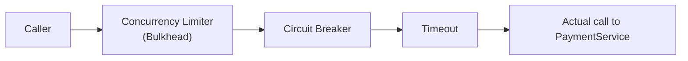
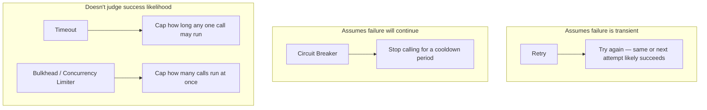

# Service Discovery and Resilience with Polly

## Introduction

Before reading this lesson, you should already be comfortable with **[The Saga Pattern](../12-advanced-concepts/12-44-the-saga-pattern.md)**, whose `CheckoutSagaOrchestrator` quietly assumed that calling `PaymentService` just works, or cleanly reports failure. Two questions were glossed over: how does the orchestrator even know *where* `PaymentService` lives on the network, and what should happen when a call to it doesn't cleanly fail or succeed, but hangs, or fails intermittently under load? This lesson answers both — service discovery for the first, and Polly's fuller policy set (beyond the retry policy from [Retry Patterns with Polly](../05-exception-handling/05-09-retry-patterns-with-polly.md)) for the second.

By the end of this lesson, you will be able to:

- Explain service discovery — DNS-based discovery and service registries — and why hardcoded addresses don't survive real deployments
- Recall Polly's retry policy from Module 5 and identify where retry alone falls short
- Configure a **Circuit Breaker** policy that stops calling a service that's already failing
- Configure a **Timeout** policy that bounds how long a single call is allowed to take
- Configure **Bulkhead isolation** (a concurrency limit) that stops one failing dependency from exhausting all available resources
- Compose Circuit Breaker, Timeout, Retry, and Bulkhead into a single resilience pipeline

## Service Discovery and Resilience with Polly — A Layman's Perspective

Imagine you're trying to call a coworker at a large company, but company policy is that extensions get reassigned constantly as people move desks, get promoted, or the office relocates floors. If you wrote down "Dial 4471" on a sticky note six months ago, there's a real chance 4471 now rings someone else's desk entirely, or nobody's. What actually works, every time, is calling the company's main receptionist and asking, "please connect me to whoever's handling payments today" — the receptionist looks up the *current* extension and connects you, regardless of how many times that extension has changed since you last called. That receptionist is service discovery: instead of your code hardcoding "call 10.0.4.17," it asks a directory — DNS, or a dedicated service registry — "where does the payment service currently live?" and gets back whatever address is currently correct, even if the actual server behind it was replaced an hour ago.

Now separately, imagine you're the receptionist yourself, fielding calls all day, and one particular department — say, a vendor's support line — has started acting up: sometimes it takes forty rings before anyone answers, sometimes it just rings forever. A naive approach is to keep dialing that vendor every single time someone asks for them, tying up your own phone line for forty rings each time, over and over, all day. A smarter receptionist, after the third or fourth call in a row goes nowhere, stops even attempting that call for a while — "I know that line's been down all morning, let me not waste your time and mine dialing it again" — and instead immediately tells the next caller "that department's unreachable right now, try again shortly." That's a Circuit Breaker: after enough consecutive failures, it stops even attempting calls for a cooldown period, failing fast instead of repeating a doomed attempt.

A Timeout is the receptionist deciding, in advance, "I will let any single call ring for at most fifteen seconds — if nobody's picked up by then, I'm hanging up and telling the caller it didn't connect," rather than holding the line indefinitely on the hope that someone eventually answers. And Bulkhead isolation is the receptionist recognizing that only three of the company's twenty phone lines should ever be tied up dialing that one flaky vendor at once — even if fifty employees are simultaneously trying to reach them, at most three calls to that vendor happen concurrently, so the other seventeen phone lines stay free for everyone else's calls, completely unaffected by however badly that one vendor is behaving. None of these four ideas — discovery, circuit breaking, timeouts, bulkheads — replace each other; a well-run front desk uses all four together, and so does a well-run distributed system.

## Service Discovery and Resilience with Polly — A Programming Language Perspective

**Service discovery** resolves a logical service name to a concrete, currently-valid network address at call time, rather than at build time — via DNS-based discovery (common in Kubernetes, where a service name resolves through cluster DNS to a currently-healthy pod) or a dedicated service registry that instances register with and deregister from as they start and stop; Module 16 covers .NET's dedicated tooling for this in depth. **Polly** is .NET's resilience library, and beyond the retry policy already covered in Module 5, its policy set in the current `Polly` v8 `ResiliencePipelineBuilder` API includes `AddCircuitBreaker()` (stops calls after a failure threshold, entering an "open" state for a cooldown period before testing recovery in a "half-open" state), `AddTimeout()` (bounds a single call's duration and cancels it if exceeded), and `AddConcurrencyLimiter()` — the modern name for what's still commonly called Bulkhead isolation — which caps how many calls to a given dependency may run concurrently. Multiple policies compose into a single `ResiliencePipeline` by chaining `.Add...()` calls on one builder, applied in the order they're added.

## How to Compose Circuit Breaker, Timeout, and Bulkhead with Polly

A resilience pipeline is built once, then reused for every call to a given dependency. Order matters: policies added earlier wrap policies added later, so a typical pipeline puts the broadest protection (concurrency limiting) on the outside and the narrowest (timeout) on the inside.


*Figure 1: Each policy wraps the next — a call must clear the bulkhead's concurrency slot, then the circuit breaker's "closed" check, then the timeout, before the real call happens.*

```csharp
// Program.cs — .NET 10 / C# 14
using Polly;
using Polly.CircuitBreaker;
using Polly.Timeout;

int attempt = 0;

ResiliencePipeline pipeline = new ResiliencePipelineBuilder()
    .AddCircuitBreaker(new()
    {
        FailureRatio = 0.5,
        MinimumThroughput = 3,
        BreakDuration = TimeSpan.FromSeconds(5)
    })
    .AddTimeout(TimeSpan.FromMilliseconds(200))
    .Build();

// Simulate three consecutive failures to trip the circuit breaker.
for (int i = 1; i <= 4; i++)
{
    try
    {
        await pipeline.ExecuteAsync(async _ =>
        {
            attempt++;
            await Task.Delay(10);
            throw new InvalidOperationException($"payment gateway unreachable (attempt {attempt})");
        });
    }
    catch (BrokenCircuitException)
    {
        Console.WriteLine($"Call {i}: circuit is OPEN — failing fast, no call attempted");
    }
    catch (InvalidOperationException ex)
    {
        Console.WriteLine($"Call {i}: failed — {ex.Message}");
    }
}
```

**Console Output:**

```text
Call 1: failed — payment gateway unreachable (attempt 1)
Call 2: failed — payment gateway unreachable (attempt 2)
Call 3: failed — payment gateway unreachable (attempt 3)
Call 4: circuit is OPEN — failing fast, no call attempted
```

The first three calls each genuinely attempt the operation and fail, which is enough consecutive failure (meeting `MinimumThroughput` at a 50%+ `FailureRatio`) to trip the breaker. The fourth call never reaches the `throw` at all — Polly itself raises `BrokenCircuitException` before the delegate runs, exactly like the receptionist who stops dialing a known-dead line. `AddTimeout(200ms)` never triggers here because every simulated failure happens well under 200ms, but it would raise a `TimeoutRejectedException` if the delegate ran longer than that bound.

## Real-Time Example: A Resilient PaymentService Call in E-Commerce Order Processing

We continue building on the `CheckoutSagaOrchestrator` and `PaymentService` from the previous lesson, now wrapping the payment call in a full resilience pipeline: a concurrency limiter caps how many simultaneous payment calls the checkout flow may issue, a circuit breaker stops hammering a payment gateway that's already down, and a timeout bounds any single call. The saga orchestrator's own compensating logic from the previous lesson stays unchanged — this pipeline only governs *how* the payment call itself behaves, not what happens after it reports success or failure.

```csharp
// Program.cs — .NET 10 / C# 14 — Real-Time Example (E-Commerce Order Processing)
using Polly;
using Polly.CircuitBreaker;

var pipeline = new ResiliencePipelineBuilder()
    .AddConcurrencyLimiter(permitLimit: 2, queueLimit: 0)
    .AddCircuitBreaker(new()
    {
        FailureRatio = 0.5,
        MinimumThroughput = 2,
        BreakDuration = TimeSpan.FromSeconds(10)
    })
    .AddTimeout(TimeSpan.FromMilliseconds(300))
    .Build();

var gateway = new FlakyPaymentGateway(failuresBeforeRecovery: 2);

foreach (var orderId in new[] { "ORD-501", "ORD-502", "ORD-503" })
{
    try
    {
        var confirmation = await pipeline.ExecuteAsync(
            async ct => await gateway.ChargeAsync(orderId, 84.50m, ct));
        Console.WriteLine($"{orderId}: charged, confirmation {confirmation}");
    }
    catch (BrokenCircuitException)
    {
        Console.WriteLine($"{orderId}: circuit OPEN — payment gateway assumed down, failing fast");
    }
    catch (Exception ex)
    {
        Console.WriteLine($"{orderId}: payment call failed — {ex.Message}");
    }
}

public sealed class FlakyPaymentGateway(int failuresBeforeRecovery)
{
    private int _calls;

    public Task<string> ChargeAsync(string orderId, decimal amount, CancellationToken ct)
    {
        _calls++;
        if (_calls <= failuresBeforeRecovery)
            throw new InvalidOperationException("gateway timeout");

        return Task.FromResult($"CONF-{orderId}-{_calls}");
    }
}
```

**Console Output:**

```text
ORD-501: payment call failed — gateway timeout
ORD-502: payment call failed — gateway timeout
ORD-503: circuit OPEN — payment gateway assumed down, failing fast
```

`FlakyPaymentGateway` is configured to fail its first two calls. The circuit breaker's `MinimumThroughput: 2` means it needs to observe two completed calls before it evaluates its failure ratio at all, so `ORD-501` and `ORD-502` both genuinely reach the gateway and fail on their own — only once the second failure completes does the breaker have enough samples to see a 100% failure ratio and flip open. `ORD-503` then never reaches the gateway at all, even though the gateway would have actually recovered by the third call. This is the real trade-off a circuit breaker makes: it protects the system from repeatedly calling a failing dependency, at the cost of not noticing recovery until its `BreakDuration` cooldown elapses and it allows a trial call through in the half-open state.

## Retry vs. Circuit Breaker vs. Timeout vs. Bulkhead

Retry, covered in Module 5, assumes a failure is transient and worth attempting again immediately (or after a backoff) — it's the right tool when the *next* call is likely to succeed. A Circuit Breaker assumes the opposite: after enough recent failures, the next call is *unlikely* to succeed, so it stops trying altogether for a while, protecting both the caller and the struggling dependency from further load. A Timeout doesn't care about failure patterns at all — it simply refuses to let any single call run unbounded, regardless of whether that call would have eventually succeeded. Bulkhead isolation (concurrency limiting) is different again: it doesn't judge whether calls are likely to succeed, it simply ensures one dependency can never consume more than its allotted share of concurrent capacity, so a flood of calls to a struggling `PaymentService` can't starve calls to a healthy `InventoryService` sharing the same thread pool or connection pool.


*Figure 2: Each policy solves a different failure shape — none of the four substitutes for the others.*

| Aspect | Retry | Circuit Breaker | Timeout | Bulkhead (Concurrency Limiter) |
|---|---|---|---|---|
| Assumption | Failure is likely transient | Recent failures predict near-term failure | A call might simply run too long | Too many concurrent calls can exhaust shared resources |
| Reaction | Attempt the call again | Stop attempting calls for a cooldown | Cancel a call past a time bound | Reject or queue calls past a concurrency limit |
| Protects | The immediate operation's success | The struggling dependency and the caller | The caller from hanging indefinitely | Other dependencies sharing the same resource pool |
| Polly API | `AddRetry()` (Module 5) | `AddCircuitBreaker()` | `AddTimeout()` | `AddConcurrencyLimiter()` |

## Types of Resilience and Discovery Concepts

Several related ideas round out this lesson, some of which Module 16 covers as dedicated Azure services:

1. **DNS-based service discovery** — resolving a service name through standard DNS, common in Kubernetes-hosted services.
2. **Service registry** — a dedicated directory (such as Consul) that instances register with directly, an alternative to DNS-based discovery.
3. **Circuit Breaker** — `AddCircuitBreaker()`, failing fast after a failure threshold, as built in this lesson.
4. **Timeout** — `AddTimeout()`, bounding a single call's duration.
5. **Bulkhead isolation / Concurrency Limiter** — `AddConcurrencyLimiter()`, capping concurrent calls to one dependency.
6. **Distributed tracing** — following one request across every service it touches, including through these resilience policies, which is exactly where the next, capstone lesson picks up.

## What You've Learned & What's Next

Service discovery answers "where is this dependency right now," while Polly's Circuit Breaker, Timeout, and Bulkhead policies answer "what should happen when calling it goes wrong" — each addressing a different failure shape than simple retry alone, and composing together into a single resilience pipeline that protects both the caller and the struggling dependency.

Continue your learning journey with **[Distributed Tracing](../12-advanced-concepts/12-46-distributed-tracing.md)**, the capstone of this entire 46-lesson module, where we follow one checkout request across every service — Gateway, `OrderService`, `PaymentService`, `InventoryService` — it touches, including the resilience policies covered here.

---
*Applies to: .NET 10 / C# 14. Last reviewed 2026-08-16.*
