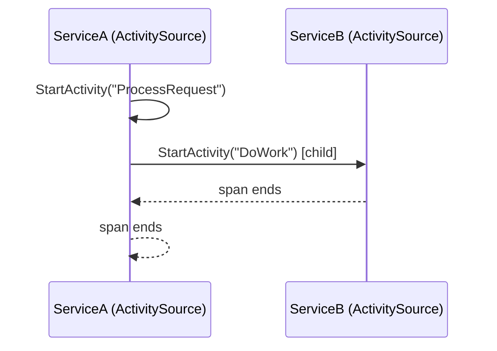
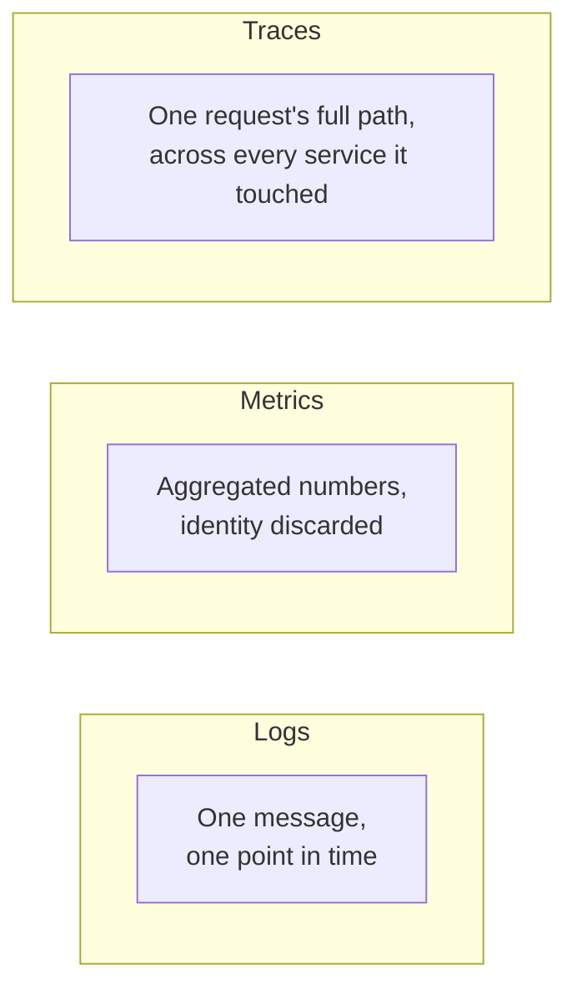

# Distributed Tracing

## Introduction

Before reading this lesson, you should already be comfortable with **[Service Discovery and Resilience with Polly](../12-advanced-concepts/12-45-service-discovery-and-resilience.md)**. This lesson is the capstone of Module 12 — the 46th and final lesson of "Advanced Concepts" — and it closes the module by answering a question every earlier lesson here has quietly left open: once a single checkout request fans out across a Gateway, an `OrderService`, a `PaymentService`, and an `InventoryService`, each with its own logs, how does anyone reconstruct *that one request's* full journey, in order, across all four? Distributed tracing is the answer, and .NET has had a native, OpenTelemetry-compatible answer to it built in since .NET 5: `System.Diagnostics.Activity`.

By the end of this lesson, you will be able to:

- Explain what a trace and a span are, and how a trace ID and span ID propagate across service boundaries
- Explain why distributed tracing exists as its own discipline, separate from ordinary per-service logging
- Use `ActivitySource` and `Activity` — .NET's built-in, OpenTelemetry-aligned tracing primitives — to create parent and child spans
- Trace a simulated multi-service checkout request end to end, in order
- Recognize how this foreshadows Module 16's Azure Application Insights coverage
- Recap this entire 46-lesson module and see what Module 13 builds on next

## Distributed Tracing — A Layman's Perspective

Picture a single package shipped from an online store, moving through four different facilities on its way to your door: the seller's warehouse, a regional sorting center, a long-haul truck, and your local delivery depot. Each of those four facilities keeps its own internal logbook — the warehouse logs when it packed the box, the sorting center logs when it scanned it onto the right conveyor, and so on. If something goes wrong — the package arrives three days late — and you ask each facility separately "did you have a problem with my package," you'd have to visit four different logbooks, in four different buildings, each written in that facility's own shorthand, and manually figure out which log entries in each book actually belong to *your* package versus the thousands of other packages that passed through the same building that day.

What actually solves this, in real shipping, is a single tracking number printed on the box itself, scanned at every single facility it passes through. Now each facility's logbook entry for your package is tagged with that same tracking number, and anyone — you, customer support, the shipping company — can pull every scan across every facility, in order, filtered down to just that one tracking number, and see the exact path: packed at 9am, left the warehouse at 11am, arrived at the sorting center at 3pm, sat there until the next morning, left on the truck at 8am the next day, arrived at your depot at 2pm. One tracking number, stamped everywhere the package went, turns four separate, disconnected logbooks into one continuous story.

Distributed tracing gives every incoming request the software equivalent of that tracking number: a trace ID, generated the moment the request first enters the system (at the Gateway, in our case), and carried along on every subsequent call the request triggers — to `OrderService`, from there to `PaymentService`, from there to `InventoryService` — the same way the tracking number rides along on the box itself rather than being looked up fresh at each stop. Each individual facility's "scan" — one service doing one unit of work — is called a span, and every span in the whole journey shares the same trace ID, the way every scan of the same box shares the same tracking number. A span also records which *other* span triggered it — the sorting center's scan doesn't just say "I handled this box," it implicitly follows the warehouse's scan in the sequence — which is what lets you reconstruct not just "these four things happened" but "these four things happened in *this specific order, each caused by the one before it*."

Without that shared trace ID, you're back to visiting four separate logbooks by hand, guessing which entries belong together based on rough timestamps and hoping nothing else happened to arrive at the same facility around the same time. With it, one query — "show me everything tagged with trace ID X" — reconstructs the entire request's path across every service it touched, in the exact order it happened.

## Distributed Tracing — A Programming Language Perspective

.NET represents a unit of traced work with `System.Diagnostics.Activity`, created by calling `StartActivity()` on an `ActivitySource` — a named source registered per logical component (roughly one per service or major subsystem). Every `Activity` carries a `TraceId` (shared by every span in the same logical request), a `SpanId` (unique to that one span), and a `ParentSpanId` (the span that caused this one to start) — this is precisely .NET's implementation of the **W3C Trace Context** standard, the vendor-neutral specification that lets a trace ID and span ID propagate correctly even across services written by different teams, in different languages, using different tracing libraries. `Activity.Current` is tracked per async-flow context automatically, so starting a new `Activity` while another is already active — even across an `await` — makes the new one a child of the current one without any manual plumbing. This built-in `Activity` API *is* .NET's native implementation of the OpenTelemetry data model; the separate `OpenTelemetry` NuGet packages layer on exporters (to Application Insights, Jaeger, Zipkin, and others) on top of these same `Activity` objects, rather than replacing them.

## How to Create and Nest Spans with ActivitySource

An `ActivityListener` must be registered before any `Activity` will actually be created — without a listener expressing interest, `StartActivity()` silently returns `null`, since there's no reason to pay the bookkeeping cost of a span nobody will read.


*Figure 1: `DoWork`'s span shares `ProcessRequest`'s TraceId and records `ProcessRequest`'s SpanId as its ParentSpanId.*

```csharp
// Program.cs — .NET 10 / C# 14
using System.Diagnostics;

using var listener = new ActivityListener
{
    ShouldListenTo = _ => true,
    Sample = (ref ActivityCreationOptions<ActivityContext> _) => ActivitySamplingResult.AllData,
    ActivityStarted = a =>
        Console.WriteLine($"START {a.OperationName,-14} TraceId={a.TraceId} SpanId={a.SpanId} ParentSpanId={a.ParentSpanId}")
};
ActivitySource.AddActivityListener(listener);

var serviceA = new ActivitySource("ServiceA");
var serviceB = new ActivitySource("ServiceB");

using (var outer = serviceA.StartActivity("ProcessRequest"))
{
    using var inner = serviceB.StartActivity("DoWork");
}
```

**Console Output** *(the `TraceId`/`SpanId` hex values are generated fresh each run — yours will differ, but the structure holds)*:

```text
START ProcessRequest  TraceId=4bf92f3577b34da6a3ce929d0e0e4736 SpanId=00f067aa0ba902b7 ParentSpanId=0000000000000000
START DoWork          TraceId=4bf92f3577b34da6a3ce929d0e0e4736 SpanId=b7ad6b7169203331 ParentSpanId=00f067aa0ba902b7
```

Both spans share the exact same `TraceId` — that's the tracking number from the shipping analogy, stamped on both scans. `DoWork`'s `ParentSpanId` is `ProcessRequest`'s own `SpanId`, which is exactly how a trace reconstructs *order and causation*, not just "these two things happened around the same time." `ProcessRequest`'s own `ParentSpanId` is all zeros because nothing outside this snippet started it — in a real system, that field would instead hold the caller's span ID, continuing the chain from wherever the request truly began.

## Real-Time Example: Tracing a Checkout Request Across Four Services in E-Commerce Order Processing

We close out this module's E-Commerce Order Processing thread by tracing one checkout request through the exact chain this module has been building toward: a Gateway receives the request, calls `OrderService` to place the order, which in turn calls `PaymentService` to charge payment and `InventoryService` to reserve stock — the same two dependencies coordinated by the saga orchestrator two lessons ago. Each "service" here is simulated as its own `ActivitySource` in one process, exactly as it would be in four separately deployed services once each call is instrumented to carry the W3C Trace Context header across the network.

```csharp
// Program.cs — .NET 10 / C# 14 — Real-Time Example (E-Commerce Order Processing)
using System.Diagnostics;

using var listener = new ActivityListener
{
    ShouldListenTo = _ => true,
    Sample = (ref ActivityCreationOptions<ActivityContext> _) => ActivitySamplingResult.AllData,
    ActivityStarted = a =>
        Console.WriteLine($"START {a.Source.Name,-16} {a.OperationName,-18} SpanId={a.SpanId} ParentSpanId={a.ParentSpanId}")
};
ActivitySource.AddActivityListener(listener);

var gateway = new ActivitySource("Gateway");
var orderService = new ActivitySource("OrderService");
var paymentService = new ActivitySource("PaymentService");
var inventoryService = new ActivitySource("InventoryService");

using (var gatewaySpan = gateway.StartActivity("HandleCheckoutRequest"))
{
    Console.WriteLine($"TraceId for this checkout request: {gatewaySpan?.TraceId}");

    using (var placeOrderSpan = orderService.StartActivity("PlaceOrder"))
    {
        using (paymentService.StartActivity("ChargePayment")) { /* charge the card */ }
        using (inventoryService.StartActivity("ReserveStock")) { /* decrement stock */ }
    }
}
```

**Console Output** *(SpanId values are generated fresh each run; the TraceId is identical on every line, which is the point)*:

```text
TraceId for this checkout request: 4bf92f3577b34da6a3ce929d0e0e4736
START Gateway          HandleCheckoutRequest SpanId=00f067aa0ba902b7 ParentSpanId=0000000000000000
START OrderService      PlaceOrder            SpanId=b7ad6b7169203331 ParentSpanId=00f067aa0ba902b7
START PaymentService    ChargePayment         SpanId=1a2b3c4d5e6f7081 ParentSpanId=b7ad6b7169203331
START InventoryService  ReserveStock          SpanId=9f8e7d6c5b4a3021 ParentSpanId=b7ad6b7169203331
```

Every one of these four spans — spread across four logically separate services — shares the exact same `TraceId`, confirmed by the line printed before the spans even start. `ChargePayment` and `ReserveStock` both list `PlaceOrder`'s `SpanId` as their `ParentSpanId`, correctly showing that `OrderService` triggered both, as siblings, rather than one triggering the other. In a real deployment, this same `TraceId` would ride along in an HTTP header on the actual network calls between the four services, so a tool like Application Insights (Module 16) could pull every span tagged with it and render exactly this parent-child tree, across process and machine boundaries, without you writing any of that correlation logic by hand.

## Traces vs. Logs vs. Metrics

Distributed tracing is one of observability's three commonly cited pillars, and it answers a different question than the other two. A log is a discrete, often unstructured message emitted by one piece of code at one moment — useful for "what exactly happened here," but with no built-in sense of how it relates to work happening in a *different* service. A metric is an aggregated number over time — request count, average latency, error rate — useful for "how is the system behaving overall," but it deliberately throws away any single request's individual identity to make aggregation cheap. A trace sits between them: it's tied to one specific request's identity, like a log, but it stitches together every span that request touched, across every service, like nothing a plain log file can do on its own.


*Figure 2: The three observability pillars answer different questions and are complementary, not competing.*

| Aspect | Logs | Metrics | Traces |
|---|---|---|---|
| Granularity | One message per event | Aggregated numeric values | One full request, end to end |
| Cross-service correlation | None, unless manually correlated | None — inherently aggregate | Built-in, via shared trace ID |
| Best question answered | "What happened here, exactly?" | "How is the system behaving overall?" | "What happened to *this* request, everywhere?" |
| .NET primitive | `ILogger` | `Meter` / `System.Diagnostics.Metrics` | `ActivitySource` / `Activity` |

## Types of Distributed Tracing Concepts

A handful of related concepts round out this lesson, several of which Module 16 covers as dedicated Azure tooling:

1. **Traces** — the full, end-to-end record of one request's journey, identified by a single `TraceId`.
2. **Spans (`Activity`)** — one unit of work within a trace, as created by `ActivitySource.StartActivity()` throughout this lesson.
3. **W3C Trace Context** — the vendor-neutral standard for propagating trace/span IDs across service and language boundaries, which `Activity` implements natively.
4. **OpenTelemetry SDK and exporters** — the NuGet packages that take these same `Activity` objects and ship them to a backend for storage and visualization.
5. **Azure Application Insights (Module 16)** — the managed backend this lesson's tracing model feeds into for real dashboards, alerts, and end-to-end transaction views.
6. **Metrics and structured logging** — this lesson's sibling pillars of observability, covered in their own dedicated context outside this module.

## What You've Learned & What's Next — Module 12 Recap

This lesson closes Module 12, Advanced Concepts, 46 lessons in total. The module opened with the SOLID principles and the Gang of Four design patterns — the vocabulary for well-structured individual classes — then widened into Clean Architecture and Bounded Contexts, CQRS with MediatR, and this final arc's Domain-Driven Design basics, event-driven architecture, the Saga pattern, service discovery with Polly's resilience policies, and now distributed tracing. Read end to end, the module tells one continuous story: start with a single well-designed class, then keep widening the lens — to a layered application, to a set of independent services, to a whole distributed system — until the final concern isn't "is this class well-designed" at all, but "can I even see what my own distributed system just did." Distributed tracing's `TraceId`/`SpanId` propagation is the answer this module ends on, and it's also the last piece needed to operate everything the rest of Module 12 built.

Continue your learning journey with **[Introduction to Reflection in C#](../13-reflection-sourcegen-lowlevel/13-01-introduction-to-reflection.md)**, the first lesson of Module 13, where the focus shifts away from distributed system design entirely and back down to a single running process — starting with how a C# program can inspect its own types, members, and attributes at runtime.

---
*Applies to: .NET 10 / C# 14. Last reviewed 2026-08-16.*
