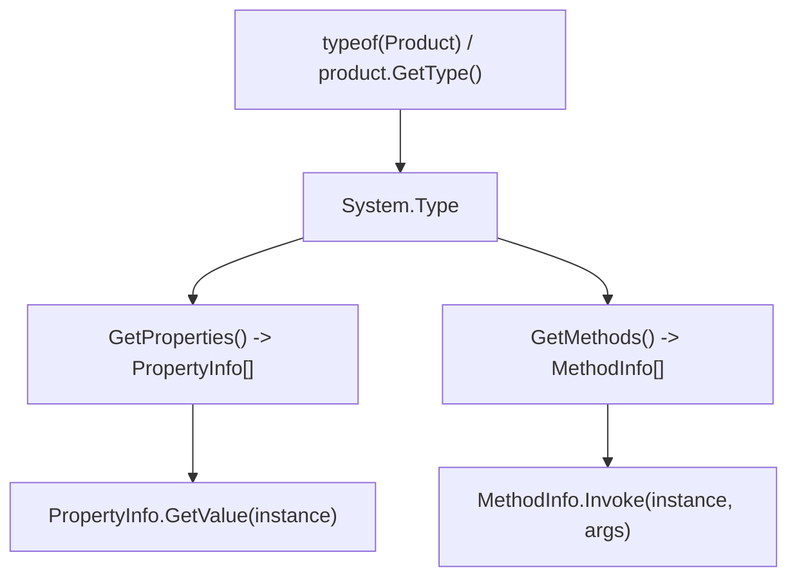
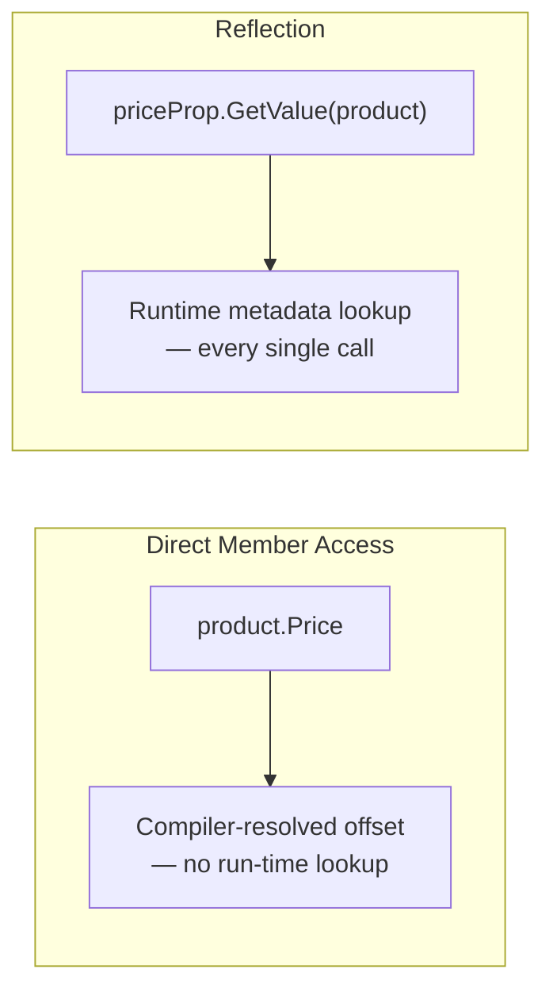

# Introduction to Reflection in C#

## Introduction

Before reading this lesson, you should already be broadly comfortable with classes, properties, and methods from earlier modules — this lesson doesn't assume anything from Module 12's distributed-systems material specifically, but it does mark a deliberate change of scale: Module 12 ended by widening the lens all the way out to tracing a request across four separate services, and Module 13 opens by narrowing it all the way back in, down to a single running process asking questions about *itself*. Every C# program you've written so far has known its own shape at compile time — you wrote the class, so you already know it has a `Name` property. **Reflection** is what lets a program discover and operate on that shape *without* that compile-time knowledge — reading a type's members, and even invoking them, based on information only available while the program is running.

By the end of this lesson, you will be able to:

- Explain what reflection is and why it matters when a type isn't known until run time
- Use `typeof` and `GetType()` to obtain a `System.Type` object, and explain how they differ
- List a type's properties and methods with `Type.GetProperties()` and `Type.GetMethods()`
- Read a property's value and invoke a method dynamically using `PropertyInfo` and `MethodInfo.Invoke`
- Explain why reflection is measurably slower than direct member access, and why that cost matters

## Reflection — A Layman's Perspective

Imagine a detective who is handed a sealed box confiscated at customs, with no manifest and no label. A normal warehouse worker only handles boxes they packed themselves — they already know exactly what's inside, because they put it there. The detective's job is fundamentally different: given *any* box, packed by *anyone*, the detective has to open it, look at what's actually inside, catalog each item by examining it directly, and — if one of those items turns out to be a tool — pick it up and actually operate it, all without ever having seen this particular box's contents listed anywhere in advance.

That's the exact difference between ordinary code and reflection. Ordinary code is the warehouse worker: when you write `product.Price`, you already know `Product` has a `Price` property, because you're looking at the class definition right there in your own project. Reflection is the detective: given a `Type` object — the sealed box — it opens it up and asks, in effect, "what properties does this thing actually have?" and "what methods can I actually call on it?", discovering the answer by examining the box's real contents rather than trusting a label written in advance. `Type.GetProperties()` is the detective cataloging every item found inside; `Type.GetMethods()` is cataloging every tool found inside; and `MethodInfo.Invoke()` is the detective actually picking up one of those tools and operating it, even though nobody ever handed them an instruction manual for it beforehand.

This matters because plenty of real software genuinely doesn't know, at the moment it's written, exactly what will be inside the box. A framework that serializes objects to JSON is written long before it ever sees *your* specific classes — it can't hard-code `product.Price` for a `Product` type it's never heard of, so it has to open the box at run time and discover, for whatever type actually shows up, what properties exist and what their values are. A dependency injection container registering "every class that implements this interface" faces the same problem: it doesn't know your class names in advance, so it has to inspect what's actually loaded and decide from there. Reflection is the general-purpose tool that makes all of that possible — at the cost, as this lesson's final section shows, of being noticeably slower than the warehouse worker's approach, precisely because the detective has to actually open and examine each box instead of already knowing what's inside.

That cost is exactly why this module doesn't stop at reflection. Later lessons introduce source generators — a way of doing the detective's cataloging work once, in advance, at compile time, so that by the time the program runs, it already has the manifest reflection would otherwise have to reconstruct from scratch every single time.

## Reflection — A Programming Language Perspective

Reflection is the .NET runtime's built-in facility, exposed through the `System` and `System.Reflection` namespaces, for inspecting and manipulating a program's own types and members at run time. Every loaded type is represented by an instance of `System.Type`, obtainable two ways: `typeof(Product)` resolves a `Type` at **compile time**, since the type name must be known in source code, while `product.GetType()` resolves it at **run time**, from the object's actual, potentially-polymorphic runtime type — the two often produce the same `Type` object, but only `GetType()` correctly reflects a derived type reached through a base-class reference. From a `Type`, `GetProperties()` and `GetMethods()` return arrays of `PropertyInfo` and `MethodInfo` — metadata objects describing each member's name, declaring type, and signature. `PropertyInfo.GetValue(instance)` reads a property's current value without a compile-time-known accessor, and `MethodInfo.Invoke(instance, parameters)` calls a method dynamically, boxing its return value as `object?`. All of this metadata is read from the assembly's metadata tables at run time, which is the direct source of reflection's overhead relative to statically-compiled member access.

## How to Inspect a Type with System.Reflection

`typeof(SomeType)` and `someInstance.GetType()` are the two entry points into reflection — pick `typeof` when the type name is known in your source code, and `GetType()` when you only have a reference typed as a base class or interface and need the concrete runtime type. From the resulting `Type`, `GetProperties()` and `GetMethods()` return every public member as an array you can loop over, and `GetMethod(name)` finds one specific method by name so you can invoke it dynamically.


*Figure 1: A `Type` object is the entry point to every other piece of reflection metadata about that type.*

```csharp
// Program.cs — .NET 10 / C# 14
using System.Reflection;

Product product = new("Wireless Mouse", 24.99m, inStock: true);

Type type = product.GetType();
Console.WriteLine($"Type name: {type.Name}");

Console.WriteLine("Properties:");
foreach (PropertyInfo prop in type.GetProperties())
{
    object? value = prop.GetValue(product);
    Console.WriteLine($"  {prop.Name} ({prop.PropertyType.Name}) = {value}");
}

Console.WriteLine("Public methods declared on Product:");
foreach (MethodInfo method in type.GetMethods().Where(m => m.DeclaringType == type && !m.IsSpecialName))
{
    Console.WriteLine($"  {method.Name}()");
}

MethodInfo? describeMethod = type.GetMethod("Describe");
string? result = (string?)describeMethod?.Invoke(product, parameters: null);
Console.WriteLine($"Invoked dynamically: {result}");

class Product(string name, decimal price, bool inStock)
{
    public string Name { get; } = name;
    public decimal Price { get; } = price;
    public bool InStock { get; } = inStock;

    public string Describe() => $"{Name} costs ${Price:F2}";
}
```

**Console Output:**

```text
Type name: Product
Properties:
  Name (String) = Wireless Mouse
  Price (Decimal) = 24.99
  InStock (Boolean) = True
Public methods declared on Product:
  Describe()
Invoked dynamically: Wireless Mouse costs $24.99
```

Nothing in this program's output required `Program.cs` to reference `product.Name` or `product.Describe()` directly by name in the calling code — every property and every method was discovered from `type`, and `Describe` was called entirely through `MethodInfo.Invoke`, using only a string, `"Describe"`, to find it. `!m.IsSpecialName` filters out the compiler-generated property accessor methods (`get_Name`, `set_Name`, and similar) so only genuinely declared methods show up in the method listing.

## Real-Time Example: Auditing Order Lines via Reflection in E-Commerce Order Processing

We extend the E-Commerce Order Processing domain with an `OrderLine` class, similar in spirit to the `Order`/`OrderLine` records used for serialization back in Module 9. Imagine a generic audit-logging feature that has to print every field of *any* object passed to it, and compute totals from a method it's never seen before — the kind of code a shared logging or reporting library actually has to write, since it can't hard-code every domain type its callers might use.

```csharp
// Program.cs — .NET 10 / C# 14 — Real-Time Example (E-Commerce Order Processing)
using System.Reflection;

OrderLine[] lines =
[
    new OrderLine("USB-C Hub", 2, 39.50m),
    new OrderLine("Laptop Stand", 1, 45.00m)
];

Console.WriteLine("Order line audit report (built entirely via reflection):");
foreach (OrderLine line in lines)
{
    Type type = line.GetType();
    Console.WriteLine($"-- {type.Name} --");
    foreach (PropertyInfo prop in type.GetProperties())
    {
        Console.WriteLine($"  {prop.Name}: {prop.GetValue(line)}");
    }
}

MethodInfo? lineTotalMethod = typeof(OrderLine).GetMethod("LineTotal");
decimal grandTotal = 0m;
foreach (OrderLine line in lines)
{
    decimal lineTotal = (decimal)lineTotalMethod!.Invoke(line, parameters: null)!;
    grandTotal += lineTotal;
}
Console.WriteLine($"Grand total (via MethodInfo.Invoke): ${grandTotal:F2}");

class OrderLine(string productName, int quantity, decimal unitPrice)
{
    public string ProductName { get; } = productName;
    public int Quantity { get; } = quantity;
    public decimal UnitPrice { get; } = unitPrice;

    public decimal LineTotal() => Quantity * UnitPrice;
}
```

**Console Output:**

```text
Order line audit report (built entirely via reflection):
-- OrderLine --
  ProductName: USB-C Hub
  Quantity: 2
  UnitPrice: 39.50
-- OrderLine --
  ProductName: Laptop Stand
  Quantity: 1
  UnitPrice: 45.00
Grand total (via MethodInfo.Invoke): $124.00
```

This audit routine never references `ProductName`, `Quantity`, `UnitPrice`, or `LineTotal` as compile-time-known members — it discovers all four purely from `OrderLine`'s `Type` at run time. That's precisely the shape of a real audit-logging or generic-reporting component: written once, it can print and total up fields for `OrderLine` today and, without a single code change, for a completely different domain class added six months from now, as long as that new class also exposes a parameterless method matching the name it looks up.

## Reflection vs. Direct Member Access

Direct member access — `product.Price`, `line.LineTotal()` — is resolved entirely at compile time: the compiler already knows the exact memory offset or method address, so calling it at run time costs essentially nothing beyond the work the member itself does. Reflection resolves the same member by name, at run time, by walking metadata tables the runtime maintains for every loaded type — `GetProperty`, `GetValue`, and `Invoke` all do real work on every single call, work that direct access simply never has to do because the compiler already did the equivalent lookup once, permanently, when it emitted the calling code.

```csharp
// Program.cs — .NET 10 / C# 14
using System.Diagnostics;
using System.Reflection;

const int iterations = 1_000_000;
Product product = new("Wireless Mouse", 24.99m, inStock: true);
PropertyInfo priceProp = typeof(Product).GetProperty(nameof(Product.Price))!;

var directWatch = Stopwatch.StartNew();
decimal directSum = 0m;
for (int i = 0; i < iterations; i++)
{
    directSum += product.Price;
}
directWatch.Stop();

var reflectionWatch = Stopwatch.StartNew();
decimal reflectionSum = 0m;
for (int i = 0; i < iterations; i++)
{
    reflectionSum += (decimal)priceProp.GetValue(product)!;
}
reflectionWatch.Stop();

Console.WriteLine($"Direct access:     {directWatch.ElapsedMilliseconds} ms (sum={directSum})");
Console.WriteLine($"Reflection access: {reflectionWatch.ElapsedMilliseconds} ms (sum={reflectionSum})");

class Product(string name, decimal price, bool inStock)
{
    public string Name { get; } = name;
    public decimal Price { get; } = price;
    public bool InStock { get; } = inStock;
}
```

**Console Output** *(exact millisecond values vary by machine and run — the sums match and reflection is consistently several times slower)*:

```text
Direct access:     19 ms (sum=24990000.00)
Reflection access: 160 ms (sum=24990000.00)
```


*Figure 2: Direct access pays its resolution cost once, at compile time; reflection pays a version of that cost on every call, at run time.*

| Aspect | Direct Member Access | Reflection |
|---|---|---|
| Member resolved | At compile time, by name | At run time, by string lookup |
| Per-call overhead | Effectively none | Real — metadata lookup every call |
| Requires compile-time knowledge of the type | Yes | No |
| Typical use case | Ordinary application code | Generic frameworks, serializers, DI containers |

## Types of Reflection-Related Concepts in C#

Reflection is the foundation for several more specific techniques covered across the rest of this module:

1. **[Custom Attributes](13-02-custom-attributes.md)** — metadata tags read back off types and members using this same reflection API.
2. **[Dynamic Type Inspection](13-03-dynamic-type-inspection.md)** — creating instances of runtime-only-known types and scanning whole assemblies.
3. **[Introduction to Roslyn Source Generators](13-04-introduction-to-source-generators.md)** — the compile-time alternative that avoids reflection's per-call cost entirely.
4. **[Source Generators for Performance](../12-advanced-concepts/12-34-source-generators-for-performance.md)** — where this exact performance gap was previewed through System.Text.Json's source-generated serializers.
5. **`System.Reflection.Emit`** — a related, more advanced API for generating and running entirely new code at run time, out of scope for this lesson.

## What You've Learned & What's Next

Reflection lets a program discover and operate on its own types, properties, and methods using only run-time metadata — `Type`, `PropertyInfo`, and `MethodInfo` are the core building blocks, and `MethodInfo.Invoke` is how you call a method you only know the name of. That power comes at a real, measurable performance cost compared to ordinary compiled member access, which is exactly the tension the rest of this module explores.

Continue your learning journey with **[Custom Attributes](13-02-custom-attributes.md)**, where you'll learn to declare your own metadata tags and read them back with reflection — the exact mechanism behind the `[Validate]`-style attributes used throughout real .NET frameworks.

---
*Applies to: .NET 10 / C# 14. Last reviewed 2026-08-16.*
