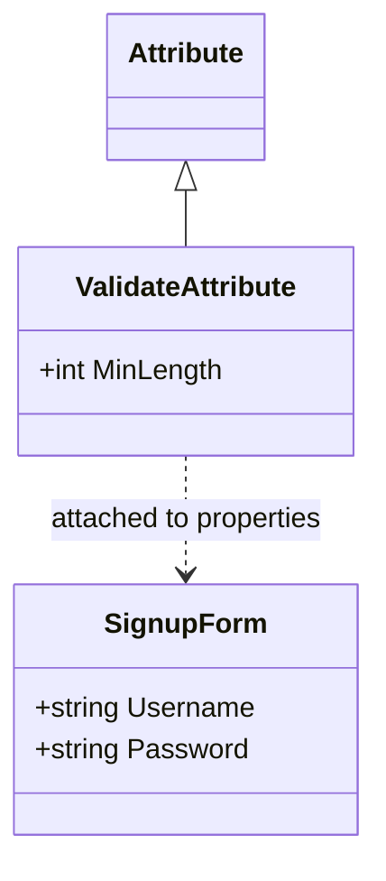
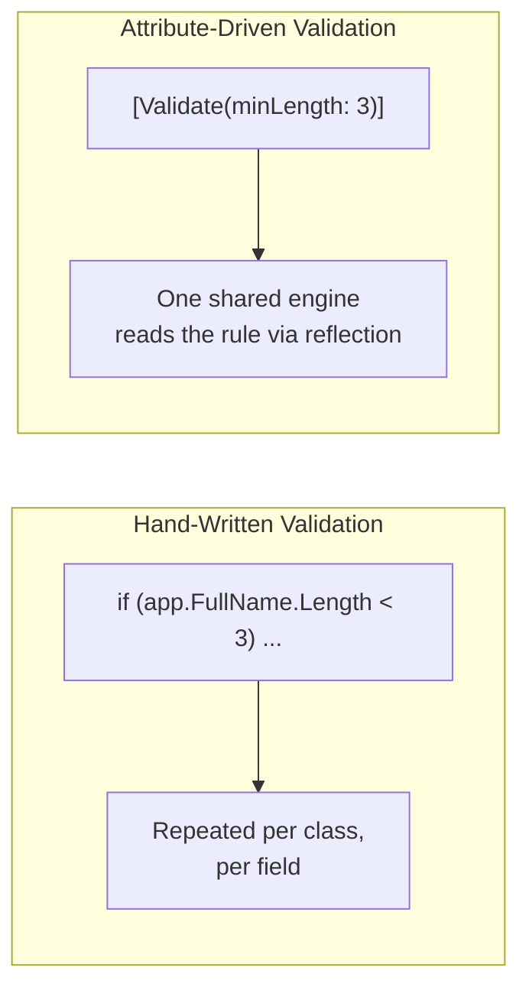

# Custom Attributes

## Introduction

Before reading this lesson, you should already be comfortable with **[Introduction to Reflection in C#](../13-reflection-sourcegen-lowlevel/13-01-introduction-to-reflection.md)**, especially `PropertyInfo` and the idea of discovering a type's members at run time rather than at compile time. You've almost certainly *used* attributes already — `[Serializable]`, `[JsonSerializable]` from Module 9, `[Fact]` in a test project — square-bracket tags attached to a class, property, or method. This lesson shows you the other half of that story: how to declare your *own* attribute, restrict where it's legal to apply it, and — critically — how to read it back at run time using the exact reflection techniques from the previous lesson.

By the end of this lesson, you will be able to:

- Declare a custom attribute class by deriving from `System.Attribute`
- Restrict where an attribute can be applied using `[AttributeUsage]`
- Attach a custom attribute, with constructor arguments, to a property or class
- Read a custom attribute back at run time with `GetCustomAttribute<T>()`
- Build a small validation engine driven entirely by attribute metadata

## Custom Attributes — A Layman's Perspective

Think about the labels printed on a shipping box beyond the address itself: "FRAGILE," "THIS SIDE UP," "KEEP REFRIGERATED." None of those labels change what's physically inside the box — the box's *contents* are exactly the same with or without the label. What the label does is attach an *instruction* to the box, one that a worker handling it later can read and act on, without ever having to open the box or ask the sender directly. A forklift operator doesn't need to call the shipper to find out whether a box can be tipped on its side; they just read the label. And crucially, some labels only make sense on some kinds of packages — "KEEP REFRIGERATED" belongs on a produce crate, not on a pallet of bricks, and a well-run shipping company enforces that restriction rather than letting workers slap any label on anything.

A custom attribute in C# is exactly that label, attached to a class, property, or method instead of a box. When you write `[Validate(minLength: 8)]` above a `Password` property, you're not changing what `Password` *is* — it's still just a string property — you're attaching an instruction that some other piece of code can read later and act on: "when you're deciding whether this value is acceptable, it needs to be at least 8 characters." The property itself doesn't do anything differently at run time just because the label is there; the label just sits attached to the property's metadata, waiting for something to come along and read it.

That "something" is reflection, from the previous lesson. Exactly the way `GetProperties()` let you discover a type's properties without knowing them in advance, `GetCustomAttribute<T>()` lets you discover which labels are attached to a given property, and read the details written on that label — in this case, the `MinLength` value you passed to the attribute's constructor. A validation engine built this way never has to hard-code "Username needs 3 characters, Password needs 8" anywhere in its own logic; it just walks every property, checks whether a `[Validate]` label is attached, and if so, reads the number written on that label and enforces it. Add a new property with a new `[Validate]` label tomorrow, and the exact same validation engine handles it correctly without a single line of the engine's own code changing — precisely the same way a shipping company's forklift-handling rules don't need to change just because a new kind of labeled box shows up on the dock.

Restricting *where* a label is allowed to go — "FRAGILE" belongs on a box, not scrawled onto a shipping manifest page — is `[AttributeUsage]`'s job: it tells the compiler exactly which kinds of things your attribute is legal to attach to, and the compiler enforces that restriction for you, at compile time, before the program ever runs.

## Custom Attributes — A Programming Language Perspective

A custom attribute is an ordinary C# class that derives, directly or indirectly, from `System.Attribute`; by convention its name ends in `Attribute`, though C#'s attribute-application syntax (`[Validate(...)]`) lets you omit that suffix when applying it. Its constructor parameters and public properties define what data the attribute can carry, and those values are supplied as compile-time constants when the attribute is applied to a class, property, method, or other target. `[AttributeUsage(AttributeTargets.Property)]`, itself an attribute applied to your attribute class, restricts legal application sites — attempting to apply a property-only attribute to a method is a compile error, not a run-time surprise. Once applied, an attribute instance is not created until something asks for it: `MemberInfo.GetCustomAttribute<T>()` (an extension method in `System.Reflection`) constructs and returns the attribute instance attached to a given member, or `null` if none is present, making attribute metadata pay-for-play rather than something read on every ordinary property access.

## How to Declare and Read a Custom Attribute in C#

Declaring a custom attribute is three steps: derive from `Attribute`, add `[AttributeUsage]` to restrict its targets, and expose whatever data it should carry through constructor parameters. Reading it back is one call: `GetCustomAttribute<T>()` on the `PropertyInfo`, `MethodInfo`, or `Type` you obtained through ordinary reflection.


*Figure 1: `ValidateAttribute` derives from `Attribute` and is attached as metadata to `SignupForm`'s properties.*

```csharp
// Program.cs — .NET 10 / C# 14
using System.Reflection;

var form = new SignupForm();
List<string> errors = [];

foreach (PropertyInfo prop in typeof(SignupForm).GetProperties())
{
    ValidateAttribute? rule = prop.GetCustomAttribute<ValidateAttribute>();
    if (rule is null) continue;

    string? value = (string?)prop.GetValue(form);
    if (value is null || value.Length < rule.MinLength)
    {
        errors.Add($"{prop.Name} must be at least {rule.MinLength} characters (was {value?.Length ?? 0}).");
    }
}

if (errors.Count == 0)
{
    Console.WriteLine("Validation passed.");
}
else
{
    Console.WriteLine("Validation failed:");
    foreach (string error in errors)
    {
        Console.WriteLine($"  - {error}");
    }
}

[AttributeUsage(AttributeTargets.Property)]
class ValidateAttribute(int minLength) : Attribute
{
    public int MinLength { get; } = minLength;
}

class SignupForm
{
    [Validate(minLength: 3)]
    public string Username { get; set; } = "ab";

    [Validate(minLength: 8)]
    public string Password { get; set; } = "hunter2!";
}
```

**Console Output:**

```text
Validation failed:
  - Username must be at least 3 characters (was 2).
```

`ValidateAttribute` carries exactly one piece of data, `MinLength`, supplied through its constructor when applied as `[Validate(minLength: 3)]`. `[AttributeUsage(AttributeTargets.Property)]` means the compiler would reject `[Validate(3)]` if you accidentally applied it to a class or a method instead — the restriction is enforced before the program even builds. `GetCustomAttribute<ValidateAttribute>()` returns `null` for any property with no `[Validate]` label at all, which is exactly why the loop skips straight past properties that shouldn't be validated.

## Real-Time Example: Validating an Account Application in Banking/ATM

We open a new thread in the Banking/ATM domain with an `AccountApplication` class representing a new customer's request to open an account. A real bank's account-opening system enforces rules like these constantly — a minimum opening deposit, a minimum-length PIN, a plausible name — and rather than hand-writing an `if` statement for every single rule against every single field, we drive the checks entirely from `[Validate]` attributes, exactly as in the how-to example, extended to support both string length and numeric minimums.

```csharp
// Program.cs — .NET 10 / C# 14 — Real-Time Example (Banking/ATM)
using System.Reflection;

var applications = new List<AccountApplication>
{
    new() { FullName = "Ravi Shah", InitialDeposit = 500m, PinCode = "4821" },
    new() { FullName = "Al", InitialDeposit = 10m, PinCode = "77" }
};

foreach (AccountApplication app in applications)
{
    List<string> errors = ValidationEngine.Validate(app);
    Console.WriteLine($"Application for '{app.FullName}':");
    if (errors.Count == 0)
    {
        Console.WriteLine("  Approved for account opening.");
    }
    else
    {
        foreach (string error in errors)
        {
            Console.WriteLine($"  REJECTED - {error}");
        }
    }
}

[AttributeUsage(AttributeTargets.Property)]
class ValidateAttribute(int minLength = 0, double minValue = double.MinValue) : Attribute
{
    public int MinLength { get; } = minLength;
    public double MinValue { get; } = minValue;
}

class AccountApplication
{
    [Validate(minLength: 3)]
    public string FullName { get; set; } = "";

    [Validate(minValue: 100)]
    public decimal InitialDeposit { get; set; }

    [Validate(minLength: 4)]
    public string PinCode { get; set; } = "";
}

static class ValidationEngine
{
    public static List<string> Validate(object target)
    {
        List<string> errors = [];
        foreach (PropertyInfo prop in target.GetType().GetProperties())
        {
            ValidateAttribute? rule = prop.GetCustomAttribute<ValidateAttribute>();
            if (rule is null) continue;

            object? value = prop.GetValue(target);
            if (value is string s && s.Length < rule.MinLength)
            {
                errors.Add($"{prop.Name} must be at least {rule.MinLength} characters (was {s.Length}).");
            }
            else if (value is decimal d && (double)d < rule.MinValue)
            {
                errors.Add($"{prop.Name} must be at least {rule.MinValue:F0} (was {d}).");
            }
        }
        return errors;
    }
}
```

**Console Output:**

```text
Application for 'Ravi Shah':
  Approved for account opening.
Application for 'Al':
  REJECTED - FullName must be at least 3 characters (was 2).
  REJECTED - InitialDeposit must be at least 100 (was 10).
  REJECTED - PinCode must be at least 4 characters (was 2).
```

`ValidationEngine.Validate` has no idea `AccountApplication` even exists — it works against `object target` and discovers every rule purely from `[Validate]` metadata. Adding a fourth field to `AccountApplication` next month, with its own `[Validate]` attribute, requires zero changes to `ValidationEngine` itself, which is exactly the payoff a real banking system needs: one small, well-tested validation engine, reused across every form the bank ever adds.

## Custom Attributes vs. Plain Conditional Logic

Hand-written `if` statements checking each field directly are easy to read for a small, fixed set of rules, but they scatter validation logic across every class that needs it, and every new field means writing a new, hand-tested check by hand. Attribute-driven validation inverts that: the *rule* lives right next to the *field* it applies to, as a compact, declarative label, while the *logic that enforces* the rule lives in exactly one shared place — the validation engine — regardless of how many classes or fields ultimately carry `[Validate]` attributes.


*Figure 2: Attribute-driven validation centralizes the enforcement logic while keeping each rule declared right next to the field it governs.*

| Aspect | Hand-Written `if` Checks | Attribute-Driven Validation |
|---|---|---|
| Where the rule lives | Inline, inside validation code | On the property itself, as metadata |
| Adding a new rule to a new field | Write and test new conditional logic | Add one attribute; engine already handles it |
| Enforcement logic location | Duplicated per class, typically | Centralized in one reusable engine |
| Compile-time safety on placement | None inherent | Enforced via `[AttributeUsage]` |

## Types of Attribute-Related Concepts in C#

Custom attributes connect directly to several related ideas, some covered elsewhere in this curriculum:

1. **[Introduction to Reflection in C#](13-01-introduction-to-reflection.md)** — the `PropertyInfo`/`MethodInfo` mechanics this lesson's attribute-reading code builds directly on.
2. **[Dynamic Type Inspection](13-03-dynamic-type-inspection.md)** — the next lesson, extending discovery to whole assemblies rather than one known type.
3. **Built-in framework attributes** — `[Serializable]`, `[JsonSerializable]` (Module 9), and ASP.NET Core's `[HttpGet]`/`[FromBody]` (Module 10) are all this same mechanism, just declared by the framework instead of you.
4. **`AttributeTargets` flags** — the enum controlling exactly which language constructs (`Class`, `Method`, `Property`, `All`, and combinations thereof) an attribute is legal to apply to.
5. **Data annotation attributes** (`System.ComponentModel.DataAnnotations`) — a ready-made, framework-provided validation attribute set that solves the exact problem this lesson built by hand.

## What You've Learned & What's Next

Custom attributes let you attach declarative metadata directly to a class, property, or method, restricted to legal targets via `[AttributeUsage]`, and read back at run time through `GetCustomAttribute<T>()` — turning scattered conditional logic into one small, reusable engine driven entirely by labels sitting next to the data they describe.

Continue your learning journey with **[Dynamic Type Inspection](13-03-dynamic-type-inspection.md)**, where we go beyond inspecting one known type and start creating instances of types known only by name, and scanning an entire assembly to find them.

---
*Applies to: .NET 10 / C# 14. Last reviewed 2026-08-16.*
