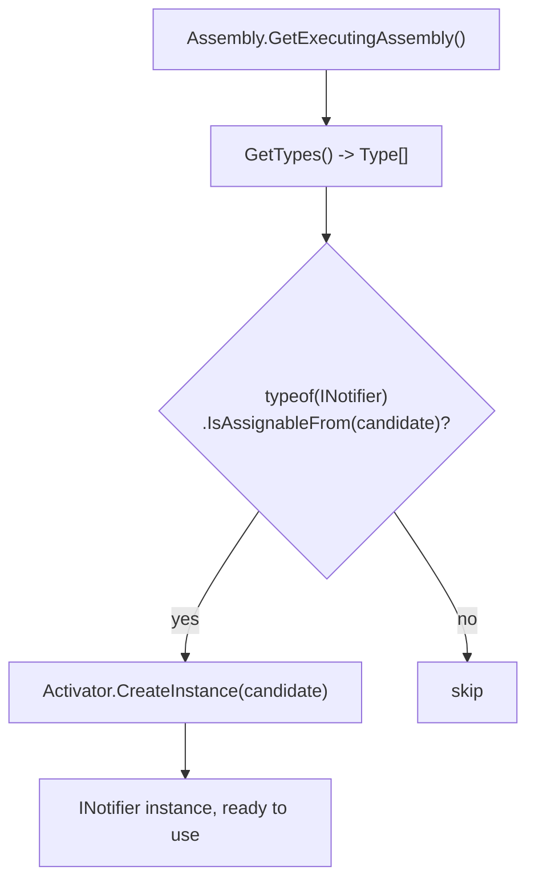
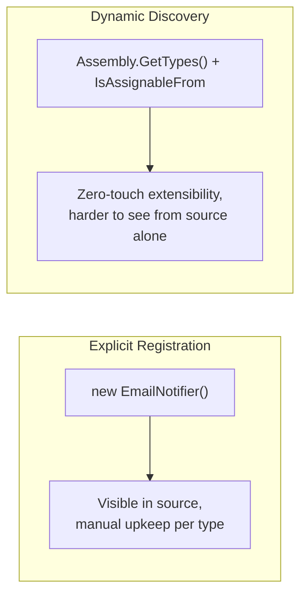

# Dynamic Type Inspection

## Introduction

Before reading this lesson, you should already be comfortable with **[Custom Attributes](../13-reflection-sourcegen-lowlevel/13-02-custom-attributes.md)**, and especially with the idea that reflection lets code discover a type's members without knowing them at compile time. This lesson pushes that idea one step further: so far, every example has started from a type you already had in hand — a `Product` instance, a `SignupForm` instance. Real plugin systems and dependency injection containers face a harder problem — they don't have an instance yet, and sometimes not even a compile-time-known type at all, only a *name*, or a whole assembly to search through. `Activator.CreateInstance` and `Assembly.GetTypes()` are how C# solves exactly that problem.

By the end of this lesson, you will be able to:

- Create an instance of a type known only by its string name using `Activator.CreateInstance`
- Enumerate every type defined in an assembly using `Assembly.GetTypes()`
- Combine both to find and instantiate every type implementing a given interface
- Explain how this pattern underlies real plugin systems and DI container auto-registration
- Recognize the trade-offs of this approach compared to explicitly registering types by hand

## Dynamic Type Inspection — A Layman's Perspective

Picture the difference between calling a specific employee you already know by name and posting an open call for "anyone qualified to do this job" across an entire company directory. Calling a known employee is simple — you look up their extension and dial it, because you already know exactly who you want. But sometimes you don't know who's qualified in advance, and you don't want to hard-code a name that might change — new employees join, some leave, and you'd rather the process kept working correctly no matter who's currently on staff. So instead, you post a notice: "anyone in this building qualified to handle fire-safety inspections, please step forward," and you walk the entire company directory, checking each person's job title, pulling aside everyone who qualifies, without ever needing to know their names in advance.

`Activator.CreateInstance` is the first half of this: given only a name — not a type reference sitting in your own source code, just a string like `"NotificationSystem.EmailNotifier"` — it looks that name up and creates a real, working instance of it, the same way you might look up an employee's extension from a name alone and get them on the phone, without having personally met them beforehand. `Assembly.GetTypes()` is the second half, the company-wide notice: it hands you every single type defined anywhere in a given assembly, so you can walk through all of them and check which ones qualify — "does this type implement the interface I care about?" — without ever having to know their class names ahead of time.

This combination is exactly how a plugin system works in practice. A photo editor that supports third-party filters doesn't ship with a fixed list of every filter that will ever exist; instead, at startup, it scans a folder of plugin assemblies, walks every type it finds using `GetTypes()`, checks which ones implement its `IFilter` interface, and creates an instance of each one with `CreateInstance` — discovering and activating filters nobody had written yet when the photo editor itself was built. A dependency injection container does the same thing when it "auto-registers" services: rather than you writing `services.AddScoped<IOrderRepository, SqlOrderRepository>()` for every single service by hand, the container scans an assembly, finds every class implementing a recognized interface, and registers each one automatically — the software equivalent of the company-wide notice, catching every qualified person without anyone reading a name off a list in advance.

## Dynamic Type Inspection — A Programming Language Perspective

`Activator.CreateInstance` is a static method, overloaded to accept either a `Type` object or a fully-qualified type name string (via `Assembly.GetType(name)` first, then passed to `CreateInstance`), that invokes a type's constructor and returns a new instance as `object` — the run-time equivalent of the `new` keyword, usable when the type to construct isn't known until the program is already executing. `Assembly.GetTypes()` returns every `Type` defined within a given `System.Reflection.Assembly` — typically `Assembly.GetExecutingAssembly()` for the currently running assembly, or an assembly loaded explicitly via `Assembly.LoadFrom(path)` for external plugin `.dll` files. Combined with `Type.IsAssignableFrom()`, which tests whether one type implements or derives from another, this pair forms the standard pattern for both plugin discovery and DI container auto-registration: enumerate every type in an assembly, filter down to those assignable to a known interface, and construct each surviving candidate dynamically.

## How to Create Instances and Scan Assemblies in C#

`Assembly.GetType(fullyQualifiedName)` resolves a single type by its complete name (including namespace), which `Activator.CreateInstance` can then construct via its parameterless constructor. To find *every* matching type rather than one named type, `Assembly.GetTypes()` returns the full list, which you filter with `IsAssignableFrom` against the interface you care about.


*Figure 1: Scanning an assembly for every type assignable to a known interface, then constructing each match dynamically.*

```csharp
// Program.cs — .NET 10 / C# 14
using System.Reflection;

string typeName = "NotificationSystem.EmailNotifier";
Type? type = Assembly.GetExecutingAssembly().GetType(typeName);

if (type is not null && Activator.CreateInstance(type) is INotifier notifier)
{
    notifier.Send("Your order has shipped.");
}

Console.WriteLine("All INotifier implementations found by scanning the assembly:");
foreach (Type candidate in Assembly.GetExecutingAssembly().GetTypes())
{
    if (typeof(INotifier).IsAssignableFrom(candidate) && !candidate.IsInterface)
    {
        Console.WriteLine($"  {candidate.FullName}");
    }
}

interface INotifier
{
    void Send(string message);
}

namespace NotificationSystem
{
    class EmailNotifier : INotifier
    {
        public void Send(string message) => Console.WriteLine($"[Email] {message}");
    }

    class SmsNotifier : INotifier
    {
        public void Send(string message) => Console.WriteLine($"[SMS] {message}");
    }
}
```

**Console Output:**

```text
[Email] Your order has shipped.
All INotifier implementations found by scanning the assembly:
  NotificationSystem.EmailNotifier
  NotificationSystem.SmsNotifier
```

`typeName` is a plain string — nothing in the calling code references `EmailNotifier` as a compile-time type name at all, yet `Activator.CreateInstance` still builds a fully working instance from it. The second half of the program never mentions `EmailNotifier` or `SmsNotifier` by name either; it discovers both purely by scanning every type in the assembly and checking `IsAssignableFrom` against `INotifier`, which is exactly why a third `INotifier` implementation added later would show up in that list automatically, with no changes to this scanning code.

## Real-Time Example: Auto-Registering Inventory Report Plugins in Library/Inventory Management

We open a new thread in the Library/Inventory Management domain with a small plugin system for generating inventory reports. A library's back-office system might ship with a handful of built-in report types today, and add new ones over time — a low-stock alert, a utilization report, perhaps a seasonal-demand report next year — without wanting to hand-edit a central registration list every time a new report type is added to the codebase.

```csharp
// Program.cs — .NET 10 / C# 14 — Real-Time Example (Library/Inventory Management)
using System.Reflection;

Console.WriteLine("Auto-registering report plugins found in this assembly:");
List<IInventoryReport> plugins = [];
foreach (Type candidate in Assembly.GetExecutingAssembly().GetTypes())
{
    bool isPlugin = typeof(IInventoryReport).IsAssignableFrom(candidate)
        && candidate is { IsInterface: false, IsAbstract: false };

    if (isPlugin && Activator.CreateInstance(candidate) is IInventoryReport plugin)
    {
        Console.WriteLine($"  Registered: {candidate.Name}");
        plugins.Add(plugin);
    }
}

var books = new List<Book>
{
    new("Clean Code", Copies: 4, CopiesCheckedOut: 3),
    new("The Pragmatic Programmer", Copies: 2, CopiesCheckedOut: 2)
};

Console.WriteLine();
foreach (IInventoryReport plugin in plugins)
{
    plugin.Run(books);
}

record Book(string Title, int Copies, int CopiesCheckedOut);

interface IInventoryReport
{
    void Run(List<Book> books);
}

class LowStockReport : IInventoryReport
{
    public void Run(List<Book> books)
    {
        Console.WriteLine("-- Low Stock Report --");
        foreach (Book book in books.Where(b => b.CopiesCheckedOut == b.Copies))
        {
            Console.WriteLine($"  {book.Title}: 0 copies available");
        }
    }
}

class UtilizationReport : IInventoryReport
{
    public void Run(List<Book> books)
    {
        Console.WriteLine("-- Utilization Report --");
        foreach (Book book in books)
        {
            double rate = (double)book.CopiesCheckedOut / book.Copies * 100;
            Console.WriteLine($"  {book.Title}: {rate:F0}% checked out");
        }
    }
}
```

**Console Output:**

```text
Auto-registering report plugins found in this assembly:
  Registered: LowStockReport
  Registered: UtilizationReport

-- Low Stock Report --
  The Pragmatic Programmer: 0 copies available
-- Utilization Report --
  Clean Code: 75% checked out
  The Pragmatic Programmer: 100% checked out
```

Neither `LowStockReport` nor `UtilizationReport` is ever named directly in the registration loop — both are discovered purely by scanning the assembly and checking `IInventoryReport` assignability. A third report class added anywhere in this codebase tomorrow, implementing the same interface, would be picked up and run automatically the very next time this program executes, with zero changes to the discovery loop itself — exactly the property that makes this pattern worth its extra indirection in a real, evolving application.

## Dynamic Discovery vs. Explicit Registration

Explicit registration — writing `new EmailNotifier()` or `services.AddScoped<INotifier, EmailNotifier>()` by hand for each implementation — is simple to read and lets a tool like Visual Studio's "Find All References" immediately show you every registered type, since each one is named directly in source code. Dynamic discovery trades that direct visibility for zero-touch extensibility: add a new class implementing the right interface anywhere in the scanned assembly, and it's picked up automatically, with no line of registration code to remember to write — at the cost of it being harder to answer "what's actually registered?" just by reading the source, since the answer now depends on what happens to be compiled into the assembly at run time.


*Figure 2: Explicit registration favors readability per type; dynamic discovery favors extensibility across an evolving codebase.*

| Aspect | Explicit Registration | Dynamic Discovery |
|---|---|---|
| Adding a new implementation | Requires a new registration line | Automatic — no registration code needed |
| Visibility in source code | Every registered type is named directly | Depends on what's compiled into the assembly |
| Typical mechanism | `new Type()`, manual DI registration | `Assembly.GetTypes()` + `Activator.CreateInstance` |
| Common real-world use | Small, stable service sets | Plugin systems, large DI container auto-registration |

## Types of Dynamic Type Inspection Techniques in C#

Dynamic type creation and assembly scanning connect to several related techniques, some covered elsewhere in this curriculum:

1. **[Custom Attributes](13-02-custom-attributes.md)** — often combined with assembly scanning, filtering candidates by an attribute rather than only by interface.
2. **[Introduction to Roslyn Source Generators](13-04-introduction-to-source-generators.md)** — the next lesson, showing how the same "find and generate code for matching types" idea can move to compile time instead.
3. **`Assembly.LoadFrom(path)`** — loading an external plugin `.dll` at run time, a step ahead of scanning `GetExecutingAssembly()` for types already compiled into your own program.
4. **Dependency injection container auto-registration** — the real-world technique this lesson's plugin example directly mirrors, as used by libraries like Scrutor on top of ASP.NET Core's built-in DI container (Module 10).
5. **`Type.IsAssignableFrom` vs. `is` pattern matching** — the reflection-based type check used here, contrasted with ordinary compile-time-known `is`/`as` checks from earlier modules.

## What You've Learned & What's Next

`Activator.CreateInstance` builds an object from a type known only by name or by a `Type` reference obtained dynamically, and `Assembly.GetTypes()` combined with `IsAssignableFrom` finds every matching implementation in an assembly without naming any of them in advance — together, the exact mechanism behind real plugin systems and DI container auto-registration. This is also reflection at its most expensive: scanning an entire assembly's types is real, repeated work every time it runs.

Continue your learning journey with **[Introduction to Roslyn Source Generators](13-04-introduction-to-source-generators.md)**, where we look at how a compiler plugin can do a version of this same discovery work once, at compile time, and generate ordinary C# code in response — no run-time scanning required at all.

---
*Applies to: .NET 10 / C# 14. Last reviewed 2026-08-16.*
