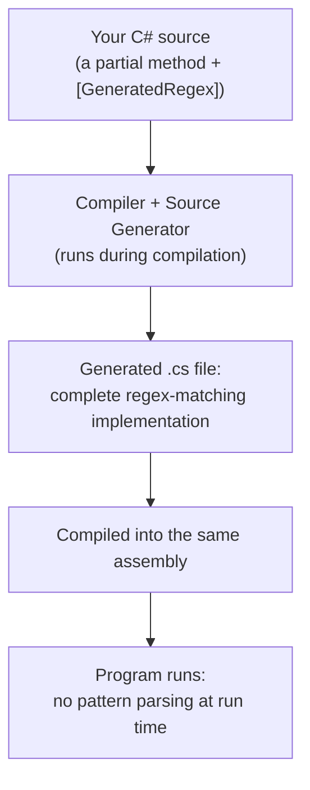
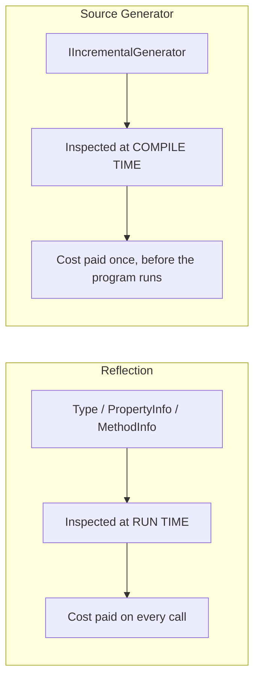

# Introduction to Roslyn Source Generators

## Introduction

Before reading this lesson, you should already be comfortable with **[Dynamic Type Inspection](../13-reflection-sourcegen-lowlevel/13-03-dynamic-type-inspection.md)**, and with the broader theme running through this module: reflection is powerful, but every lookup it performs happens at run time, repeatedly, at real cost. This lesson introduces the other side of that trade-off. A **Roslyn source generator** is a plugin that runs *inside the compiler itself*, while your project is being built, inspecting the code you actually wrote and emitting brand-new C# source files in response — files that get compiled right alongside your own, before your program ever runs a single line. You've already used generated code without writing a line of generator logic yourself, back in Module 9's System.Text.Json coverage and Module 12's performance-focused revisit; this lesson opens the hood on how that machinery actually works.

By the end of this lesson, you will be able to:

- Explain what a source generator is and precisely when it runs relative to your own code
- Describe the modern `IIncrementalGenerator` interface at a conceptual level
- Use a real, built-in source generator (`[GeneratedRegex]`) and observe compile-time codegen firsthand
- Explain, precisely, how compile-time source generation differs from run-time reflection
- Connect this lesson back to Module 9's and Module 12's System.Text.Json source-generated serializers

## Roslyn Source Generators — A Layman's Perspective

Picture how a large building actually gets built. An architect draws up a blueprint — floor plans, elevations, the overall design intent. But construction crews on site don't work directly from that high-level blueprint; a structural engineer reviews it first and produces detailed "shop drawings" — precise, fully-dimensioned drawings of exactly how each beam, joint, and connection should be fabricated, filling in every mechanical detail the architect's blueprint only implied. Crucially, all of that shop-drawing work happens *before construction starts* — in an office, on paper, with no deadline pressure from a crew standing around waiting. By the time steel actually arrives at the site, every worker already has an exact, fully-detailed drawing to build from; nobody is improvising measurements or re-deriving a joint's dimensions on the spot, in the middle of construction, with a crane idling overhead.

A Roslyn source generator is exactly that structural engineer, except the "blueprint" it reviews is your actual C# source code, and the "construction" it's preparing for is your program actually running. While your project is compiling — the equivalent of the design office, before anything is truly "built" — the generator reads the classes, attributes, and patterns you wrote, and produces additional, fully-detailed C# source files in response: "for this exact class, marked with this exact attribute, here is the complete, ready-to-compile code needed to support it." Those generated files are compiled together with your own code, so that by the time your program actually starts running, none of that supporting logic still needs to be figured out — it's already sitting there, fully written, the same way a construction crew already has fully-dimensioned shop drawings in hand before the first beam goes up.

This is a fundamentally different moment in time than reflection operates in. Reflection — the subject of this entire module so far — does its inspecting work *while the program is running*, which is why it costs something on every single call: it's the equivalent of a worker on-site stopping to re-measure and re-derive a joint's dimensions from the architect's rough blueprint, every single time that joint needs to be built, because nobody prepared a shop drawing in advance. A source generator does that same kind of inspection, but does it once, at compile time, when there's no program running yet and nothing waiting on the result — and the payoff is that the running program never has to do that inspection work itself at all.

That's also precisely why source generators can't do everything reflection can. A generator only ever sees your code as it exists at compile time — it has no way to react to a type that's only discovered at run time, the way `Assembly.GetTypes()` from the previous lesson can. Source generators and reflection solve overlapping problems from opposite ends of the compile-time/run-time divide, and knowing which end you're standing on is exactly what this lesson is about.

## Roslyn Source Generators — A Programming Language Perspective

A source generator is a class implementing `Microsoft.CodeAnalysis.IIncrementalGenerator`, packaged as a special kind of analyzer assembly that the C# compiler (Roslyn) loads and runs during every compilation. Its `Initialize` method registers a pipeline — a sequence of steps, expressed through `IncrementalValuesProvider<T>`, that identifies candidate syntax nodes (a class marked with a specific attribute, for instance), transforms each candidate into whatever data the generator needs, and finally calls `RegisterSourceOutput` to emit one or more new C# source files, added to the compilation as if you had written them by hand. `IIncrementalGenerator` is the modern replacement (introduced alongside .NET 6 and still the standard API in .NET 10/C# 14) for the older `ISourceGenerator` interface, redesigned specifically so the compiler can cache and re-run only the pipeline steps affected by an edit, rather than regenerating everything on every keystroke in the IDE. The critical distinction from everything else in this module: a source generator's output becomes part of the compiled assembly *before the program runs at all* — it is compile-time metaprogramming, not run-time introspection, and the code it produces is ordinary, statically-visible C# that pays no reflection-style per-call cost whatsoever.

## How Source Generators Fit Into Compilation

You don't need to write a generator to benefit from one — .NET ships several built-in, ready-to-use generators, and `[GeneratedRegex]` is one of the simplest to observe directly. Applying it to a `partial` method that returns `Regex` tells the compiler to generate a fully compiled, high-performance regex-matching implementation for that exact pattern at compile time, rather than building the pattern into a `Regex` object at run time the way `new Regex(pattern)` does.


*Figure 1: The generator's output becomes ordinary compiled code before the program ever executes.*

```csharp
// Program.cs — .NET 10 / C# 14
using System.Text.RegularExpressions;

string[] promoCodes = ["SAVE10", "sale-5", "WINTER2026"];

foreach (string code in promoCodes)
{
    bool isValid = PromoCodePattern().IsMatch(code);
    Console.WriteLine($"{code,-12} valid={isValid}");
}

partial class Program
{
    [GeneratedRegex(@"^[A-Z0-9]{5,12}$")]
    private static partial Regex PromoCodePattern();
}
```

**Console Output:**

```text
SAVE10       valid=True
sale-5       valid=False
WINTER2026   valid=True
```

`PromoCodePattern()` has no method body in your source code at all — it's declared `partial` specifically so the `[GeneratedRegex]` source generator can supply the missing implementation during compilation. If you open this project in an IDE and navigate to `PromoCodePattern`'s generated implementation, you'd find a complete, hand-written-equivalent matching engine for this exact pattern, sitting in a generated file the compiler produced automatically — nothing here parses the regex pattern string at run time the way an ordinary `new Regex(pattern)` call would.

Writing your own generator follows the same `IIncrementalGenerator` shape `[GeneratedRegex]` itself is built on — in outline, not runnable on its own since it requires a separate generator project (the full walkthrough is next lesson):

```csharp
// AutoToStringGenerator.cs — ILLUSTRATIVE ONLY, requires a separate
// netstandard2.0 generator project; not runnable standalone.
using Microsoft.CodeAnalysis;

[Generator]
public class AutoToStringGenerator : IIncrementalGenerator
{
    public void Initialize(IncrementalGeneratorInitializationContext context)
    {
        var classes = context.SyntaxProvider.ForAttributeWithMetadataName(
            "AutoToStringAttribute",
            predicate: static (node, _) => true,
            transform: static (ctx, _) => ctx.TargetNode);

        context.RegisterSourceOutput(classes, static (spc, classNode) =>
        {
            // Build and add a generated .cs file for this class here.
        });
    }
}
```

## Real-Time Example: Compile-Time Promo Code Validation in E-Commerce Order Processing

We extend the E-Commerce Order Processing domain with promo code validation at checkout, continuing the same `Order` line of the domain built up across Modules 9 and 12. A checkout service validates promo code formats on every single request — exactly the kind of hot path where a source-generated regex, compiled once, pays off over the lifetime of the service compared to an ordinary `Regex` built from a pattern string at run time.

```csharp
// Program.cs — .NET 10 / C# 14 — Real-Time Example (E-Commerce Order Processing)
using System.Text.RegularExpressions;

var checkoutAttempts = new List<(string OrderId, string PromoCode)>
{
    ("ORD-88231", "SAVE10"),
    ("ORD-88232", "free-shipping!"),
    ("ORD-88233", "WINTER2026")
};

foreach (var (orderId, promoCode) in checkoutAttempts)
{
    bool accepted = PromoCodeValidator.IsValid(promoCode);
    Console.WriteLine(accepted
        ? $"{orderId}: promo code '{promoCode}' accepted"
        : $"{orderId}: promo code '{promoCode}' REJECTED (bad format)");
}

static partial class PromoCodeValidator
{
    [GeneratedRegex(@"^[A-Z0-9]{5,12}$")]
    private static partial Regex Pattern();

    public static bool IsValid(string code) => Pattern().IsMatch(code);
}
```

**Console Output:**

```text
ORD-88231: promo code 'SAVE10' accepted
ORD-88232: promo code 'free-shipping!' REJECTED (bad format)
ORD-88233: promo code 'WINTER2026' accepted
```

`PromoCodeValidator.IsValid` is called on every single checkout attempt in a real storefront, potentially thousands of times a minute during a sale. Because `Pattern()`'s matching logic was generated once, at compile time, none of those calls pay any pattern-parsing cost at run time — a small difference per call, but one that compounds directly into lower CPU usage under real checkout load, the same performance argument Module 12's `JsonSerializerContext` lesson made for serialization.

## Source Generation vs. Reflection

Both techniques ultimately answer a version of the same question — "what does this code look like, and what do I do with that?" — but at opposite ends of a program's lifetime. Reflection (this module's first three lessons) inspects `Type`, `PropertyInfo`, and `MethodInfo` objects while the program is already running, which is exactly why it must repeat that inspection, at real cost, on every single call. A source generator inspects your code's syntax and semantics while the *compiler* is running, long before any program instance exists, and its output is ordinary, already-compiled C# — there is nothing left for the running program to inspect or figure out, because the generator already did that work and wrote the answer directly into the assembly.


*Figure 2: Reflection inspects code while the program runs; a source generator inspects code while the compiler runs.*

| Aspect | Reflection | Source Generators |
|---|---|---|
| When inspection happens | Run time, on demand | Compile time, once |
| What it produces | `Type`/`PropertyInfo`/`MethodInfo` objects to query live | Ordinary C# source, compiled into the assembly |
| Per-call run-time cost | Real — metadata lookup every call | None — generated code runs directly |
| Can react to types unknown at compile time | Yes (`Assembly.GetTypes()`, string type names) | No — only sees what exists in source at compile time |
| Native AOT / trimming friendliness | Limited — trimmer can't always prove safety | Full — generated code is statically visible |

## Types of Source-Generator-Related Concepts in C#

Source generation spans several concrete techniques, some already covered and one arriving next lesson:

1. **[Building a Source Generator](13-05-building-a-source-generator.md)** — the next lesson, writing a minimal `IIncrementalGenerator` from scratch.
2. **[Source Generators for Performance](../12-advanced-concepts/12-34-source-generators-for-performance.md)** — System.Text.Json's `JsonSerializerContext`, this same mechanism applied to reflection-free JSON serialization.
3. **`[GeneratedRegex]`** — the built-in generator used throughout this lesson, producing a compiled regex engine at compile time.
4. **`[LoggerMessage]`** — a built-in generator producing strongly-typed, allocation-minimal logging methods from an attributed partial method.
5. **ASP.NET Core minimal API route generation** — compile-time-generated request-handling glue for AOT-published minimal APIs (Module 10/12).
6. **[Dynamic Type Inspection](13-03-dynamic-type-inspection.md)** — this module's run-time counterpart, useful precisely where a generator's compile-time view falls short.

## What You've Learned & What's Next

A Roslyn source generator is a compiler plugin, built around `IIncrementalGenerator`, that inspects your code once at compile time and emits additional, ordinary C# source compiled directly into your assembly — trading reflection's run-time flexibility for zero per-call cost and full compatibility with trimming and Native AOT. `[GeneratedRegex]` demonstrated that trade-off directly, with no generator of your own required yet.

Continue your learning journey with **[Building a Source Generator](13-05-building-a-source-generator.md)**, where you'll set up a real generator project and write a minimal `IIncrementalGenerator` implementation from scratch.

---
*Applies to: .NET 10 / C# 14. Last reviewed 2026-08-16.*
