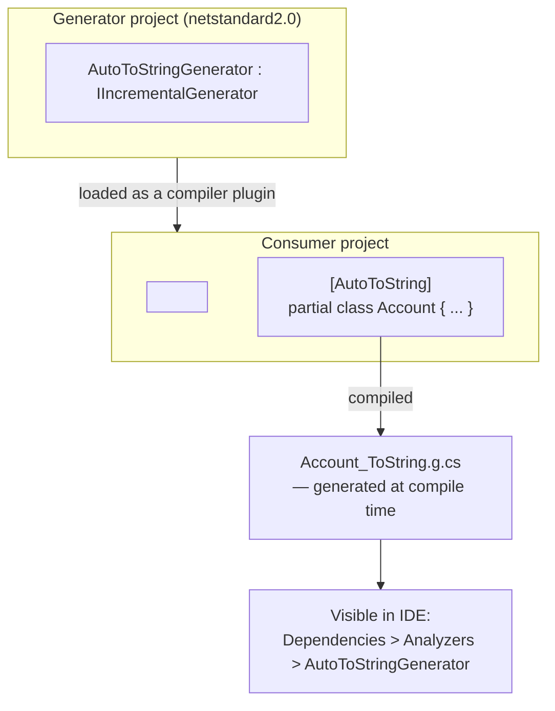
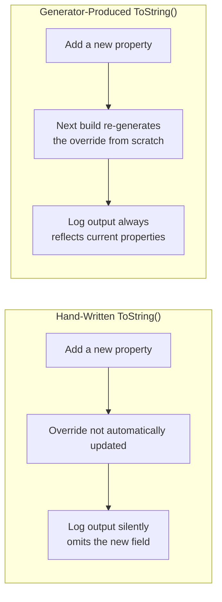

# Building a Source Generator

## Introduction

Before reading this lesson, you should already be comfortable with **[Introduction to Roslyn Source Generators](../13-reflection-sourcegen-lowlevel/13-04-introduction-to-source-generators.md)**, especially the shape of `IIncrementalGenerator` and the idea that a generator inspects your code once, at compile time, and emits new C# source in response. That previous lesson only *consumed* a generator someone else already built. This lesson has you write one: a small, complete `IIncrementalGenerator` that finds every class marked `[AutoToString]` and generates a `ToString()` override for it automatically — a task real teams solve this exact way to avoid hand-writing (and forgetting to update) repetitive boilerplate across dozens of domain classes.

By the end of this lesson, you will be able to:

- Set up a source generator project targeting `netstandard2.0` with `Microsoft.CodeAnalysis.CSharp`
- Reference a generator project from a consumer project as an analyzer, not an ordinary library
- Write a minimal `IIncrementalGenerator` using `ForAttributeWithMetadataName` and `RegisterSourceOutput`
- Have the generator emit its own marker attribute via `RegisterPostInitializationOutput`
- View a generator's output as actual generated source files inside your IDE

## Building a Source Generator — A Layman's Perspective

Lesson 4 compared a source generator to a structural engineer, turning an architect's blueprint into detailed shop drawings before construction begins. This lesson puts you in the structural engineer's chair. Imagine you've been hired specifically to handle one repetitive but essential detail across an entire building project: every single door frame, no matter which room it's in, needs a load-bearing header sized correctly for that door's width. Rather than have every site carpenter work that calculation out by hand for every door — a repetitive task, easy to get slightly wrong, easy to forget entirely — you, the engineer, write one general rule: "given any door's width, here's exactly how to size its header," and you apply that rule to every door frame in the blueprint before construction starts, producing a finished shop drawing for each one automatically.

That's exactly the shape of the generator you're about to build. Instead of headers over doors, it's a `ToString()` method over classes — a small piece of boilerplate that's easy to write once, tedious to write correctly for the fifteenth class, and easy to forget to update the sixteenth time someone adds a new property to a class and forgets the `ToString()` override no longer lists it. Your rule, expressed as code instead of a carpentry formula, is: "find every class tagged `[AutoToString]`, look at its properties, and produce a `ToString()` override that prints every one of them." Write that rule once, and it applies itself, correctly, to every class you tag today and every class you tag next year — the same way the engineer's one header-sizing rule quietly keeps every future door frame correct without anyone re-deriving it by hand.

The one genuinely new wrinkle, compared to lesson 4's ready-made `[GeneratedRegex]`, is that you're now the one setting up the "engineering office" itself — a separate project, built to a specific, restricted target framework, whose only job is to be loaded by the compiler and run during someone *else's* build. That separation is deliberate: the shop-drawing office doesn't get built alongside the building it's drawing plans for; it's a distinct operation, referenced by the construction project as a tool, not as a wall or a beam that ends up in the finished structure.

## Building a Source Generator — A Programming Language Perspective

A source generator project is an ordinary class library with two things that make it special: it targets **`netstandard2.0`**, and its output assembly is referenced by a consumer project as an **analyzer**, not as an ordinary compiled dependency. The `netstandard2.0` requirement exists because a generator loads directly into whichever process is running the C# compiler — Visual Studio's IDE process, `dotnet build`'s command-line host, and other tools all differ in their exact runtime, and `netstandard2.0` is the one target guaranteed compatible with all of them. The project references `Microsoft.CodeAnalysis.CSharp` (typically with `PrivateAssets="all"`, since consumers shouldn't inherit a dependency on Roslyn itself) and sets `<IsRoslynComponent>true</IsRoslynComponent>` to get correct build-time validation. The consuming project then references the generator project with `OutputItemType="Analyzer"` and `ReferenceOutputAssembly="false"` — telling MSBuild "load this as a compiler plugin, don't link its assembly into my program." Inside the generator, `IIncrementalGenerator.Initialize` typically uses `context.SyntaxProvider.ForAttributeWithMetadataName(...)` to efficiently find every syntax node marked with a specific attribute, and `context.RegisterSourceOutput(...)` to emit the corresponding generated file for each match.

## How to Set Up and Write a Minimal Source Generator

A generator solution is really two projects: the generator itself, and a consumer project that references it as an analyzer and applies the attribute it looks for.


*Figure 1: The generator project is referenced as an analyzer; its output appears as generated files inside the consumer project's compilation.*

```csharp
// AutoToStringGenerator.cs — ILLUSTRATIVE: lives in a separate
// netstandard2.0 project referencing Microsoft.CodeAnalysis.CSharp.
// Not runnable as a standalone script; requires the generator project
// setup shown above.
using System.Linq;
using System.Text;
using Microsoft.CodeAnalysis;
using Microsoft.CodeAnalysis.CSharp.Syntax;

[Generator]
public class AutoToStringGenerator : IIncrementalGenerator
{
    private const string AttributeSource = @"
namespace GeneratedAttributes
{
    [System.AttributeUsage(System.AttributeTargets.Class)]
    public sealed class AutoToStringAttribute : System.Attribute { }
}";

    public void Initialize(IncrementalGeneratorInitializationContext context)
    {
        // The generator provides its own marker attribute — consumers
        // never have to declare [AutoToString] themselves.
        context.RegisterPostInitializationOutput(ctx =>
            ctx.AddSource("AutoToStringAttribute.g.cs", AttributeSource));

        IncrementalValuesProvider<ClassDeclarationSyntax> classes = context.SyntaxProvider
            .ForAttributeWithMetadataName(
                "GeneratedAttributes.AutoToStringAttribute",
                predicate: static (node, _) => node is ClassDeclarationSyntax,
                transform: static (ctx, _) => (ClassDeclarationSyntax)ctx.TargetNode);

        context.RegisterSourceOutput(classes, static (spc, classDecl) =>
        {
            string className = classDecl.Identifier.Text;
            var propertyNames = classDecl.Members
                .OfType<PropertyDeclarationSyntax>()
                .Select(p => p.Identifier.Text)
                .ToList();

            var sb = new StringBuilder();
            sb.AppendLine("// <auto-generated/>");
            sb.AppendLine($"partial class {className}");
            sb.AppendLine("{");
            sb.Append("    public override string ToString() => $\"")
              .Append(className)
              .Append(" { ")
              .Append(string.Join(", ", propertyNames.Select(p => $"{p}={{{p}}}")))
              .AppendLine(" }\";");
            sb.AppendLine("}");

            spc.AddSource($"{className}_ToString.g.cs", sb.ToString());
        });
    }
}
```

This is the whole generator: `RegisterPostInitializationOutput` adds the `[AutoToString]` attribute's own definition (so a consumer project needs no shared attribute file at all), `ForAttributeWithMetadataName` efficiently finds every class carrying it, and `RegisterSourceOutput` walks each matching class's properties and writes a `partial class` file containing exactly one generated `ToString()` override.

To see this without building the full generator project yourself, here is the **hand-written equivalent** of exactly what `AutoToStringGenerator` would produce for an `[AutoToString]`-marked `Account` class — genuinely runnable, so you can confirm the shape of the result directly:

```csharp
// Program.cs — .NET 10 / C# 14
// The second `partial class Account` block below is written by hand here,
// but its content is exactly what AutoToStringGenerator would generate
// automatically for a class marked [AutoToString].

Account account = new("ACC-10293", 2500.75m);
Console.WriteLine(account);

partial class Account(string accountNumber, decimal balance)
{
    public string AccountNumber { get; } = accountNumber;
    public decimal Balance { get; } = balance;
}

// --- Everything below this line is what the generator would emit ---
partial class Account
{
    public override string ToString() => $"Account {{ AccountNumber={AccountNumber}, Balance={Balance} }}";
}
```

**Console Output:**

```text
Account { AccountNumber=ACC-10293, Balance=2500.75 }
```

With the real generator wired up via a `ProjectReference` marked `OutputItemType="Analyzer"`, `Account` would only need to be declared `partial` and tagged `[AutoToString]` — no second `partial class Account` block written by hand at all. In Visual Studio, expanding **Dependencies > Analyzers > AutoToStringGenerator** in Solution Explorer shows the exact generated `Account_ToString.g.cs` file, with the same content shown above, sitting there as ordinary source the compiler produced automatically.

## Real-Time Example: Auto-Generating Boilerplate for Banking/ATM Domain Classes

We continue the Banking/ATM domain, applying `[AutoToString]` to `Account` and a new `Transaction` class — exactly the kind of small, repetitive-but-essential boilerplate a real banking codebase accumulates across dozens of domain types, where a forgotten manual `ToString()` update after adding a field is a genuine, recurring source of misleading log output.

```csharp
// Program.cs — .NET 10 / C# 14 — Real-Time Example (Banking/ATM)
// As above, the second block for each class is the HAND-WRITTEN equivalent
// of AutoToStringGenerator's output — shown here so the result is directly
// runnable and verifiable, standing in for what a referenced generator
// project would produce automatically for any [AutoToString]-tagged class.

Account account = new("ACC-10293", 2500.75m);
Transaction withdrawal = new("TXN-5591", "Withdrawal", -200.00m);

Console.WriteLine(account);
Console.WriteLine(withdrawal);

partial class Account(string accountNumber, decimal balance)
{
    public string AccountNumber { get; } = accountNumber;
    public decimal Balance { get; } = balance;
}

partial class Account
{
    public override string ToString() => $"Account {{ AccountNumber={AccountNumber}, Balance={Balance} }}";
}

partial class Transaction(string transactionId, string type, decimal amount)
{
    public string TransactionId { get; } = transactionId;
    public string Type { get; } = type;
    public decimal Amount { get; } = amount;
}

partial class Transaction
{
    public override string ToString() => $"Transaction {{ TransactionId={TransactionId}, Type={Type}, Amount={Amount} }}";
}
```

**Console Output:**

```text
Account { AccountNumber=ACC-10293, Balance=2500.75 }
Transaction { TransactionId=TXN-5591, Type=Withdrawal, Amount=-200.00 }
```

With `AutoToStringGenerator` wired into the real project as an analyzer, both second `partial class` blocks above disappear entirely from hand-written code — tagging `Account` and `Transaction` with `[AutoToString]` is the only change needed, and every future property added to either class is picked up in its `ToString()` output automatically the next time the project builds, with no manual override to remember to update.

## Hand-Written Boilerplate vs. Generator-Produced Boilerplate

Hand-written `ToString()` overrides are simple to write for one class and immediately visible in source, but they silently rot: add a new property to `Account` next month, and nothing forces the hand-written override to mention it, so a log line can quietly go on omitting a field for months before anyone notices. A generator-produced override is derived directly from the class's actual current properties, every time the project builds — there is no override to forget to update, because the "override" is really a description of the class re-derived fresh on every compilation.


*Figure 2: A generated override is re-derived from the class's actual shape on every build, so it can't silently fall out of sync.*

| Aspect | Hand-Written `ToString()` | Generator-Produced `ToString()` |
|---|---|---|
| Stays in sync with new properties | Only if a developer remembers to update it | Automatically, every build |
| Written by | A developer, once per class | `AutoToStringGenerator`, for every tagged class |
| Setup cost | None | One-time generator project + reference |
| Risk of silent staleness | Real and common | None — regenerated from current source |

## Types of Concepts Related to Building Source Generators

Writing your own generator connects to several related ideas worth knowing about:

1. **[Expression Trees](13-06-expression-trees.md)** — the next lesson, covering a different form of code-as-data, built and inspected at run time rather than emitted at compile time.
2. **[Introduction to Roslyn Source Generators](13-04-introduction-to-source-generators.md)** — this lesson's prerequisite, covering `IIncrementalGenerator` and `[GeneratedRegex]` conceptually before this hands-on build.
3. **`RegisterPostInitializationOutput`** — used here to have the generator supply its own `[AutoToString]` attribute, so consumers need no shared attribute file.
4. **`<EmitCompilerGeneratedFiles>true</EmitCompilerGeneratedFiles>`** — an MSBuild property that writes every generated file to disk under `<CompilerGeneratedFilesOutputPath>`, useful for inspecting generator output outside the IDE.
5. **Debugging a source generator** — attaching a debugger to the build process (or `Debugger.Launch()` inside `Initialize`) to step through generator logic directly.
6. **[Source Generators for Performance](../12-advanced-concepts/12-34-source-generators-for-performance.md)** — a production-grade, Microsoft-maintained generator (`JsonSerializerContext`) built on these exact same `IIncrementalGenerator` mechanics.

## What You've Learned & What's Next

Building a source generator means creating a separate `netstandard2.0` project referencing `Microsoft.CodeAnalysis.CSharp`, implementing `IIncrementalGenerator` to find attribute-marked syntax with `ForAttributeWithMetadataName`, and emitting new source with `RegisterSourceOutput` — the consumer project then references it as an analyzer rather than an ordinary library, and its output appears as real, inspectable generated files right in the IDE.

Continue your learning journey with **[Expression Trees](13-06-expression-trees.md)**, where we look at a different kind of code-as-data — building and inspecting executable logic as an object graph at run time, rather than generating source at compile time.

---
*Applies to: .NET 10 / C# 14. Last reviewed 2026-08-16.*
