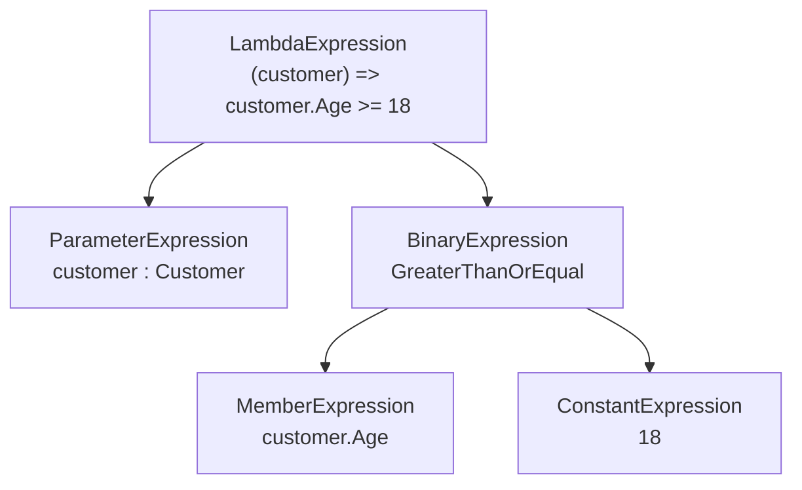
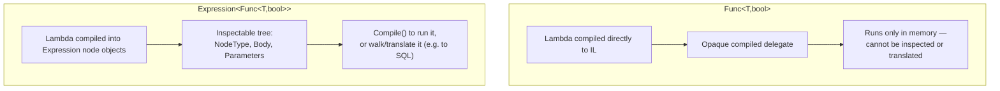

# Expression Trees

## Introduction

Before reading this lesson, you should already be comfortable with **[Building a Source Generator](../13-reflection-sourcegen-lowlevel/13-05-building-a-source-generator.md)**. That lesson showed one way C# treats code as something other than a fixed, finished thing: a source generator inspects your code at *compile* time and emits more code alongside it. This lesson introduces a second, very different way C# does the same trick, this time at *run* time — representing a lambda not as compiled, executable instructions, but as an inspectable data structure describing what that lambda says, called an expression tree.

By the end of this lesson, you will be able to:

- Explain the difference between a compiled delegate (`Func<T,bool>`) and an expression tree (`Expression<Func<T,bool>>`)
- Inspect an expression tree's shape — its root node type, its parameters, and its body
- Build a simple expression tree by hand using the `Expression` factory methods, without writing a lambda at all
- Compile an expression tree into a runnable delegate with `.Compile()`
- Explain how LINQ providers such as EF Core walk an expression tree to translate C# into SQL instead of running it directly
- Connect this back to `IQueryable<T>` and LINQ to Entities from Modules 04 and 11

## Expression Trees — A Layman's Perspective

Picture an architect drawing up a blueprint for a home addition. The blueprint itself doesn't build anything — it's a sheet of paper describing intent: a wall goes here, a door goes there, this room is twelve feet by fourteen. No wood has been cut, no concrete poured. It's a plan, not the addition.

Now suppose that exact same blueprint is handed to two completely different builders. The first is a local contractor working on-site, with a truck full of standard lumber and a crew familiar with the town's building codes. That contractor reads the blueprint and starts framing walls in wood that same afternoon, following its dimensions line by line, producing a physical addition built the ordinary way.

The second builder never sees the site at all — the same blueprint is faxed overseas to a factory that manufactures precast concrete panels for modular construction, under an entirely different building code, using materials the first contractor has never touched. That factory doesn't frame anything in wood. It reads the exact same blueprint — the same room dimensions, the same door placement — and produces a completely different physical result: precast panels, shipped and assembled on-site, that satisfy the exact same plan through an entirely different construction process. Same blueprint, two wildly different executions, because a blueprint is a *description* of the desired outcome, not the outcome itself, and anyone capable of reading it is free to realize it however best suits their own materials, tools, and constraints.

That's the whole point of a blueprint that a finished wall could never offer. If you handed the overseas factory an already-built wooden wall instead of a blueprint, it would be useless to them — it's already fixed into one specific material, built by one specific method, with nothing left to reinterpret. A blueprint stays useful precisely because it stops short of being the finished thing.

An `Expression<Func<T,bool>>` is C#'s blueprint. Write `customer => customer.Age >= 18` where the compiler expects an `Expression<Func<Customer, bool>>`, and instead of compiling that lambda straight into runnable instructions, the compiler builds an object graph describing it: "compare a property called `Age`, on some parameter called `customer`, against the constant `18`, using greater-than-or-equal." Nothing has run yet. Hand that same tree to LINQ to Objects, and it gets compiled and executed directly in memory — the local contractor, building in wood, on-site. Hand that same tree to EF Core instead, and it gets walked, node by node, and translated into an entirely different execution engine's language — a `WHERE Age >= 18` clause sent to a database server that has never heard of C# at all. A plain `Func<Customer, bool>`, by contrast, is the already-built wall: compiled, opaque, runnable exactly one way, with nothing left in it for anyone to read or reinterpret.

## Expression Trees — A Programming Language Perspective

`Expression<TDelegate>`, defined in `System.Linq.Expressions`, is a sealed subclass of the non-generic `LambdaExpression`. When the compiler sees a lambda assigned to an `Expression<TDelegate>`-typed target — rather than an ordinary delegate type like `Func<TDelegate>` — it does not emit IL for a callable method body at all. Instead, it emits code that *builds an object graph* out of `Expression`-derived node types: `ParameterExpression` for the lambda's parameter, `MemberExpression` for a property or field access, `ConstantExpression` for a literal value, `BinaryExpression` for an operator like `>=`, and `MethodCallExpression` for a method invocation, among others. The tree's root is always a `LambdaExpression`, whose `Body` property holds the rest of the tree and whose `Parameters` property holds its `ParameterExpression` entries. Calling `.Compile()` on an `Expression<TDelegate>` performs a small, on-demand compilation of that tree into an actual delegate, indistinguishable at that point from one built from an ordinary lambda. Only *expression-bodied* lambdas — a single expression, not a statement block with loops or multiple statements — can be represented this way, which is precisely why LINQ query predicates read the way they do.

## How to Build and Inspect an Expression Tree in C#

The compiler will build a tree for you automatically the moment a lambda is assigned to an `Expression<TDelegate>`-typed variable — no special syntax beyond that target type is required. The same tree can also be constructed entirely by hand, one `Expression` factory method call at a time, which is exactly what the compiler is doing on your behalf under the hood.


*Figure 1: An expression tree for `customer => customer.Age >= 18` — five node objects describing the lambda, not a single instruction executed yet.*

```csharp
// Program.cs — .NET 10 / C# 14
using System.Linq.Expressions;

// The compiler builds this entire tree for us from an ordinary-looking lambda,
// because the target type is Expression<Func<...>>, not Func<...>.
Expression<Func<Customer, bool>> isAdult = customer => customer.Age >= 18;

Console.WriteLine($"Root node type: {isAdult.NodeType}");
Console.WriteLine($"Parameter: {isAdult.Parameters[0].Name} : {isAdult.Parameters[0].Type.Name}");

var body = (BinaryExpression)isAdult.Body;
Console.WriteLine($"Body node type: {body.NodeType}");
Console.WriteLine($"Left: {body.Left}");
Console.WriteLine($"Right: {body.Right}");

// Build the exact same tree by hand, calling the Expression factory methods directly.
ParameterExpression customerParam = Expression.Parameter(typeof(Customer), "customer");
MemberExpression ageProperty = Expression.Property(customerParam, nameof(Customer.Age));
ConstantExpression eighteen = Expression.Constant(18);
BinaryExpression comparison = Expression.GreaterThanOrEqual(ageProperty, eighteen);
Expression<Func<Customer, bool>> handBuilt =
    Expression.Lambda<Func<Customer, bool>>(comparison, customerParam);

Func<Customer, bool> compiled = handBuilt.Compile();
Console.WriteLine($"Hand-built tree, compiled and run on age 20: {compiled(new Customer(20))}");
Console.WriteLine($"Hand-built tree, compiled and run on age 15: {compiled(new Customer(15))}");

record Customer(int Age);
```

**Console Output:**

```text
Root node type: Lambda
Parameter: customer : Customer
Body node type: GreaterThanOrEqual
Left: customer.Age
Right: 18
Hand-built tree, compiled and run on age 20: True
Hand-built tree, compiled and run on age 15: False
```

Nothing about `isAdult` ran until `.Compile()` was called on `handBuilt` — up to that point, `isAdult.Body`, `isAdult.Parameters`, and every node beneath them were just objects sitting in memory, exactly as inspectable as any other object graph. The hand-built version, assembled purely from `Expression.Parameter`, `Expression.Property`, `Expression.Constant`, `Expression.GreaterThanOrEqual`, and `Expression.Lambda`, produces a tree structurally identical to the one the compiler built for `isAdult` — proving the compiler isn't doing anything magical here, just automating exactly these same calls.

## Real-Time Example: One Predicate, Two Executions in E-Commerce Order Processing

We extend the E-Commerce Order Processing domain with the same `Order` shape used elsewhere in this curriculum, and feed a single `Expression<Func<Order, bool>>` to two completely different consumers: one compiles and runs it in memory (exactly what LINQ to Objects does), the other walks its nodes by hand to produce a SQL `WHERE` clause (a miniature version of exactly what EF Core's real LINQ provider does against `IQueryable<Order>`).

```csharp
// Program.cs — .NET 10 / C# 14 — Real-Time Example (E-Commerce Order Processing)
using System.Linq.Expressions;

Order[] orders =
[
    new(1001, "CUST-01", 89.99m),
    new(1002, "CUST-02", 154.50m),
    new(1003, "CUST-01", 42.00m),
];

Expression<Func<Order, bool>> highValueOrder = order => order.Total > 100m;

Console.WriteLine("-- LINQ to Objects: compile and run in memory --");
Func<Order, bool> predicate = highValueOrder.Compile();
foreach (Order order in orders.Where(predicate))
{
    Console.WriteLine($"Order {order.OrderId}: {order.Total:C} (matched in memory)");
}

Console.WriteLine();
Console.WriteLine("-- Simulated LINQ provider: translate the SAME tree to SQL --");
string sql = ExpressionToSql.Translate(highValueOrder);
Console.WriteLine(sql);

record Order(int OrderId, string CustomerId, decimal Total);

static class ExpressionToSql
{
    public static string Translate(Expression<Func<Order, bool>> predicate)
    {
        string whereClause = Visit(predicate.Body);
        return $"SELECT * FROM Orders WHERE {whereClause}";
    }

    private static string Visit(Expression node) => node switch
    {
        BinaryExpression binary =>
            $"{Visit(binary.Left)} {SqlOperator(binary.NodeType)} {Visit(binary.Right)}",
        MemberExpression member => member.Member.Name,
        ConstantExpression constant => constant.Value?.ToString() ?? "NULL",
        _ => throw new NotSupportedException($"Node type {node.NodeType} is not supported.")
    };

    private static string SqlOperator(ExpressionType nodeType) => nodeType switch
    {
        ExpressionType.GreaterThan => ">",
        ExpressionType.LessThan => "<",
        ExpressionType.Equal => "=",
        _ => throw new NotSupportedException($"Operator {nodeType} is not supported.")
    };
}
```

**Console Output:**

```text
-- LINQ to Objects: compile and run in memory --
Order 1002: $154.50 (matched in memory)

-- Simulated LINQ provider: translate the SAME tree to SQL --
SELECT * FROM Orders WHERE Total > 100
```

The exact same `highValueOrder` tree fed two entirely different consumers without being written twice. `.Compile()` plus `.Where()` produced a real delegate that filtered `orders` one at a time in process memory — precisely what LINQ to Objects does with any `IEnumerable<T>`. `ExpressionToSql.Translate` never called `.Compile()` at all; it walked `Total > 100m`'s `BinaryExpression`, `MemberExpression`, and `ConstantExpression` nodes and rendered them as SQL text instead. That second path is a small-scale version of exactly what Module 11's EF Core does for real against an `IQueryable<Order>` — the filtering happens inside the database engine, not your application's memory, because the tree was translated rather than executed locally.

## Compiled Delegate vs. Expression Tree

A `Func<T,bool>` and an `Expression<Func<T,bool>>` can be written with identical-looking lambda syntax, yet they are fundamentally different kinds of object: one is finished, runnable machine behavior; the other is a description that something else — possibly your own code, possibly a LINQ provider you'll never see the internals of — decides how to realize. Only the latter can be inspected, rewritten, or translated into a different execution engine's language, because only the latter still exists as data rather than as already-compiled instructions.


*Figure 2: A `Func<T,bool>` is already the finished behavior; an `Expression<Func<T,bool>>` is a description that can still be compiled, walked, or translated.*

| Aspect | `Func<T,bool>` | `Expression<Func<T,bool>>` |
|---|---|---|
| What it is | A compiled delegate — a reference to executable IL | A tree of `Expression` objects describing the lambda's structure |
| When it "runs" | Immediately, as ordinary method-call IL | Only after `.Compile()` — or never, if only inspected/translated |
| Inspectable at runtime | No — opaque compiled code | Yes — `NodeType`, `Body`, `Parameters`, and every child node |
| Typical use case | LINQ to Objects, any in-memory delegate | LINQ providers (`IQueryable<T>`) such as EF Core, rule engines |
| Lambda restrictions | Full statement blocks, loops, multiple statements allowed | Single expression only — no statement blocks or loops |

## Types of Expression-Tree-Related Concepts

Expression trees connect directly back to LINQ's dual execution model and forward to this module's remaining lessons on what runtime dynamism costs:

1. **[Introduction to LINQ](../04-linq/04-01-introduction-to-linq.md)** — the foundational query syntax whose lambdas become expression trees whenever a provider needs to translate them.
2. **[LINQ to Objects vs LINQ to Entities](../04-linq/04-21-linq-to-objects-vs-entities.md)** — the `IEnumerable<T>`/`IQueryable<T>` split that decides whether your lambda compiles to a delegate or builds a tree.
3. **[Querying with EF Core and LINQ](../11-efcore/11-06-querying-with-ef-core-linq.md)** — a real LINQ provider performing exactly the tree-to-SQL translation this lesson's `ExpressionToSql` simulated.
4. **[Introduction to Reflection in C#](../13-reflection-sourcegen-lowlevel/13-01-introduction-to-reflection.md)** — the runtime type inspection that `MemberExpression` and its relatives lean on internally.
5. **`ExpressionVisitor`** — the `System.Linq.Expressions` base class that formalizes the manual `Visit`-style pattern this lesson hand-rolled, and what EF Core's real provider derives from.
6. **[Introduction to Native AOT](../13-reflection-sourcegen-lowlevel/13-07-introduction-to-native-aot.md)** — covered next, where building trees and calling `.Compile()` at runtime is one of the dynamic-code patterns Native AOT restricts.

## What You've Learned & What's Next

An `Expression<Func<T,bool>>` represents a lambda as data — an inspectable tree of `Expression` nodes — rather than as compiled, runnable instructions, which is exactly what lets a LINQ provider like EF Core translate the same C# predicate you'd write for an in-memory list into SQL executed by an entirely different engine. `Func<T,bool>`, by contrast, is already the finished behavior, with nothing left in it to inspect or translate.

Continue your learning journey with **[Introduction to Native AOT](../13-reflection-sourcegen-lowlevel/13-07-introduction-to-native-aot.md)**, where we look at what happens when an entire application is compiled ahead of time — and why runtime dynamism like building expression trees and calling `.Compile()` is exactly the kind of thing that model has to restrict.

---
*Applies to: .NET 10 / C# 14. Last reviewed 2026-08-16.*
