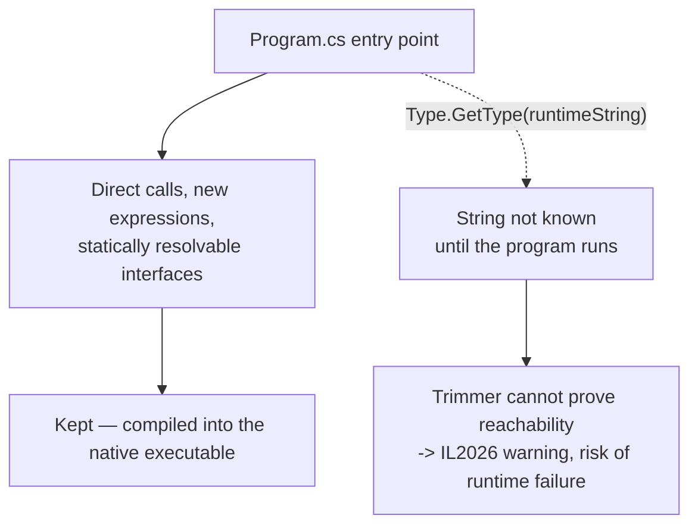
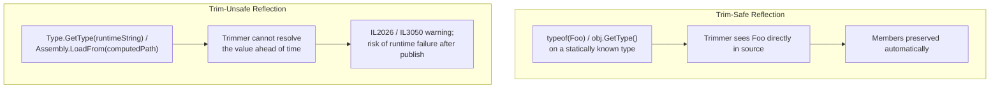

# Introduction to Native AOT

## Introduction

Before reading this lesson, you should already be comfortable with **[Expression Trees](../13-reflection-sourcegen-lowlevel/13-06-expression-trees.md)** and, further back, with **[JIT vs Native AOT Compilation](../12-advanced-concepts/12-33-jit-vs-native-aot.md)** from Module 12, which introduced Native AOT's startup-time and footprint advantages. This lesson goes one level deeper into *why* those advantages exist and what they cost: Native AOT publishing only works because a build-time trimmer removes everything it cannot prove your application will ever use — and that same trimmer is precisely what makes unrestricted reflection, arbitrary `Type.GetType(string)` calls, and runtime code generation awkward or unsupported. Every reflection-heavy technique from earlier in this module deserves a second look through that lens.

By the end of this lesson, you will be able to:

- Explain what happens during trimming when an application is published with Native AOT
- Identify the specific patterns Native AOT restricts: unrestricted reflection, `Type.GetType(string)` with a runtime-determined string, and dynamic code generation
- Explain why the trimmer can only keep what it can prove is statically reachable from the application's entry point
- Recognize why reflection-heavy code from earlier lessons in this module often needs adaptation before it can publish cleanly under Native AOT
- Distinguish trim-safe reflection (`typeof`, `obj.GetType()`) from trim-unsafe reflection (a type name built or supplied at run time)
- Replace a reflection-based lookup with a trim-safe static registry

## Native AOT — A Layman's Perspective

Picture hiring professional movers for a permanent downsizing move into a smaller house. These movers work from one document only: a written inventory list, prepared in advance, itemizing exactly what gets packed. Anything on that list is wrapped carefully and guaranteed to arrive at the new address. Nothing else comes along — deliberately, since the entire point of downsizing was to stop hauling an entire house's worth of belongings to a place that doesn't have room for them.

For the overwhelming majority of your belongings, this works perfectly, because you already know, before moving day, exactly what you own and want to keep. You walk every room, write it all down, and the movers pack precisely that.

But suppose you also rent a numbered storage unit across town, and instead of listing its contents in advance, your plan is: "once I'm settled into the new place, I'll flip through a directory, pick whichever unit number feels right that day, drive over, and grab whatever's inside." No inventory list can capture that plan, because the decision of *which* unit to open doesn't exist yet — it only happens after the move is already done. A moving company faced with this plan has exactly two honest choices: refuse to guarantee that unit's contents will be waiting at the new house at all, since nothing from it was ever loaded onto the truck; or throw every single unit in the entire storage facility onto the truck just in case, which defeats the entire purpose of hiring movers to downsize in the first place.

Native AOT publishing is that downsizing move. Running `dotnet publish` with `PublishAot=true` asks the build process to behave exactly like that moving company: start from your `Program.cs` entry point, walk every method call, every `new`, every interface implementation it can trace directly through your source, and compile — pack onto the truck — only what that walk can prove will actually be needed. Code you call by name, directly, in your own source, is always on the itemized list, and always survives the move. Code you plan to reach later by deciding a type's *name* as a string computed at run time, then looking it up with something like `Type.GetType(nameDecidedLater)`, is exactly the "which storage unit, decided after moving day" problem: the build process has no way to know, while it's still packing the truck, what that string will actually name once the program is running, so it cannot honestly guarantee that type made it onto the truck at all.

This is exactly why the reflection techniques covered earlier in this module matter here. Code written on the assumption that reflection can always look up any type, by any name, at any moment, needs a second look once Native AOT enters the picture — because the trimmer needs a written inventory, not a promise to figure it out later.

## Native AOT — A Programming Language Perspective

Publishing with `dotnet publish /p:PublishAot=true` runs a build-time trimmer and linker (`illink`) as a mandatory, non-optional part of compilation rather than an optional afterthought: it performs static reachability analysis starting from the application's entry point, walking every method body, every statically resolvable virtual or interface dispatch target, and every type it can prove gets constructed — and it discards, permanently, anything it cannot prove is reachable from that walk. Reflection driven by a *statically known* `Type` — `typeof(Foo)`, or `obj.GetType()` followed by a member name written directly in source — remains fully trim-safe, because the trimmer can see exactly which type and member are involved and preserves them automatically. What breaks, or triggers a build-time warning, is reflection driven by a value only known at run time: `Type.GetType(variableString)`, `Assembly.LoadFrom` with a computed path, or building executable code dynamically with `System.Reflection.Emit` — none of these let the trimmer prove, ahead of time, what will actually be requested once the program runs. .NET's trimming analyzer flags exactly these unprovable call sites at publish time with warnings such as `IL2026`, `IL2075`, and `IL3050`, and the `[DynamicallyAccessedMembersAttribute]` exists specifically to let a reflection call site tell the trimmer which members to preserve even when the exact type can't be known until later.

## How Trimming Decides What Survives Native AOT

The trimmer's reachability walk starts at `Program.cs` and follows every call it can resolve statically; a `Type.GetType(string)` call breaks that walk, because the string it depends on isn't resolved until the program is already running.


*Figure 1: The trimmer only keeps what it can trace statically from the entry point; a runtime-determined type name breaks that trace.*

```csharp
// Program.cs — .NET 10 / C# 14
// Imagine 'processorTypeName' arrived from a config file or command-line argument —
// its value would not be fixed at compile time in a real system, even though this
// sample hardcodes it here for a deterministic, runnable demonstration.
string processorTypeName = "IntroToAot.SlowLoanBookProcessor";

Type? processorType = Type.GetType(processorTypeName);

if (processorType is null)
{
    Console.WriteLine($"No type found for: {processorTypeName}");
}
else
{
    var processor = (IBookProcessor?)Activator.CreateInstance(processorType);
    processor?.Process("Clean Code");
}

interface IBookProcessor
{
    void Process(string title);
}

namespace IntroToAot
{
    public class SlowLoanBookProcessor : IBookProcessor
    {
        public void Process(string title) => Console.WriteLine($"Processing loan for: {title}");
    }
}
```

**Console Output** *(running normally with `dotnet run`, under the traditional JIT model)*:

```text
Processing loan for: Clean Code
```

**Illustrative `dotnet publish` trim warning** *(what publishing this same code with `/p:PublishAot=true` reports — not this program's actual console output, and not from a single controlled run)*:

```text
warning IL2026: Program.<Main>$(String[]): Using member 'System.Type.GetType(String)' which
has 'RequiresUnreferencedCodeAttribute' can break functionality when trimming application code.
The type 'IntroToAot.SlowLoanBookProcessor' might be removed because its name is not statically
known to the trimmer.
```

The program above runs perfectly under the ordinary JIT model — `Type.GetType` resolves the hardcoded string every time, without incident. But the trimmer doesn't attempt to trace what a `string` variable will contain across every possible code path; it conservatively flags *every* `Type.GetType(string)` call site as unprovable, whether or not the string happens to be a fixed literal in this particular sample. That warning is exactly the situation the next lesson publishes for real and shows how to resolve.

## Real-Time Example: Trim-Safe Dispatch in Library/Inventory Management

We extend the Library/Inventory Management case study with a checkout-policy lookup: each `LibraryItem` carries a category code, and the correct checkout policy needs to be selected based on that code — the same *kind* of "pick behavior by a string key" problem the reflection-based `SlowLoanBookProcessor` lookup above ran into. Instead of resolving a type by name, this version uses a static dictionary of factory delegates that the trimmer can see, and prove reachable, directly in source.

```csharp
// Program.cs — .NET 10 / C# 14 — Real-Time Example (Library/Inventory Management)
LibraryItem[] catalog =
[
    new("Clean Code", "BOOK"),
    new("Inception", "DVD"),
    new("National Geographic - March", "MAGAZINE"),
];

// Trim-safe: a static, compile-time-visible registry instead of a reflection-based
// type-name lookup. Every constructor call here is written directly in source, so
// the trimmer can prove all three policy types are reachable and keep them.
Dictionary<string, Func<ICheckoutPolicy>> policyRegistry = new()
{
    ["BOOK"] = () => new StandardCheckoutPolicy(),
    ["DVD"] = () => new ShortLoanCheckoutPolicy(),
    ["MAGAZINE"] = () => new InLibraryOnlyPolicy(),
};

foreach (LibraryItem item in catalog)
{
    if (policyRegistry.TryGetValue(item.CategoryCode, out Func<ICheckoutPolicy>? factory))
    {
        ICheckoutPolicy policy = factory();
        Console.WriteLine($"{item.Title} -> {policy.Describe()}");
    }
    else
    {
        Console.WriteLine($"{item.Title} -> No checkout policy registered for '{item.CategoryCode}'");
    }
}

record LibraryItem(string Title, string CategoryCode);

interface ICheckoutPolicy
{
    string Describe();
}

class StandardCheckoutPolicy : ICheckoutPolicy
{
    public string Describe() => "Standard 21-day loan";
}

class ShortLoanCheckoutPolicy : ICheckoutPolicy
{
    public string Describe() => "Short 3-day loan";
}

class InLibraryOnlyPolicy : ICheckoutPolicy
{
    public string Describe() => "In-library use only, no checkout";
}
```

**Console Output:**

```text
Clean Code -> Standard 21-day loan
Inception -> Short 3-day loan
National Geographic - March -> In-library use only, no checkout
```

This registry achieves exactly the same goal as a reflection-based type-name lookup — choosing behavior based on a string key — without ever asking the trimmer to guess what a runtime string might name. Every constructor call (`new StandardCheckoutPolicy()`, `new ShortLoanCheckoutPolicy()`, `new InLibraryOnlyPolicy()`) is visible directly in source, so Native AOT's trimmer trivially proves all three types are reachable and keeps them, with no `IL2026`-style warning at all. This is the general shape of the fix that reflection-heavy patterns from earlier in this module need before they can publish cleanly under Native AOT — a fix the next lesson applies to a complete command-line tool, warnings and all.

## Trim-Safe Reflection vs. Trim-Unsafe Reflection

Not all reflection is affected equally. Reflection anchored to a type the compiler already knows about — `typeof(Foo)`, or `obj.GetType()` immediately followed by a member name written in source — gives the trimmer everything it needs to keep that type automatically, no different from an ordinary method call. Reflection anchored to a value that only exists once the program is already running — a string read from configuration, a command-line argument, user input — is what the trimmer cannot verify in advance, and it is exactly this second category, not reflection as a whole, that Native AOT restricts.


*Figure 2: The dividing line isn't "reflection or not" — it's whether the type involved is knowable at build time or only at run time.*

| Aspect | Trim-Safe Reflection | Trim-Unsafe Reflection |
|---|---|---|
| Type known at | Build time (`typeof`, generic constraints) | Only at run time (string, config, user input) |
| Trimmer behavior | Keeps the type and members automatically | Cannot prove reachability — may warn and/or strip it |
| Typical APIs | `typeof`, `obj.GetType()`, generics | `Type.GetType(string)`, `Assembly.LoadFrom`, `Reflection.Emit` |
| Fix under Native AOT | None needed | Replace with a static registry, or annotate with `[DynamicallyAccessedMembers]` |
| Warning code | None | `IL2026`, `IL2075`, `IL3050` |

## Types of Native AOT Concepts to Explore Next

Native AOT's trimming model connects directly back to this module's earlier reflection lessons and forward to publishing one for real:

1. **[JIT vs Native AOT Compilation](../12-advanced-concepts/12-33-jit-vs-native-aot.md)** — the startup-time and footprint comparison this lesson's trimming mechanics explain the "why" behind.
2. **[Publishing a Native AOT Application](../13-reflection-sourcegen-lowlevel/13-08-publishing-native-aot-app.md)** — next lesson, the full `dotnet publish` walkthrough and trim-warning remediation this lesson set up.
3. **[Introduction to Reflection in C#](../13-reflection-sourcegen-lowlevel/13-01-introduction-to-reflection.md)** — the baseline reflection techniques worth revisiting through this lesson's trim-safety lens.
4. **[Dynamic Type Inspection](../13-reflection-sourcegen-lowlevel/13-03-dynamic-type-inspection.md)** — another runtime-dispatch technique that needs the same AOT-safety scrutiny as `Type.GetType`.
5. **[Building a Source Generator](../13-reflection-sourcegen-lowlevel/13-05-building-a-source-generator.md)** — a compile-time alternative that sidesteps the trimmer problem entirely, since it never needs a runtime type-name lookup.
6. **`[DynamicallyAccessedMembersAttribute]`** — the attribute that lets a reflection call site tell the trimmer which members to preserve when the exact type genuinely can't be known until run time.

## What You've Learned & What's Next

Native AOT publishing works by trimming away everything the build process cannot prove is reachable from your application's entry point — which is exactly why reflection anchored to a compile-time-known type stays safe, while reflection anchored to a runtime-only string does not. Code written under the assumption that any type can always be looked up by any name, at any time, is precisely the pattern earlier reflection-heavy lessons in this module need to revisit before publishing under this model.

Continue your learning journey with **[Publishing a Native AOT Application](../13-reflection-sourcegen-lowlevel/13-08-publishing-native-aot-app.md)**, where we run a real `dotnet publish -r <RID> /p:PublishAot=true`, inspect the resulting native executable, and walk through addressing the trim warnings this lesson only introduced.

---
*Applies to: .NET 10 / C# 14. Last reviewed 2026-08-16.*
