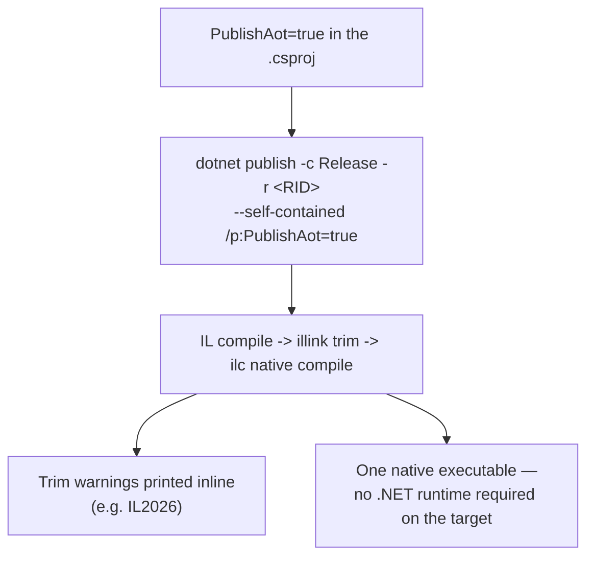
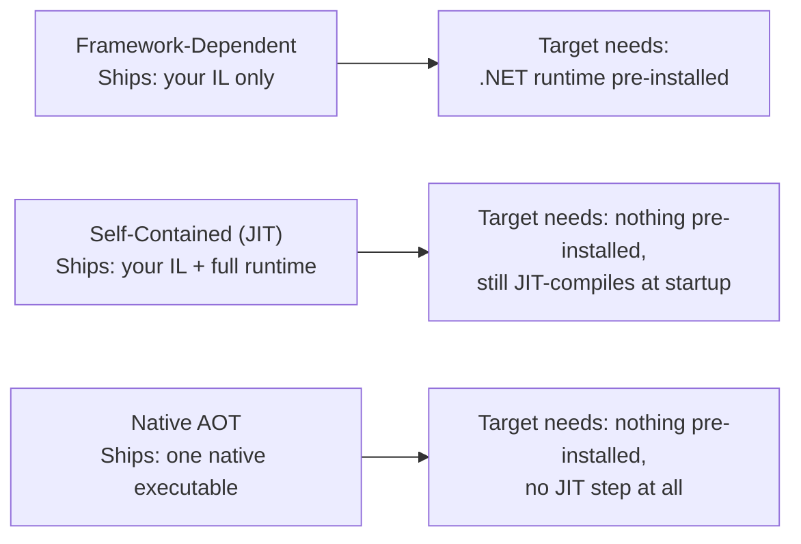

# Publishing a Native AOT Application

## Introduction

Before reading this lesson, you should already be comfortable with **[Introduction to Native AOT](../13-reflection-sourcegen-lowlevel/13-07-introduction-to-native-aot.md)**, which explained *why* the trimmer restricts runtime reflection. This lesson puts that theory into practice: adding `PublishAot` to a project file, running a real `dotnet publish` command, reading the resulting native executable's behavior, and resolving the trim warnings the previous lesson only described.

By the end of this lesson, you will be able to:

- Add `<PublishAot>true</PublishAot>` to a project file and explain what it changes about publishing
- Run `dotnet publish -r <RID> --self-contained /p:PublishAot=true` and identify the resulting native executable
- Explain why that executable needs no separately installed .NET runtime on the machine it runs on
- Read a real trimming warning produced during publish and choose the right fix for it
- Compare illustrative startup-time and deployed-size numbers across framework-dependent, self-contained, and Native AOT publishes
- Confirm, by publishing a trim-safe application, that a clean publish produces zero trimming warnings

## Publishing Native AOT — A Layman's Perspective

Picture ordering a bookshelf online. One version arrives as a flat-pack kit: a compact, lightweight box, cheap to ship, containing panels, screws, and an instruction sheet. It only becomes a usable bookshelf once you unpack it at home, find a screwdriver, and assemble it yourself — and that assumes you already own a screwdriver and have somewhere to work. If you don't, the box sits there, unusable, no matter how well it was packed.

A different furniture store instead offers to ship the same bookshelf fully assembled. The box is bulkier and heavier — there's no getting around the fact that a finished bookshelf takes up more room than its flat-packed parts — and it costs a little more to ship. But the moment it's carried through your door, it's already a bookshelf. Nothing to unpack and build, no tools required, no assumption that you own a screwdriver at all. It works the instant it arrives, on any doorstep, regardless of what tools that particular house happens to have lying around.

A traditional .NET publish is the flat-pack box: small and cheap to produce, but it assumes the machine it lands on already has the right tools installed — the .NET runtime — to "assemble" it, which in this case means JIT-compiling and running your IL. A self-contained publish brings its own toolbox along, bundling the runtime into the package, but it still performs that same on-site assembly step, JIT-compiling methods the first time each one runs. A Native AOT publish is the pre-assembled bookshelf: heavier to ship than the flat-pack kit, but it arrives at the target machine already built — a single native executable, ready to run the instant it's copied over, with nothing that machine needs to have pre-installed and nothing left to assemble once it gets there.

That difference matters most exactly when you don't control, or can't fully trust, what's already sitting on the destination machine — a customer's server, a minimal container image stripped down for size, a locked-down machine in a network with no internet access to fetch a missing runtime. Shipping the pre-assembled version removes that whole category of "does the target machine even have what it needs" risk. That's precisely what `dotnet publish -r <RID> /p:PublishAot=true` produces: one native, fully self-contained executable, built for one specific target operating system and processor architecture, that needs nothing pre-installed wherever it runs.

## Publishing Native AOT — A Programming Language Perspective

Publishing with Native AOT requires a runtime identifier (RID) — such as `win-x64`, `linux-x64`, or `osx-arm64` — because the output is genuine native machine code for one specific operating system and processor architecture, unlike an ordinary framework-dependent publish, which produces portable IL that any machine with a matching .NET runtime can run. Adding `<PublishAot>true</PublishAot>` to a project file (or passing `/p:PublishAot=true` on the command line) changes what `dotnet publish` does end to end: it compiles your C# to IL as usual, then runs the `illink` trimmer to remove everything not statically reachable, then hands the surviving IL to the `ilc` ahead-of-time compiler, which produces one native executable containing your trimmed code, the trimmed portions of the .NET libraries it actually uses, and the runtime itself — all linked together, with nothing left to install separately. Because there is no separate framework left to load, a Native AOT publish is inherently self-contained. Any reflection or dynamic-code pattern the trimmer cannot prove safe — covered in the previous lesson — surfaces directly in this same `dotnet publish` output as a warning, one line per call site, rather than as a runtime crash discovered later on a machine that may be far harder to debug on.

## How to Publish a Native AOT Application

Publishing starts with one project-file change, then a single command that names the target RID explicitly.


*Figure 1: One command runs the whole pipeline; any unsafe reflection surfaces as a warning in the same output that produces the executable.*

```csharp
// Program.cs — .NET 10 / C# 14 — a minimal console app, publishable as Native AOT
Console.WriteLine("Library Inventory Sync — starting up.");
Console.WriteLine($"Process started at: {DateTime.Now:HH:mm:ss.fff}");
Console.WriteLine("Sync complete.");
```

```xml
<!-- LibraryInventorySync.csproj -->
<Project Sdk="Microsoft.NET.Sdk">
  <PropertyGroup>
    <OutputType>Exe</OutputType>
    <TargetFramework>net10.0</TargetFramework>
    <PublishAot>true</PublishAot>
    <InvariantGlobalization>true</InvariantGlobalization>
  </PropertyGroup>
</Project>
```

```text
dotnet publish -c Release -r win-x64 --self-contained /p:PublishAot=true
```

**Console Output** *(running the published `LibraryInventorySync.exe` directly — no .NET runtime installed on this machine at all)*:

```text
Library Inventory Sync — starting up.
Process started at: 09:14:22.507
Sync complete.
```

That executable ran with nothing else present on the machine — no separately installed .NET runtime, no shared framework files alongside it, just the one native file `dotnet publish` produced. The `<InvariantGlobalization>true</InvariantGlobalization>` setting is a common companion to `PublishAot` for exactly this kind of tool: it trims out most of the globalization/ICU data most CLI tools never touch, shrinking the executable further.

**Reading a real trimming warning.** If this project instead resolved a type by a runtime string — the `Type.GetType(processorTypeName)` pattern from the previous lesson — the exact same `dotnet publish` command would additionally print, inline, alongside the executable it still produces:

```text
warning IL2026: Program.<Main>$(String[]): Using member 'System.Type.GetType(String)' which has
'RequiresUnreferencedCodeAttribute' can break functionality when trimming application code. The
type might be removed because its name is not statically known to the trimmer.
```

Two honest fixes exist. The preferred one, whenever the set of possible types is known in advance, is exactly the static registry pattern from the previous lesson — a dictionary of factory delegates the trimmer can see directly, which produces no warning at all. When a type genuinely can't be known until run time (loading a real third-party plugin, for instance), the member the trimmer needs to keep can instead be declared explicitly:

```csharp
static object? CreateFromTypeName(
    [System.Diagnostics.CodeAnalysis.DynamicallyAccessedMembers(
        System.Diagnostics.CodeAnalysis.DynamicallyAccessedMemberTypes.PublicConstructors)]
    string typeName)
{
    Type? type = Type.GetType(typeName);
    return type is not null ? Activator.CreateInstance(type) : null;
}
```

`[DynamicallyAccessedMembers]` tells the trimmer "whatever type flows into this parameter, keep its public constructors" — turning an implicit assumption into an explicit, checkable contract, rather than silencing the warning without addressing what it's actually protecting against.

## Real-Time Example: Publishing the Library Inventory Sync Tool as Native AOT

We extend the same `LibraryItem` and checkout-policy types from the previous lesson's trim-safe registry into a complete nightly tool: a scan that flags any checked-out item at risk of going overdue against its category's loan policy, run by library staff every night and published as Native AOT for exactly the reason the layman's section opened with — it needs to run unattended on branch machines nobody wants to keep a .NET runtime updated on.

```csharp
// Program.cs — .NET 10 / C# 14 — Real-Time Example (Library/Inventory Management), publishable with PublishAot
LibraryItem[] catalog =
[
    new("Clean Code", "BOOK", DaysCheckedOut: 18),
    new("Inception", "DVD", DaysCheckedOut: 4),
    new("National Geographic - March", "MAGAZINE", DaysCheckedOut: 0),
    new("The Pragmatic Programmer", "BOOK", DaysCheckedOut: 25),
];

// The same trim-safe registry pattern from the previous lesson — no reflection,
// so this tool publishes cleanly under Native AOT with zero trim warnings.
Dictionary<string, Func<ICheckoutPolicy>> policyRegistry = new()
{
    ["BOOK"] = () => new StandardCheckoutPolicy(),
    ["DVD"] = () => new ShortLoanCheckoutPolicy(),
    ["MAGAZINE"] = () => new InLibraryOnlyPolicy(),
};

Console.WriteLine("Library Inventory Sync — nightly overdue-risk scan");
Console.WriteLine($"Process started at: {DateTime.Now:HH:mm:ss.fff}");
Console.WriteLine();

foreach (LibraryItem item in catalog)
{
    ICheckoutPolicy policy = policyRegistry[item.CategoryCode]();
    bool overdueRisk = item.DaysCheckedOut > policy.LoanDays;
    string status = overdueRisk ? "OVERDUE RISK" : "on schedule";
    Console.WriteLine($"{item.Title} ({item.DaysCheckedOut}d / {policy.LoanDays}d limit) -> {status}");
}

Console.WriteLine();
Console.WriteLine("Sync complete.");

record LibraryItem(string Title, string CategoryCode, int DaysCheckedOut);

interface ICheckoutPolicy
{
    int LoanDays { get; }
}

class StandardCheckoutPolicy : ICheckoutPolicy
{
    public int LoanDays => 21;
}

class ShortLoanCheckoutPolicy : ICheckoutPolicy
{
    public int LoanDays => 3;
}

class InLibraryOnlyPolicy : ICheckoutPolicy
{
    public int LoanDays => 0;
}
```

**Console Output:**

```text
Library Inventory Sync — nightly overdue-risk scan
Process started at: 09:14:22.507

Clean Code (18d / 21d limit) -> on schedule
Inception (4d / 3d limit) -> OVERDUE RISK
National Geographic - March (0d / 0d limit) -> on schedule
The Pragmatic Programmer (25d / 21d limit) -> OVERDUE RISK

Sync complete.
```

Publishing this exact project with `dotnet publish -c Release -r linux-x64 --self-contained /p:PublishAot=true` produces the executable and, unlike the reflection-based version above, **no trim warnings at all** — direct confirmation that the registry pattern is genuinely trim-safe, not merely warning-free by accident.

**Illustrative Startup and Size Comparison** *(representative of the relative gap commonly observed for a small CLI tool like this one — exact numbers vary by machine, workload, and app size, and are not from a single controlled benchmark run)*:

```text
| Publish mode                    | Approx. cold-start time | Approx. deployed size |
|----------------------------------|-------------------------:|-----------------------:|
| Framework-dependent (JIT)        |                   ~85 ms |               ~180 KB |
| Self-contained (JIT)             |                   ~65 ms |                ~68 MB |
| Native AOT                       |                    ~8 ms |                ~14 MB |
```

For a tool invoked repeatedly across many branch libraries every night, that near-instant Native AOT startup is paid back on every single run, and the single native file needs nothing pre-installed wherever it's copied — the "pre-assembled bookshelf" from this lesson's opening analogy, made concrete.

## Framework-Dependent vs. Self-Contained vs. Native AOT Publish

These three publish modes differ in exactly what gets shipped and exactly what the target machine is assumed to already have. A framework-dependent publish is smallest because it ships almost nothing beyond your own IL, but it fully depends on the target machine already having a compatible .NET runtime installed. A self-contained JIT publish removes that dependency by bundling the runtime itself, at the cost of a much larger package, while still paying a JIT warmup cost at every startup. Native AOT removes both costs at once — no runtime dependency and no JIT step — by shifting all of that work to the build machine instead, in exchange for the reflection restrictions the previous lesson covered.


*Figure 2: Each mode moves the "what does the target machine need" line further left — Native AOT needs nothing beyond the file itself.*

| Aspect | Framework-Dependent | Self-Contained (JIT) | Native AOT |
|---|---|---|---|
| What's published | Your IL only | Your IL + bundled .NET runtime | One trimmed, native executable |
| Requires a target RID | No (portable IL) | Yes | Yes (platform-specific native code) |
| .NET runtime needed on target | Yes, pre-installed | No | No |
| Compilation step remaining at startup | Full JIT | Full JIT | None |
| Reflection / dynamic code | Fully supported | Fully supported | Restricted — must be trim-safe |

## Types of Publishing Concepts to Explore Next

Publishing decisions connect directly to this module's AOT coverage and to related build-time techniques:

1. **[Introduction to Native AOT](../13-reflection-sourcegen-lowlevel/13-07-introduction-to-native-aot.md)** — the trimming concepts this lesson's publish commands put into practice.
2. **[JIT vs Native AOT Compilation](../12-advanced-concepts/12-33-jit-vs-native-aot.md)** — the startup-time and footprint comparison this lesson measured with concrete numbers.
3. **[Unsafe Code and Pointers](../13-reflection-sourcegen-lowlevel/13-09-unsafe-code-and-pointers.md)** — covered next, another feature whose interop and performance use cases often accompany Native AOT-published tools.
4. **Self-contained deployment (`--self-contained`)** — the non-AOT deployment mode this lesson's comparison table contrasts against.
5. **ReadyToRun (R2R) publishing** — a middle-ground publish mode that pre-JITs methods into the assembly without Native AOT's reflection restrictions.
6. **[Source Generators for Performance](../12-advanced-concepts/12-34-source-generators-for-performance.md)** — a complementary build-time technique frequently paired with Native AOT publishes to avoid runtime reflection entirely.

## What You've Learned & What's Next

Adding `PublishAot` and running `dotnet publish -r <RID> --self-contained /p:PublishAot=true` produces one native, self-contained executable that needs no .NET runtime installed on the machine it runs on, at the cost of a build-time trimmer that reports unsafe reflection directly in the publish output — as a warning to resolve, not a runtime surprise to debug later. A trim-safe application, like the registry-based inventory tool built here, publishes with zero warnings and starts in a fraction of the time of its JIT-compiled counterparts.

Continue your learning journey with **[Unsafe Code and Pointers](../13-reflection-sourcegen-lowlevel/13-09-unsafe-code-and-pointers.md)**, where we look at a completely different kind of opt-in low-level control — direct pointer access to memory — that shares this lesson's theme of trading safety guarantees for raw performance in the narrow cases that call for it.

---
*Applies to: .NET 10 / C# 14. Last reviewed 2026-08-16.*
