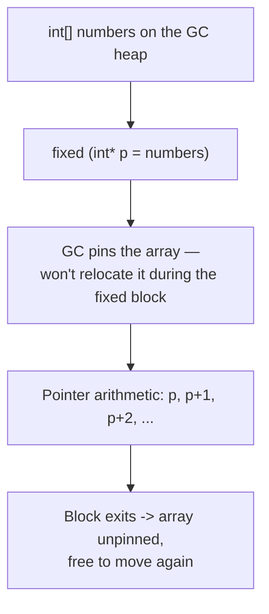
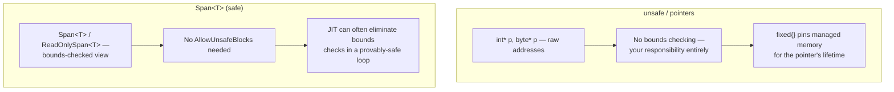

# Unsafe Code and Pointers

## Introduction

Before reading this lesson, you should already be comfortable with **[Publishing a Native AOT Application](../13-reflection-sourcegen-lowlevel/13-08-publishing-native-aot-app.md)**. That lesson was about trading runtime flexibility for compile-time guarantees; this lesson trades something different — the runtime's own memory-safety guarantees — for direct, raw access to memory addresses, through the `unsafe` keyword and pointer types. It's the lowest-level feature this entire curriculum touches, and, fittingly, one of the rarest to actually need in ordinary business C#.

By the end of this lesson, you will be able to:

- Explain what the `unsafe` keyword and pointer types add on top of ordinary managed C#
- Declare and dereference a pointer (`int*`, `byte*`) inside an unsafe context
- Explain why the `fixed` statement is required before taking a pointer into managed memory, and what "pinning" prevents
- Enable unsafe code for a project with `<AllowUnsafeBlocks>` and explain why it's opt-in rather than default
- Identify the realistic reasons to reach for unsafe code — native interop, extreme performance-critical loops — versus why it stays rare in typical business logic
- Contrast raw pointer access with `Span<T>`, the safe alternative most high-performance C# code should reach for first

## Unsafe Code and Pointers — A Layman's Perspective

Picture how an ordinary bank customer interacts with their own money. You never walk into the vault yourself. You fill out a request slip — "withdraw $200 from account 4471" — and a teller fetches it for you. Behind the scenes, the bank is free to reorganize its vault however it likes: consolidate cash drawers, move reserves between branches overnight, repack shelves for a security audit — and none of it ever affects you, because you never dealt with a physical shelf and slot number in the first place. You only ever dealt with a request slip, and the bank guaranteed the slip would always resolve correctly, no matter how the vault's internals shifted around underneath it.

Now picture the bank's own internal auditor, who occasionally needs something a request slip can't express: physically standing at a specific shelf, at a specific slot number, to reconcile the exact physical contents against the ledger, or to move a heavy pallet directly without repackaging it through the ordinary teller counter. That requires unlocking a separate, direct-access door into the vault — one an ordinary customer is never handed a key to. And critically, the moment that auditor is standing there, pointing at slot 14 on shelf B, the vault manager cannot reorganize *that* shelf until the auditor steps back out — because if the shelf's contents shifted while a finger was still pointing at slot 14, that finger might now be pointing at nothing, or worse, at someone else's cash entirely.

This direct-access door is powerful, but it comes with real risk that request slips never carried: point at the wrong slot, and there's no automatic check stopping you from reading, or corrupting, something that was never yours to touch. That's exactly why the door is normally welded shut. A bank has to explicitly authorize its existence at all, and even then hands the key to only a narrow set of specialists, for narrow reasons — reconciling against a decades-old physical vault system that only understands raw slot numbers, or shaving real time off a process repeated millions of times a day, where every request-slip round trip has been measured to actually matter. For the ordinary business of deposits, withdrawals, and transfers, nobody ever needs that door; the request-slip system already does everything the job requires, safely, by design.

Unsafe code and pointers are C#'s version of that direct-access vault door: opt-in, deliberately narrow, and reserved for native interop and extreme performance-critical code — not for the everyday banking logic sitting one layer above it.

## Unsafe Code and Pointers — A Programming Language Perspective

The `unsafe` keyword marks a context — a method, a block, or a type — where pointer types (`T*` for an unmanaged `T`, such as `int*` or `byte*`) become legal C# syntax. A project must additionally set `<AllowUnsafeBlocks>true</AllowUnsafeBlocks>` (or pass the `/unsafe` compiler flag), or any `unsafe` context fails to compile at all — the feature is opt-in at the project level, not merely at the syntax level. Inside an unsafe context, `*ptr` dereferences a pointer, `&variable` takes the address of a variable, and pointer arithmetic (`ptr + 1`) advances by `sizeof(T)` bytes rather than by one raw byte. Because ordinary objects and arrays live on the garbage-collected heap and can be *relocated* by a compacting collection, taking a raw pointer directly into one requires the `fixed` statement, which pins the target for the duration of the `fixed` block — instructing the GC not to move that specific object while a pointer into it is in use — and automatically unpins it the instant the block ends. Memory allocated with `stackalloc`, covered next, lives on the thread stack rather than the GC heap, so pointers into it never require `fixed` at all, since nothing is ever relocating stack memory out from under them.

## How to Use unsafe Code and Pointers in C#

A pointer into a managed array must be taken inside a `fixed` block, which pins the array for exactly as long as the block is in scope; outside that scope, the array is free to move on the next garbage collection, same as any other managed object.


*Figure 1: `fixed` pins managed memory only for as long as raw pointer arithmetic needs it, then releases the GC's hands immediately.*

This project must enable unsafe code before any of the following will compile:

```xml
<!-- .csproj -->
<PropertyGroup>
  <AllowUnsafeBlocks>true</AllowUnsafeBlocks>
</PropertyGroup>
```

```csharp
// Program.cs — .NET 10 / C# 14
int[] numbers = [10, 20, 30, 40, 50];

unsafe
{
    fixed (int* firstElement = numbers)
    {
        int* current = firstElement;
        for (int i = 0; i < numbers.Length; i++)
        {
            Console.WriteLine($"numbers[{i}] = {*current} (offset {i * sizeof(int)} bytes)");
            current++;
        }
    }
}
```

**Console Output:**

```text
numbers[0] = 10 (offset 0 bytes)
numbers[1] = 20 (offset 4 bytes)
numbers[2] = 30 (offset 8 bytes)
numbers[3] = 40 (offset 12 bytes)
numbers[4] = 50 (offset 16 bytes)
```

`fixed (int* firstElement = numbers)` is what makes taking a pointer into `numbers` legal at all — without it, the compiler refuses, because a compacting garbage collection could move `numbers` to a new address between one pointer read and the next, silently invalidating `firstElement`. Pinning guarantees the array's address stays put for exactly as long as this block's pointer arithmetic needs it; the moment the block ends, `numbers` is free to be relocated on the next collection, with no lingering restriction left behind.

## Real-Time Example: An Unsafe Checksum Scan in Banking/ATM Transaction Reconciliation

We extend the Banking/ATM domain with a nightly reconciliation job that receives a packed binary batch of transaction records from an upstream mainframe feed — each record a fixed 8 bytes: a 4-byte account ID followed by a 4-byte amount in cents. Before parsing anything, the job computes a fast XOR checksum across the raw bytes to confirm the batch wasn't corrupted in transit. Run over potentially millions of bytes every night, this is exactly the kind of measured, extreme-performance case unsafe pointer arithmetic exists for — skipping per-byte bounds checks and method-call overhead that would otherwise be paid millions of times over.

```csharp
// Program.cs — .NET 10 / C# 14 — Real-Time Example (Banking/ATM)
using System.Globalization;

byte[] transactionBatch = BuildSampleBatch();

byte checksum = ComputeChecksumUnsafe(transactionBatch);
int recordCount = transactionBatch.Length / 8;

Console.WriteLine($"Batch size: {transactionBatch.Length} bytes");
Console.WriteLine($"XOR checksum: 0x{checksum:X2}");
Console.WriteLine($"Records in batch: {recordCount}");

unsafe
{
    fixed (byte* basePtr = transactionBatch)
    {
        for (int i = 0; i < recordCount; i++)
        {
            int* recordPtr = (int*)(basePtr + (i * 8));
            int accountId = recordPtr[0];
            decimal amount = recordPtr[1] / 100m;
            Console.WriteLine($"Record {i}: Account {accountId}, Amount {Usd(amount)}");
        }
    }
}

static unsafe byte ComputeChecksumUnsafe(byte[] data)
{
    byte checksum = 0;
    fixed (byte* basePtr = data)
    {
        byte* current = basePtr;
        for (int i = 0; i < data.Length; i++)
        {
            checksum ^= *current;
            current++;
        }
    }

    return checksum;
}

static byte[] BuildSampleBatch()
{
    // Two 8-byte records: 4-byte account id + 4-byte amount-in-cents, little-endian.
    byte[] buffer = new byte[16];
    BitConverter.GetBytes(1001).CopyTo(buffer, 0);
    BitConverter.GetBytes(45000).CopyTo(buffer, 4);  // $450.00
    BitConverter.GetBytes(1002).CopyTo(buffer, 8);
    BitConverter.GetBytes(12599).CopyTo(buffer, 12); // $125.99
    return buffer;
}

static string Usd(decimal amount) => amount.ToString("C", CultureInfo.GetCultureInfo("en-US"));
```

**Console Output:**

```text
Batch size: 16 bytes
XOR checksum: 0x62
Records in batch: 2
Record 0: Account 1001, Amount $450.00
Record 1: Account 1002, Amount $125.99
```

Both `fixed` blocks pin `transactionBatch` only for exactly as long as pointer arithmetic touches it; outside them, the array is fully manageable again, same as any other array. `ComputeChecksumUnsafe` walks every byte with no bounds check and no method-call overhead per byte — the entire reason to reach for this over a normal `foreach` loop, and a saving only worth taking once profiling (Module 12) shows it actually matters for a batch this size, run this often. Everywhere else in this reconciliation job — parsing the amount, formatting it, deciding what to log — ordinary managed C# remains exactly the right tool.

## Unsafe Pointers vs. Span\<T\>

Raw pointers and `Span<T>` can express many of the same low-level operations — walking through contiguous memory, reading and writing at an offset — but they sit at opposite ends of the safety spectrum. `Span<T>`, covered in Module 08, is bounds-checked, requires no `AllowUnsafeBlocks` opt-in, and the JIT is frequently able to eliminate its bounds checks entirely inside a tight loop once it can prove the loop stays within range — meaning most of the raw performance unsafe pointers offer is already available safely. Reaching past `Span<T>` for actual pointers is justified only in the narrower cases `Span<T>` genuinely cannot cover: calling into native APIs that expect a real pointer, or code so extremely hot that even `Span<T>`'s residual overhead has been measured to matter.


*Figure 2: `Span<T>` covers nearly every case that once required raw pointers; unsafe pointers remain for the narrow slice `Span<T>` genuinely can't reach.*

| Aspect | Unsafe Pointers | `Span<T>` |
|---|---|---|
| Bounds checking | None — entirely your responsibility | Enforced automatically |
| Requires project opt-in | Yes (`<AllowUnsafeBlocks>`) | No |
| Needs `fixed` to touch managed memory | Yes | No — handles pinning internally |
| Typical use case | Native interop, extreme low-level performance | Nearly all high-performance managed code |
| How common in business logic | Rare — a narrow, deliberate exception | Common wherever allocation-free slicing helps |

## Types of Unsafe and Pointer-Related Concepts

Pointers connect to interop and to this module's remaining low-level lessons:

1. **[Span\<T\> and Memory\<T\>](../08-memory-management/08-06-span-t-and-memory-t.md)** — the safe, bounds-checked alternative that covers the large majority of cases raw pointers used to be needed for.
2. **[stackalloc and Stack-Allocated Memory](../13-reflection-sourcegen-lowlevel/13-10-stackalloc-and-stack-memory.md)** — covered next, a stack-only allocation that pairs naturally with pointers without ever needing `fixed`.
3. **[P/Invoke and Native Interop](../13-reflection-sourcegen-lowlevel/13-11-pinvoke-and-native-interop.md)** — the most common legitimate reason to reach for pointers at all: calling into native libraries that expect them.
4. **[Span\<T\>/Memory\<T\> Performance Deep-Dive](../12-advanced-concepts/12-32-span-memory-performance-deep-dive.md)** — benchmarked evidence for when the extra risk of raw pointers is, and isn't, worth it over `Span<T>`.
5. **[Boxing and Unboxing](../08-memory-management/08-07-boxing-and-unboxing.md)** — another low-level memory-layout topic pointers make directly visible, which ordinary managed code normally hides entirely.
6. **Fixed-size buffers** (`fixed` field declarations inside a `struct`) — a related, narrower unsafe feature for embedding an inline buffer directly inside a value type.

## What You've Learned & What's Next

The `unsafe` keyword and pointer types (`int*`, `byte*`) give C# direct, unchecked access to raw memory addresses, gated behind an explicit `<AllowUnsafeBlocks>` project opt-in and, for managed memory, the `fixed` statement, which pins an object against garbage-collector relocation for exactly as long as a pointer into it is in use. This power is real, but it's reserved for native interop and profiling-justified, extreme performance-critical code — everywhere else in ordinary business logic, `Span<T>` already delivers nearly all the same performance with none of the risk.

Continue your learning journey with **[stackalloc and Stack-Allocated Memory](../13-reflection-sourcegen-lowlevel/13-10-stackalloc-and-stack-memory.md)**, where we look at a stack-only allocation technique that pairs directly with `Span<T>` — no `unsafe`, no `fixed`, and no garbage collector involvement at all.

---
*Applies to: .NET 10 / C# 14. Last reviewed 2026-08-16.*
