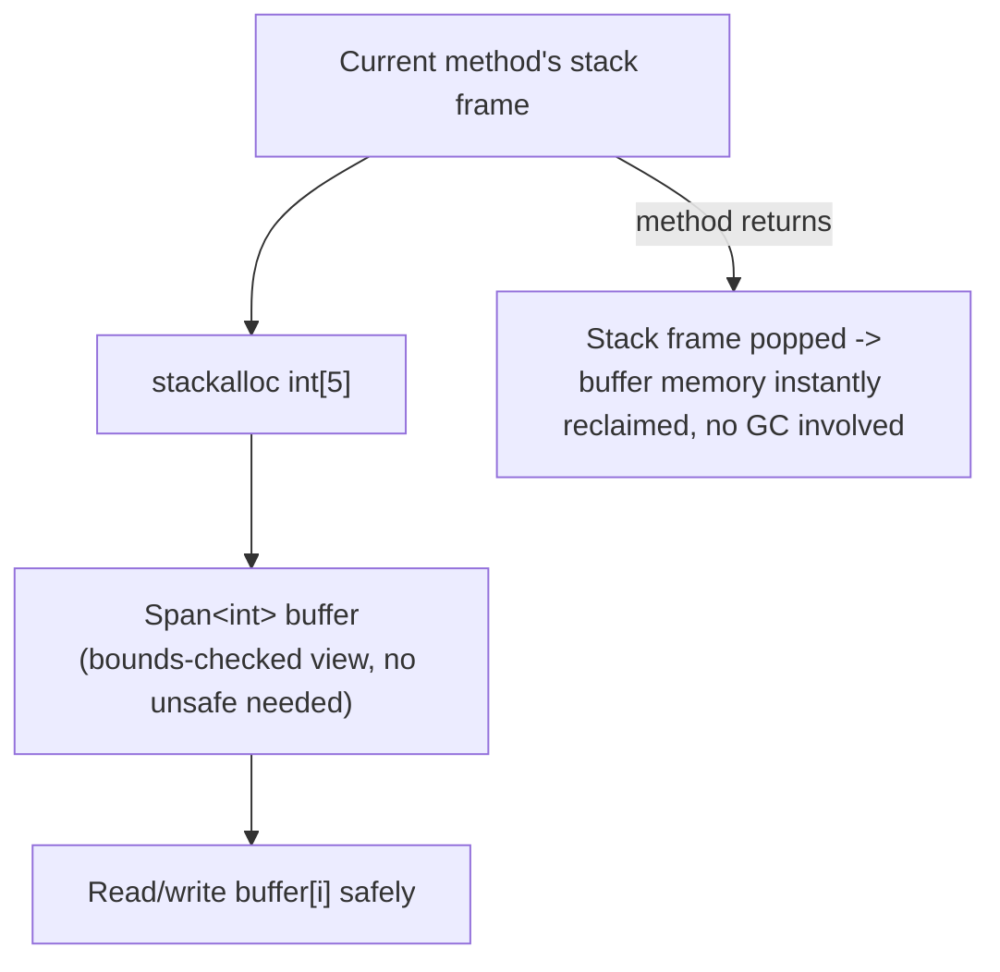
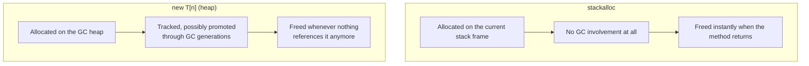

# stackalloc and Stack-Allocated Memory

## Introduction

Before reading this lesson, you should already be comfortable with **[Unsafe Code and Pointers](../13-reflection-sourcegen-lowlevel/13-09-unsafe-code-and-pointers.md)**, including why the `fixed` statement exists at all: managed memory can be relocated by the garbage collector, so a raw pointer into it needs to be pinned first. This lesson introduces a second kind of low-level memory that sidesteps that whole problem in a different way — `stackalloc`, which allocates directly on the stack, where the garbage collector never has any business relocating anything in the first place, and which — paired with `Span<T>` — needs no `unsafe` keyword at all.

By the end of this lesson, you will be able to:

- Explain what `stackalloc` allocates and how that differs from a heap allocation via `new`
- Allocate a `stackalloc` buffer and wrap it in a `Span<T>` without writing any `unsafe` code
- Explain why stack-allocated memory needs no garbage collector involvement and is freed automatically when its scope exits
- Recognize the stack's size limit and the real risk of an uncatchable `StackOverflowException` from an oversized `stackalloc`
- Decide when to guard a `stackalloc` size at run time, and when to fall back to the heap instead
- Contrast a `stackalloc` + `Span<T>` solution with the raw-pointer version from the previous lesson

## stackalloc — A Layman's Perspective

Picture your own desk at work, with one small built-in drawer. That drawer is always right there — no request form to fill out, no trip to a shared stockroom, no clerk to hand you a shelf assignment. You open it, use it for whatever scratch paper or supplies you need during today's task, and the moment you get up and leave your desk for good, the drawer is simply empty again, ready for whoever sits there next. Nobody had to remember to clean it out. Nobody in a separate stockroom had to track that it was ever in use at all.

Compare that to the building's shared warehouse down the hall — vast, flexible, able to hold vastly more than any one desk drawer ever could, but only because an entire separate system exists to track what's stored there, who requested it, and when it's finally safe to reclaim the space. That warehouse is what the garbage-collected heap is for every ordinary `new` allocation in this curriculum so far: enormously more capable, but only because a whole tracking system stands behind it.

The catch with your desk drawer is size. It's built into a standard desk, so it's genuinely small — fine for a notepad and a few pens, hopeless for a pallet of files. Try to force a pallet's worth of paperwork into a drawer sized for a notepad, and it either simply won't fit, or, pushed hard enough, it warps the drawer track so badly the whole desk becomes unusable. A warehouse shelf never has that particular failure mode; it just asks the shared tracking system for more room.

Recall, from Module 08, the reading frame you'd hold up over a library book's pages to look at exactly the range you needed, without copying anything — that was `Span<T>`. The exact same reading frame works just as well held over your desk drawer's contents as it did over the library book's pages: it's still just a bounds-checked window onto memory, indifferent to whether that memory happens to live in a drawer or on a shelf. Reaching directly into the drawer with bare hands instead — the raw-pointer approach from the previous lesson — works too, but only the reading frame keeps you from ever reaching past the drawer's actual edge by mistake.

`stackalloc` is that desk drawer: a small, scratch buffer that lives directly on the current method's own stack frame, needs no request to any shared tracking system, and vanishes automatically the moment you leave that frame behind. And exactly like a real desk, sizing it too large — or, worse, opening drawer after drawer without ever leaving your desk, the way deep, unbounded recursion does — risks collapsing the whole thing: a stack overflow.

## stackalloc — A Programming Language Perspective

`stackalloc <type>[<n>]` allocates `n` contiguous elements of an unmanaged type directly on the current method's stack frame, rather than on the garbage-collected heap. That memory is reclaimed automatically the instant the stack frame is popped — when the method returns — with zero garbage collector involvement: nothing is tracked, nothing is promoted through a GC generation, nothing is ever collected, because it was never the GC's memory to begin with. Historically, `stackalloc` could only be assigned to a pointer type inside an `unsafe` context. Since C# 7.2, it can instead be assigned directly to a `Span<T>` or `ReadOnlySpan<T>` in ordinary safe code, since `Span<T>` already provides the exact bounds-checked safety net Module 08 introduced for arrays and strings — now simply pointed at stack memory instead of heap memory. Because it is real stack memory, its size is bounded by the thread's stack size (commonly around 1 MB by default for a typical thread), and unlike a heap array — which fails with an ordinary, catchable `OutOfMemoryException` if genuinely too large — exceeding available stack space throws a `StackOverflowException`, which, unlike nearly every other .NET exception, cannot be caught; it terminates the process immediately.

## How to Use stackalloc with Span\<T\> in C#

Assigning a `stackalloc` expression directly to a `Span<T>` variable requires no `unsafe` keyword and no `AllowUnsafeBlocks` project setting at all — the compiler already knows `Span<T>` enforces the same safety guarantees an ordinary array would.


*Figure 1: `stackalloc` memory is freed the instant its stack frame is popped — there is no GC step to wait for.*

```csharp
// Program.cs — .NET 10 / C# 14
Span<int> buffer = stackalloc int[5];

for (int i = 0; i < buffer.Length; i++)
{
    buffer[i] = (i + 1) * 10;
}

int sum = 0;
foreach (int value in buffer)
{
    sum += value;
}

Console.WriteLine($"Buffer: [{string.Join(", ", buffer.ToArray())}]");
Console.WriteLine($"Sum: {sum}");

const int MaxSafeStackallocInts = 1024; // A conservative, self-imposed guard.
int requestedSize = 2000;

if (requestedSize > MaxSafeStackallocInts)
{
    Console.WriteLine(
        $"Requested size {requestedSize} exceeds the safe stackalloc limit of {MaxSafeStackallocInts}; falling back to the heap.");
    int[] heapBuffer = new int[requestedSize];
    Console.WriteLine($"Heap buffer allocated: {heapBuffer.Length} ints.");
}
```

**Console Output:**

```text
Buffer: [10, 20, 30, 40, 50]
Sum: 150
Requested size 2000 exceeds the safe stackalloc limit of 1024; falling back to the heap.
Heap buffer allocated: 2000 ints.
```

Nothing here required the `unsafe` keyword — `Span<int> buffer` wraps the `stackalloc`'d memory with the same bounds-checked safety net Module 08 introduced for arrays, just pointed at stack memory instead of heap memory this time. The moment this method returns, that stack frame is popped and `buffer`'s memory is gone — no `Dispose`, no GC generation, nothing left to track. The guard check before the second allocation is deliberate: real code should never pass an unbounded or user-supplied size straight into `stackalloc`, since exceeding the stack's capacity throws a `StackOverflowException` that terminates the process immediately, with no way to catch or recover from it.

## Real-Time Example: A Safe Overdraft Guard in Banking/ATM Session Validation

We revisit the Banking/ATM domain's transaction-batch scanning from the previous lesson, but for a different, smaller-scale need: validating one ATM session's pending transactions against a starting balance before committing any of them, ensuring the balance never goes negative partway through. A single ATM session is always small and bounded — a handful of withdrawals and deposits at most — making it a natural fit for a small, short-lived `stackalloc` buffer, with none of the previous lesson's pointer arithmetic required.

```csharp
// Program.cs — .NET 10 / C# 14 — Real-Time Example (Banking/ATM)
decimal startingBalance = 500.00m;
decimal[] pendingTransactions = [-150.00m, 300.00m, -700.00m, 50.00m];

bool approved = TryValidateSession(startingBalance, pendingTransactions, out decimal finalBalance, out int failedAtIndex);

if (approved)
{
    Console.WriteLine($"Session approved. Final balance: {finalBalance:C}");
}
else
{
    Console.WriteLine($"Session REJECTED at transaction {failedAtIndex}: balance would go negative.");
}

static bool TryValidateSession(
    decimal startingBalance,
    ReadOnlySpan<decimal> transactions,
    out decimal finalBalance,
    out int failedAtIndex)
{
    const int MaxTransactionsPerSession = 8;

    if (transactions.Length > MaxTransactionsPerSession)
    {
        throw new ArgumentException($"A single ATM session cannot exceed {MaxTransactionsPerSession} transactions.");
    }

    // Stack-allocated running-balance buffer — small, bounded, and gone the instant
    // this method returns. No heap allocation, no GC involvement, no unsafe keyword.
    Span<decimal> runningBalances = stackalloc decimal[MaxTransactionsPerSession];

    decimal balance = startingBalance;
    for (int i = 0; i < transactions.Length; i++)
    {
        balance += transactions[i];
        runningBalances[i] = balance;

        if (balance < 0)
        {
            finalBalance = balance;
            failedAtIndex = i;
            return false;
        }
    }

    finalBalance = balance;
    failedAtIndex = -1;
    return true;
}
```

**Console Output:**

```text
Session REJECTED at transaction 2: balance would go negative.
```

The `-150.00, +300.00, -700.00, +50.00` sequence leaves the balance at `$650.00` after the second transaction, then drops it to `-$50.00` on the third — caught immediately by the guard, before the fourth transaction is even inspected. This solves the same "small, short-lived scratch buffer" need as the previous lesson's checksum scan, but with a completely safe `Span<decimal>` rather than a raw pointer, because validating one session's running balance never needed pointer arithmetic or native interop — only a temporary buffer that doesn't outlive the method call. The `transactions.Length > MaxTransactionsPerSession` guard is what keeps this pattern safe from a stack overflow: no caller can ever request a buffer larger than the fixed size this method was written to allocate.

## stackalloc vs. new T[] (Heap Allocation)

`stackalloc` and an ordinary heap array both produce contiguous, indexable memory, but they differ in exactly where that memory lives and who is responsible for reclaiming it. Stack memory belongs entirely to the current call frame and disappears the instant that frame is popped, with the garbage collector never involved at all. Heap memory is tracked by the GC for as long as something still references it, which is far more flexible — and far more expensive to allocate and eventually collect — than a stack frame that simply unwinds.


*Figure 2: Stack memory is reclaimed by the call frame unwinding; heap memory is reclaimed by the garbage collector, whenever it decides to run.*

| Aspect | `stackalloc` | `new T[n]` (heap) |
|---|---|---|
| Where it lives | Current method's stack frame | GC heap |
| Lifetime | Freed automatically when the method returns | Freed whenever the GC decides nothing references it |
| GC involvement | None | Tracked, possibly promoted through generations |
| Typical size limit | Small — bounded by thread stack size (often ~1 MB total) | Bounded only by available memory |
| Failure mode when too large | `StackOverflowException` — uncatchable, terminates the process | `OutOfMemoryException` — a normal, catchable exception |
| Safe wrapper | `Span<T>` / `ReadOnlySpan<T>` (no `unsafe` needed since C# 7.2) | An array reference, or a `Span<T>` over it |

## Types of stackalloc and Stack-Memory Concepts

Stack-allocated memory connects directly back to Module 08's foundations and forward to native interop:

1. **[Span\<T\> and Memory\<T\>](../08-memory-management/08-06-span-t-and-memory-t.md)** — the safe wrapper this lesson's `stackalloc` buffers were held in throughout, revisited from Module 08.
2. **[Unsafe Code and Pointers](../13-reflection-sourcegen-lowlevel/13-09-unsafe-code-and-pointers.md)** — the previous lesson's raw-pointer approach to the same kind of scratch-buffer problem, contrasted here.
3. **[P/Invoke and Native Interop](../13-reflection-sourcegen-lowlevel/13-11-pinvoke-and-native-interop.md)** — covered next, where stack-allocated buffers are frequently used to marshal small buffers to and from native calls.
4. **`ArrayPool<T>`** — a pooled-heap alternative for buffers too large for `stackalloc` but still too "hot" in a loop to allocate fresh from the heap every time.
5. **[Garbage Collection Generations](../08-memory-management/08-03-garbage-collection-generations.md)** — the heap-side lifecycle `stackalloc` sidesteps entirely.
6. **[Stack vs Heap](../08-memory-management/08-02-stack-vs-heap.md)** — the foundational distinction this entire lesson has been a deep, practical extension of.

## What You've Learned & What's Next

`stackalloc` allocates a small, contiguous buffer directly on the current stack frame, reclaimed automatically the instant that frame is popped, with zero garbage collector involvement — and wrapping it in `Span<T>` gets you all of that with no `unsafe` keyword required at all. That convenience comes with a real limit: the stack itself is small, and an oversized or unbounded `stackalloc` risks an uncatchable `StackOverflowException`, which is exactly why real code guards its size before allocating rather than trusting a caller-supplied value directly.

Continue your learning journey with **[P/Invoke and Native Interop](../13-reflection-sourcegen-lowlevel/13-11-pinvoke-and-native-interop.md)**, where stack-allocated buffers and the raw pointers from two lessons ago come together for real — calling into native, non-.NET libraries directly from C#.

---
*Applies to: .NET 10 / C# 14. Last reviewed 2026-08-16.*
