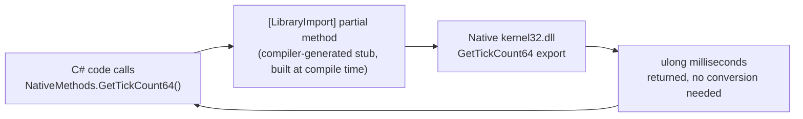
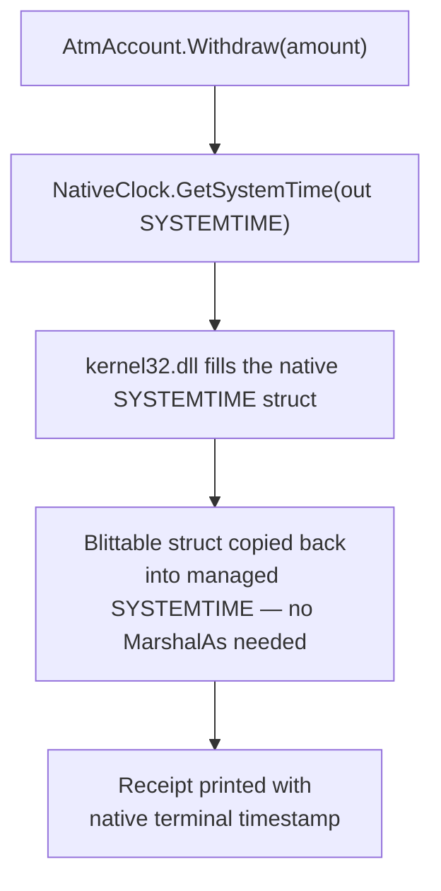
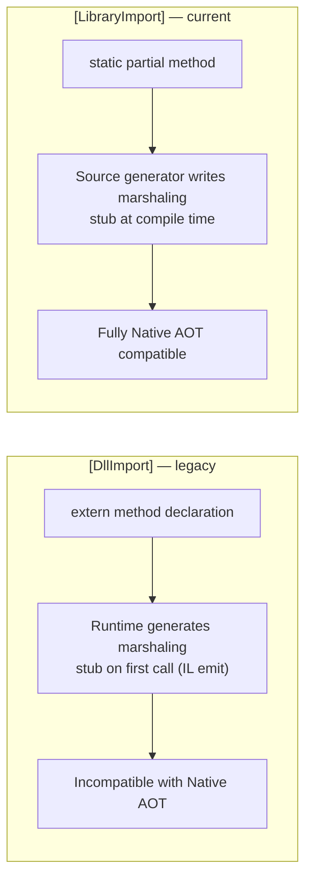

# P/Invoke and Native Interop

## Introduction

Before reading this lesson, you should already be comfortable with **[stackalloc and Stack-Allocated Memory](../13-reflection-sourcegen-lowlevel/13-10-stackalloc-and-stack-memory.md)**, including the idea that C# can reach down below the managed heap and work with raw memory directly. This lesson takes that same "below the usual abstraction" theme one level further: sometimes the code you need to call isn't C# at all — it's a native library written in C, C++, or exposed directly by the operating system, with no .NET wrapper in sight. **Platform Invoke**, universally called **P/Invoke**, is the mechanism that lets managed C# code call into that unmanaged, native world, and back.

By the end of this lesson, you will be able to:

- Explain what P/Invoke is and why C# needs a dedicated mechanism to call native libraries
- Declare a native function signature with the modern, source-generated `[LibraryImport]` attribute
- Explain why `[LibraryImport]` is now preferred over the older `[DllImport]` attribute, especially for Native AOT
- Explain the basics of marshaling — how a native type like a fixed-size struct or a raw pointer is converted to and from a managed type
- Call a real native OS function from C# and correctly interpret its result

## P/Invoke and Native Interop — A Layman's Perspective

Imagine your company's finance department, which speaks fluent English and keeps every record in a very particular internal spreadsheet format, needs to place an order with a supplier overseas who only speaks Japanese and only accepts orders on a specific paper form with fields in a fixed physical layout — this many characters for the item code, this many digits for the quantity, in this exact order, no more, no less. Your finance department cannot simply photocopy its own spreadsheet and mail it over; the supplier's intake clerk wouldn't recognize a single field on it. What actually happens is a translator sits between the two: they take the values out of the English spreadsheet, convert them into the exact Japanese paper form's rigid layout — the right field, the right width, the right encoding — and hand that form to the supplier. When the supplier's confirmation comes back, on their own rigid form, the same translator reads it and converts it back into values the finance department's spreadsheet understands.

That translator's job has two distinct parts, and both matter. The first part is simply knowing *which* form to send the order to — which supplier, which department, which mail slot the paper goes into. The second, more delicate part is making sure every single field is converted correctly on the way there and the way back: a quantity that's a plain number in the English spreadsheet has to become an exact fixed-width digit string on the Japanese form, and a date has to be reformatted, not just recopied, because the two systems don't represent the same idea of "a number" or "a date" the same way underneath.

P/Invoke is exactly this translator, sitting between your C# code and a native library. The native library — often written in C, sometimes decades old, frequently part of the operating system itself — has its own rigid idea of what a function's inputs and outputs look like: raw bytes, fixed-size numbers, pointers to blocks of memory, none of which look anything like a C# `string` or `List<T>` under the hood. When you declare a native function's signature in C# and call it, something has to sit between your managed call and that native function, converting every single argument from C#'s internal representation into exactly the bytes the native function expects, and converting the native return value back into something C# can use. That conversion step is called **marshaling**, and it is not optional cosmetic detail — get a single field's size or layout wrong, and the native side either misreads the data outright or, in the worst case, corrupts memory it was never given permission to touch.

For decades, C# handled this translation with an attribute called `[DllImport]`, which works by generating the marshaling logic at runtime, the very first time each native function is called. Recent C# versions introduced `[LibraryImport]`, which does that same translation job but writes the marshaling code out as an ordinary, inspectable piece of C# at *compile time* instead — faster, and, critically, compatible with Native AOT, which cannot run the runtime code-generation `[DllImport]` quietly relies on. That shift — from a translator improvising on the spot to a translator who wrote out the exact script in advance — is this lesson's version of a pattern this entire module keeps returning to.

## P/Invoke and Native Interop — A Programming Language Perspective

**P/Invoke** (Platform Invoke) is .NET's mechanism for calling functions exported by unmanaged native libraries — a Windows DLL, a Linux `.so`, or a macOS `.dylib` — from managed C# code. You declare a `static partial` method whose signature mirrors the native function's, and mark it with `[LibraryImport("library-name")]`, from the `System.Runtime.InteropServices` namespace; the Roslyn source generator that ships with the .NET SDK sees that attribute at compile time and writes the other half of the `partial` method — the actual marshaling stub — directly into the compiled assembly. This is a direct successor to the older `[DllImport]` attribute, which achieves the same call but generates its marshaling stub with runtime IL emission the first time the method is invoked, an approach Native AOT's ahead-of-time, no-JIT compilation model cannot support. **Marshaling** is the general term for the conversion `[LibraryImport]` and `[DllImport]` perform on every parameter and return value: blittable types (`int`, `double`, and simple sequential-layout structs of blittable fields) require no conversion at all and are copied byte-for-byte, while non-blittable types like `string` or `bool` require an explicit conversion step to and from their native representation, governed by `[MarshalAs]` or a built-in default marshaller.

## How to Call a Native Function with LibraryImport

`[LibraryImport]` requires the calling method to be `static partial`, declared inside a `partial` type, so the source generator has somewhere to attach the generated half of the method. The example below calls `GetTickCount64`, a genuine Win32 API exported by `kernel32.dll` that returns the number of milliseconds since the machine last started — a `ulong` return value, which is blittable and needs no marshaling at all.


*Figure 1: A blittable return type like `ulong` passes straight through the generated stub with no conversion step.*

```csharp
// Program.cs — .NET 10 / C# 14
using System.Runtime.InteropServices;

ulong uptimeMs = NativeMethods.GetTickCount64();
Console.WriteLine($"System uptime: {TimeSpan.FromMilliseconds(uptimeMs)}");

internal static partial class NativeMethods
{
    [LibraryImport("kernel32.dll")]
    internal static partial ulong GetTickCount64();
}
```

**Console Output** *(the exact duration depends on how long the machine has been running — yours will differ)*:

```text
System uptime: 2.03:41:17.2680000
```

`GetTickCount64` is declared as `static partial`, matching exactly what `[LibraryImport]` requires; the source generator emits the other half of that partial method, containing the actual call into `kernel32.dll`. Because `ulong` is a blittable type — its in-memory layout is identical in managed and native code — no marshaling conversion happens at all here; the value is copied directly across the boundary. `TimeSpan.FromMilliseconds` then turns that raw millisecond count into the readable duration printed above.

## Real-Time Example: Reading the Native Clock for an ATM Withdrawal Receipt in Banking/ATM

We continue the Banking/ATM case study, extending the account-balance logic introduced alongside `AtmSessionContext` in Module 10's dependency-injection lesson. A real ATM's receipt printer stamps every transaction with the terminal's own hardware clock — not the application's `DateTime.UtcNow` — so that the paper receipt matches exactly what the terminal's internal audit log recorded. We simulate that by calling `GetSystemTime`, a Win32 API that fills in a native `SYSTEMTIME` struct — our first example of marshaling an actual struct, not just a primitive, across the P/Invoke boundary.


*Figure 2: `SYSTEMTIME`'s fields are all `ushort` — a blittable struct — so the whole struct marshals as a single memory copy, both ways.*

```csharp
// Program.cs — .NET 10 / C# 14 — Real-Time Example (Banking/ATM)
using System.Runtime.InteropServices;

var account = new AtmAccount("1001-A", balance: 542.10m);
const decimal withdrawal = 60.00m;

account.Withdraw(withdrawal);

NativeClock.GetSystemTime(out SYSTEMTIME utcNow);
string timestamp =
    $"{utcNow.Year:D4}-{utcNow.Month:D2}-{utcNow.Day:D2} {utcNow.Hour:D2}:{utcNow.Minute:D2}:{utcNow.Second:D2} UTC";

Console.WriteLine("---- ATM Receipt ----");
Console.WriteLine($"Account:          {account.AccountNumber}");
Console.WriteLine($"Withdrawn:        {withdrawal:C}");
Console.WriteLine($"New Balance:      {account.Balance:C}");
Console.WriteLine($"Terminal Clock:   {timestamp}");

class AtmAccount(string accountNumber, decimal balance)
{
    public string AccountNumber { get; } = accountNumber;
    public decimal Balance { get; private set; } = balance;

    public void Withdraw(decimal amount)
    {
        if (amount > Balance)
        {
            throw new InvalidOperationException("Insufficient funds.");
        }

        Balance -= amount;
    }
}

[StructLayout(LayoutKind.Sequential)]
internal struct SYSTEMTIME
{
    public ushort Year, Month, DayOfWeek, Day, Hour, Minute, Second, Milliseconds;
}

internal static partial class NativeClock
{
    [LibraryImport("kernel32.dll")]
    internal static partial void GetSystemTime(out SYSTEMTIME lpSystemTime);
}
```

**Console Output** *(the terminal clock reflects the current UTC time at the moment the program runs — yours will differ)*:

```text
---- ATM Receipt ----
Account:          1001-A
Withdrawn:        $60.00
New Balance:      $482.10
Terminal Clock:   2026-08-16 09:14:52 UTC
```

`SYSTEMTIME` is marked `[StructLayout(LayoutKind.Sequential)]`, forcing its eight `ushort` fields to occupy memory in exactly the order declared, with no compiler-inserted reordering — matching the native struct's layout field-for-field. Because every field is a blittable `ushort`, the entire struct marshals as one contiguous memory copy, with `out SYSTEMTIME lpSystemTime` receiving that copy directly; no per-field conversion logic runs at all. In a real ATM, this same pattern — calling into a vendor's native driver DLL instead of `kernel32.dll` — is exactly how the application layer talks to the physical cash dispenser, card reader, and receipt printer hardware underneath it.

## [DllImport] vs [LibraryImport]

Both attributes solve the identical problem — declaring a native function's signature so C# can call it — and their syntax looks almost the same at a glance. The difference is entirely in *when* the marshaling code gets produced. `[DllImport]` marks an `extern` method with no body at all; at the moment that method is first called, the runtime generates the marshaling stub on the fly, using reflection-emit-style IL generation — work that Native AOT's ahead-of-time model has no opportunity to do, since there's no JIT present once the executable ships. `[LibraryImport]` marks a `static partial` method instead, and the Roslyn source generator writes the marshaling stub as ordinary, fully compiled C# at build time — visible to the trimmer, visible in a decompiler, and requiring nothing to happen at runtime that wasn't already baked into the assembly.


*Figure 3: `[DllImport]` defers marshaling-code generation to runtime; `[LibraryImport]` produces the same code ahead of time, at compile time.*

| Aspect | `[DllImport]` | `[LibraryImport]` |
|---|---|---|
| Method declaration | `static extern`, no body | `static partial`, generator fills the body |
| Marshaling code generated | At runtime, on first call | At compile time, by a source generator |
| Native AOT compatible | No — relies on runtime code generation | Yes — this is precisely why it was introduced |
| Introduced | Available since the earliest .NET Framework versions | C# 12 / .NET 7, now the recommended default |
| Inspectable generated code | No — hidden inside the runtime | Yes — visible as ordinary generated C# |

## Types of Native Interop in C#

1. **[stackalloc and Stack-Allocated Memory](../13-reflection-sourcegen-lowlevel/13-10-stackalloc-and-stack-memory.md)** — the stack buffers frequently passed by pointer into native calls like this lesson's.
2. **[Advanced Span<T>/Memory<T> Usage](../13-reflection-sourcegen-lowlevel/13-12-advanced-span-memory-usage.md)** — next lesson's `MemoryMarshal` techniques, often paired with native interop buffers.
3. **[JIT vs Native AOT Compilation](../12-advanced-concepts/12-33-jit-vs-native-aot.md)** — why `[LibraryImport]`'s compile-time marshaling specifically matters once an app is published as Native AOT.
4. **COM Interop** — an older, distinct interop model (`[ComImport]`, `[Guid]`) for calling into Component Object Model components, largely separate from the plain C-style APIs `[LibraryImport]` targets.
5. **Custom marshallers (`[MarshalUsing]`)** — hand-written marshaling logic for shapes `[LibraryImport]` cannot convert automatically, such as certain collection or union types.
6. **`unsafe` pointers and fixed buffers** — the raw-pointer techniques this module's low-level lessons use to build the buffers that interop code like this often marshals.

## What You've Learned & What's Next

P/Invoke lets managed C# call directly into native libraries, and `[LibraryImport]` — by generating its marshaling stub at compile time instead of runtime — is now the preferred, Native-AOT-compatible way to declare that boundary, with `[DllImport]` remaining only for legacy code or the rare shape `[LibraryImport]`'s generator can't yet handle. Marshaling itself is simply the conversion between managed and native memory layouts, free for blittable types like `ulong` and our `SYSTEMTIME` struct, and explicit for anything else.

Continue your learning journey with **[Advanced Span<T>/Memory<T> Usage](../13-reflection-sourcegen-lowlevel/13-12-advanced-span-memory-usage.md)**, where the `Span<T>`/`Memory<T>` foundation from Module 8 gets pushed further with `MemoryMarshal` and the C# 13 generic constraint relaxation that lets a `ref struct` participate in generic code for the first time.

---
*Applies to: .NET 10 / C# 14. Last reviewed 2026-08-16.*
