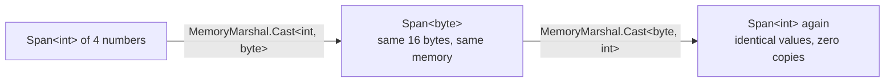
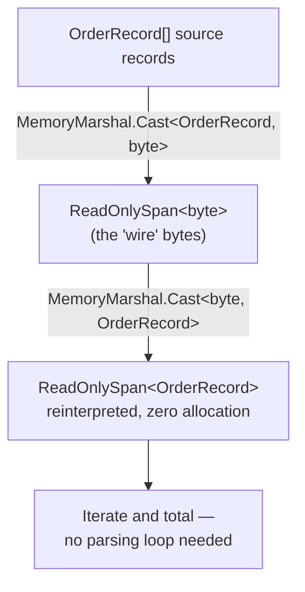
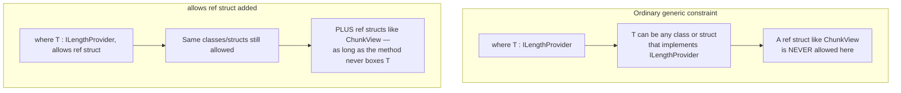

# Advanced Span<T>/Memory<T> Usage

## Introduction

Before reading this lesson, you should already be comfortable with **[P/Invoke and Native Interop](../13-reflection-sourcegen-lowlevel/13-11-pinvoke-and-native-interop.md)** and, further back, with `Span<T>` and `Memory<T>` themselves from Module 8's dedicated lesson. That lesson established `Span<T>` as a zero-allocation, stack-only view over contiguous memory. This lesson pushes that same idea harder: reinterpreting one shape of memory as another shape entirely with `MemoryMarshal`, understanding precisely why `Span<T>`'s `ref struct` nature has historically locked it out of ordinary generic code, and how C# 13's `allows ref struct` constraint finally opens that door.

By the end of this lesson, you will be able to:

- Use `MemoryMarshal.Cast` to reinterpret a span of one blittable type as a span of another, with zero copying
- Explain precisely why a `ref struct` cannot be boxed, cannot be a field of an ordinary class, and cannot cross an `await`
- Use the C# 13 `where T : allows ref struct` constraint to write a generic method that a `ref struct` type can satisfy
- Combine `Span<T>` slicing with `MemoryMarshal` reinterpretation to parse a binary buffer with zero allocations

## Advanced Span<T>/Memory<T> Usage — A Layman's Perspective

Recall the viewing frame from Module 8's lesson — a lightweight cardboard window held over a page, letting a researcher read exactly the section they need without ever photocopying anything. This lesson introduces a second trick the same reading room offers: a frame that doesn't just show you a range of pages, but lets you read the *exact same physical page* two different ways, depending on how you hold the frame against it. Hold a wide, short frame over a strip of the page and you see it as one long line of tiny print. Hold a narrower, taller frame over that identical strip of paper and, because the ink happens to be arranged in a grid, you instead read it as several stacked rows of larger characters. Nothing on the page moved. Not one letter was rewritten. Only the shape of the frame — and therefore how the same ink gets grouped and read — changed.

That's what `MemoryMarshal` does to memory that's already sitting there: it lets you look at a block of bytes as a sequence of 32-bit numbers instead, or a sequence of small structured records instead, without copying a single byte anywhere. The bytes were always capable of being read that way; `MemoryMarshal` just supplies the differently shaped frame.

Now, about that cardboard frame's own strange rule: it's not just tied to one desk in one reading room, as the earlier lesson mentioned — it's tied to being held *in someone's hands, right now, in person*. It cannot be sealed in an envelope and left in a filing cabinet drawer for later, because a frame sitting alone in a drawer, disconnected from a person's grip at this exact moment, isn't doing anything a frame is supposed to do — it's just a flat, meaningless rectangle. That's why the reading room's librarian has always refused to let general-purpose delivery services handle the frame: those services are built to carry *things that make sense sitting in a box, unattended, for a while* — letters, tickets, packages — and the frame simply isn't that kind of thing.

For years, that librarian's rule was absolute: no exceptions, full stop, for any delivery service, no matter how carefully it promised to handle the frame. Recently, though, the reading room introduced one very specific kind of courier — trained to move the frame only within arm's reach, only while someone is actively holding it, never setting it down in a box or a truck along the way — and for the first time, that one courier is allowed to carry the frame between two readers who need to hand it off mid-task. That new, narrowly trusted courier is this lesson's `allows ref struct`: a way for a general-purpose piece of code to say "I can carry this frame safely too, as long as I promise never to box it up and set it down somewhere it could go stale."

## Advanced Span<T>/Memory<T> Usage — A Programming Language Perspective

`System.Runtime.InteropServices.MemoryMarshal` provides static methods that reinterpret existing memory as a different type without copying: `MemoryMarshal.Cast<TFrom, TTo>(Span<TFrom>)` produces a `Span<TTo>` over the identical underlying bytes, valid only when both `TFrom` and `TTo` are unmanaged, blittable value types, and `MemoryMarshal.Read<T>`/`Write<T>` read or write a single blittable value directly from/to a `ReadOnlySpan<byte>` at its current position. Because `Span<T>` is a `readonly ref struct`, the runtime forbids boxing it, storing it as an instance field of a non-`ref struct` class, capturing it in a closure, or holding it across an `await` — every one of those operations could outlive the stack frame the span's underlying memory is only guaranteed valid for. Before C# 13, that same restriction extended to generics: a type parameter `T` could never be instantiated with a `ref struct` like `Span<int>`, because the compiler couldn't verify every generic code path respected the ref struct's stack-only lifetime. C# 13 introduces the `where T : allows ref struct` **anti-constraint**, which relaxes exactly that restriction for a specific type parameter, paired with a related C# 13 feature letting `ref struct` types implement interfaces — provided no interface member requires boxing the value.

## How to Reinterpret Memory with MemoryMarshal and allows ref struct

`MemoryMarshal.Cast` requires both type arguments to be unmanaged (no references inside them); attempting it on a type containing a reference, like `string`, fails to compile. The `allows ref struct` constraint, separately, only matters when a generic method's type parameter itself might be instantiated with a `ref struct`.


*Figure 1: Casting back and forth between `int` and `byte` views of the same span never copies a single byte — only the "shape" used to read it changes.*

```csharp
// Program.cs — .NET 10 / C# 14
using System.Runtime.InteropServices;

Span<int> numbers = [10, 20, 30, 40];

Span<byte> asBytes = MemoryMarshal.Cast<int, byte>(numbers);
Console.WriteLine($"Byte view length: {asBytes.Length} bytes for {numbers.Length} ints");

asBytes[0] = 99; // Mutating the byte view mutates the SAME memory the int view sees.
Console.WriteLine($"numbers[0] after byte-level edit: {numbers[0]}");

PrintLength(new TextBlock("hello world"));
PrintLength(new ChunkView("hi".AsSpan()));

static void PrintLength<T>(T item) where T : ILengthProvider, allows ref struct
{
    Console.WriteLine($"Length: {item.Length}");
}

interface ILengthProvider
{
    int Length { get; }
}

sealed class TextBlock(string text) : ILengthProvider
{
    public int Length { get; } = text.Length;
}

// A ref struct implementing an interface — allowed since C# 13, as long as no
// member requires boxing the value.
readonly ref struct ChunkView(ReadOnlySpan<char> data) : ILengthProvider
{
    private readonly ReadOnlySpan<char> _data = data;
    public int Length => _data.Length;
}
```

**Console Output:**

```text
Byte view length: 16 bytes for 4 ints
numbers[0] after byte-level edit: 99
Length: 11
Length: 2
```

`MemoryMarshal.Cast<int, byte>` produces a `Span<byte>` that is a different *view* of the exact same 16 bytes backing `numbers` — no array was copied, so writing `asBytes[0] = 99` (on a little-endian machine) changes `numbers[0]`'s low byte, and `numbers[0]` reads back as `99`. `PrintLength<T>` is declared `where T : ILengthProvider, allows ref struct` — without that constraint, passing the `ref struct ChunkView` as `T` would fail to compile at all, since ordinary generics have never permitted a `ref struct` type argument. `allows ref struct` doesn't force `T` to be a `ref struct`; it simply permits one, alongside ordinary reference types like `TextBlock`, in the same generic method.

## Real-Time Example: A Zero-Allocation Order Feed Parser in E-Commerce Order Processing

We extend the E-Commerce Order Processing domain with a compact binary order feed — a warehouse system streams fixed-width order records as raw bytes instead of JSON, to minimize bandwidth on a high-volume feed. Each record is a blittable `OrderRecord` struct; `MemoryMarshal.Cast` lets the receiving side reinterpret the incoming byte buffer directly as a span of `OrderRecord` values, with no per-record allocation or manual byte-offset arithmetic.


*Figure 2: The "wire" bytes and the reinterpreted records are the same memory throughout — only the type used to view it changes.*

```csharp
// Program.cs — .NET 10 / C# 14 — Real-Time Example (E-Commerce Order Processing)
using System.Runtime.InteropServices;

OrderRecord[] outgoing =
[
    new OrderRecord(OrderId: 88231, ProductId: 4021, Quantity: 2, UnitPriceCents: 3950),
    new OrderRecord(OrderId: 88232, ProductId: 4099, Quantity: 1, UnitPriceCents: 4500),
    new OrderRecord(OrderId: 88233, ProductId: 4021, Quantity: 5, UnitPriceCents: 3950)
];

// Simulate "the bytes that arrived over the wire" from the warehouse feed.
ReadOnlySpan<byte> wireBytes = MemoryMarshal.Cast<OrderRecord, byte>(outgoing);
Console.WriteLine($"Received {wireBytes.Length} raw bytes for {outgoing.Length} records.");

// Reinterpret those same bytes back into records — zero allocation, zero per-field parsing.
ReadOnlySpan<OrderRecord> received = MemoryMarshal.Cast<byte, OrderRecord>(wireBytes);

decimal batchTotal = 0m;
foreach (OrderRecord record in received)
{
    decimal lineTotal = record.Quantity * (record.UnitPriceCents / 100m);
    batchTotal += lineTotal;
    Console.WriteLine($"Order {record.OrderId}: product {record.ProductId} x{record.Quantity} = {lineTotal:C}");
}

Console.WriteLine($"Batch total: {batchTotal:C}");

[StructLayout(LayoutKind.Sequential)]
readonly record struct OrderRecord(int OrderId, int ProductId, int Quantity, int UnitPriceCents);
```

**Console Output:**

```text
Received 48 raw bytes for 3 records.
Order 88231: product 4021 x2 = $79.00
Order 88232: product 4099 x1 = $45.00
Order 88233: product 4021 x5 = $197.50
Batch total: $321.50
```

`OrderRecord` is a `readonly record struct` with four `int` fields and `[StructLayout(LayoutKind.Sequential)]`, making it 16 bytes and fully blittable — exactly the shape `MemoryMarshal.Cast` requires. Three records cast to 48 raw bytes (`3 × 16`), and casting those same 48 bytes straight back to `ReadOnlySpan<OrderRecord>` recovers the original three records with no parsing loop, no per-field offset math, and no intermediate allocation at all. A real warehouse feed handling thousands of records per second gets its entire deserialization step reduced to two `MemoryMarshal.Cast` calls, at the cost of committing to a fixed binary layout instead of a flexible, self-describing format like JSON.

## Generic Constraints: Ordinary vs allows ref struct

An ordinary generic constraint like `where T : ILengthProvider` narrows *which* types are acceptable, but every type C# has ever allowed there was implicitly guaranteed to be safely storable, boxable if needed, and usable across any code path — because `ref struct` types were categorically excluded from ever reaching a generic type parameter at all. `allows ref struct` doesn't narrow anything further; it widens the door, explicitly telling the compiler "this method promises never to box `T`, store it in a field, or do anything else a `ref struct` couldn't survive" — a promise the compiler then verifies at every use inside the method body.


*Figure 3: `allows ref struct` doesn't replace an existing constraint — it adds permission for a category of type that was previously impossible to pass at all.*

| Aspect | Ordinary constraint (`where T : I...`) | `where T : I..., allows ref struct` |
|---|---|---|
| Can `T` be a `ref struct` (e.g. `Span<int>`, `ChunkView`) | No — compile error if attempted | Yes |
| Can `T` be boxed inside the method body | Yes, if needed | No — the compiler forbids it |
| Can `T` be stored in a field or captured in a closure | Yes | No, when `T` is actually instantiated as a `ref struct` |
| Introduced | Available since generics (C# 2.0) | C# 13 |
| Typical motivation | Restrict `T` to types with certain members | Let high-performance `Span`-like types share generic algorithms with ordinary types |

## Types of Advanced Span/Memory Techniques in C#

1. **[Span<T> and Memory<T>](../08-memory-management/08-06-span-t-and-memory-t.md)** — the foundational lesson this one builds directly on.
2. **[Span<T>/Memory<T> Performance Deep-Dive](../12-advanced-concepts/12-32-span-memory-performance-deep-dive.md)** — benchmarked, measured evidence for the allocation savings techniques like this lesson's rely on.
3. **[stackalloc and Stack-Allocated Memory](../13-reflection-sourcegen-lowlevel/13-10-stackalloc-and-stack-memory.md)** — the stack-allocation prerequisite `Span<T>` is frequently paired with.
4. **[P/Invoke and Native Interop](../13-reflection-sourcegen-lowlevel/13-11-pinvoke-and-native-interop.md)** — where this lesson's `MemoryMarshal`-style reinterpretation frequently meets native buffers directly.
5. **`ref struct` interfaces (C# 13)** — the companion feature, used in this lesson's `ChunkView`, letting a `ref struct` implement an interface as long as no member requires boxing it.
6. **[Reflection vs Source Generators — Comparison](../13-reflection-sourcegen-lowlevel/13-13-reflection-vs-source-generators.md)** — next lesson, shifting the performance conversation from memory layout to type inspection.

## What You've Learned & What's Next

`MemoryMarshal.Cast` reinterprets existing memory as a different blittable type with zero copying, the same way holding a differently shaped frame over the same ink changes what you read without touching the page. `Span<T>`'s `ref struct` restrictions exist to guarantee it never outlives the memory it points to, and C# 13's `allows ref struct` constraint is a narrow, verified exception to those restrictions, letting a generic method accept a `ref struct` type argument for the first time without weakening any of the safety guarantees that made `ref struct` restrictive in the first place.

Continue your learning journey with **[Reflection vs Source Generators — Comparison](../13-reflection-sourcegen-lowlevel/13-13-reflection-vs-source-generators.md)**, where the lens shifts from memory layout entirely to a different performance question this module has been building toward: when should a program inspect its own types at runtime, and when should it generate that inspection's answer once, at compile time?

---
*Applies to: .NET 10 / C# 14. Last reviewed 2026-08-16.*
