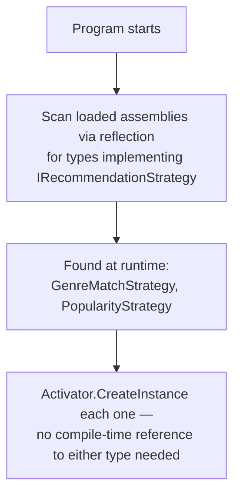
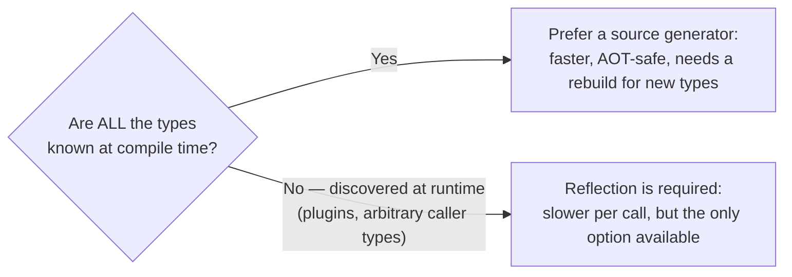

# Reflection vs Source Generators — Comparison

## Introduction

Before reading this lesson, you should already be comfortable with **[Advanced Span<T>/Memory<T> Usage](../13-reflection-sourcegen-lowlevel/13-12-advanced-span-memory-usage.md)**, and, more importantly for this lesson, with reflection and source generators individually from earlier in this module and from Module 12's performance lessons. Both of those tools solve the same underlying problem — a program needing to know a type's shape without you writing that knowledge out by hand — but they solve it at opposite ends of a program's life: one at runtime, one at compile time. This lesson puts them side by side and asks the question every earlier lesson introducing either one has quietly deferred: given a real design decision, which one should you actually reach for?

By the end of this lesson, you will be able to:

- Summarize, without re-deriving from scratch, how reflection and source generators each solve "does my code need to know a type's shape"
- Explain the concrete cost reflection pays at runtime that a source generator pays once, at compile time, instead
- Apply a decision table covering startup performance, Native AOT deployment, and dynamic/plugin scenarios to a real design choice
- Explain why System.Text.Json ships both a reflection-based and a source-generated serializer rather than picking one
- Recognize when reflection's runtime flexibility is not just acceptable but strictly necessary

## Reflection vs Source Generators — A Layman's Perspective

Picture two very different ways a large retail chain handles unfamiliar products arriving at a checkout counter. The first approach: every single time a cashier scans something the system has never seen priced at that register before, a specialist is paged to the counter, examines the item by hand, looks up its category, checks today's pricing rules, and tells the register what to charge — right there, in the moment, with the customer waiting. This works for absolutely anything, including a one-off item that arrived that morning and will never be sold again. But it costs real time, at the register, every single time an unfamiliar item shows up.

The second approach: before the store even opens for the day, the same specialist sits down with the full catalog of everything the store plans to sell that day, works out the exact price and category for every item in advance, and loads all of that directly into the register's own memory. Now, all day, every scan is instant — no specialist paged, no on-the-spot lookup, because the answer was already computed and sitting there, ready. The catch is equally obvious: this only works for items that were known about in advance. If a genuinely new, unplanned item shows up mid-shift — a customer's homemade jam, say, that no catalog anticipated — this register has nothing to fall back on, because it was never designed to improvise.

Reflection is the first approach: your program examines a type's shape — its properties, their names, their types — at the exact moment it's needed, live, during execution, which is precisely why it can handle types it has never seen before, discovered only once the program is already running. A source generator is the second approach: it examines every type it's told about *before the program ever runs*, while the compiler is still working, and bakes the answer directly into the compiled program — instant at runtime, but only for the exact set of types it was shown in advance.

Neither approach is simply "the better one." A store that only ever sells items from a fixed, known catalog would be foolish to keep paying for a specialist at every register, every day, when the pricing could all be worked out once, in advance. A store that genuinely needs to handle unpredictable, one-off items — a plugin, an unknown format arriving from an external partner, a type nobody wrote down anywhere at compile time — has no choice but to keep the specialist on call, because there was never a catalog to precompute against in the first place. This lesson's whole job is helping you tell, for a given piece of code, which store you're actually running.

## Reflection vs Source Generators — A Programming Language Perspective

**Reflection** (`System.Reflection`) inspects a `Type`'s members — its properties, fields, methods, constructors, and attributes — at run time, after the assembly containing that type is already loaded; every inspection re-walks that metadata, and dynamic invocation through `MethodInfo.Invoke` or `Activator.CreateInstance` carries real per-call overhead relative to a direct method call. A **source generator**, implementing Roslyn's `IIncrementalGenerator`, inspects the same kind of structural information — but during **compilation**, as ordinary syntax and semantic analysis — and emits additional C# source that the compiler then compiles as if you had written it by hand; by the time the program runs, there is no type-shape inspection left to do at all, only the pre-written code executing directly. The practical consequence C# 14 and .NET 10 developers care about most is **Native AOT** compatibility: AOT's trimmer can only preserve members it can prove, statically, might be used, and unconstrained reflection defeats that proof, while a source generator's output is ordinary, statically visible code the trimmer reasons about with full confidence.

## How Reflection Enables What a Source Generator Cannot

The clearest illustration of reflection's irreplaceable strength is discovering types the program was never told about at compile time — the textbook definition of a plugin architecture. A source generator, by contrast, must know at compile time exactly which types to generate code for; it cannot generate code for a type that doesn't exist yet when the program is built.


*Figure 1: Reflection discovers and instantiates these two strategy types without the calling code ever naming either one at compile time.*

```csharp
// Program.cs — .NET 10 / C# 14
using System.Reflection;

IEnumerable<IRecommendationStrategy> strategies =
    Assembly.GetExecutingAssembly()
        .GetTypes()
        .Where(t => typeof(IRecommendationStrategy).IsAssignableFrom(t) && !t.IsInterface)
        .Select(t => (IRecommendationStrategy)Activator.CreateInstance(t)!);

foreach (IRecommendationStrategy strategy in strategies)
{
    Console.WriteLine($"Discovered strategy: {strategy.Name}");
}

interface IRecommendationStrategy
{
    string Name { get; }
}

class GenreMatchStrategy : IRecommendationStrategy
{
    public string Name => "Genre Match";
}

class PopularityStrategy : IRecommendationStrategy
{
    public string Name => "Popularity Ranking";
}
```

**Console Output:**

```text
Discovered strategy: Genre Match
Discovered strategy: Popularity Ranking
```

Nothing in this program's `Main`-equivalent top-level code ever writes `new GenreMatchStrategy()` or names `PopularityStrategy` directly — `GetTypes().Where(...)` finds every class implementing `IRecommendationStrategy` purely by inspecting loaded metadata, and `Activator.CreateInstance` builds each one from that discovered `Type` alone. A source generator has no equivalent move available here: it would need to already know, at compile time, the full list of strategy classes to generate anything for, which defeats the entire point of a system where new strategies can be added — even shipped in a separately compiled plugin assembly — without recompiling the code that discovers them.

## Real-Time Example: A Plugin-Based Recommendation Engine in Library/Inventory Management

We extend the Library/Inventory Management domain with a book recommendation engine that a library wants third-party developers to be able to extend after the core system ships — a new recommendation strategy, dropped in as a separately compiled assembly, should start working without a single line of the core engine being recompiled. Reflection-based discovery, exactly as shown above, is the only one of these two tools that can satisfy that requirement.

```csharp
// Program.cs — .NET 10 / C# 14 — Real-Time Example (Library/Inventory Management)
using System.Reflection;

var catalog = new List<Book>
{
    new("The Hobbit", Genre: "Fantasy", Checkouts: 214),
    new("Dune", Genre: "Sci-Fi", Checkouts: 178),
    new("Mistborn", Genre: "Fantasy", Checkouts: 261)
};

List<IRecommendationStrategy> strategies =
    Assembly.GetExecutingAssembly()
        .GetTypes()
        .Where(t => typeof(IRecommendationStrategy).IsAssignableFrom(t) && !t.IsInterface)
        .Select(t => (IRecommendationStrategy)Activator.CreateInstance(t)!)
        .ToList();

Console.WriteLine($"Loaded {strategies.Count} recommendation strategy plugin(s):");
foreach (IRecommendationStrategy strategy in strategies)
{
    Book pick = strategy.Recommend(catalog);
    Console.WriteLine($"  {strategy.Name} recommends: \"{pick.Title}\" ({pick.Genre}, {pick.Checkouts} checkouts)");
}

record Book(string Title, string Genre, int Checkouts);

interface IRecommendationStrategy
{
    string Name { get; }
    Book Recommend(IEnumerable<Book> catalog);
}

class MostCheckedOutStrategy : IRecommendationStrategy
{
    public string Name => "Most Checked Out";
    public Book Recommend(IEnumerable<Book> catalog) => catalog.MaxBy(b => b.Checkouts)!;
}

class FantasyFirstStrategy : IRecommendationStrategy
{
    public string Name => "Fantasy First";
    public Book Recommend(IEnumerable<Book> catalog) =>
        catalog.Where(b => b.Genre == "Fantasy").MaxBy(b => b.Checkouts) ?? catalog.First();
}
```

**Console Output:**

```text
Loaded 2 recommendation strategy plugin(s):
  Most Checked Out recommends: "Mistborn" (Fantasy, 261 checkouts)
  Fantasy First recommends: "Mistborn" (Fantasy, 261 checkouts)
```

`MostCheckedOutStrategy` and `FantasyFirstStrategy` were found purely by scanning the assembly's loaded types for anything implementing `IRecommendationStrategy` — the exact mechanism a real plugin loader would apply to a separately compiled DLL dropped into a plugins folder, using `Assembly.LoadFrom` instead of `GetExecutingAssembly`. A source-generator-based design simply has no comparable path here: generating code for a strategy class requires the generator to see that class's source during the *core* engine's own compilation, which is precisely what a third-party, independently shipped plugin assembly cannot offer.

## Reflection vs. Source Generators

This is the decision this whole lesson has been building toward, and it comes down to one question asked before either tool gets chosen: is every type this code will ever need to inspect known when *this* assembly is compiled, or might new types show up only after the program has already shipped? If every type is known in advance — your own DTOs, your own entity classes, your own service registrations — a source generator does the identical inspection work a source generator, or you, could plan for exactly once, at compile time, and the resulting code is faster, smaller in startup cost, and fully Native AOT-safe, at the price of needing to recompile whenever a new type is added. If types can only be known at run time — a genuine plugin architecture, a scripting host, a serializer that must handle arbitrary caller-supplied types it was never told about — reflection is not the slower alternative; it is the only mechanism capable of the job at all, because there was never a fixed catalog for a generator to have inspected in the first place.

System.Text.Json, covered back in Module 9 and revisited in Module 12's performance lesson, is the clearest evidence that this isn't an either-or choice at the library level: it ships **both** a reflection-based `JsonSerializer.Serialize(value)` default, which works on any type at all with zero setup, and a source-generated `JsonSerializerContext` mode, opted into with `[JsonSerializable]`, for the specific, known-in-advance types an application's hottest serialization paths actually need. The library's own design mirrors this lesson's answer exactly: keep reflection as the flexible universal fallback, and let callers opt specific, known types into the source-generated fast path when startup performance or Native AOT compatibility actually demands it.


*Figure 2: One question decides the starting point — everything else in this lesson's table is a secondary refinement of it.*

| Decision factor | Favors Reflection | Favors Source Generators |
|---|---|---|
| Startup / per-call performance needs | Acceptable if inspection cost is infrequent or non-critical | Strongly favored — inspection cost is paid once, at compile time |
| Native AOT / trimmed deployment | Risky — trimmer may remove members reflection needed | Strongly favored — generated code is fully visible to the trimmer |
| Plugin / dynamic type discovery | Required — the only way to find types unknown at compile time | Not possible — generator needs the type at compile time |
| Types fully known at compile time | Works, but redoes known-in-advance work every call | Ideal case — nothing left to discover, so precompute it |
| Development/maintenance simplicity | Simpler for one-off or rarely-hot code paths | Extra setup (`partial` types, attributes) pays off only when hot |

## Types of Reflection/Source-Generator Design Decisions

1. **[Introduction to Reflection in C#](../13-reflection-sourcegen-lowlevel/13-01-introduction-to-reflection.md)** — this module's earlier deep dive into the reflection APIs used throughout this lesson.
2. **[Source Generators for Performance](../12-advanced-concepts/12-34-source-generators-for-performance.md)** — the System.Text.Json source-generated path this lesson's comparison revisits in full.
3. **[System.Text.Json in Depth](../09-file-io-serialization/09-05-system-text-json-in-depth.md)** — where both of this lesson's serialization modes were first introduced.
4. **[JIT vs Native AOT Compilation](../12-advanced-concepts/12-33-jit-vs-native-aot.md)** — the deployment model that most sharply favors the source-generated side of this decision.
5. **Writing custom incremental source generators** — covered earlier in this module, the `IIncrementalGenerator` mechanics behind every source-generated example in this comparison.
6. **[Reflection-Based Dependency Injection Internals](../13-reflection-sourcegen-lowlevel/13-14-reflection-based-di-internals.md)** — next lesson, a full case study of reflection chosen deliberately over a source-generated alternative.

## What You've Learned & What's Next

Reflection and source generators solve the same problem — knowing a type's shape without hand-writing that knowledge — at opposite points in a program's life: reflection at run time, on demand, flexible enough to handle types discovered only after the program starts; source generators at compile time, once, faster and Native AOT-safe, but only for types known when the assembly is built. System.Text.Json's decision to ship both, rather than pick a winner, is the practical proof that this is a genuine trade-off rather than a strictly-better-option situation.

Continue your learning journey with **[Reflection-Based Dependency Injection Internals](../13-reflection-sourcegen-lowlevel/13-14-reflection-based-di-internals.md)**, where we take the "reflection is required when types are only known dynamically" side of this lesson's table and use it to demystify exactly how ASP.NET Core's DI container resolves your constructors behind the scenes.

---
*Applies to: .NET 10 / C# 14. Last reviewed 2026-08-16.*
