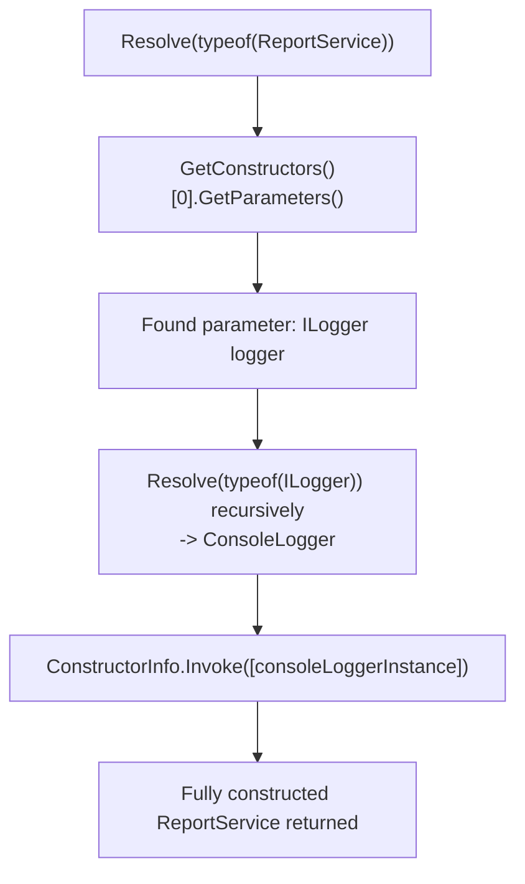
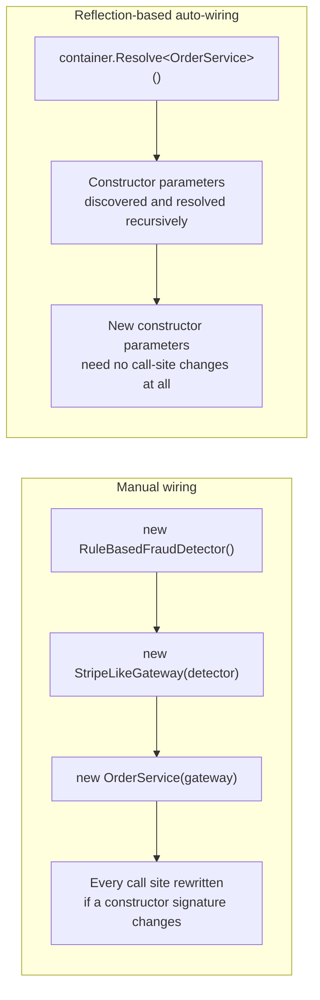

# Reflection-Based Dependency Injection Internals

## Introduction

Before reading this lesson, you should already be comfortable with **[Reflection vs Source Generators — Comparison](../13-reflection-sourcegen-lowlevel/13-13-reflection-vs-source-generators.md)**, including the conclusion that reflection is the only option when the exact set of types involved can't be known until run time. This lesson applies that exact conclusion to something you've almost certainly already used without ever seeing how it works: **[Dependency Injection and Service Lifetimes](../10-aspnetcore/10-08-di-and-service-lifetimes.md)**'s built-in ASP.NET Core container. Every constructor parameter that container has ever supplied for you was resolved through reflection — inspecting your constructor's parameter list at run time and recursively resolving each one — and this lesson builds a tiny version of that exact mechanism from scratch, so none of it has to remain "magic."

By the end of this lesson, you will be able to:

- Explain, at a mechanical level, how a DI container inspects a constructor to discover what it needs
- Use `GetConstructors()` and `GetParameters()` to read a type's constructor signature via reflection
- Build a minimal container that recursively resolves a constructor's dependencies, then that dependency's own dependencies
- Explain why this recursive resolution is exactly what makes constructor injection appear to "just work" with no wiring code
- Recognize the real-world tradeoffs a production container like ASP.NET Core's adds on top of this lesson's minimal version

## Reflection-Based Dependency Injection Internals — A Layman's Perspective

Imagine a hotel's room-service kitchen receiving an order for a very particular sandwich, one that happens to require an ingredient the kitchen doesn't keep pre-made: a special sauce, which itself is made from three other ingredients the kitchen also doesn't keep pre-made, one of which is a reduction that needs yet another ingredient prepared first. Nobody handed the line cook a fully assembled sandwich, and nobody handed them a shopping list either. What actually happens is the cook reads the order, sees "special sauce" listed as an ingredient, checks the recipe card for that sauce, sees what *it* needs, checks the recipe cards for those, and keeps drilling down — recipe card leading to recipe card — until every single thing needed is either already sitting in the pantry ready to use, or has just been assembled from something that was. Only once every ingredient at every level has actually been produced does assembly of the final sandwich begin, from the bottom up.

Nobody wrote out, in advance, one giant master recipe that lists literally everything from the bread down to the last drop of the reduction all in one place. That would be enormous and fragile — change one small ingredient deep in the chain, and the whole master recipe would need rewriting. Instead, each recipe card only ever says what *that one dish* directly needs, by name, and trusts that whoever's following the cards will chase down each of those names in turn, however deep the chain runs, until it bottoms out in raw ingredients that need no further recipe at all.

A dependency injection container does exactly this when it builds you an object. Your class's constructor is the recipe card: it doesn't say "and by the way, here's everything my dependencies need too" — it just lists, by type, what it directly needs. The container reads that list, and for each item on it, goes and finds — or builds — that exact thing, which might mean reading *that* type's own constructor recipe card next, and repeating the whole process, however many layers deep the chain goes, until every dependency at every level bottoms out in something the container already knows how to produce outright. What looks like the container handing you a fully assembled object in one single step is really this same drill-down-then-build-back-up process, just invisible because it happens so fast, and because you never had to write a single line of "and don't forget to also go build this one first" yourself.

## Reflection-Based Dependency Injection Internals — A Programming Language Perspective

A DI container's core responsibility is **constructor resolution**: given a requested type, find its (usually single, or the one with the most satisfiable parameters) public constructor via `Type.GetConstructors()`, read that constructor's parameter list via `ConstructorInfo.GetParameters()`, and for every parameter, recursively resolve *that* parameter's type the same way, before finally calling `ConstructorInfo.Invoke(resolvedArguments)` to produce the instance. This recursion is what "resolving a dependency graph" means concretely: it is not a special graph-traversal algorithm distinct from ordinary recursion, it is exactly the same "resolve this type" function calling itself for each constructor parameter it discovers, bottoming out at whichever registered types have no further unsatisfied constructor parameters left. ASP.NET Core's real container (`Microsoft.Extensions.DependencyInjection`) performs precisely this reflection-based resolution, layered with lifetime tracking (Singleton/Scoped/Transient, from Module 10), circular-dependency detection, and a compiled-expression cache so the reflection cost is paid once per type rather than on every single resolution.

## How to Build a Minimal Reflection-Based Container

A minimal container needs exactly two operations: a way to register which concrete type satisfies which requested type, and a `Resolve` method that reads a constructor's parameters and recursively resolves each one before invoking the constructor.


*Figure 1: `Resolve` calling itself for each constructor parameter is the entire mechanism — no separate graph-walking algorithm exists underneath it.*

```csharp
// Program.cs — .NET 10 / C# 14
using System.Reflection;

var container = new MiniContainer();
container.Register<ILogger, ConsoleLogger>();
container.Register<ReportService, ReportService>();

var report = container.Resolve<ReportService>();
report.Generate();

interface ILogger
{
    void Log(string message);
}

class ConsoleLogger : ILogger
{
    public void Log(string message) => Console.WriteLine($"[LOG] {message}");
}

class ReportService(ILogger logger)
{
    public void Generate()
    {
        logger.Log("Generating report...");
        Console.WriteLine("Report generated.");
    }
}

class MiniContainer
{
    private readonly Dictionary<Type, Type> _registrations = [];

    public void Register<TRequested, TImplementation>() =>
        _registrations[typeof(TRequested)] = typeof(TImplementation);

    public T Resolve<T>() => (T)Resolve(typeof(T));

    private object Resolve(Type requestedType)
    {
        Type implementationType = _registrations.TryGetValue(requestedType, out Type? mapped)
            ? mapped
            : requestedType;

        ConstructorInfo constructor = implementationType.GetConstructors()[0];
        ParameterInfo[] parameters = constructor.GetParameters();

        object[] arguments = parameters
            .Select(p => Resolve(p.ParameterType))
            .ToArray();

        return constructor.Invoke(arguments);
    }
}
```

**Console Output:**

```text
[LOG] Generating report...
Report generated.
```

`Resolve(typeof(ReportService))` looks up `ReportService`'s single constructor, sees it needs one parameter of type `ILogger`, and calls `Resolve(typeof(ILogger))` recursively before `ReportService`'s own constructor is ever invoked. That inner call resolves `ILogger` to `ConsoleLogger` — a constructor with zero parameters, so its own recursive `Select` produces an empty argument array, bottoming the recursion out immediately — and only once that `ConsoleLogger` instance exists does the outer call finally invoke `ReportService`'s constructor with it. Nothing here is specific to `ReportService` or `ILogger`; the exact same `Resolve` method would chase a constructor dependency chain three, four, or ten layers deep with no changes at all.

## Real-Time Example: Resolving an OrderService's Dependency Chain in E-Commerce Order Processing

We extend the E-Commerce Order Processing domain with the exact shape a real checkout endpoint's dependency chain takes: an `OrderService` needs an `IPaymentGateway`, and that gateway itself needs an `IFraudDetector` — a two-level-deep chain that demonstrates the recursion isn't limited to a single hop, which is precisely what ASP.NET Core's container is doing every time a controller or minimal API endpoint's constructor lists a service.

```csharp
// Program.cs — .NET 10 / C# 14 — Real-Time Example (E-Commerce Order Processing)
using System.Reflection;

var container = new MiniContainer();
container.Register<IFraudDetector, RuleBasedFraudDetector>();
container.Register<IPaymentGateway, StripeLikeGateway>();
container.Register<OrderService, OrderService>();

var orderService = container.Resolve<OrderService>();
orderService.PlaceOrder(orderId: "ORD-9042", amount: 129.99m);

interface IFraudDetector
{
    bool LooksSuspicious(decimal amount);
}

class RuleBasedFraudDetector : IFraudDetector
{
    public bool LooksSuspicious(decimal amount) => amount > 5000m;
}

interface IPaymentGateway
{
    void Charge(string orderId, decimal amount);
}

class StripeLikeGateway(IFraudDetector fraudDetector) : IPaymentGateway
{
    public void Charge(string orderId, decimal amount)
    {
        if (fraudDetector.LooksSuspicious(amount))
        {
            Console.WriteLine($"Order {orderId}: flagged for manual review, not charged.");
            return;
        }

        Console.WriteLine($"Order {orderId}: charged {amount:C} successfully.");
    }
}

class OrderService(IPaymentGateway paymentGateway)
{
    public void PlaceOrder(string orderId, decimal amount)
    {
        Console.WriteLine($"Placing order {orderId}...");
        paymentGateway.Charge(orderId, amount);
    }
}

class MiniContainer
{
    private readonly Dictionary<Type, Type> _registrations = [];

    public void Register<TRequested, TImplementation>() =>
        _registrations[typeof(TRequested)] = typeof(TImplementation);

    public T Resolve<T>() => (T)Resolve(typeof(T));

    private object Resolve(Type requestedType)
    {
        Type implementationType = _registrations.TryGetValue(requestedType, out Type? mapped)
            ? mapped
            : requestedType;

        ConstructorInfo constructor = implementationType.GetConstructors()[0];
        ParameterInfo[] parameters = constructor.GetParameters();

        object[] arguments = parameters
            .Select(p => Resolve(p.ParameterType))
            .ToArray();

        return constructor.Invoke(arguments);
    }
}
```

**Console Output:**

```text
Placing order ORD-9042...
Order ORD-9042: charged $129.99 successfully.
```

Resolving `OrderService` alone triggers three nested constructor calls: `OrderService` needs `IPaymentGateway`, which resolves to `StripeLikeGateway`, whose own constructor needs `IFraudDetector`, which resolves to `RuleBasedFraudDetector` first. Only after that innermost, dependency-free `RuleBasedFraudDetector` is built does the recursion unwind back through `StripeLikeGateway` and finally `OrderService` itself. This is the identical shape ASP.NET Core's real container resolves for you on every request whose controller or endpoint constructor asks for a service that itself depends on other services — the "magic" is this same recursive constructor walk, just running inside a container that also tracks Singleton/Scoped/Transient lifetimes and caches the reflection lookups for speed.

## Manual Wiring vs Reflection-Based Auto-Wiring

Manually wiring dependencies means writing out, by hand, every `new` call in the correct bottom-up order — `new RuleBasedFraudDetector()`, then `new StripeLikeGateway(that)`, then `new OrderService(that)` — which works, and is even marginally faster since no reflection runs at all, but grows brittle fast: add a new constructor parameter to `StripeLikeGateway` and every hand-written `new StripeLikeGateway(...)` call site across the codebase must be found and updated. Reflection-based auto-wiring, as built in this lesson, reads each constructor's parameter list live and resolves it recursively, so adding a new constructor parameter to any registered type requires no changes anywhere except registering whatever new type that parameter needs — the container's `Resolve` method already knows how to chase it down.


*Figure 2: Manual wiring hard-codes the order of construction; reflection-based resolution derives that order fresh from whatever the constructors currently declare.*

| Aspect | Manual Wiring | Reflection-Based Auto-Wiring |
|---|---|---|
| Who decides construction order | The developer, by hand, at every call site | The container, derived from constructor parameters at resolve time |
| Cost of adding a constructor parameter | Every `new` call site must be updated | Only a new registration is needed; call sites are unaffected |
| Runtime overhead | None — direct constructor calls | Reflection lookup cost per resolution (cacheable, as production containers do) |
| Circular dependency detection | Left entirely to the developer noticing | The container can detect and report it (this lesson's minimal version does not) |
| Typical scale it suits | A handful of objects, wired once, rarely changed | Applications with many services and deep, evolving dependency chains |

## Types of Dependency Resolution Concepts

1. **[Dependency Injection and Service Lifetimes](../10-aspnetcore/10-08-di-and-service-lifetimes.md)** — the production ASP.NET Core container this lesson's `MiniContainer` is a deliberately simplified stand-in for.
2. **[Introduction to Reflection in C#](../13-reflection-sourcegen-lowlevel/13-01-introduction-to-reflection.md)** — the `GetConstructors`/`GetParameters`/`Invoke` APIs this lesson's container is built entirely from.
3. **[Reflection vs Source Generators — Comparison](../13-reflection-sourcegen-lowlevel/13-13-reflection-vs-source-generators.md)** — why a production container still chooses reflection here, rather than a source-generated alternative, since registered types can arrive from any assembly at run time.
4. **Circular dependency detection** — the safeguard a minimal container like this lesson's omits, which production containers add by tracking types currently being resolved.
5. **Constructor selection strategies** — how a real container chooses among *multiple* constructors on one type, rather than this lesson's simplifying assumption of exactly one.
6. **[Building a Mini ORM with Reflection](../13-reflection-sourcegen-lowlevel/13-15-building-a-mini-orm-with-reflection.md)** — next lesson, applying this same reflection-driven mindset to mapping objects to data instead of to each other.

## What You've Learned & What's Next

A dependency injection container's constructor injection is not magic: it is `GetConstructors()`, `GetParameters()`, and a recursive `Resolve` call for each parameter discovered, bottoming out once a type's constructor needs nothing further — exactly the tiny `MiniContainer` built in this lesson, minus the lifetime tracking and caching a production container layers on top. Once you've built that recursion yourself, ASP.NET Core silently resolving a three-level-deep constructor chain on every request stops looking like magic and starts looking like exactly what it is.

Continue your learning journey with **[Building a Mini ORM with Reflection](../13-reflection-sourcegen-lowlevel/13-15-building-a-mini-orm-with-reflection.md)**, this module's capstone, where the same reflection toolkit used here to resolve constructors gets pointed at mapping an object's properties to database columns instead.

---
*Applies to: .NET 10 / C# 14. Last reviewed 2026-08-16.*
