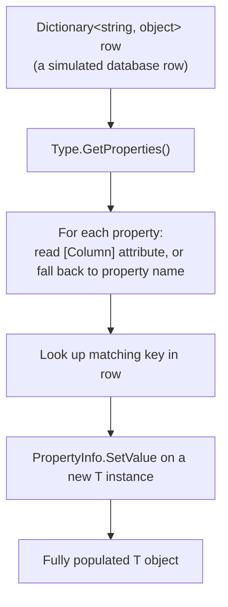
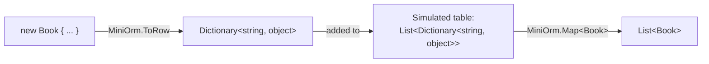
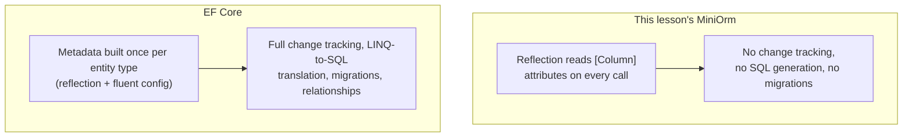

# Building a Mini ORM with Reflection

## Introduction

Before reading this lesson, you should already be comfortable with **[Reflection-Based Dependency Injection Internals](../13-reflection-sourcegen-lowlevel/13-14-reflection-based-di-internals.md)**. This lesson is the capstone of Module 13, Reflection, Source Generators & Low-Level C# — the 15th and final lesson of the module — and it ties together nearly everything this module has covered: reflection over a type's properties, custom attributes attached to those properties, and dynamic instantiation, all aimed at one deliberately hands-on goal — mapping a plain C# class to a database table's rows and columns without using EF Core at all. By the end, the "magic" behind Module 11's `DbContext` and `DbSet<T>` should look a lot less like magic.

By the end of this lesson, you will be able to:

- Define custom `[Table]` and `[Column]` attributes to describe how a class maps to a database table
- Use reflection to read those attributes at run time and map a data row to an object, and an object back to a data row
- Build a tiny, working mini-ORM's `Map<T>` and `ToRow<T>` operations from scratch
- Explain, concretely, what EF Core is doing with reflection and attributes internally when it maps an entity
- Explain why a production system reaches for EF Core or a source-generated mapper instead of hand-rolled reflection like this lesson's

## Building a Mini ORM with Reflection — A Layman's Perspective

Picture a librarian moving books between two very different storage systems: a wall of labeled physical shelves, where each shelf slot is a small paper card holding just a title, an author, and a call number in a fixed format — and a proper writing desk, where the librarian keeps a stack of blank library-card templates, each with named blanks: "Title:", "Author:", "Call Number:". Every time a book needs to go from the shelf card into a usable library card on the desk, and back again, someone has to know exactly which blank on the desk template corresponds to which line on the shelf card — "Title:" maps to the first line, "Author:" to the second, and so on — and copy the values across, one named field at a time.

Now imagine the librarian doesn't want to memorize that mapping by heart, or trust every new hire to get it right from memory either. So instead, they pin a small note directly onto each blank on the desk template: the blank labeled "Title:" gets a note pinned to it that says "this comes from the shelf card's TTL line," the blank labeled "Author:" gets a note saying "this comes from the AUTH line," and so on. Now, anyone standing at the desk — even someone who has never moved a single book before — can read the pinned notes, glance at the corresponding line on the shelf card, and correctly fill in every blank, purely by following the notes, without ever needing to have the mapping explained to them separately.

Those pinned notes are exactly what a custom **attribute** does in this lesson: a small, permanently attached piece of metadata sitting right on a class's property, saying "this property corresponds to that database column." And the person standing at the desk, reading each pinned note and copying the right value across without anyone walking them through it personally, is exactly what **reflection** does at run time: it reads those attached notes off each property, one at a time, and performs the copy itself, for any class carrying that kind of note, without a single line of hand-written "property X goes to column Y" code existing anywhere. That's the entire idea an ORM — object-relational mapper — is built from: read the notes, follow them, copy the values, both directions.

## Building a Mini ORM with Reflection — A Programming Language Perspective

An **ORM** (object-relational mapper) maps between a class's properties and a data source's rows and columns, so application code works with plain objects instead of hand-written data-access code for every type. This lesson's mini-ORM represents that mapping with two custom attributes — `[Table("...")]` on the class and `[Column("...")]` on each property — both trivial classes deriving from `System.Attribute`, read back at run time via `PropertyInfo.GetCustomAttribute<ColumnAttribute>()`. Mapping a row to an object walks `Type.GetProperties()`, reads each property's `[Column]` attribute (or falls back to the property's own name), looks up the matching value in the row, and assigns it with `PropertyInfo.SetValue`; mapping an object back to a row reverses that same walk, reading each property's current value with `PropertyInfo.GetValue`. This is a deliberately simplified version of what a real ORM — most notably **EF Core**, Module 11's subject — does internally: EF Core's metadata model builds this exact property-to-column map once per entity type (largely via reflection, with newer versions leaning increasingly on compiled expressions and source generators for speed) and reuses it for every row that type ever reads or writes.

## How to Map a Class to a Row with Reflection

Two small attributes are enough to describe a mapping; a generic `Map<T>` method does the actual reflection-driven work of turning a row — represented here as a plain `Dictionary<string, object>`, standing in for what a real ADO.NET `DataRow` or database driver would hand back — into a fully populated object.


*Figure 1: The mapper never mentions `Book`, `Order`, or any other specific type by name — it works purely from whatever `[Column]` attributes it finds.*

```csharp
// Program.cs — .NET 10 / C# 14
using System.Reflection;

Dictionary<string, object> row = new()
{
    ["book_id"] = 101,
    ["title"] = "The Pragmatic Programmer",
    ["in_stock"] = true
};

Book book = MiniOrm.Map<Book>(row);
Console.WriteLine($"Mapped: [{book.Id}] {book.Title} (in stock: {book.InStock})");

[AttributeUsage(AttributeTargets.Property)]
class ColumnAttribute(string name) : Attribute
{
    public string Name { get; } = name;
}

class Book
{
    [Column("book_id")]
    public int Id { get; set; }

    [Column("title")]
    public string Title { get; set; } = "";

    [Column("in_stock")]
    public bool InStock { get; set; }
}

static class MiniOrm
{
    public static T Map<T>(Dictionary<string, object> row) where T : new()
    {
        var entity = new T();

        foreach (PropertyInfo property in typeof(T).GetProperties())
        {
            string columnName = property.GetCustomAttribute<ColumnAttribute>()?.Name ?? property.Name;

            if (row.TryGetValue(columnName, out object? value))
            {
                property.SetValue(entity, Convert.ChangeType(value, property.PropertyType));
            }
        }

        return entity;
    }
}
```

**Console Output:**

```text
Mapped: [101] The Pragmatic Programmer (in stock: True)
```

`MiniOrm.Map<T>` never once mentions `Book` by name — it discovers `Id`, `Title`, and `InStock` purely by walking `typeof(T).GetProperties()`, reads each property's `[Column]` attribute to learn which row key it corresponds to, and assigns the matching value with `SetValue`. The same method would map any other attributed class — an `Order`, an `Account` — with zero changes, because the mapping information lives entirely in the attributes pinned to that class's own properties, not in `MiniOrm` itself.

## Real-Time Example: A Mini ORM for the Library/Inventory Management Catalog

We extend the Library/Inventory Management domain with a `Book` entity backed by a simulated in-memory "database" — a `List<Dictionary<string, object>>` standing in for actual database rows, so this example runs anywhere `dotnet run` does, with no real database connection required. `MiniOrm` gains a `ToRow<T>` method, the mirror image of `Map<T>`, so a `Book` object can be turned back into a row ready for an `INSERT`.


*Figure 2: The same two reflection-driven methods handle both directions — reading existing rows into objects, and turning a new object into a row.*

```csharp
// Program.cs — .NET 10 / C# 14 — Real-Time Example (Library/Inventory Management)
using System.Reflection;

List<Dictionary<string, object>> booksTable =
[
    new() { ["book_id"] = 101, ["title"] = "The Pragmatic Programmer", ["in_stock"] = true },
    new() { ["book_id"] = 102, ["title"] = "Clean Code", ["in_stock"] = false }
];

Console.WriteLine("-- Existing catalog (mapped from simulated DB rows) --");
List<Book> catalog = booksTable.Select(MiniOrm.Map<Book>).ToList();
foreach (Book existing in catalog)
{
    Console.WriteLine($"  [{existing.Id}] {existing.Title} (in stock: {existing.InStock})");
}

var newBook = new Book { Id = 103, Title = "Domain-Driven Design", InStock = true };
Dictionary<string, object> newRow = MiniOrm.ToRow(newBook);
booksTable.Add(newRow);

Console.WriteLine("-- After inserting a new book via ToRow --");
Console.WriteLine($"  Row added: book_id={newRow["book_id"]}, title={newRow["title"]}, in_stock={newRow["in_stock"]}");
Console.WriteLine($"  Table now has {booksTable.Count} rows.");

[AttributeUsage(AttributeTargets.Property)]
class ColumnAttribute(string name) : Attribute
{
    public string Name { get; } = name;
}

class Book
{
    [Column("book_id")]
    public int Id { get; set; }

    [Column("title")]
    public string Title { get; set; } = "";

    [Column("in_stock")]
    public bool InStock { get; set; }
}

static class MiniOrm
{
    public static T Map<T>(Dictionary<string, object> row) where T : new()
    {
        var entity = new T();

        foreach (PropertyInfo property in typeof(T).GetProperties())
        {
            string columnName = property.GetCustomAttribute<ColumnAttribute>()?.Name ?? property.Name;

            if (row.TryGetValue(columnName, out object? value))
            {
                property.SetValue(entity, Convert.ChangeType(value, property.PropertyType));
            }
        }

        return entity;
    }

    public static Dictionary<string, object> ToRow<T>(T entity) where T : notnull
    {
        var row = new Dictionary<string, object>();

        foreach (PropertyInfo property in typeof(T).GetProperties())
        {
            string columnName = property.GetCustomAttribute<ColumnAttribute>()?.Name ?? property.Name;
            row[columnName] = property.GetValue(entity)!;
        }

        return row;
    }
}
```

**Console Output:**

```text
-- Existing catalog (mapped from simulated DB rows) --
  [101] The Pragmatic Programmer (in stock: True)
  [102] Clean Code (in stock: False)
-- After inserting a new book via ToRow --
  Row added: book_id=103, title=Domain-Driven Design, in_stock=True
  Table now has 3 rows.
```

`booksTable.Select(MiniOrm.Map<Book>)` turns every existing simulated row into a fully populated `Book` with one line, and `MiniOrm.ToRow(newBook)` performs the exact reverse walk, reading `Id`, `Title`, and `InStock` back out via `GetValue` into a fresh dictionary keyed by each property's `[Column]` name. This is, at a deliberately small scale, precisely what EF Core's change tracker and query pipeline do for every entity type your `DbContext` maps — read or write each mapped property, using each property's configured column name, without a single hand-written `SELECT` or `INSERT` column list anywhere in your code.

## This Mini-ORM vs. EF Core

This lesson's `MiniOrm` and EF Core solve the identical core problem — mapping properties to columns via reflection over attributes (or, in EF Core's case, attributes plus a rich fluent configuration API) — but everything past that core mapping step is where EF Core earns Module 11's fifteen lessons. `MiniOrm.Map<T>` and `ToRow<T>` have no idea how to generate SQL, no idea which properties changed since a row was loaded, no concept of relationships between tables, and no migrations to keep a schema in sync with your classes over time; every one of those is a real, hard problem EF Core has already solved, tested, and optimized. Building this lesson's tiny version by hand isn't a suggestion to skip EF Core in real projects — it's the opposite: seeing exactly how much reflection-driven property mapping *doesn't* cover is what makes clear how much EF Core is actually doing underneath `dbContext.Books.Add(book)`.

It's also worth being explicit about this lesson's own tradeoff: a **production** mini-ORM, if a team genuinely needed one instead of EF Core, would very likely use **source generators** instead of runtime reflection for exactly the reasons Lesson 13 of this module laid out — no per-call `GetProperties()`/`GetCustomAttribute()` cost, and full Native AOT compatibility. This lesson deliberately built the reflection-based version anyway, on purpose, because seeing the slow, fully-visible mechanics first is what makes both EF Core's internals and a hypothetical source-generated mapper's shortcuts make sense, rather than starting from a black box either way.


*Figure 3: Both start from the same reflection-over-attributes idea; EF Core builds an entire data-access platform on top of it that this lesson's version never attempts.*

| Aspect | This Lesson's MiniOrm | EF Core |
|---|---|---|
| Mapping mechanism | Reflection over `[Column]` on every call | Reflection/fluent config once per type, cached metadata |
| Change tracking | None — every write is manual | Full change tracking (Module 11, lesson 9) |
| Query capability | None — rows must already be in hand | LINQ translated to SQL, joins, filtering |
| Relationships | None | One-to-many, many-to-many (Module 11, lessons 4–5) |
| Schema evolution | None | Code-first migrations (Module 11, lesson 3) |
| Production-ready | No — deliberately a teaching tool | Yes |

## Types of Reflection-Driven Mapping Concepts

1. **[Introduction to Entity Framework Core](../11-efcore/11-01-introduction-to-ef-core.md)** — the production ORM this lesson's `MiniOrm` is a deliberately small stand-in for.
2. **[DbContext and DbSet<T>](../11-efcore/11-02-dbcontext-and-dbset.md)** — where EF Core's real, cached version of this lesson's property-to-column mapping lives.
3. **[Reflection-Based Dependency Injection Internals](../13-reflection-sourcegen-lowlevel/13-14-reflection-based-di-internals.md)** — this module's other from-scratch reflection build, resolving constructors instead of mapping columns.
4. **[Reflection vs Source Generators — Comparison](../13-reflection-sourcegen-lowlevel/13-13-reflection-vs-source-generators.md)** — the decision framework behind this lesson's closing note that a production mini-ORM would likely use source generators instead.
5. **Change tracking and the Unit of Work pattern** — the EF Core machinery (Module 11, lesson 9, and Module 12's Repository/Unit of Work pattern) this capstone's mini-ORM deliberately does not attempt to replicate.
6. **[Introduction to gRPC in .NET](../14-grpc-signalr-security/14-01-introduction-to-grpc.md)** — next lesson, the first lesson of Module 14.

## What You've Learned & What's Next — Module 13 Recap

This lesson closes Module 13, Reflection, Source Generators & Low-Level C#, 15 lessons in total. The module opened by teaching a C# program to inspect its own types and attributes at run time, then widened into source generators as compile-time answer to that same class of problem, then dropped further still into P/Invoke, `stackalloc`, and advanced `Span<T>`/`Memory<T>` techniques for working directly against native and raw memory. This final arc brought all of it back together: Lesson 13 gave you the framework for choosing between reflection and source generators, Lesson 14 used reflection to demystify dependency injection's constructor resolution, and this capstone used that same reflection toolkit — this time paired with custom attributes — to demystify how an ORM like EF Core maps your classes to your database in the first place. Read end to end, the module tells one continuous story: a running program can examine itself, and once you've built that self-examination by hand, at a small scale, twice, none of the frameworks built on top of it — DI containers, ORMs, JSON serializers — ever have to look like magic again.

Continue your learning journey with **[Introduction to gRPC in .NET](../14-grpc-signalr-security/14-01-introduction-to-grpc.md)**, the first lesson of Module 14, where the focus shifts from a single process examining itself to two separate processes communicating efficiently over the network.

---
*Applies to: .NET 10 / C# 14. Last reviewed 2026-08-16.*
