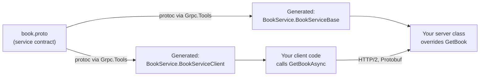
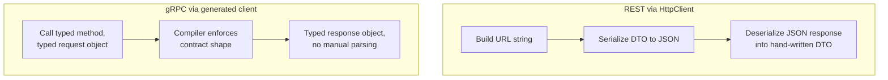

# Introduction to gRPC in .NET

## Introduction

Before reading this lesson, you should already be comfortable with **[Building a Mini ORM with Reflection](../13-reflection-sourcegen-lowlevel/13-15-building-a-mini-orm-with-reflection.md)**, and more broadly with the ASP.NET Core hosting model from Module 10. This lesson opens Module 14, gRPC, SignalR & Security, and shifts the focus from a single process examining itself to two separate processes — a client and a server — communicating efficiently over the network. gRPC is the first tool this module introduces for that job.

By the end of this lesson, you will be able to:

- Explain what gRPC is and why it exists alongside REST
- Write a `.proto` file that defines a service contract using Protocol Buffers
- Explain what code generation produces from a `.proto` file, and why neither side hand-writes it
- Implement a minimal unary RPC (a single request, a single response) in an ASP.NET Core service
- Call that RPC from a strongly-typed generated C# client
- Explain why gRPC runs over HTTP/2 rather than HTTP/1.1

## Introduction to gRPC — A Layman's Perspective

Imagine two shipping companies that need to exchange manifests every time a container crosses between them. One approach is a handwritten letter: "Container holds twelve boxes, mostly books, weighs about four hundred kilos, give or take." It's readable by any human on either end, in any language, and it's flexible — you can phrase it however you like. But someone still has to *read* it, interpret what "mostly books" and "give or take" actually mean, and manually transcribe the numbers into their own system. If the letter arrives with a typo or an unexpected phrase, the whole handoff stalls until a human sorts it out.

Now imagine instead that both companies agreed, once, on a fixed customs form: box 1 is always "container ID," box 2 is always "item count" as a whole number, box 3 is always "weight in kilograms" as a decimal. Neither side writes the form from scratch anymore — a printing press stamps out identical pre-structured forms for both companies from the single agreed template, and everyone just fills in the boxes. The form is far less readable to a stranger glancing at it — it's dense codes and numbers, not prose — but it is unambiguous, compact, and both companies' warehouse machines can process it instantly, without a human translator standing in the middle.

That agreed customs form is exactly what a **`.proto` file** is: a single, precise template both the client and the server compile from, describing exactly which fields exist, in exactly what order, with exactly what types. The "printing press" that stamps out identical, pre-structured paperwork for both sides is **code generation** — a build-time tool reads the `.proto` template once and produces matching C# classes for both the server and the client, so neither side ever hand-writes the parsing logic for the other side's messages. And the dense, compact, code-filled form itself — rather than a readable prose letter — is **Protocol Buffers**, the binary wire format gRPC uses instead of JSON: smaller, faster to produce and parse, but no longer something you'd want to read directly in a browser's network tab.

The shipping lane those forms travel down matters too. A prose letter mailed the old way — one letter, wait for a reply, mail the next letter — is what a plain HTTP/1.1 request/response cycle looks like. gRPC instead runs over **HTTP/2**, a shipping lane that keeps a single connection open and lets many forms travel back and forth on it concurrently, without each one waiting for the last one to fully arrive. That's the foundation this lesson builds on: a fixed contract, generated paperwork, and a faster lane to send it down.

## Introduction to gRPC — A Programming Language Perspective

**gRPC** is an open-source, high-performance remote procedure call (RPC) framework, originally from Google, built on two pillars: **Protocol Buffers** (protobuf) as the interface definition language and binary serialization format, and **HTTP/2** as the transport. A service contract is written once in a `.proto` file using the `service` and `rpc` keywords, declaring one or more remote methods and the request/response message shapes each one uses. The `Grpc.Tools` NuGet package hooks into MSBuild and runs the `protoc` compiler during build, generating a C# base class (`{Service}.{Service}Base`) the server implements by overriding its methods, and a strongly-typed client class (`{Service}.{Service}Client`) the caller instantiates directly — no manual JSON parsing, no hand-written DTOs, no URL string-building. In ASP.NET Core, `builder.Services.AddGrpc()` registers the gRPC middleware, and `app.MapGrpcService<T>()` exposes an implementation over Kestrel's HTTP/2 endpoint.

## How to Define and Call a Unary gRPC Service in C#

A **unary RPC** — one request message in, one response message out — is gRPC's simplest call shape and the right place to start. Three pieces are needed: the `.proto` contract, a server class implementing the generated base class, and a client making the call.


*Figure 1: One `.proto` file feeds the code generator twice — once for the server-side base class, once for the client-side stub.*

```protobuf
// book.proto
syntax = "proto3";

option csharp_namespace = "LibraryGrpc";

package library;

service BookService {
  rpc GetBook (BookRequest) returns (BookReply);
}

message BookRequest {
  int32 book_id = 1;
}

message BookReply {
  int32 id = 1;
  string title = 2;
  string author = 3;
}
```

```csharp
// Server: Program.cs — .NET 10 / C# 14 (ASP.NET Core gRPC service)
var builder = WebApplication.CreateBuilder(args);
builder.Services.AddGrpc();

var app = builder.Build();
app.MapGrpcService<BookGrpcService>();
app.Run();

class BookGrpcService : BookService.BookServiceBase
{
    public override Task<BookReply> GetBook(BookRequest request, ServerCallContext context)
    {
        var reply = new BookReply
        {
            Id = request.BookId,
            Title = "Clean Code",
            Author = "Robert C. Martin"
        };

        return Task.FromResult(reply);
    }
}
```

```csharp
// Client: Program.cs — .NET 10 / C# 14 (separate console app)
using Grpc.Net.Client;
using LibraryGrpc;

using var channel = GrpcChannel.ForAddress("https://localhost:5001");
var client = new BookService.BookServiceClient(channel);

BookReply reply = await client.GetBookAsync(new BookRequest { BookId = 101 });

Console.WriteLine($"[{reply.Id}] {reply.Title} by {reply.Author}");
```

**Console Output** *(printed by the client console app after the RPC completes — the server and client are two separate running processes, so this is the client's own output, not a simulated trace):*

```text
[101] Clean Code by Robert C. Martin
```

Neither `BookGrpcService` nor the client code ever hand-parses a byte of the wire format — `BookRequest` and `BookReply` are fully generated C# classes with typed properties (`BookId`, `Id`, `Title`, `Author`), produced straight from the `.proto` file's field names and numbers. `client.GetBookAsync(...)` serializes the request to Protobuf, sends it over the open HTTP/2 connection, and deserializes the reply back into a `BookReply` object — all of it generated, none of it hand-written.

## Real-Time Example: A Book Lookup Service for Library/Inventory Management

We extend the Library/Inventory Management domain's `Book` entity — the same one mapped by the mini-ORM in the previous lesson — into a small gRPC catalog lookup service backed by an in-memory dictionary standing in for the library's database. This adds one thing the minimal example skipped: what happens when the requested book doesn't exist.

```csharp
// Server: BookGrpcService.cs — .NET 10 / C# 14 — Real-Time Example (Library/Inventory Management)
using Grpc.Core;
using LibraryGrpc;

class BookGrpcService : BookService.BookServiceBase
{
    private static readonly Dictionary<int, (string Title, string Author)> Catalog = new()
    {
        [101] = ("The Pragmatic Programmer", "Andrew Hunt & David Thomas"),
        [102] = ("Clean Code", "Robert C. Martin")
    };

    public override Task<BookReply> GetBook(BookRequest request, ServerCallContext context)
    {
        if (!Catalog.TryGetValue(request.BookId, out var book))
        {
            throw new RpcException(new Status(
                StatusCode.NotFound, $"No book with ID {request.BookId} in the catalog."));
        }

        return Task.FromResult(new BookReply
        {
            Id = request.BookId,
            Title = book.Title,
            Author = book.Author
        });
    }
}
```

```csharp
// Client: Program.cs — .NET 10 / C# 14 — Real-Time Example (Library/Inventory Management)
using Grpc.Core;
using Grpc.Net.Client;
using LibraryGrpc;

using var channel = GrpcChannel.ForAddress("https://localhost:5001");
var client = new BookService.BookServiceClient(channel);

foreach (int bookId in new[] { 101, 999 })
{
    try
    {
        BookReply reply = await client.GetBookAsync(new BookRequest { BookId = bookId });
        Console.WriteLine($"Found: [{reply.Id}] {reply.Title} by {reply.Author}");
    }
    catch (RpcException ex) when (ex.StatusCode == StatusCode.NotFound)
    {
        Console.WriteLine($"Lookup failed for ID {bookId}: {ex.Status.Detail}");
    }
}
```

**Console Output** *(client console output after two RPC calls against the running server):*

```text
Found: [101] The Pragmatic Programmer by Andrew Hunt & David Thomas
Lookup failed for ID 999: No book with ID 999 in the catalog.
```

This is closer to how a real library or e-commerce catalog service behaves: a lookup either succeeds with a fully populated record, or fails with a specific, typed status the client can branch on — `StatusCode.NotFound` here, rather than a generic exception or an ambiguous null. Every gRPC status code maps to a well-known outcome (`NotFound`, `InvalidArgument`, `Unauthenticated`, and more), so a client written in C#, Java, or Go can all react to the same failure the same way, without agreeing on a bespoke JSON error shape first.

## gRPC Client Call vs a Traditional REST/HttpClient Call

A REST call over `HttpClient` builds a URL, serializes a request body to JSON with `System.Text.Json`, sends it, and deserializes the JSON response back into a DTO you defined by hand — three separate manual steps, none of them checked against the server's actual contract until the response arrives at run time. A gRPC call skips all three: the method name, its parameter type, and its return type are all fixed by the generated `BookServiceClient`, so calling `client.GetBookAsync(new BookRequest { BookId = 101 })` simply won't compile if the contract doesn't have a `GetBook` method taking a `BookRequest`. The tradeoff is contract rigidity — a REST endpoint can accept whatever shape of JSON its code chooses to read that request in, but a gRPC contract requires both sides to regenerate their stubs whenever the `.proto` file changes. Lesson 3 covers this tradeoff, and several others, in full depth.


*Figure 2: REST leaves request/response shape checking until run time; a gRPC contract violation is a compile error.*

| Aspect | REST via `HttpClient` | gRPC via generated client |
|---|---|---|
| Contract source | Convention, often undocumented or OpenAPI-described | `.proto` file, compiler-enforced on both sides |
| Payload format | JSON (text, human-readable) | Protobuf (binary, compact) |
| Client code | Hand-written DTOs and calls | Fully generated client class |
| Compile-time safety | None — shape errors surface at run time | Method/parameter mismatches are compile errors |
| Typical use | Public, browser-facing APIs | Internal service-to-service calls |

## Types of gRPC Call Patterns and Related Topics

1. **[gRPC Streaming](../14-grpc-signalr-security/14-02-grpc-streaming.md)** — the three other call shapes beyond this lesson's unary call: server streaming, client streaming, and bidirectional streaming.
2. **[gRPC vs REST — Comparison](../14-grpc-signalr-security/14-03-grpc-vs-rest-comparison.md)** — a full comparison of payload size, contract flexibility, and when to choose each.
3. **[Introduction to SignalR](../14-grpc-signalr-security/14-04-introduction-to-signalr.md)** — a different real-time communication model, built for browser clients rather than service-to-service calls.
4. **[Introduction to ASP.NET Core](../10-aspnetcore/10-01-introduction-to-aspnetcore.md)** — the hosting model and Kestrel server gRPC services run on top of.
5. **[HTTPS and Certificates](../10-aspnetcore/10-22-https-and-certificates.md)** — gRPC requires HTTP/2, which in practice means TLS is mandatory outside of local development.

## What You've Learned & What's Next

gRPC replaces a hand-written REST call's URL-building, JSON serialization, and manual DTOs with a `.proto` contract that generates strongly-typed code for both the server and the client, sent over HTTP/2 in a compact binary format. A mismatch between what a client sends and what a server expects becomes a compile-time problem instead of a run-time surprise.

Continue your learning journey with **[gRPC Streaming](../14-grpc-signalr-security/14-02-grpc-streaming.md)**, where this lesson's single request/single response call grows into the three streaming call shapes gRPC supports.

---
*Applies to: .NET 10 / C# 14. Last reviewed 2026-08-16.*
