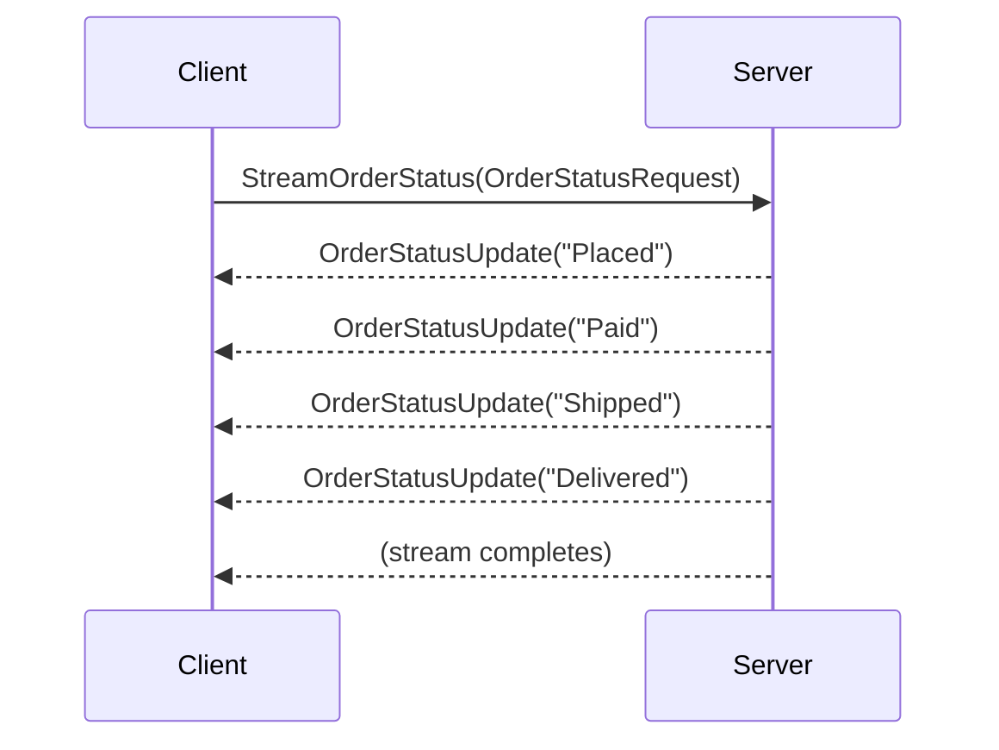
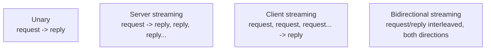

# gRPC Streaming

## Introduction

Before reading this lesson, you should already be comfortable with **[Introduction to gRPC in .NET](../14-grpc-signalr-security/14-01-introduction-to-grpc.md)**, including the unary call — one request, one response. This lesson widens that single call shape into the three other patterns gRPC supports, each built around the same `.proto` contract and generated stubs, but exchanging more than one message per call.

By the end of this lesson, you will be able to:

- Name and distinguish gRPC's four call types: unary, server streaming, client streaming, and bidirectional streaming
- Define a server-streaming RPC in a `.proto` file using the `stream` keyword
- Implement a server-streaming RPC that pushes a sequence of updates to a connected client
- Consume a server stream in C# using `IAsyncEnumerable<T>` and `await foreach`
- Explain why streaming a live sequence of updates is often better than the client repeatedly polling for the same information

## gRPC Streaming — A Layman's Perspective

Picture two ways of finding out whether a parcel you're expecting has arrived. The first way: you walk out to the mailbox every ten minutes, open it, look inside, and walk back — whether or not anything has changed since your last trip. Most trips are wasted; the parcel usually isn't there yet, and you've spent the effort checking anyway. If you check too rarely, you find out late; if you check too often, you're outside more than you're doing anything useful. That repeated round trip, checking a fixed spot over and over on your own schedule, is exactly what **polling** looks like in software — a client repeatedly asking "has anything changed?" and getting "no" almost every time.

The second way: you give the mail carrier your phone number, and instead of walking out to check, the carrier texts you the moment something relevant happens — "your parcel just left the depot," then later "it's out for delivery," then later still "it's on your porch." You never walk to the mailbox at all. Every message you get is one you actually needed, sent to you the instant it became true, over one ongoing conversation rather than many separate trips. That's what a gRPC **stream** is: instead of the client asking once and getting one static answer, the connection stays open, and the server pushes each new update down it the moment that update exists — no wasted round trips, no stale "still no" answers, no guessing how often to check back.

There's a third shape too, worth a quick mention here even though this lesson's main example is the mailbox-style one. Sometimes it's the *customer* sending a stream of updates, not the carrier — imagine dictating a running shopping list to a shopper over the phone, one item at a time, rather than handing over one written list up front. And sometimes both directions happen at once: a live two-way phone call where either side can speak whenever they have something new to say. Those two variations are this lesson's other streaming shapes, both built from the same "keep the line open" idea as the mailbox scenario, just with the direction of the ongoing updates reversed or doubled.

## gRPC Streaming — A Programming Language Perspective

A `.proto` service method marks a streamed side of a call with the `stream` keyword in front of the request type, the response type, or both. **Server streaming** (`rpc Foo (Request) returns (stream Reply)`) sends one request and receives a sequence of replies over time. **Client streaming** (`rpc Foo (stream Request) returns (Reply)`) is the reverse: a sequence of requests sent up front, one final reply back. **Bidirectional streaming** (`rpc Foo (stream Request) returns (stream Reply)`) allows both sides to send messages independently, in any order, for as long as the call is open. In generated C# server code, a server-streaming method receives an `IServerStreamWriter<T>` parameter and calls `WriteAsync` per item; on the client, the generated stub exposes an `IAsyncStreamReader<T>` that C# 14's `await foreach` consumes directly via the `ReadAllAsync()` extension from `Grpc.Core`. All of this still runs over the single, long-lived HTTP/2 connection from the previous lesson — streaming is a call-shape decision in the `.proto` file, not a different transport.

## How to Write a Server-Streaming RPC in C#

A server-streaming RPC still starts from a single request message, but the method signature swaps a returned value for a stream writer parameter the method writes to, once per update, for as long as it has more to send.


*Figure 1: One request opens the call; the server writes as many replies as it needs before the stream ends.*

```protobuf
// order_status.proto
syntax = "proto3";

option csharp_namespace = "OrderGrpc";

package ecommerce;

service OrderStatusService {
  rpc StreamOrderStatus (OrderStatusRequest) returns (stream OrderStatusUpdate);
}

message OrderStatusRequest {
  int32 order_id = 1;
}

message OrderStatusUpdate {
  int32 order_id = 1;
  string status = 2;
  string timestamp = 3;
}
```

```csharp
// Server: OrderStatusGrpcService.cs — .NET 10 / C# 14
using Grpc.Core;
using OrderGrpc;

class OrderStatusGrpcService : OrderStatusService.OrderStatusServiceBase
{
    public override async Task StreamOrderStatus(
        OrderStatusRequest request,
        IServerStreamWriter<OrderStatusUpdate> responseStream,
        ServerCallContext context)
    {
        string[] stages = { "Placed", "Paid", "Shipped", "Delivered" };

        foreach (string stage in stages)
        {
            await responseStream.WriteAsync(new OrderStatusUpdate
            {
                OrderId = request.OrderId,
                Status = stage,
                Timestamp = DateTime.UtcNow.ToString("HH:mm:ss")
            });

            await Task.Delay(1000, context.CancellationToken);
        }
    }
}
```

```csharp
// Client: Program.cs — .NET 10 / C# 14
using Grpc.Net.Client;
using OrderGrpc;

using var channel = GrpcChannel.ForAddress("https://localhost:5001");
var client = new OrderStatusService.OrderStatusServiceClient(channel);

using var call = client.StreamOrderStatus(new OrderStatusRequest { OrderId = 5001 });

await foreach (OrderStatusUpdate update in call.ResponseStream.ReadAllAsync())
{
    Console.WriteLine($"[{update.Timestamp}] Order {update.OrderId}: {update.Status}");
}
```

**Console Output** *(the client's actual console output for one live run, consuming the stream as it arrives — not a simulated trace; exact timestamps will differ run to run):*

```text
[10:15:01] Order 5001: Placed
[10:15:02] Order 5001: Paid
[10:15:03] Order 5001: Shipped
[10:15:04] Order 5001: Delivered
```

Nothing in the client code polls, sleeps, and re-asks. `await foreach` suspends until the server writes the *next* item, and resumes exactly once per `WriteAsync` call on the server side — four writes on the server produce exactly four loop iterations on the client, one second apart, matching the server's own pacing rather than any polling interval the client picked.

## Real-Time Example: Streaming Live Order Status for E-Commerce Order Processing

We extend the E-Commerce Order Processing domain's `Order` class with a richer status lifecycle and a store of in-flight orders, then stream a specific order's status changes to whichever client is watching it — a shopper's "track my order" page, kept live without that page ever polling an endpoint on a timer.

```csharp
// Server: OrderStatusGrpcService.cs — .NET 10 / C# 14 — Real-Time Example (E-Commerce Order Processing)
using Grpc.Core;
using OrderGrpc;

enum OrderStage { Placed, PaymentConfirmed, Shipped, OutForDelivery, Delivered }

class OrderStatusGrpcService : OrderStatusService.OrderStatusServiceBase
{
    private static readonly HashSet<int> KnownOrderIds = [7001, 7002, 7003];

    public override async Task StreamOrderStatus(
        OrderStatusRequest request,
        IServerStreamWriter<OrderStatusUpdate> responseStream,
        ServerCallContext context)
    {
        if (!KnownOrderIds.Contains(request.OrderId))
        {
            throw new RpcException(new Status(
                StatusCode.NotFound, $"No order with ID {request.OrderId} exists."));
        }

        try
        {
            foreach (OrderStage stage in Enum.GetValues<OrderStage>())
            {
                await responseStream.WriteAsync(new OrderStatusUpdate
                {
                    OrderId = request.OrderId,
                    Status = stage.ToString(),
                    Timestamp = DateTime.UtcNow.ToString("HH:mm:ss")
                });

                await Task.Delay(800, context.CancellationToken);
            }
        }
        catch (OperationCanceledException)
        {
            Console.WriteLine($"[server] Client stopped watching order {request.OrderId} early.");
        }
    }
}
```

```csharp
// Client: Program.cs — .NET 10 / C# 14 — Real-Time Example (E-Commerce Order Processing)
using Grpc.Net.Client;
using OrderGrpc;

using var channel = GrpcChannel.ForAddress("https://localhost:5001");
var client = new OrderStatusService.OrderStatusServiceClient(channel);

using var cts = new CancellationTokenSource();
using var call = client.StreamOrderStatus(new OrderStatusRequest { OrderId = 7002 }, cancellationToken: cts.Token);

int updatesSeen = 0;
await foreach (OrderStatusUpdate update in call.ResponseStream.ReadAllAsync(cts.Token))
{
    Console.WriteLine($"[{update.Timestamp}] Order {update.OrderId}: {update.Status}");
    updatesSeen++;

    if (updatesSeen == 2)
    {
        Console.WriteLine("Customer navigated away from the tracking page — closing stream.");
        cts.Cancel();
        break;
    }
}
```

**Console Output** *(client console output for one live run; the server-side cancellation log line appears in the server process's own console, shown here together for clarity):*

```text
[11:02:10] Order 7002: Placed
[11:02:11] Order 7002: PaymentConfirmed
Customer navigated away from the tracking page — closing stream.
[server] Client stopped watching order 7002 early.
```

This is the realistic version of a "track my order" feature: the connection carries only real status changes, in order, as they happen, and closing the browser tab (or the `CancellationTokenSource`, here) tells the server to stop working on that stream immediately, rather than leaving it writing updates nobody will ever read.

## The Four gRPC Call Types Compared

Unary is the default shape from the previous lesson; the other three all involve a `stream` keyword on one or both sides of the `.proto` method signature. The choice isn't about performance alone — it's about which side has more than one message to send, and whether those messages need to arrive as a running sequence rather than a single completed answer.


*Figure 2: All four shapes share one `.proto` and one HTTP/2 connection type — only the direction and count of messages changes.*

| Call type | `.proto` signature | Typical use |
|---|---|---|
| Unary | `rpc Foo (Req) returns (Reply)` | A single lookup, e.g. `GetBook` |
| Server streaming | `rpc Foo (Req) returns (stream Reply)` | Live updates on one subscribed topic, e.g. order status |
| Client streaming | `rpc Foo (stream Req) returns (Reply)` | Uploading a batch, e.g. a sequence of sensor readings summarized into one result |
| Bidirectional streaming | `rpc Foo (stream Req) returns (stream Reply)` | A live two-way exchange, e.g. a chat-style negotiation between two services |

## Types of gRPC Streaming and Related Topics

1. **[Introduction to gRPC in .NET](../14-grpc-signalr-security/14-01-introduction-to-grpc.md)** — the unary call this lesson's three streaming shapes build on.
2. **[gRPC vs REST — Comparison](../14-grpc-signalr-security/14-03-grpc-vs-rest-comparison.md)** — next lesson, where streaming's advantage over repeated REST polling is examined directly.
3. **[Introduction to SignalR](../14-grpc-signalr-security/14-04-introduction-to-signalr.md)** — a browser-facing alternative to gRPC streaming for push-style updates.
4. **[SignalR Groups and Scaling](../14-grpc-signalr-security/14-05-signalr-groups-and-scaling.md)** — the same "broadcast to whoever is watching" idea this lesson's order-status stream introduced, applied to many simultaneous SignalR clients.
5. **Asynchronous streams (`IAsyncEnumerable<T>`)** — the underlying C# language feature (Module 7) that `await foreach` over a gRPC response stream is built on.

## What You've Learned & What's Next

Streaming turns a gRPC call from a single question-and-answer into an open channel the server (or client, or both) can keep writing to, which is exactly the right tool whenever a client would otherwise have to poll the same endpoint over and over waiting for something to change.

Continue your learning journey with **[gRPC vs REST — Comparison](../14-grpc-signalr-security/14-03-grpc-vs-rest-comparison.md)**, which weighs gRPC's contract and performance advantages against REST's flexibility and universal browser support.

---
*Applies to: .NET 10 / C# 14. Last reviewed 2026-08-16.*
