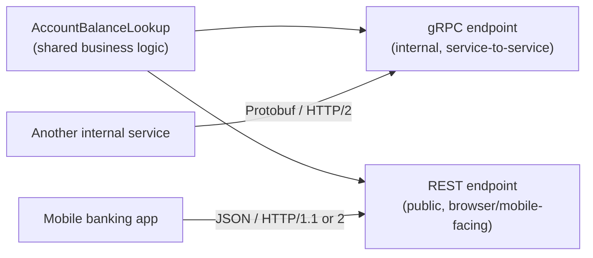
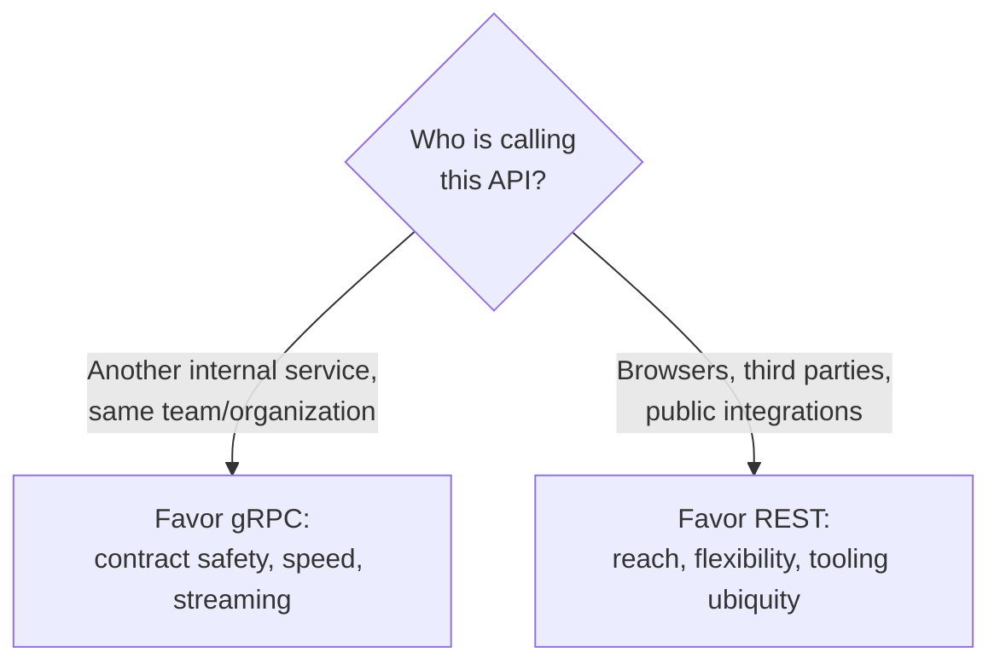

# gRPC vs REST — Comparison

## Introduction

Before reading this lesson, you should already be comfortable with **[gRPC Streaming](../14-grpc-signalr-security/14-02-grpc-streaming.md)** and, from Module 10, with building REST APIs over ASP.NET Core minimal APIs or controllers. This lesson steps back from gRPC's mechanics to ask a more practical question: given a new API to build, which one should it actually be?

By the end of this lesson, you will be able to:

- Compare Protobuf and JSON payloads for size and parsing speed
- Explain the difference between a strictly enforced contract and a flexible, loosely-checked schema
- Explain why gRPC has historically needed a proxy (`grpc-web`) to work directly from a browser
- Choose gRPC or REST appropriately for a given API's audience and use case
- Describe a system that exposes the same underlying operation through both, for different callers

## gRPC vs REST — A Layman's Perspective

Picture two ways a warehouse can ship the same kind of item to two different kinds of customers. To another warehouse it trusts and does business with constantly, it ships a vacuum-sealed, machine-packed crate: every item inside is arranged in a fixed, pre-agreed layout, sealed tight to save space in the truck, and unpacked in seconds by the receiving warehouse's own specialized equipment, because both sides built their loading docks to the same exact specification. It's fast, compact, and cheap to move in bulk — but only because both ends already agreed on that specification and installed the matching equipment ahead of time.

To an individual customer, though, that same warehouse ships a plain, ordinary cardboard box: a bit bulkier for the same contents, packed a little less tightly, but anyone — literally anyone, with nothing more than a pair of hands — can open it, look inside, and understand what's there without needing any special equipment at all. A customer's front porch was never built to accept a sealed industrial crate and a forklift; it was built to accept an ordinary box left by an ordinary delivery van.

That's the real shape of the gRPC-vs-REST decision. The vacuum-sealed crate is **Protobuf over gRPC**: compact and fast, but only because both the sender and receiver compiled their code from the same shared `.proto` specification ahead of time. The ordinary cardboard box is **JSON over REST**: a little larger, a little slower to unpack at scale, but readable by literally anything that can make an HTTP request and parse text — a browser's own JavaScript, a curl command, a debugging tool's network tab, all without installing any special equipment first. And the reason gRPC traditionally can't just show up at a browser's front porch directly is exactly the reason the industrial crate can't be left for the individual customer: browsers were never built with the loading-dock equipment gRPC's crate expects — full, low-level control over HTTP/2 framing and trailers — so reaching a browser at all normally requires routing through **grpc-web**, a translation proxy that repacks the crate into something a browser's ordinary equipment can actually receive.

## gRPC vs REST — A Programming Language Perspective

**REST** (Representational State Transfer) is an architectural style, not a protocol: it maps operations onto HTTP verbs (`GET`, `POST`, `PUT`, `DELETE`) against resource URLs, typically exchanging **JSON**, a self-describing, human-readable text format with no formally enforced schema beyond whatever a client and server independently agree to. **gRPC** exchanges **Protocol Buffers**, a binary format with a schema enforced by the shared `.proto` file itself — every field has a fixed number and wire type, so there is no per-message field-name text to parse, only positional binary values, which is both smaller on the wire and faster to serialize and deserialize than JSON at scale. Because browsers do not expose the raw HTTP/2 trailer frames gRPC's streaming and status-code model depends on, calling a gRPC service directly from browser JavaScript is not natively supported; `Grpc.AspNetCore.Web` in ASP.NET Core adds **grpc-web** support, translating browser-compatible requests into standard gRPC calls server-side.

## How to Expose the Same Operation as Both REST and gRPC

A single business operation can sit behind both an internal gRPC contract and a public REST endpoint at once — the two are just different doors onto the same logic, which is exactly how many real systems are shaped.


*Figure 1: The same underlying lookup, reached two different ways depending on who's calling.*

```csharp
// Shared logic: AccountBalanceLookup.cs — .NET 10 / C# 14
static class AccountBalanceLookup
{
    private static readonly Dictionary<string, decimal> Balances = new()
    {
        ["ACC-4471"] = 2350.75m,
        ["ACC-8820"] = 128.40m
    };

    public static decimal? GetBalance(string accountNumber) =>
        Balances.TryGetValue(accountNumber, out decimal balance) ? balance : null;
}
```

```csharp
// REST endpoint: Program.cs (minimal API) — .NET 10 / C# 14
app.MapGet("/api/accounts/{accountNumber}/balance", (string accountNumber) =>
{
    decimal? balance = AccountBalanceLookup.GetBalance(accountNumber);
    return balance is not null
        ? Results.Ok(new { accountNumber, balance })
        : Results.NotFound();
});
```

**Console Output** *(logged output from the running ASP.NET Core process when a mobile app calls the REST endpoint):*

```text
info: Microsoft.AspNetCore.Hosting.Diagnostics[1]
      Request GET /api/accounts/ACC-4471/balance responded 200 in 4.1102 ms
```

The REST route is reachable from a browser's `fetch()` call, a mobile app's `HttpClient`, or a plain `curl` command with zero extra tooling — its cost is a slightly larger, self-describing JSON payload (`{"accountNumber":"ACC-4471","balance":2350.75}`) compared to the equivalent Protobuf bytes a gRPC call for the same data would send.

## Real-Time Example: One Balance Lookup, Two Doors, for Banking/ATM

We extend the Banking/ATM domain's account balance lookup with an internal gRPC contract meant only for other trusted backend services — an ATM's own controller software checking an account before dispensing cash — while the REST endpoint above stays the one a customer's mobile banking app calls directly.

```protobuf
// account.proto
syntax = "proto3";
option csharp_namespace = "BankingGrpc";
package banking;

service AccountService {
  rpc GetBalance (BalanceRequest) returns (BalanceReply);
}

message BalanceRequest {
  string account_number = 1;
}

message BalanceReply {
  string account_number = 1;
  double balance = 2;
}
```

```csharp
// Server: AccountGrpcService.cs — .NET 10 / C# 14 — Real-Time Example (Banking/ATM)
using Grpc.Core;
using BankingGrpc;

class AccountGrpcService : AccountService.AccountServiceBase
{
    public override Task<BalanceReply> GetBalance(BalanceRequest request, ServerCallContext context)
    {
        decimal? balance = AccountBalanceLookup.GetBalance(request.AccountNumber);

        if (balance is null)
        {
            throw new RpcException(new Status(
                StatusCode.NotFound, $"No account {request.AccountNumber} found."));
        }

        return Task.FromResult(new BalanceReply
        {
            AccountNumber = request.AccountNumber,
            Balance = (double)balance.Value
        });
    }
}
```

```csharp
// Client: ATM controller code — .NET 10 / C# 14 — Real-Time Example (Banking/ATM)
using Grpc.Net.Client;
using BankingGrpc;

using var channel = GrpcChannel.ForAddress("https://ledger-service.internal:5001");
var client = new AccountService.AccountServiceClient(channel);

BalanceReply reply = await client.GetBalanceAsync(new BalanceRequest { AccountNumber = "ACC-4471" });
Console.WriteLine($"ATM check — {reply.AccountNumber}: ${reply.Balance:F2} available.");
```

**Console Output** *(the ATM controller's own console output after the internal gRPC call completes):*

```text
ATM check — ACC-4471: $2350.75 available.
```

Both calls return the same balance for the same account, but nothing else about them matches: the ATM's internal check is a compact, compiler-checked Protobuf exchange between two backend services that never leaves the bank's own network, while the mobile app's check is an ordinary JSON REST call any HTTP client, including the phone's own browser-based fallback UI, can make without any generated stub at all.

## Protobuf/gRPC vs JSON/REST — The Core Tradeoffs

This is the decision this lesson exists to make explicit. Four dimensions drive it: **payload size and speed**, **contract strictness**, **reach**, and **audience**. Protobuf's binary, positionally-encoded fields are consistently smaller and faster to parse than the equivalent JSON — for the account balance above, roughly 20–30 bytes of Protobuf against 45+ bytes of JSON once field names are spelled out, and that gap widens with larger, more nested messages. But that compactness comes from the `.proto` contract's strictness: both sides must be compiled against the same schema, so an internal microservice fleet that deploys its services together, and controls both ends of every call, pays no real cost for that rigidity. A public API has no such control over its callers — it cannot force every browser, partner integration, and third-party script to regenerate a client stub every time a field changes, so REST's looser, JSON-based, additive-by-default contract fits that audience far better. Reach follows the same line: REST works natively from any browser today; gRPC reaches a browser only through the `grpc-web` proxy translation layer, an extra moving part a purely internal call never needs.


*Figure 2: The audience for a call, more than the call's content, usually decides which protocol fits.*

| Aspect | gRPC (Protobuf) | REST (JSON) |
|---|---|---|
| Payload size/speed | Smaller, faster to (de)serialize | Larger, slower at high volume |
| Contract | Strict `.proto`, compiler-enforced both sides | Flexible, conventionally documented (OpenAPI) |
| Browser support | Needs a `grpc-web` proxy | Native — any `fetch()` or `HttpClient` call |
| Debuggability | Binary — needs tooling to inspect on the wire | Human-readable in any network tab or `curl` |
| Best-fit audience | Internal microservice-to-microservice calls | Public-facing, browser- or partner-consumed APIs |

## Types of API Communication Styles

1. **[Introduction to gRPC in .NET](../14-grpc-signalr-security/14-01-introduction-to-grpc.md)** — the unary call and generated stub this comparison assumes.
2. **[gRPC Streaming](../14-grpc-signalr-security/14-02-grpc-streaming.md)** — the streaming call shapes REST has no direct equivalent for.
3. **[Introduction to SignalR](../14-grpc-signalr-security/14-04-introduction-to-signalr.md)** — next lesson, a third style built specifically for browser-facing real-time push.
4. **[Minimal APIs vs Controllers](../10-aspnetcore/10-04-minimal-apis-vs-controllers.md)** — the two ways this lesson's REST endpoint could equally have been written in ASP.NET Core.
5. **[OpenAPI and Swagger](../10-aspnetcore/10-17-openapi-and-swagger.md)** — the closest REST equivalent to a `.proto` file's documented contract, though not compiler-enforced the same way.

## What You've Learned & What's Next

Neither gRPC nor REST is a strictly better choice — gRPC trades reach and flexibility for a faster, compiler-enforced contract, which is exactly the right trade for calls between services you control on both ends, and exactly the wrong trade for an API the public browser has to call directly.

Continue your learning journey with **[Introduction to SignalR](../14-grpc-signalr-security/14-04-introduction-to-signalr.md)**, a third communication style built specifically to push real-time updates to browser clients, the audience this lesson found REST better suited to than gRPC.

---
*Applies to: .NET 10 / C# 14. Last reviewed 2026-08-16.*
