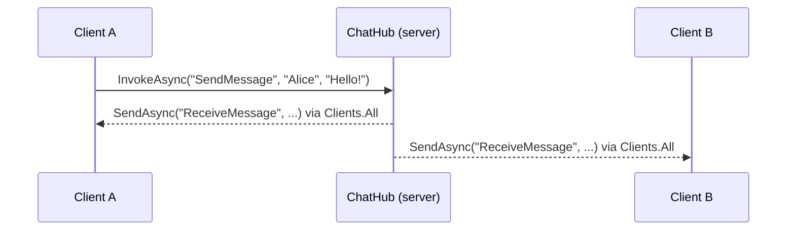
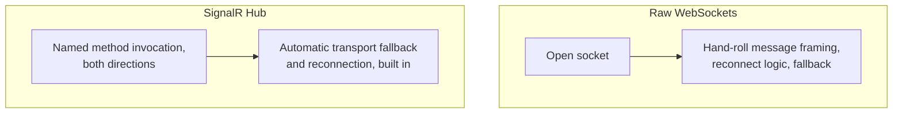

# Introduction to SignalR

## Introduction

Before reading this lesson, you should already be comfortable with **[gRPC vs REST — Comparison](../14-grpc-signalr-security/14-03-grpc-vs-rest-comparison.md)**, including why REST fits browser-facing audiences better than gRPC does. This lesson introduces the tool ASP.NET Core actually gives that browser-facing audience for real-time, server-pushed updates: SignalR.

By the end of this lesson, you will be able to:

- Explain what SignalR is and the problem it solves for browser and app clients
- Explain how SignalR abstracts over WebSockets, Server-Sent Events, and long polling with automatic fallback
- Define a `Hub` class exposing a method a client can invoke
- Push a message from the server to connected clients from inside a Hub method
- Connect to a Hub from a .NET client and both send and receive messages

## Introduction to SignalR — A Layman's Perspective

Picture a phone call versus a stack of letters. With letters, if you want to know whether the other person has anything new to tell you, you have to keep writing and mailing a new letter asking "anything new?" — over and over, most of the time getting nothing back worth the stamp. A phone call is different: once the line is open, either person can speak the moment they have something to say, and the other side hears it immediately, without either of them "checking in." Nobody has to guess how often to mail the next letter.

Now imagine you're trying to set up that phone call, but you don't actually know in advance what kind of phone the other person has. Maybe they have a modern phone that can hold a continuous open line effortlessly. Maybe they only have an old phone that can't stay connected for long and needs to hang up and redial every so often to check for messages. Maybe, in the worst case, they don't have a phone built for calls at all, and the best you can manage is trading very short voicemails back and forth as fast as you both can leave and check them. A good phone operator, in this scenario, wouldn't force you to know which situation you're in — the operator would silently pick whichever mode of connection the other person's phone could actually sustain, set it up transparently, and let you just keep talking as if you had the best possible line the whole time.

That operator is exactly the role **SignalR** plays. Underneath, real "always-open, either-side-can-speak" connections are handled by **WebSockets** on capable clients, falling back to **Server-Sent Events** or plain **long polling** on clients or networks that can't sustain a full WebSocket — old proxies, restrictive corporate firewalls, older browsers. SignalR picks the best transport a given connection can actually support, sets it up, and then gets out of the way, so your own code never has to write separate logic for "if WebSockets work" versus "if only long polling works." And the phone call itself — the ability for either side to just *say something*, by name, the moment they have it, rather than mailing a formatted letter and waiting for a reply — is what a SignalR **Hub** gives you: a shared meeting point where the server can call a named method on a connected client, and a connected client can call a named method on the server, both directions, whenever either side actually has something to say.

## Introduction to SignalR — A Programming Language Perspective

**SignalR** is an ASP.NET Core library for real-time, bidirectional communication between a server and connected clients, abstracting over the underlying transport — **WebSockets** where available, with automatic fallback to **Server-Sent Events** or long polling. A **Hub**, declared as a class deriving from `Microsoft.AspNetCore.SignalR.Hub`, is the server-side endpoint clients connect to; any public method on a Hub becomes directly invokable from a connected client via `HubConnection.InvokeAsync`. Inside a Hub method, the built-in `Clients` property (`Clients.All`, `Clients.Caller`, `Clients.Others`, and more) lets the server push a named message to any subset of connected clients via `SendAsync`, which the client receives by registering a handler with `connection.On<T1, T2, ...>(methodName, handler)`. `builder.Services.AddSignalR()` registers the required services, and `app.MapHub<T>(path)` exposes a Hub at a given route, all inside an ordinary ASP.NET Core `Program.cs`.

## How to Define a Hub and Connect to It in C#

A minimal Hub needs just one method clients can call, and one call back out to whichever clients should hear about it — here, a simple chat-style broadcast to everyone currently connected.


*Figure 1: One client's invocation reaches every connected client, including itself, because the Hub method calls `Clients.All`.*

```csharp
// Server: ChatHub.cs — .NET 10 / C# 14
using Microsoft.AspNetCore.SignalR;

class ChatHub : Hub
{
    public async Task SendMessage(string user, string message)
    {
        await Clients.All.SendAsync("ReceiveMessage", user, message);
    }
}
```

```csharp
// Server: Program.cs — .NET 10 / C# 14
var builder = WebApplication.CreateBuilder(args);
builder.Services.AddSignalR();

var app = builder.Build();
app.MapHub<ChatHub>("/chatHub");
app.Run();
```

```csharp
// Client: Program.cs — .NET 10 / C# 14 (console app using Microsoft.AspNetCore.SignalR.Client)
using Microsoft.AspNetCore.SignalR.Client;

var connection = new HubConnectionBuilder()
    .WithUrl("https://localhost:5001/chatHub")
    .Build();

connection.On<string, string>("ReceiveMessage", (user, message) =>
{
    Console.WriteLine($"{user}: {message}");
});

await connection.StartAsync();
Console.WriteLine("Connected to chat hub.");

await connection.InvokeAsync("SendMessage", "Alice", "Hello from Alice!");

Console.ReadLine();
```

**Console Output** *(the client's actual connection log and received message — this is a live SignalR connection's real output, not a simulated console-app trace):*

```text
Connected to chat hub.
Alice: Hello from Alice!
```

`connection.InvokeAsync("SendMessage", ...)` calls the Hub method directly by name, exactly like a local method call, except it crosses the network to reach the server. The server's `Clients.All.SendAsync("ReceiveMessage", ...)` then reaches every client that registered a handler for that name — including the very client that sent the original message, since `Clients.All` means everyone currently connected.

## Real-Time Example: Notifying Library Patrons When a Book Becomes Available

We extend the Library/Inventory Management domain's `Book` catalog with a live notification Hub: when library staff check a book back in, every connected patron client hears about it immediately, without any client needing to poll the catalog on a timer to find out.

```csharp
// Server: BookAvailabilityHub.cs — .NET 10 / C# 14 — Real-Time Example (Library/Inventory Management)
using Microsoft.AspNetCore.SignalR;

class BookAvailabilityHub : Hub
{
    // Called by staff-facing software when a book is checked back in.
    public async Task NotifyBookReturned(int bookId, string title)
    {
        await Clients.All.SendAsync("BookAvailable", bookId, title);
    }
}
```

```csharp
// Server: Program.cs — .NET 10 / C# 14 — Real-Time Example (Library/Inventory Management)
var builder = WebApplication.CreateBuilder(args);
builder.Services.AddSignalR();

var app = builder.Build();
app.MapHub<BookAvailabilityHub>("/bookAvailabilityHub");
app.Run();
```

```csharp
// Client: Patron notification listener — .NET 10 / C# 14 — Real-Time Example (Library/Inventory Management)
using Microsoft.AspNetCore.SignalR.Client;

var connection = new HubConnectionBuilder()
    .WithUrl("https://localhost:5001/bookAvailabilityHub")
    .Build();

connection.On<int, string>("BookAvailable", (bookId, title) =>
{
    Console.WriteLine($"Notification: \"{title}\" (Book #{bookId}) is now available for pickup.");
});

await connection.StartAsync();
Console.WriteLine("Listening for book availability notifications...");

Console.ReadLine();
```

**Console Output** *(the patron client's console output at the moment staff check a book back in — the actual push received over the live connection):*

```text
Listening for book availability notifications...
Notification: "Clean Code" (Book #102) is now available for pickup.
```

This is the practical payoff SignalR gives a "notify me when it's back in stock" feature: staff-side software calls one Hub method once, and every patron client watching the catalog — potentially dozens, each on whatever browser or app they have open — hears about it in the same instant, with no client ever asking "is it back yet?" on a schedule. The next lesson narrows this broadcast from "every connected client" down to only the clients actually interested in one specific book.

## SignalR vs Raw WebSockets

`System.Net.WebSockets` gives you a raw, two-way byte stream and nothing else — no reconnect logic, no fallback for clients that can't hold a WebSocket open, and no built-in concept of "call this named method on the other side." Every one of those has to be hand-built on top of the raw socket: your own message framing, your own reconnect-with-backoff logic, your own routing from an incoming byte payload to the right handler. SignalR's Hub abstraction supplies all of that already — named method invocation in both directions, automatic reconnection, and transport fallback — at the cost of being specific to .NET-to-.NET (or .NET-to-JavaScript-client) communication rather than a generic wire protocol any language could speak unassisted.


*Figure 2: SignalR is built on top of WebSockets, not a replacement for them — it adds the connection-management layer raw sockets leave to you.*

| Aspect | Raw WebSockets | SignalR |
|---|---|---|
| Transport | WebSocket only | WebSockets, SSE, or long polling, chosen automatically |
| Method invocation | None — you frame and route messages yourself | Named methods, both directions, via `InvokeAsync`/`SendAsync` |
| Reconnection | Hand-rolled | Built in (`HubConnectionBuilder.WithAutomaticReconnect()`) |
| Fallback for restrictive networks | None | Automatic |
| Best fit | Cross-platform, protocol-agnostic byte streams | .NET/browser real-time features within one application |

## Types of Real-Time Communication in ASP.NET Core

1. **[SignalR Groups and Scaling](../14-grpc-signalr-security/14-05-signalr-groups-and-scaling.md)** — next lesson, narrowing a broadcast to a specific subset of connected clients.
2. **[gRPC Streaming](../14-grpc-signalr-security/14-02-grpc-streaming.md)** — the service-to-service equivalent of pushing a live sequence of updates.
3. **[gRPC vs REST — Comparison](../14-grpc-signalr-security/14-03-grpc-vs-rest-comparison.md)** — why SignalR, not gRPC, is ASP.NET Core's usual answer for browser-facing push.
4. **[IHostedService and Background Services](../10-aspnetcore/10-18-ihostedservice-background-services.md)** — where server-initiated Hub notifications (like a scheduled catalog check) are typically triggered from.
5. **[Cookie Authentication in ASP.NET Core](../14-grpc-signalr-security/14-06-cookie-authentication.md)** — securing a Hub connection so `Clients.Caller` and group membership reflect a real, authenticated identity.

## What You've Learned & What's Next

SignalR gives a server the ability to call named methods directly on connected clients, and clients the same ability in reverse, over whichever transport a given connection can actually sustain, entirely without either side polling the other on a timer.

Continue your learning journey with **[SignalR Groups and Scaling](../14-grpc-signalr-security/14-05-signalr-groups-and-scaling.md)**, where this lesson's broadcast-to-everyone Hub narrows to notifying only the clients actually watching a specific piece of data.

---
*Applies to: .NET 10 / C# 14. Last reviewed 2026-08-16.*
