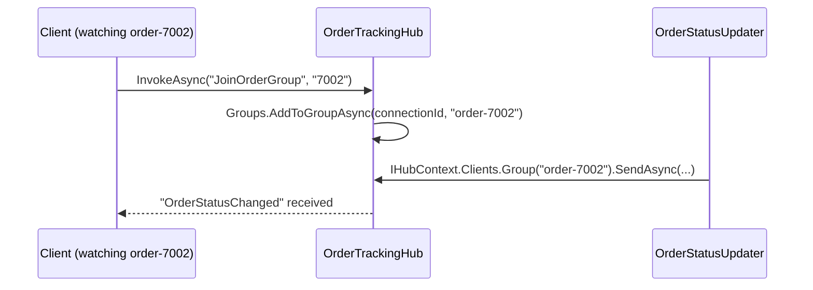
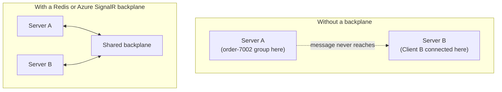

# SignalR Groups and Scaling

## Introduction

Before reading this lesson, you should already be comfortable with **[Introduction to SignalR](../14-grpc-signalr-security/14-04-introduction-to-signalr.md)**, including a Hub that broadcasts to every connected client via `Clients.All`. Broadcasting to everyone is rarely what a real feature wants — a shopper tracking one order shouldn't see notifications about every other customer's order too. This lesson narrows that broadcast down, and then confronts what happens once a Hub-hosting application needs to run on more than one server at once.

By the end of this lesson, you will be able to:

- Add a connection to a named group with `Groups.AddToGroupAsync`
- Send a message to only the clients in a specific group with `Clients.Group(...)`
- Trigger a Hub notification from ordinary application code using `IHubContext<T>`
- Explain why multiple server instances break group-based broadcasting without a shared backplane
- Name the two standard backplane options for scaling SignalR: Azure SignalR Service and a Redis backplane

## SignalR Groups and Scaling — A Layman's Perspective

Picture an airport's gate announcement system. The airport doesn't page every single passenger in the building every time one flight is boarding — that would be useless noise for the thousand people not flying to that destination. Instead, the announcement goes out over the specific speaker zone near that flight's gate, reaching only the passengers actually waiting there, because each gate area is wired to its own channel of the PA system, not the whole building's channel. A passenger only hears the announcements relevant to the gate they're currently sitting near.

That gate-specific speaker zone is exactly what a SignalR **group** is: a named subset of connected clients, and a message sent "to the group" reaches only the clients that were added to it, not every connection the server has open. A shopper's browser, sitting on an order-tracking page for order #7002, joins the "order-7002" group the moment that page loads, the same way a passenger's physical presence near gate 14 puts them in earshot of gate 14's speaker — and a status update for order #7002 only ever needs to reach that one small audience.

Now stretch the airport analogy across two separate terminals that don't share a PA system at all. If gate 14's flight information changes, and the announcement only goes out over Terminal A's speakers, a passenger who happens to be waiting in Terminal B — perhaps because that's simply which terminal they walked into, with no idea it matters — never hears it, even though they're in the same airport, waiting for the same gate. That's precisely the trap a **scaled-out** web application falls into without extra help: if two separate server instances are both handling browser connections behind a load balancer, and a client joined "the order-7002 group" on Server A, a status update that only reaches Server A's in-memory group list will never make it to a client who happens to be connected to Server B — even though, from the outside, it looks like one application. Fixing that requires a shared, cross-terminal announcement system both server instances plug into, which is exactly the role a SignalR **backplane** plays.

## SignalR Groups and Scaling — A Programming Language Perspective

A **group** in SignalR is a named, server-tracked association between an arbitrary string identifier and a set of connection IDs, managed with `Groups.AddToGroupAsync(connectionId, groupName)` and `Groups.RemoveFromGroupAsync(connectionId, groupName)` from inside a Hub method, typically keyed to `Context.ConnectionId`. Messages sent with `Clients.Group(groupName).SendAsync(...)` reach only the connections currently in that group. Because notifications often originate from ordinary application code — a background job, an order service — rather than from inside a Hub method itself, ASP.NET Core exposes `IHubContext<THub>` via dependency injection, giving non-Hub code the same `Clients` API a Hub method would have. At scale, SignalR's default in-memory group and connection tracking is per-process; running more than one server instance requires a **backplane** — either the **Azure SignalR Service** (a fully managed connection and message-fanout layer) or a self-hosted **Redis backplane** (`Microsoft.AspNetCore.SignalR.StackExchangeRedis`) — so that a message sent from any one server instance reaches clients connected to any other instance too.

## How to Broadcast to a Group with SignalR

Joining a group is one Hub method call; sending to that group can be triggered either from inside another Hub method, or, as shown here, from ordinary application code holding an injected `IHubContext<T>`.


*Figure 1: Joining a group and receiving a group message are two separate paths — one from the client, one from server-side application logic.*

```csharp
// Server: OrderTrackingHub.cs — .NET 10 / C# 14
using Microsoft.AspNetCore.SignalR;

class OrderTrackingHub : Hub
{
    public async Task JoinOrderGroup(string orderId)
    {
        await Groups.AddToGroupAsync(Context.ConnectionId, $"order-{orderId}");
    }
}
```

```csharp
// Server: OrderStatusUpdater.cs — .NET 10 / C# 14
using Microsoft.AspNetCore.SignalR;

class OrderStatusUpdater(IHubContext<OrderTrackingHub> hubContext)
{
    public async Task NotifyStatusChange(string orderId, string newStatus)
    {
        await hubContext.Clients.Group($"order-{orderId}")
            .SendAsync("OrderStatusChanged", orderId, newStatus);
    }
}
```

```csharp
// Client: Program.cs — .NET 10 / C# 14
using Microsoft.AspNetCore.SignalR.Client;

var connection = new HubConnectionBuilder()
    .WithUrl("https://localhost:5001/orderTrackingHub")
    .Build();

connection.On<string, string>("OrderStatusChanged", (orderId, status) =>
{
    Console.WriteLine($"Order {orderId} is now: {status}");
});

await connection.StartAsync();
await connection.InvokeAsync("JoinOrderGroup", "7002");
Console.WriteLine("Joined tracking group for order 7002.");

Console.ReadLine();
```

**Console Output** *(the client's actual console output — the group-join confirmation printed locally, followed by the real push received once `NotifyStatusChange` runs server-side):*

```text
Joined tracking group for order 7002.
Order 7002 is now: Shipped
```

A client watching order #8100 instead would never see this message at all — `Clients.Group("order-7002")` only reaches connections that called `JoinOrderGroup("7002")`, exactly like the airport's gate-14 speaker never reaching a passenger seated at gate 22.

## Real-Time Example: Order-Specific Tracking for E-Commerce Order Processing

We extend the E-Commerce Order Processing domain so that a shopper's "track my order" page for order #7002 only ever receives notifications about order #7002, even while dozens of other shoppers are simultaneously tracking dozens of other orders on the same running application.

```csharp
// Server: OrderTrackingHub.cs — .NET 10 / C# 14 — Real-Time Example (E-Commerce Order Processing)
using Microsoft.AspNetCore.SignalR;

class OrderTrackingHub : Hub
{
    public async Task JoinOrderGroup(string orderId)
    {
        await Groups.AddToGroupAsync(Context.ConnectionId, $"order-{orderId}");
        Console.WriteLine($"[hub] Connection {Context.ConnectionId} joined order-{orderId}.");
    }

    public override async Task OnDisconnectedAsync(Exception? exception)
    {
        Console.WriteLine($"[hub] Connection {Context.ConnectionId} disconnected.");
        await base.OnDisconnectedAsync(exception);
    }
}
```

```csharp
// Server: order status change trigger — .NET 10 / C# 14 — Real-Time Example (E-Commerce Order Processing)
class OrderStatusUpdater(IHubContext<OrderTrackingHub> hubContext)
{
    public async Task NotifyStatusChange(string orderId, string newStatus)
    {
        await hubContext.Clients.Group($"order-{orderId}")
            .SendAsync("OrderStatusChanged", orderId, newStatus);

        Console.WriteLine($"[server] Notified group order-{orderId}: {newStatus}");
    }
}

// Elsewhere in the order fulfillment pipeline, once payment clears and the warehouse ships the order:
await orderStatusUpdater.NotifyStatusChange("7002", "Shipped");
```

```csharp
// Client A: tracking order 7002 — .NET 10 / C# 14 — Real-Time Example (E-Commerce Order Processing)
using Microsoft.AspNetCore.SignalR.Client;

var connectionA = new HubConnectionBuilder().WithUrl("https://localhost:5001/orderTrackingHub").Build();
connectionA.On<string, string>("OrderStatusChanged", (orderId, status) =>
    Console.WriteLine($"[Shopper tracking 7002] Order {orderId}: {status}"));

await connectionA.StartAsync();
await connectionA.InvokeAsync("JoinOrderGroup", "7002");
```

```csharp
// Client B: tracking a different order, 8100 — .NET 10 / C# 14 — Real-Time Example (E-Commerce Order Processing)
using Microsoft.AspNetCore.SignalR.Client;

var connectionB = new HubConnectionBuilder().WithUrl("https://localhost:5001/orderTrackingHub").Build();
connectionB.On<string, string>("OrderStatusChanged", (orderId, status) =>
    Console.WriteLine($"[Shopper tracking 8100] Order {orderId}: {status}"));

await connectionB.StartAsync();
await connectionB.InvokeAsync("JoinOrderGroup", "8100");
```

**Console Output** *(combined real console output across the server process and both client processes, after order #7002 ships — Client B's process prints nothing further, because it was never in the `order-7002` group):*

```text
[hub] Connection a1B2c3D4 joined order-7002.
[hub] Connection e5F6g7H8 joined order-8100.
[server] Notified group order-7002: Shipped
[Shopper tracking 7002] Order 7002: Shipped
```

This is exactly what a real order-tracking page needs: hundreds of shoppers can be simultaneously connected to the same running application, each only ever hearing about their own order, because `Groups.AddToGroupAsync` scoped each connection to one group, and `Clients.Group(...)` only ever reaches that group's members. Everything shown here still runs correctly on a single server instance — the next section covers what changes once that single instance becomes several.

## Single-Server SignalR vs Scaled-Out with a Backplane

Everything demonstrated above works exactly as shown as long as one process holds every open connection and every group membership in memory. The moment a load balancer starts distributing shoppers across two or more server instances, that assumption breaks: a client that ran `JoinOrderGroup("7002")` against Server A is invisible to Server B's own in-memory group table, so an `OrderStatusUpdater` running on Server B — perhaps because that's the instance that happened to process the shipment webhook — would call `Clients.Group("order-7002")` and reach nobody at all. A **backplane** solves exactly this: every server instance connects to the same shared message bus, so a group notification raised on any instance is fanned out to every instance, each of which then forwards it to whichever of its own local connections belong to that group. The two standard options in ASP.NET Core are the fully managed **Azure SignalR Service**, which also offloads holding the client connections themselves away from your own servers, and a self-hosted **Redis backplane**, added via the `Microsoft.AspNetCore.SignalR.StackExchangeRedis` package — both are covered in depth in Module 16's Azure-focused lessons.


*Figure 2: A backplane is the shared channel every server instance publishes to and subscribes from, so group membership on one instance still reaches clients connected to any other.*

| Aspect | Single server (in-memory) | Scaled-out with a backplane |
|---|---|---|
| Group tracking | In-process memory | Shared across all instances via the backplane |
| Works with one server instance | Yes, no extra setup | Yes, but adds infrastructure for no benefit |
| Works with multiple instances behind a load balancer | No — messages can miss clients on other instances | Yes |
| Common options | N/A | Azure SignalR Service, Redis backplane |
| Typical trigger to adopt | N/A | Horizontal scaling for load or availability |

## Types of SignalR Scaling and Related Topics

1. **[Introduction to SignalR](../14-grpc-signalr-security/14-04-introduction-to-signalr.md)** — the Hub broadcast model this lesson's groups narrow.
2. **[Cookie Authentication in ASP.NET Core](../14-grpc-signalr-security/14-06-cookie-authentication.md)** — next lesson, securing which authenticated user is allowed to join which group in the first place.
3. **[gRPC Streaming](../14-grpc-signalr-security/14-02-grpc-streaming.md)** — the service-to-service equivalent of a per-subscriber push, without the group/backplane concerns.
4. **Azure SignalR Service and Redis backplanes** — covered in full in Module 16's Azure-focused lessons, where the scale-out setup shown conceptually here becomes a concrete deployment.
5. **[IHostedService and Background Services](../10-aspnetcore/10-18-ihostedservice-background-services.md)** — a common place `OrderStatusUpdater`-style notification triggers actually live in a production application.

## What You've Learned & What's Next

Groups narrow a SignalR broadcast from "every connected client" down to only the ones actually interested in a specific piece of data, and a backplane is what keeps that narrowing correct once the application itself is no longer just one server instance.

Continue your learning journey with **[Cookie Authentication in ASP.NET Core](../14-grpc-signalr-security/14-06-cookie-authentication.md)**, where the module shifts from real-time communication to securing who is allowed to call an endpoint — or join a group — in the first place.

---
*Applies to: .NET 10 / C# 14. Last reviewed 2026-08-16.*
