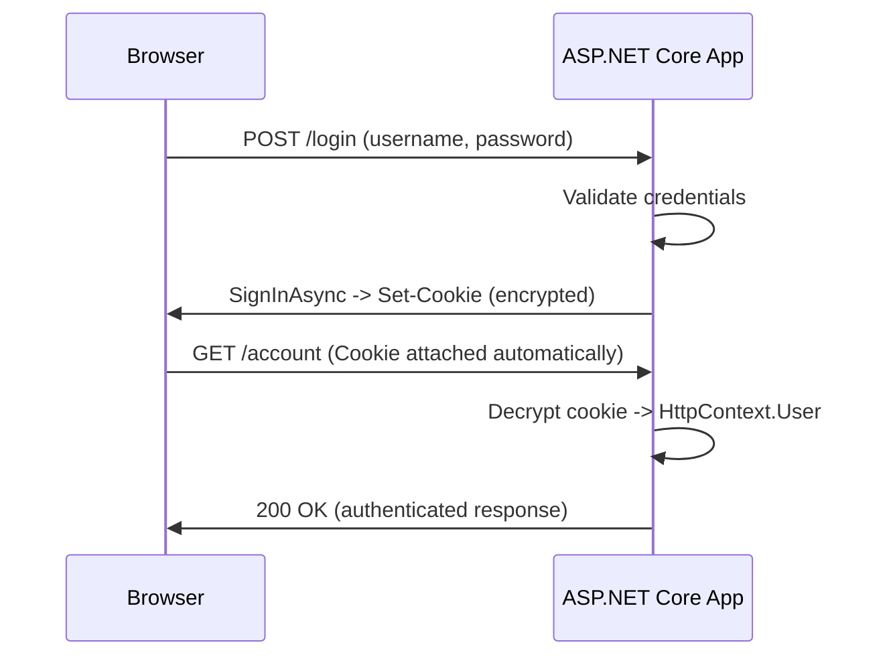
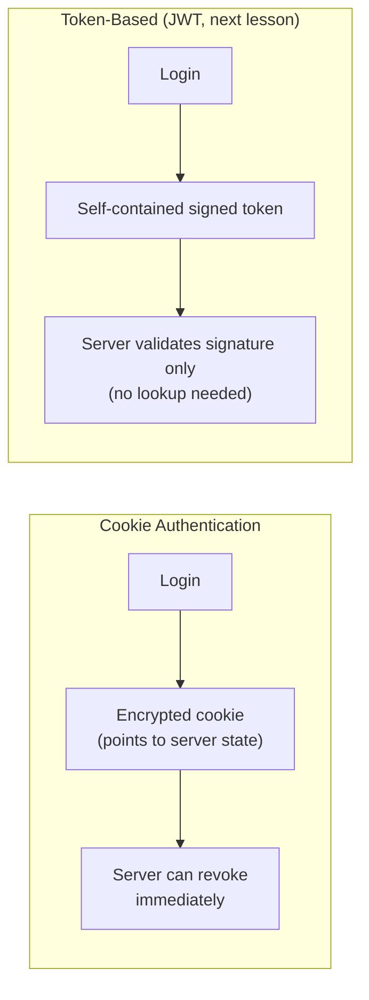

# Cookie Authentication in ASP.NET Core

## Introduction

Before reading this lesson, you should already be comfortable with **[SignalR Groups and Scaling](../14-grpc-signalr-security/14-05-signalr-groups-and-scaling.md)**. Every lesson up to this point has assumed an open connection — anyone who could reach the endpoint could call it. Starting with this lesson, Module 14 turns to a different question entirely: once a request or connection arrives, *who is making it*, and how does the server know that reliably on every single request without asking the user to log in again each time? Cookie authentication is the oldest and, for traditional server-rendered web applications, still the simplest answer to that question, and it's the right place to start before JWTs, OAuth 2.0, and OpenID Connect layer on top of it in the lessons that follow.

By the end of this lesson, you will be able to:

- Explain what an authentication cookie actually contains and why it must be encrypted, not just signed
- Configure cookie authentication with `AddAuthentication().AddCookie()` in an ASP.NET Core app
- Sign a user in and out with `HttpContext.SignInAsync` and `SignOutAsync`
- Read the resulting identity back out through `HttpContext.User` on later requests
- Judge when cookie authentication is the right fit versus when it isn't

## Cookie Authentication — A Layman's Perspective

Picture checking into a hotel. At the front desk, you show your ID, the clerk confirms who you are, and hands you a key card. That key card doesn't contain your name, your passport number, or your home address — it contains a code that means nothing on its own outside the hotel's own system. From that point on, every door in the building — your room, the gym, the pool — reads the card, checks that code against the hotel's own records, and lets you through if it matches. You never have to show your ID again for the rest of your stay. The hotel is doing the remembering, not you.

That key card is the authentication cookie, and the hotel's own front-desk records are the server-side session it points back to. When you log into a website with cookie authentication, the server checks your username and password once, decides you're legitimate, and hands your browser back a small, encrypted cookie — the digital key card. Your browser then does something you never have to think about: on every single subsequent request to that same site, it automatically re-attaches that cookie, the way you'd tap your key card at every door without being asked. The server reads the cookie, decrypts it, confirms it's genuine and hasn't expired, and now knows exactly who's asking — without you typing your password again.

Crucially, just like a lost key card can be deactivated at the front desk without changing every lock in the building, a cookie-authenticated session can be invalidated server-side — the site can force a logout, expire a session early, or reject a stolen cookie — because the server is the one holding the authority over what that cookie means. This is the trait that will matter most when this lesson contrasts with JWTs in the next lesson: a cookie's meaning lives with the issuer, and the issuer can always change its mind.

There's also a very deliberate limitation baked into this design, the same way a hotel key card only works inside that one hotel's doors: browsers only attach a cookie back to the *same site* that issued it. That's exactly why cookie authentication fits a traditional website — where the browser and the server rendering its pages are the same origin — far better than it fits a mobile app talking to an API, or a single-page app calling a completely separate backend on another domain. Those cross-origin, non-browser scenarios are where the next lesson's JWTs take over instead.

The bridge back to code: "checking in" is `SignInAsync`, the key card is the encrypted authentication cookie, the front desk's records are the server's identity data, and "checking out" — handing the card back — is `SignOutAsync`.

## Cookie Authentication — A Programming Language Perspective

**Cookie authentication** is an ASP.NET Core authentication scheme, registered via `AddAuthentication(CookieAuthenticationDefaults.AuthenticationScheme).AddCookie()`, that persists a signed-in user's `ClaimsPrincipal` — their identity plus any claims attached to it — inside an encrypted cookie sent to the browser. Calling `HttpContext.SignInAsync(scheme, claimsPrincipal)` serializes that principal, encrypts it using ASP.NET Core's Data Protection APIs, and attaches it as a `Set-Cookie` header on the response. On every later request, the cookie authentication middleware decrypts the cookie, reconstructs the `ClaimsPrincipal`, and populates `HttpContext.User` before your endpoint code ever runs — so `[Authorize]` and `User.Identity.IsAuthenticated` simply work, with no extra lookup code from you. `HttpContext.SignOutAsync(scheme)` clears the cookie, ending the session. The cookie itself is opaque to the browser and to any script running in the page; only the server, holding the matching Data Protection keys, can make sense of its contents.

## How to Sign a User In and Out with Cookie Authentication

Configuring cookie authentication takes two steps: registering the scheme in the service container, and adding the authentication/authorization middleware to the request pipeline in the right order. Signing in populates the cookie; every request after that arrives already authenticated.


*Figure 1: One explicit sign-in produces a cookie that authenticates every request afterward, with no further credential exchange.*

```csharp
// Program.cs — .NET 10 / C# 14
using Microsoft.AspNetCore.Authentication.Cookies;
using System.Security.Claims;

var builder = WebApplication.CreateBuilder(args);

builder.Services
    .AddAuthentication(CookieAuthenticationDefaults.AuthenticationScheme)
    .AddCookie(options =>
    {
        options.LoginPath = "/login";
        options.ExpireTimeSpan = TimeSpan.FromMinutes(30);
        options.SlidingExpiration = true;
    });
builder.Services.AddAuthorization();

var app = builder.Build();
app.UseAuthentication();
app.UseAuthorization();

app.MapPost("/login", async (HttpContext http, string username) =>
{
    var claims = new List<Claim> { new(ClaimTypes.Name, username) };
    var identity = new ClaimsIdentity(claims, CookieAuthenticationDefaults.AuthenticationScheme);
    var principal = new ClaimsPrincipal(identity);

    await http.SignInAsync(CookieAuthenticationDefaults.AuthenticationScheme, principal);
    return Results.Ok($"Signed in as {username}");
});

app.MapGet("/account", (HttpContext http) =>
    http.User.Identity?.IsAuthenticated == true
        ? Results.Ok($"Hello, {http.User.Identity.Name}")
        : Results.Unauthorized())
    .RequireAuthorization();

app.MapPost("/logout", async (HttpContext http) =>
{
    await http.SignOutAsync(CookieAuthenticationDefaults.AuthenticationScheme);
    return Results.Ok("Signed out");
});

app.Run();
```

**Console Output:**

*Note: authentication and authorization lessons show HTTP request/response traffic — status codes and headers — instead of a `Console.WriteLine` trace, since the interesting behavior happens over HTTP, not in application console output.*

```text
POST /login?username=alice
< HTTP/1.1 200 OK
< Set-Cookie: .AspNetCore.Cookies=CfDJ8N...encrypted...; path=/; httponly; samesite=lax
Signed in as alice

GET /account
> Cookie: .AspNetCore.Cookies=CfDJ8N...encrypted...
< HTTP/1.1 200 OK
Hello, alice

POST /logout
< HTTP/1.1 200 OK
< Set-Cookie: .AspNetCore.Cookies=; expires=Thu, 01-Jan-1970 00:00:00 GMT
Signed out
```

The `Set-Cookie` header on `/login`'s response is the entire authentication handoff: the browser stores that cookie and re-sends it, unprompted, on `/account`. Because `UseAuthentication()` runs before the endpoint, `HttpContext.User` is already populated by the time `/account`'s handler runs — no manual cookie parsing anywhere in that handler. `/logout`'s response clears the cookie by setting its expiry into the past, which is exactly why the *next* request to `/account` would return `401 Unauthorized` again.

## Real-Time Example: Cookie Authentication for the Banking/ATM Web Portal

We extend the Banking/ATM domain with a server-rendered customer web portal — the kind of same-origin, traditional web app cookie authentication suits best, as opposed to the ATM's own machine-to-machine channel or a mobile banking app, both better served by the JWT approach in the next lesson. A customer logs into the portal once; every page view of their account balance and transaction history afterward relies on the same cookie, without a login form appearing again.

```csharp
// Program.cs — .NET 10 / C# 14 — Real-Time Example (Banking/ATM)
using Microsoft.AspNetCore.Authentication.Cookies;
using System.Security.Claims;

var builder = WebApplication.CreateBuilder(args);

builder.Services
    .AddAuthentication(CookieAuthenticationDefaults.AuthenticationScheme)
    .AddCookie(options =>
    {
        options.ExpireTimeSpan = TimeSpan.FromMinutes(15);
        options.SlidingExpiration = true;
        options.Cookie.Name = "BankPortal.Auth";
    });
builder.Services.AddAuthorization();

var app = builder.Build();
app.UseAuthentication();
app.UseAuthorization();

var accounts = new Dictionary<string, decimal>
{
    ["alice"] = 4250.75m,
    ["bob"] = 980.10m
};

app.MapPost("/portal/login", async (HttpContext http, string customerId, string accountTier) =>
{
    if (!accounts.ContainsKey(customerId))
    {
        return Results.Unauthorized();
    }

    List<Claim> claims =
    [
        new(ClaimTypes.Name, customerId),
        new("AccountTier", accountTier)
    ];
    var identity = new ClaimsIdentity(claims, CookieAuthenticationDefaults.AuthenticationScheme);
    await http.SignInAsync(CookieAuthenticationDefaults.AuthenticationScheme, new ClaimsPrincipal(identity));

    return Results.Ok($"Customer '{customerId}' signed in to the portal.");
});

app.MapGet("/portal/balance", (HttpContext http) =>
{
    string customerId = http.User.Identity!.Name!;
    decimal balance = accounts[customerId];
    return Results.Ok($"Account balance for '{customerId}': {balance:C}");
})
.RequireAuthorization();

app.MapPost("/portal/logout", async (HttpContext http) =>
{
    await http.SignOutAsync(CookieAuthenticationDefaults.AuthenticationScheme);
    return Results.Ok("Customer session ended.");
});

app.Run();
```

**Console Output:**

```text
POST /portal/login?customerId=alice&accountTier=Gold
< HTTP/1.1 200 OK
< Set-Cookie: BankPortal.Auth=CfDJ8N...encrypted...; path=/; httponly; samesite=lax
Customer 'alice' signed in to the portal.

GET /portal/balance
> Cookie: BankPortal.Auth=CfDJ8N...encrypted...
< HTTP/1.1 200 OK
Account balance for 'alice': $4,250.75

POST /portal/logout
< HTTP/1.1 200 OK
< Set-Cookie: BankPortal.Auth=; expires=Thu, 01-Jan-1970 00:00:00 GMT
Customer session ended.
```

Notice `accountTier` is stored as a claim on the identity, not looked up again from `accounts` on every request — it rides inside the encrypted cookie itself, ready for the authorization policies built in Lesson 10. This is precisely the shape a real bank's customer portal needs: one login, a short sliding expiration appropriate for financial data, and a server that can end the session immediately if it detects anything suspicious, without waiting for a token to simply expire on its own.

## Cookie Authentication vs. Token-Based Authentication

Cookie authentication ties a user's identity to server-side state that the cookie merely points at — the server can always look up, extend, or revoke that session because it owns the record the cookie references. Token-based schemes, which the next lesson introduces with JWTs, instead pack the identity *inside* the token itself, so the server validates it by checking a signature rather than a database or in-memory session store. That difference is exactly why the two approaches suit different shapes of application: cookies excel when browser and server are the same origin and a human is directly driving a session in real time; tokens excel when the caller isn't a browser at all, or is calling from a different origin, or when many independent services need to validate identity without ever asking a shared session store.


*Figure 2: A cookie is a reference the server controls; a token is a self-contained credential the server merely verifies.*

| Aspect | Cookie Authentication | Token-Based (JWT) |
|---|---|---|
| Where identity lives | Server-side session (or encrypted claims in the cookie itself) | Entirely inside the token |
| Revocation | Immediate — invalidate server-side | Hard — token valid until it expires |
| Best fit | Same-origin, server-rendered web apps | Cross-origin APIs, mobile apps, microservices |
| Sent automatically by browser | Yes, on every matching-origin request | No — client code must attach it explicitly |
| Cross-domain use | Poor (SameSite restrictions) | Good |

## Types of Authentication Approaches in ASP.NET Core

1. **[JWT Authentication](../14-grpc-signalr-security/14-07-jwt-authentication.md)** — the stateless, token-based alternative covered next.
2. **[OAuth 2.0 Fundamentals](../14-grpc-signalr-security/14-08-oauth2-fundamentals.md)** — the authorization framework that often issues the tokens JWT authentication validates.
3. **[OpenID Connect](../14-grpc-signalr-security/14-09-openid-connect.md)** — the identity layer built on top of OAuth 2.0 for federated logins.
4. **[Authorization Policies and Claims](../14-grpc-signalr-security/14-10-authorization-policies-and-claims.md)** — how claims carried by either a cookie or a token drive fine-grained access rules.
5. **Windows Authentication / Negotiate** — an OS-integrated scheme suited to internal corporate networks, not covered as its own lesson in this module.

## What You've Learned & What's Next

Cookie authentication signs a user in once, stores their identity behind an encrypted cookie the browser re-sends automatically, and lets the server revoke that session at will — a strong fit for traditional, same-origin, server-rendered web apps like a bank's customer portal. It is a poor fit, however, for mobile clients and cross-origin APIs, which is exactly the gap the next lesson's approach fills.

Continue your learning journey with **[JWT Authentication](../14-grpc-signalr-security/14-07-jwt-authentication.md)**, where identity moves from a server-held session into a self-contained, signed token designed for exactly those cross-origin and stateless scenarios.

---
*Applies to: .NET 10 / C# 14. Last reviewed 2026-08-16.*
