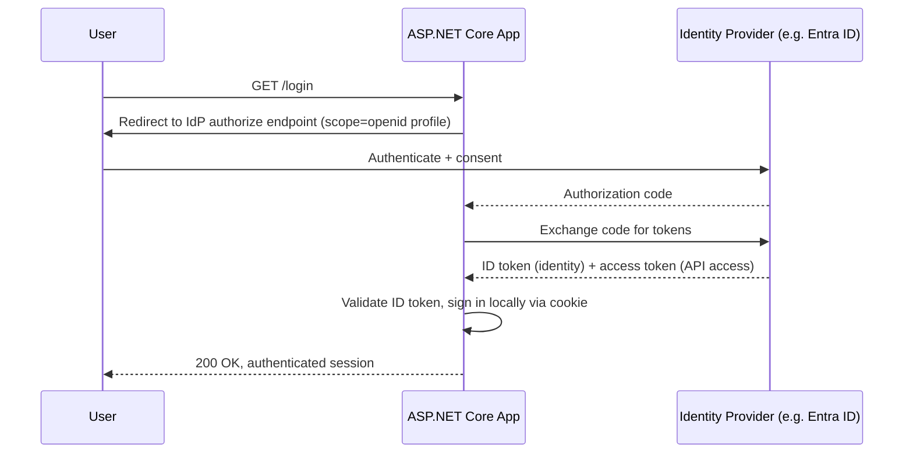
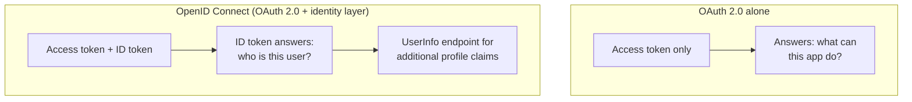

# OpenID Connect

## Introduction

Before reading this lesson, you should already be comfortable with **[OAuth 2.0 Fundamentals](../14-grpc-signalr-security/14-08-oauth2-fundamentals.md)**. That lesson ended on a deliberate gap: OAuth 2.0 issues scoped access tokens that answer "what can this app do?" but never standardizes an answer to "who is this user?" **OpenID Connect (OIDC)** is the thin, purpose-built identity layer that closes exactly that gap, built directly on top of OAuth 2.0's Authorization Code flow rather than replacing it — and it's what real-world "Sign in with..." buttons, backed by providers like Microsoft Entra ID, Google, and Auth0, are actually built on.

By the end of this lesson, you will be able to:

- Explain precisely what OIDC adds on top of OAuth 2.0, and why that addition is what actually provides authentication
- Distinguish the ID token from the access token, and state what each is for
- Describe the `UserInfo` endpoint and standardized identity claims OIDC defines
- Configure `AddOpenIdConnect()` to authenticate against a real identity provider
- Explain how this fits with real providers like Microsoft Entra ID, foreshadowing Module 16

## OpenID Connect — A Layman's Perspective

Return to the valet key from the previous lesson: a valet key proves you're allowed to drive a specific car, but it says nothing about who you are — the parking attendant handing it back doesn't learn your name, your date of birth, or which membership tier you hold. Now picture a different scenario: checking into a conference. At registration, you show your photo ID once, and in exchange you're handed something quite different from a valet key — a proper conference badge, printed with your actual name, your photo, your company, and your registration tier, all verified once by registration staff and now readable at a glance by anyone who looks at it. Every session room you walk into afterward can read that badge and know exactly who you are, immediately, without radioing back to registration to ask.

That printed, verified badge is an OIDC **ID token** — and it is genuinely a different artifact from the valet key (the OAuth 2.0 access token) discussed in the previous lesson, even though both get handed over in the very same conversation at the registration desk. The valet key still exists alongside it — maybe you also get a wristband granting access to the members-only lounge — but the badge is the part that actually answers "who is this person," standardized in a way every session room at the conference agrees to trust and read the same way. That standardization is the entire point: without OIDC, every application wanting to know "who logged in" had to invent its own bespoke way of asking the authorization server, in a slightly different, non-interoperable way each time. OIDC simply says: here is one standard badge format, with a fixed set of fields — a name field, an email field, a unique subject identifier field — that every identity provider agrees to fill in the same way, so every application can read it the same way too.

That's also precisely why "Sign in with Google," "Sign in with Microsoft," and similar buttons all feel so similar from a user's perspective despite being run by entirely different companies — they're all handing back the same standardized kind of badge, just each signed and issued by a different registration desk. Whether that desk happens to be Microsoft Entra ID (the identity platform Module 16 covers in real depth), Google, or a dedicated identity provider like Auth0 barely matters to the application reading the badge, because OIDC standardized what's printed on it and how to verify it's genuine.

The bridge back to code: the badge is the ID token, always a signed JWT with standardized fields; the registration desk is the identity provider's authorization server; and reading a claim like "email" off the badge, rather than making a second phone call to the desk, is exactly what a well-formed OIDC-based sign-in should feel like for the application — one round trip, a trustworthy token, done.

## OpenID Connect — A Programming Language Perspective

**OpenID Connect** is an identity layer specified on top of OAuth 2.0's Authorization Code flow: the client requests the `openid` scope (alongside any OAuth 2.0 scopes it also needs), and the token endpoint's response includes not just an **access token** but also an **ID token** — always a JWT, containing standardized claims such as `sub` (a stable, provider-assigned unique identifier for the user), `iss` (the issuing authority), `aud` (the intended client), `exp`, and typically `name` and `email`. The client validates the ID token's signature against the provider's published signing keys (fetched from a well-known discovery document, `/.well-known/openid-configuration`) and, once validated, can trust its claims as an authenticated fact about the user — no separate call required. A `UserInfo` endpoint is also part of the spec, letting a client fetch additional profile claims using the access token when the ID token alone doesn't carry everything needed. In ASP.NET Core, `AddAuthentication().AddOpenIdConnect(options => ...)` wires a client up to any compliant provider — Microsoft Entra ID, Google, Auth0 — by pointing `options.Authority` at that provider's discovery document and letting the middleware handle the redirect, code exchange, and ID token validation automatically.

## How to Configure AddOpenIdConnect Against an Identity Provider

Configuring OIDC in ASP.NET Core means combining a cookie scheme (to hold the resulting local sign-in, exactly as in Lesson 6) with an OIDC scheme (to perform the actual federated login against the external provider) — the two schemes work together, not in competition.


*Figure 1: The ID token is what the app trusts as proof of identity; the local cookie afterward is just this lesson's earlier mechanism carrying that identity forward.*

```csharp
// Program.cs — .NET 10 / C# 14
using Microsoft.AspNetCore.Authentication.Cookies;
using Microsoft.AspNetCore.Authentication.OpenIdConnect;

var builder = WebApplication.CreateBuilder(args);

builder.Services
    .AddAuthentication(options =>
    {
        options.DefaultScheme = CookieAuthenticationDefaults.AuthenticationScheme;
        options.DefaultChallengeScheme = OpenIdConnectDefaults.AuthenticationScheme;
    })
    .AddCookie()
    .AddOpenIdConnect(options =>
    {
        options.Authority = "https://login.microsoftonline.com/{tenant-id}/v2.0";
        options.ClientId = "demo-client-id";
        options.ClientSecret = "demo-client-secret";
        options.ResponseType = "code";
        options.Scope.Add("openid");
        options.Scope.Add("profile");
        options.SaveTokens = true;
    });
builder.Services.AddAuthorization();

var app = builder.Build();
app.UseAuthentication();
app.UseAuthorization();

app.MapGet("/login", () => Results.Challenge(
    properties: null,
    authenticationSchemes: [OpenIdConnectDefaults.AuthenticationScheme]));

app.MapGet("/profile", (HttpContext http) =>
{
    string? name = http.User.FindFirst("name")?.Value;
    string? subject = http.User.FindFirst("sub")?.Value;
    return Results.Ok($"Authenticated via OIDC as '{name}' (subject: {subject})");
})
.RequireAuthorization();

app.Run();
```

**Console Output:**

*Note: as with all authentication lessons, this shows HTTP request/response traffic rather than a console-app trace.*

```text
GET /login
< HTTP/1.1 302 Found
< Location: https://login.microsoftonline.com/{tenant-id}/v2.0/oauth2/v2.0/authorize?
            client_id=demo-client-id&response_type=code&scope=openid%20profile...

(user authenticates at the identity provider, redirected back with an authorization code)

POST https://login.microsoftonline.com/{tenant-id}/v2.0/oauth2/v2.0/token
< HTTP/1.1 200 OK
{ "id_token": "eyJhbGci...", "access_token": "eyJhbGci...", "expires_in": 3600 }

GET /profile
> Cookie: .AspNetCore.Cookies=... (local session established from validated ID token)
< HTTP/1.1 200 OK
Authenticated via OIDC as 'Alice Chen' (subject: 8f2a-91cd-...)
```

The `/login` endpoint issues an OIDC **challenge**, which the middleware turns into a redirect carrying `scope=openid profile` — that `openid` scope is what tells the provider "issue an ID token, not just an access token." Once the browser returns with a code, the middleware performs the entire token exchange, validates the ID token's signature against Entra ID's published keys, and — because `AddCookie()` is also registered as the default scheme — establishes a local cookie session from the validated claims, exactly like Lesson 6's cookie flow, just fed by a federated identity instead of a local username and password.

## Real-Time Example: OIDC Login for the Library/Inventory Staff Portal

We extend the Library/Inventory Management domain with a staff portal that delegates login entirely to the library system's parent institution — a university, say, using Microsoft Entra ID as its identity provider, a realistic setup for internal line-of-business tools (and the exact scenario Module 16 revisits in depth). Staff never create a separate library-system password; they sign in with their existing institutional account, and the library portal simply trusts the resulting ID token.

```csharp
// Program.cs — .NET 10 / C# 14 — Real-Time Example (Library/Inventory Management)
using Microsoft.AspNetCore.Authentication.Cookies;
using Microsoft.AspNetCore.Authentication.OpenIdConnect;

var builder = WebApplication.CreateBuilder(args);

builder.Services
    .AddAuthentication(options =>
    {
        options.DefaultScheme = CookieAuthenticationDefaults.AuthenticationScheme;
        options.DefaultChallengeScheme = OpenIdConnectDefaults.AuthenticationScheme;
    })
    .AddCookie()
    .AddOpenIdConnect("EntraID", options =>
    {
        options.Authority = "https://login.microsoftonline.com/university-tenant-id/v2.0";
        options.ClientId = "library-staff-portal";
        options.ClientSecret = "portal-client-secret";
        options.ResponseType = "code";
        options.Scope.Add("openid");
        options.Scope.Add("email");
        options.SaveTokens = true;
        options.Events = new OpenIdConnectEvents
        {
            OnTokenValidated = context =>
            {
                string? email = context.Principal?.FindFirst("preferred_username")?.Value;
                Console.WriteLine($"ID token validated for staff member: {email}");
                return Task.CompletedTask;
            }
        };
    });
builder.Services.AddAuthorization();

var app = builder.Build();
app.UseAuthentication();
app.UseAuthorization();

app.MapGet("/staff/login", () => Results.Challenge(
    properties: null,
    authenticationSchemes: ["EntraID"]));

app.MapGet("/staff/dashboard", (HttpContext http) =>
{
    string? email = http.User.FindFirst("preferred_username")?.Value;
    string? name = http.User.FindFirst("name")?.Value;
    return Results.Ok($"Welcome to the Library Staff Portal, {name} ({email}). Catalog access granted.");
})
.RequireAuthorization();

app.Run();
```

**Console Output:**

```text
GET /staff/login
< HTTP/1.1 302 Found
< Location: https://login.microsoftonline.com/university-tenant-id/v2.0/oauth2/v2.0/authorize?
            client_id=library-staff-portal&response_type=code&scope=openid%20email...

(staff member authenticates with their university Entra ID account)

ID token validated for staff member: j.rivera@university.edu

GET /staff/dashboard
> Cookie: .AspNetCore.Cookies=... (local session established from validated ID token)
< HTTP/1.1 200 OK
Welcome to the Library Staff Portal, Jordan Rivera (j.rivera@university.edu). Catalog access granted.
```

The library portal never stores or validates a library-specific password anywhere — it delegates that entire responsibility to the university's Entra ID tenant, and simply reads `preferred_username` and `name` off the validated ID token once the user returns. This is exactly the pattern real institutional software uses: one identity provider, one login experience, trusted uniformly across every internal application, including — as this lesson's next-lesson preview notes — the fine-grained authorization rules that follow once a claim like a staff member's role or department is known.

## OpenID Connect vs. Plain OAuth 2.0

Plain OAuth 2.0, as the previous lesson stressed, issues access tokens and answers only "what can this app do" — an access token's format and content aren't even standardized by the OAuth 2.0 spec itself, and treating an opaque access token as identity proof is a well-known anti-pattern. OIDC keeps OAuth 2.0's entire flow intact — the same Authorization Code flow, the same PKCE protection, the same authorization server — and simply adds one more standardized artifact to the response: the ID token, plus the `UserInfo` endpoint for any additional profile data. Every OIDC login is an OAuth 2.0 flow underneath; not every OAuth 2.0 flow is an OIDC login, because plenty of OAuth 2.0 use cases (like the previous lesson's budgeting-app order history example) never need to know who the user is at all — only what the token permits.


*Figure 2: OIDC is a strict superset of the previous lesson's OAuth 2.0 flow — it doesn't replace the access token, it adds the ID token alongside it.*

| Aspect | Plain OAuth 2.0 | OpenID Connect |
|---|---|---|
| Primary token | Access token (often opaque) | Access token + ID token (always a JWT) |
| Answers identity question | No — not its job | Yes — that's its entire purpose |
| Standardized user claims | Not defined | `sub`, `name`, `email`, etc. |
| Requested scope | Application-specific (e.g. `orders.read`) | Always includes `openid` |
| Real-world providers | Any OAuth 2.0 authorization server | Microsoft Entra ID, Google, Auth0 |

## Types of Identity and Federation Concepts

1. **[OAuth 2.0 Fundamentals](../14-grpc-signalr-security/14-08-oauth2-fundamentals.md)** — the authorization flow OIDC builds directly on top of.
2. **[JWT Authentication](../14-grpc-signalr-security/14-07-jwt-authentication.md)** — the token format the ID token itself always uses.
3. **Microsoft Entra ID integration** — the specific identity platform this lesson's real-time example used, covered in full depth in Module 16.
4. **[Authorization Policies and Claims](../14-grpc-signalr-security/14-10-authorization-policies-and-claims.md)** — how the claims an ID token delivers get turned into concrete access rules, covered next.
5. **The `UserInfo` endpoint** — the standardized OIDC endpoint for fetching profile claims beyond what the ID token itself carries.

## What You've Learned & What's Next

OpenID Connect doesn't replace OAuth 2.0 — it adds a standardized ID token and `UserInfo` endpoint on top of the exact same Authorization Code flow, and that addition is what finally, properly answers "who is this user," the question OAuth 2.0 alone was never designed to answer. Real identity providers like Microsoft Entra ID, Google, and Auth0 are all OIDC-compliant for precisely this reason.

Continue your learning journey with **[Authorization Policies and Claims](../14-grpc-signalr-security/14-10-authorization-policies-and-claims.md)**, where the claims an ID token (or a cookie, or a JWT) carries become the raw material for fine-grained, custom access rules inside your own application.

---
*Applies to: .NET 10 / C# 14. Last reviewed 2026-08-16.*
