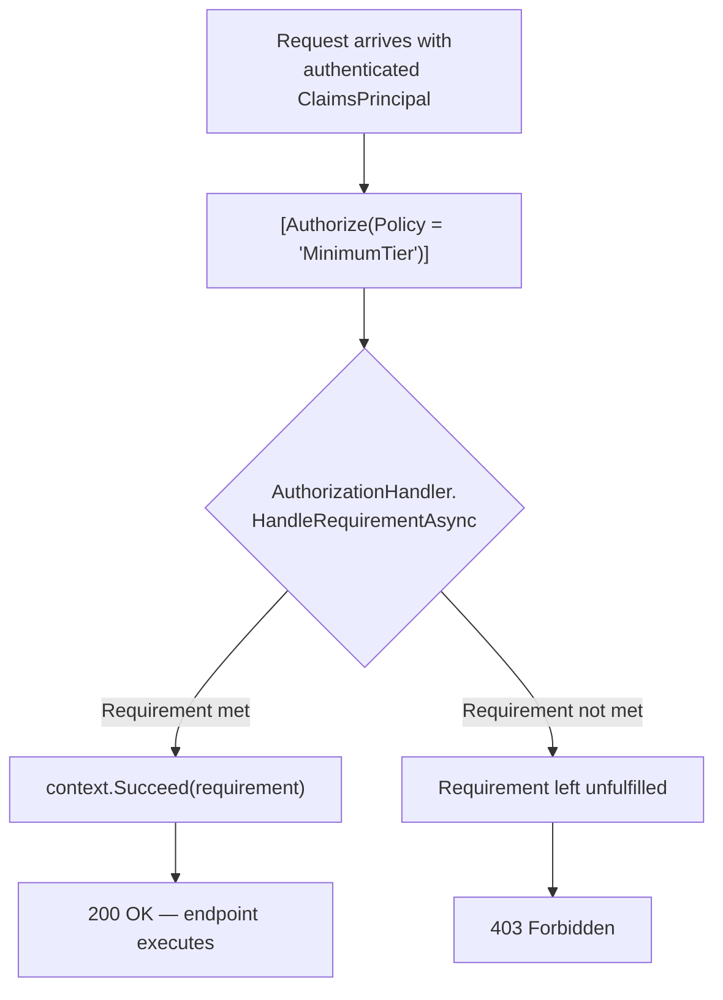
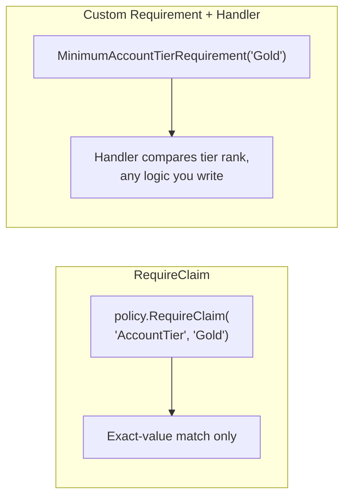

# Authorization Policies and Claims

## Introduction

Before reading this lesson, you should already be comfortable with **[OpenID Connect](../14-grpc-signalr-security/14-09-openid-connect.md)**. Every authentication mechanism this module has covered — a cookie, a JWT, an OIDC ID token — ends at the exact same place: a validated `ClaimsPrincipal` sitting on `HttpContext.User`, carrying a handful of small facts about the caller. This lesson is about what happens *after* that identity is established — how those facts, called **claims**, get turned into actual, fine-grained access decisions: not just "are you logged in?" but "are you specifically allowed to do *this*?"

By the end of this lesson, you will be able to:

- Define a claim precisely, and explain where it comes from regardless of which authentication scheme issued it
- Apply `[Authorize(Policy = "...")]` to protect an endpoint with a named, reusable rule
- Define a simple policy declaratively with `RequireClaim`
- Build a custom, logic-driven policy with `IAuthorizationRequirement` and `IAuthorizationHandler`
- Apply a custom policy to a Banking/ATM scenario requiring a minimum account tier

## Authorization Policies and Claims — A Layman's Perspective

Picture an employee ID badge at a large office building — the same physical badge every employee wears, but printed and encoded with a handful of small facts about that specific employee: their department, their clearance level, their job title, the floor they're assigned to. The badge itself doesn't decide anything; it just carries facts. The decisions happen at each door. The door to the general office floor reads the badge and asks a very simple question: "does this badge have any clearance level at all?" The door to the server room asks a much more specific one: "does this badge's clearance level say 'Level 3' or higher, *and* does its department say 'IT'?" Two doors, two completely different rules, reading facts off the exact same badge.

Those small printed facts — department, clearance level, job title — are exactly what a **claim** is in software: a simple key-value fact about a user, sitt ing right inside their identity, put there once when the badge was issued (during login, whether that login went through a cookie, a JWT, or an OIDC ID token — the badge doesn't care how it was printed, only what's printed on it). And each door's rule — "any clearance at all" versus "Level 3 IT specifically" — is exactly what an authorization **policy** is: a named, reusable rule that inspects the facts on the badge and returns a simple yes or no, completely independent from how the badge was issued in the first place.

The genuinely useful part of this design shows up when the server-room door's rule gets more complicated than a single fact can express — say, the rule actually needs to be "Level 3 IT clearance, *unless* it's a public holiday, in which case only Level 4 will do." A simple door lock that just checks one printed number can't express that. What real high-security buildings do instead is post an actual security officer at that one door, someone empowered to apply whatever judgment the rule requires, checking the badge plus whatever other context matters (today's date, an override list, anything) before deciding. That officer, applying custom logic beyond what a single printed fact could express, is exactly what a custom `IAuthorizationHandler` is: code you write once, applying whatever logic a simple claim check can't, still ultimately returning the same yes-or-no decision every other door relies on.

This lesson's Banking/ATM scenario is a natural fit for exactly this distinction: some operations only need a simple "is this customer logged in at all" check, but transferring above a certain amount, or opening a new investment account, plausibly needs "does this customer's badge say 'AccountTier: Platinum' or higher" — precisely the kind of rule this lesson builds, first the simple way, then the fully custom way.

## Authorization Policies and Claims — A Programming Language Perspective

A **claim** is a `System.Security.Claims.Claim` — a type/value pair (plus an issuer) attached to a `ClaimsIdentity`, populated during authentication regardless of scheme: a cookie's `SignInAsync` call, a JWT's payload, or an OIDC ID token's standardized fields all ultimately produce claims sitting on the same `ClaimsPrincipal`. An authorization **policy** is a named rule, registered via `AddAuthorizationBuilder().AddPolicy(name, policy => ...)`, and applied to an endpoint or controller with `[Authorize(Policy = "PolicyName")]` (or `.RequireAuthorization("PolicyName")` on minimal API endpoints). The simplest policies use `RequireClaim("ClaimType", "value")` directly in the policy builder — a declarative check against one claim's presence or value. When the rule needs actual logic beyond a value match, you define a class implementing `IAuthorizationRequirement` (a plain marker carrying whatever data the check needs) and a corresponding `AuthorizationHandler<TRequirement>` implementing the decision logic in `HandleRequirementAsync`, calling `context.Succeed(requirement)` when the rule passes. ASP.NET Core's authorization middleware runs every registered handler for a policy's requirements before an endpoint executes, and only proceeds if every requirement succeeds.

## How to Define and Apply an Authorization Policy

A policy is registered once, by name, and then referenced from any number of endpoints — the same reusability a named door rule has across every door in the building that needs it.


*Figure 1: The policy's handler runs before the endpoint itself, and the endpoint code never has to check claims manually.*

```csharp
// Program.cs — .NET 10 / C# 14
using System.Security.Claims;
using Microsoft.AspNetCore.Authorization;

var builder = WebApplication.CreateBuilder(args);

builder.Services.AddAuthorizationBuilder()
    .AddPolicy("RequireVerifiedEmail", policy =>
        policy.RequireClaim("email_verified", "true"))
    .AddPolicy("MinimumClearanceLevel", policy =>
        policy.Requirements.Add(new MinimumClearanceRequirement(3)));

builder.Services.AddSingleton<IAuthorizationHandler, MinimumClearanceHandler>();

var app = builder.Build();
app.UseAuthorization();

// Simulate an authenticated request by attaching a ClaimsPrincipal directly for this demo.
app.Use(async (http, next) =>
{
    List<Claim> claims =
    [
        new("email_verified", "true"),
        new("clearance_level", "4")
    ];
    http.User = new ClaimsPrincipal(new ClaimsIdentity(claims, "Demo"));
    await next();
});

app.MapGet("/server-room", () => Results.Ok("Access granted to the server room."))
    .RequireAuthorization("MinimumClearanceLevel");

app.MapGet("/newsletter-signup", () => Results.Ok("Verified email confirmed — signup allowed."))
    .RequireAuthorization("RequireVerifiedEmail");

app.Run();

record MinimumClearanceRequirement(int MinimumLevel) : IAuthorizationRequirement;

class MinimumClearanceHandler : AuthorizationHandler<MinimumClearanceRequirement>
{
    protected override Task HandleRequirementAsync(
        AuthorizationHandlerContext context, MinimumClearanceRequirement requirement)
    {
        string? levelClaim = context.User.FindFirst("clearance_level")?.Value;
        if (int.TryParse(levelClaim, out int level) && level >= requirement.MinimumLevel)
        {
            context.Succeed(requirement);
        }
        return Task.CompletedTask;
    }
}
```

**Console Output:**

*Note: this authorization lesson shows HTTP request/response traffic rather than a console-app trace.*

```text
GET /server-room
< HTTP/1.1 200 OK
Access granted to the server room.

GET /newsletter-signup
< HTTP/1.1 200 OK
Verified email confirmed — signup allowed.
```

`clearance_level: 4` satisfies `MinimumClearanceRequirement(3)` because `MinimumClearanceHandler` compares the two directly, calling `context.Succeed` only when the numeric comparison passes — logic a bare `RequireClaim` value match couldn't express, since `RequireClaim` only checks for an exact value or presence, not a numeric threshold. `RequireVerifiedEmail`, by contrast, needed nothing beyond an exact match, so `RequireClaim("email_verified", "true")` alone was enough, with no custom handler class required at all.

## Real-Time Example: Minimum Account Tier for High-Value ATM Operations

We extend the Banking/ATM domain with a policy that restricts a specific class of operation — opening a linked investment sub-account from the ATM — to customers whose identity carries an `AccountTier` claim of at least `Gold`. This claim would, in a real system, have been embedded during the customer's login (Lesson 6's cookie flow for a branch portal, or Lesson 7's JWT for the ATM's own backend channel) and simply carried forward to this authorization check with no separate database lookup needed.

```csharp
// Program.cs — .NET 10 / C# 14 — Real-Time Example (Banking/ATM)
using System.Security.Claims;
using Microsoft.AspNetCore.Authorization;

var builder = WebApplication.CreateBuilder(args);

builder.Services.AddAuthorizationBuilder()
    .AddPolicy("MinimumGoldTier", policy =>
        policy.Requirements.Add(new MinimumAccountTierRequirement("Gold")));

builder.Services.AddSingleton<IAuthorizationHandler, MinimumAccountTierHandler>();

var app = builder.Build();
app.UseAuthorization();

var tierRank = new Dictionary<string, int> { ["Standard"] = 1, ["Silver"] = 2, ["Gold"] = 3, ["Platinum"] = 4 };

app.MapPost("/atm/open-investment-account", (HttpContext http, string customerId) =>
{
    string tier = http.User.FindFirst("AccountTier")?.Value ?? "Standard";
    return Results.Ok($"Investment sub-account opened for '{customerId}' (tier: {tier}).");
})
.RequireAuthorization("MinimumGoldTier");

// Simulate two customers hitting the endpoint with different AccountTier claims.
async Task SimulateRequest(string customerId, string tier)
{
    using var scope = app.Services.CreateScope();
    var httpContext = new DefaultHttpContext { RequestServices = scope.ServiceProvider };
    httpContext.User = new ClaimsPrincipal(new ClaimsIdentity(
        [new Claim("AccountTier", tier), new Claim(ClaimTypes.Name, customerId)], "Demo"));

    var authService = scope.ServiceProvider.GetRequiredService<IAuthorizationService>();
    AuthorizationResult result = await authService.AuthorizeAsync(httpContext.User, "MinimumGoldTier");

    Console.WriteLine(result.Succeeded
        ? $"POST /atm/open-investment-account?customerId={customerId} (AccountTier: {tier}) -> 200 OK: Investment sub-account opened for '{customerId}' (tier: {tier})."
        : $"POST /atm/open-investment-account?customerId={customerId} (AccountTier: {tier}) -> 403 Forbidden: minimum 'Gold' tier required.");
}

await SimulateRequest("cust-9001", "Platinum");
await SimulateRequest("cust-4412", "Silver");

app.Run();

record MinimumAccountTierRequirement(string MinimumTier) : IAuthorizationRequirement;

class MinimumAccountTierHandler : AuthorizationHandler<MinimumAccountTierRequirement>
{
    private static readonly Dictionary<string, int> TierRank = new()
    {
        ["Standard"] = 1, ["Silver"] = 2, ["Gold"] = 3, ["Platinum"] = 4
    };

    protected override Task HandleRequirementAsync(
        AuthorizationHandlerContext context, MinimumAccountTierRequirement requirement)
    {
        string customerTier = context.User.FindFirst("AccountTier")?.Value ?? "Standard";

        if (TierRank.TryGetValue(customerTier, out int customerRank) &&
            TierRank.TryGetValue(requirement.MinimumTier, out int requiredRank) &&
            customerRank >= requiredRank)
        {
            context.Succeed(requirement);
        }

        return Task.CompletedTask;
    }
}
```

**Console Output:**

```text
POST /atm/open-investment-account?customerId=cust-9001 (AccountTier: Platinum) -> 200 OK: Investment sub-account opened for 'cust-9001' (tier: Platinum).
POST /atm/open-investment-account?customerId=cust-4412 (AccountTier: Silver) -> 403 Forbidden: minimum 'Gold' tier required.
```

`cust-9001`'s `Platinum` claim outranks the `Gold` minimum, so `MinimumAccountTierHandler` succeeds the requirement and the operation proceeds; `cust-4412`'s `Silver` claim ranks below `Gold`, so the requirement is never satisfied and the bank correctly refuses to open the investment sub-account. Critically, `MinimumAccountTierHandler` never queries a database to learn the customer's tier — it reads the claim straight off the already-validated identity, exactly the efficiency gain a claims-based identity is designed to deliver: the fact was established once, at login, and every downstream authorization check simply trusts it.

## RequireClaim vs. a Custom IAuthorizationRequirement/IAuthorizationHandler

`RequireClaim` is the right tool exactly when a policy reduces to "does this specific claim exist, optionally with one of these specific values" — no comparison, no external data, no combined conditions. It reads as a single declarative line and needs no supporting class. A custom `IAuthorizationRequirement` paired with an `IAuthorizationHandler` becomes necessary the moment the rule needs actual logic: a numeric threshold (this lesson's tier ranking), a comparison between two different claims, a check against something outside the claims entirely (today's date, a feature flag, a resource being accessed), or multiple independent conditions combined with real branching. The tradeoff is directness versus flexibility — `RequireClaim` is nearly free to write and read; a custom handler is a small amount of extra ceremony that buys back arbitrary decision logic, running through the exact same `[Authorize(Policy = "...")]` pipeline either way.


*Figure 2: Both plug into the same `[Authorize(Policy = "...")]` pipeline — the difference is entirely in how much decision logic the check needs.*

| Aspect | `RequireClaim` | Custom Requirement + Handler |
|---|---|---|
| Setup | One line in policy builder | A requirement class + a handler class |
| Logic supported | Exact value / presence match | Any comparison, ranking, or external check |
| Registration | None beyond the policy itself | `AddSingleton<IAuthorizationHandler, T>()` |
| Best for | Simple, fixed-value claims (`email_verified`) | Threshold or multi-condition rules (`AccountTier` ranking) |
| Reusability | Per exact value needed | Fully reusable across any tier/threshold via constructor data |

## Types of Authorization Building Blocks in ASP.NET Core

1. **[OpenID Connect](../14-grpc-signalr-security/14-09-openid-connect.md)** — one common source of the claims this lesson's policies inspect, via a validated ID token.
2. **[JWT Authentication](../14-grpc-signalr-security/14-07-jwt-authentication.md)** — another common claims source, carried inside the token payload itself.
3. **[Role-Based vs Policy-Based Authorization](../14-grpc-signalr-security/14-11-role-based-vs-policy-based-authz.md)** — next lesson, contrasting this lesson's flexible policies against the simpler, older role-check model.
4. **Resource-based authorization** — policies that evaluate against a specific resource instance (an `AuthorizationHandler<TRequirement, TResource>`), an extension of this lesson's handler pattern.
5. **Claims transformation** — reshaping or enriching a `ClaimsPrincipal`'s claims after authentication but before authorization runs, useful when a claim like `AccountTier` needs deriving rather than reading directly.

## What You've Learned & What's Next

Claims are small, portable facts attached to an identity by whichever authentication scheme established it, and authorization policies are named, reusable rules that inspect those claims to make an access decision — `RequireClaim` for simple exact-value checks, a custom `IAuthorizationRequirement`/`IAuthorizationHandler` pair the moment real logic, like this lesson's account-tier ranking, is required.

Continue your learning journey with **[Role-Based vs Policy-Based Authorization](../14-grpc-signalr-security/14-11-role-based-vs-policy-based-authz.md)**, where we contrast this lesson's flexible, claims-driven policies against the older, simpler role-based model, and clarify when each one is the better fit.

---
*Applies to: .NET 10 / C# 14. Last reviewed 2026-08-16.*
