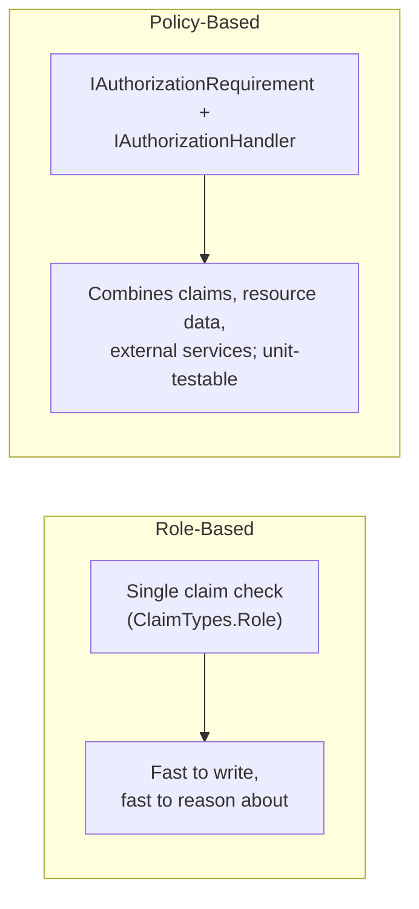

# Role-Based vs Policy-Based Authorization

## Introduction

Before reading this lesson, you should already be comfortable with **[Authorization Policies and Claims](../14-grpc-signalr-security/14-10-authorization-policies-and-claims.md)** — in particular, the idea that a role is nothing special under the hood, just an ordinary claim with the type `ClaimTypes.Role`, and that a policy is a named, reusable authorization requirement built out of claims like that one. This lesson puts those two ideas side by side as a genuine engineering choice: `[Authorize(Roles = "Admin")]` versus `[Authorize(Policy = "...")]`, and — more usefully than either concept alone — a working sense of exactly when the simple version is the right call and when reaching for a policy stops being optional.

By the end of this lesson, you will be able to:

- Explain what `[Authorize(Roles = "...")]` actually checks at run time, and why it's just a convenience wrapper around a claim
- Write a policy-based authorization requirement that combines a role with additional claims
- Identify the concrete limitations that make role-based authorization the wrong tool for a given scenario
- Decide, for a real endpoint, whether a role check is genuinely sufficient or a policy is required
- Explain why policies are unit-testable in a way that scattered role-string checks are not

## Role-Based vs Policy-Based Authorization — A Layman's Perspective

Picture two very different ways a large public library decides who's allowed behind the staff-only door to the rare books room. The first library keeps it simple: everyone wears a badge that says either "Staff" or "Visitor," and the door has one rule, checked by whoever's standing there — "Staff badge, you're in; Visitor badge, you're not." That's the entire policy, and for a plain, low-stakes storage closet holding nothing more sensitive than spare furniture, it's genuinely all the door needs. One badge, one glance, one decision.

Now picture the rare books room itself, holding first editions worth more than the building. This library doesn't trust "Staff badge" alone anymore, because plenty of staff — a new part-time shelver, someone from the finance office who technically has a staff badge — have no business handling a 400-year-old manuscript unsupervised. So the door to this room doesn't just check the badge color. It checks a whole combination written on a laminated card taped next to the door: "Admitted only if: badge says Staff, AND badge shows at least three years of service, AND today's log shows the visitor signed the rare-books handling waiver this month, AND it is currently within staffed hours." Some days that combination might let in exactly one person; other days, three. The rule isn't "which badge do you have" anymore — it's "does this specific combination of facts about you, checked together, satisfy every condition we've decided actually matters here."

Here's the detail that matters most: the *first* door's badge check and the *second* door's laminated-card check aren't really two unrelated systems. The badge itself is just one small fact about a person — "this person is Staff" — and the laminated card is really nothing more than a slightly longer list of facts, all checked together instead of just one. The rare books door didn't invent some entirely separate mechanism; it took the exact same idea — "check some fact about this person" — and simply allowed *more than one fact*, combined with logic, instead of stopping at the first one.

That's precisely the relationship between role-based and policy-based authorization in an application. `[Authorize(Roles = "Admin")]` is the furniture closet's door: one fact checked — does this identity carry the "Admin" role claim — and a single yes/no answer. Policy-based authorization is the rare books room's laminated card: a named, written-down combination of facts — a role, plus a minimum years-of-service claim, plus a time-of-day check, plus whatever else the scenario genuinely requires — evaluated together as one reusable rule. Neither approach is "more advanced" in some abstract sense; a furniture closet that suddenly required a laminated card with four conditions would just be annoying, and a rare books room secured by nothing but a badge color would be a real problem waiting to happen. The skill this lesson is actually teaching is recognizing, for a given door, which one you're standing in front of.

## Role-Based vs Policy-Based Authorization — A Programming Language Perspective

`[Authorize(Roles = "Admin")]` (and its multi-role form, `[Authorize(Roles = "Admin,Manager")]`, meaning "any one of these") is syntactic sugar over a check against `ClaimTypes.Role` claims on the current `ClaimsPrincipal` — `User.IsInRole("Admin")` under the hood — evaluated with simple OR logic across a comma-separated role list, and no logic beyond that. **Policy-based authorization**, registered via `builder.Services.AddAuthorizationBuilder().AddPolicy("PolicyName", policy => policy.RequireRole(...).RequireClaim(...).AddRequirements(new CustomRequirement()))`, evaluates one or more `IAuthorizationRequirement` objects, each handled by an `IAuthorizationHandler` that can inspect the full `ClaimsPrincipal`, the resource being accessed, and arbitrary injected services — making a decision role-based checks structurally cannot express, such as combining two claims with AND logic, calling into a database, or comparing a resource's owner to the current user. A policy is applied identically to a role check syntactically — `[Authorize(Policy = "SeniorStaffOnly")]` — but the decision behind that attribute can be arbitrarily rich, and, being an ordinary class implementing `IAuthorizationHandler`, is directly unit-testable without spinning up HTTP infrastructure at all.

## How to Choose Between a Role Check and a Policy

Use a role check when the entire decision genuinely is "does this identity carry claim X" — nothing more. Reach for a policy the moment the real rule is "X, and also Y" — because `[Authorize(Roles = "...")]` has no mechanism to express an AND condition or reference anything beyond the role claims already on the principal.

```mermaid
flowchart TD
    A["Endpoint needs an authorization check"] --> B{"Is the entire rule\njust one role claim?"}
    B -->|"Yes"| C["[Authorize(Roles = \"...\")]\nis sufficient"]
    B -->|"No — combines role + another\nclaim, resource ownership,\nor external data"| D["Write a policy:\nIAuthorizationRequirement + Handler"]
    D --> E["[Authorize(Policy = \"...\")]"]
```
*Figure 1: The fork is always the same question — one fact, or a combination of facts?*

```csharp
// Program.cs — .NET 10 / C# 14
using System.Security.Claims;
using Microsoft.AspNetCore.Authorization;

var builder = WebApplication.CreateBuilder(args);

builder.Services.AddAuthorizationBuilder()
    .AddPolicy("SeniorStaffOnly", policy => policy
        .RequireRole("Staff")
        .RequireAssertion(context =>
        {
            Claim? yearsClaim = context.User.FindFirst("YearsOfService");
            return yearsClaim is not null
                && int.TryParse(yearsClaim.Value, out int years)
                && years >= 3;
        }));

var app = builder.Build();

// Simple role check — "is this identity Staff at all?"
app.MapGet("/staff-lounge", () => Results.Ok("Welcome to the staff lounge."))
   .RequireAuthorization(new AuthorizeAttribute { Roles = "Staff" });

// Policy check — "Staff AND at least 3 years of service"
app.MapGet("/rare-books-room", () => Results.Ok("Rare books room unlocked."))
   .RequireAuthorization("SeniorStaffOnly");

app.Run();
```

**Console Output** *(this is an ASP.NET Core app — "output" here is the HTTP response for two staff members with different claims):*

```text
GET /staff-lounge     (Staff, YearsOfService=1)  --> 200 OK  "Welcome to the staff lounge."
GET /rare-books-room  (Staff, YearsOfService=1)  --> 403 Forbidden
GET /rare-books-room  (Staff, YearsOfService=5)  --> 200 OK  "Rare books room unlocked."
```

Both staff members pass the role-only check on `/staff-lounge` — role-based authorization never looks any further than the role claim. On `/rare-books-room`, the same "Staff" role is necessary but no longer sufficient: the policy's `RequireAssertion` also inspects the `YearsOfService` claim, so only the second staff member — who satisfies both conditions — gets through. `[Authorize(Roles = "Staff")]` has no syntax capable of expressing that second condition at all.

## Real-Time Example: Library/Inventory Management — Checkout Desk vs Branch Manager Overrides

We extend the Library/Inventory Management domain with two operations at very different trust levels. Checking a book out to a member is a routine action any front-desk staff member performs dozens of times a day — a single role check, `Staff`, is completely sufficient, and building anything more elaborate would just slow the desk down for no real benefit. Waiving a member's overdue fine, on the other hand, is a financial decision the library only wants a branch manager making, and only for members registered at *that manager's own branch* — a rule role-based authorization has no way to express, because it depends on comparing two pieces of data (the manager's branch, and the member's branch) rather than checking a single claim in isolation.

```csharp
// Program.cs — .NET 10 / C# 14 — Real-Time Example (Library/Inventory Management)
using Microsoft.AspNetCore.Authorization;

var builder = WebApplication.CreateBuilder(args);

builder.Services.AddAuthorizationBuilder()
    .AddPolicy("SameBranchManagerOnly", policy => policy
        .RequireRole("BranchManager")
        .RequireAssertion(context =>
        {
            string? managerBranch = context.User.FindFirst("BranchId")?.Value;
            var httpContext = context.Resource as HttpContext;
            string? targetBranch = httpContext?.Request.RouteValues["branchId"] as string;
            return managerBranch is not null && managerBranch == targetBranch;
        }));

var app = builder.Build();

// Routine, high-frequency action — a plain role check is genuinely enough.
app.MapPost("/books/{bookId}/checkout", (string bookId) =>
       Results.Ok(new { bookId, status = "CheckedOut" }))
   .RequireAuthorization(new AuthorizeAttribute { Roles = "Staff,BranchManager" });

// Sensitive, cross-cutting action — needs role AND a same-branch match.
app.MapPost("/branches/{branchId}/members/{memberId}/waive-fine", (string branchId, string memberId, decimal amount) =>
       Results.Ok(new { branchId, memberId, waivedAmount = amount, status = "FineWaived" }))
   .RequireAuthorization("SameBranchManagerOnly");

app.Run();
```

**Console Output** *(HTTP responses for a manager assigned to branch `BR-02`):*

```text
POST /books/978-0132350884/checkout                       (Staff, BranchId=BR-02)  --> 200 OK   {"bookId":"978-0132350884","status":"CheckedOut"}
POST /branches/BR-02/members/M-4471/waive-fine  (amount=5.00)  (BranchManager, BranchId=BR-02)  --> 200 OK   {"branchId":"BR-02","memberId":"M-4471","waivedAmount":5.00,"status":"FineWaived"}
POST /branches/BR-05/members/M-8820/waive-fine  (amount=5.00)  (BranchManager, BranchId=BR-02)  --> 403 Forbidden
```

The checkout endpoint accepts either `Staff` or `BranchManager` on a single role check — exactly the "furniture closet" case from this lesson's analogy, where one fact is all that matters. The fine-waiver endpoint requires `BranchManager` and rejects the third request even though the caller genuinely is a branch manager, because their `BranchId` claim (`BR-02`) doesn't match the branch in the route (`BR-05`) — a manager cannot waive fines at a branch they don't run. No amount of role-string cleverness expresses that; it requires comparing two independent facts, which is exactly what a policy's handler exists to do.

## Coarse-Grained vs Fine-Grained Authorization

Role-based and policy-based authorization aren't really competing systems — a role check is a policy check with the simplest possible requirement, and every `[Authorize(Roles = "...")]` attribute could be rewritten as a policy that does nothing but call `RequireRole`. The real distinction is coarse-grained versus fine-grained: how much context the decision needs beyond "which group is this identity in."


*Figure 2: Role-based authorization is the degenerate, single-condition case of the same policy pipeline.*

| Aspect | Role-Based (`Roles = "..."`) | Policy-Based (`Policy = "..."`) |
|---|---|---|
| What it checks | One claim type (`ClaimTypes.Role`) | Any combination of claims, resource data, or injected services |
| Logic expressiveness | OR across listed roles only | Arbitrary AND/OR/custom logic in a handler |
| Can it inspect the resource being accessed? | No | Yes, via resource-based authorization (`AuthorizeAsync(user, resource, policy)`) |
| Testability | Requires exercising `User.IsInRole` indirectly | Handler is a plain class — test it directly, no HTTP pipeline needed |
| When it's the right choice | The rule genuinely is one group membership check | The rule combines multiple facts or depends on data outside the token |

## Types of Authorization Requirements in ASP.NET Core

1. **Role requirements** (`RequireRole`) — this lesson's simplest case, a thin wrapper over a single claim type.
2. **Claim requirements** (`RequireClaim`) — checking any claim, or claim value, beyond just role — the mechanism underlying **[Authorization Policies and Claims](../14-grpc-signalr-security/14-10-authorization-policies-and-claims.md)**.
3. **Assertion-based requirements** (`RequireAssertion`) — an inline predicate over the full `AuthorizationHandlerContext`, used for the branch-matching logic in this lesson's Real-Time Example.
4. **Custom `IAuthorizationRequirement` + `IAuthorizationHandler` pairs** — the fully general form, capable of injecting a database-backed service to make a decision no claim alone could express.
5. **Resource-based authorization** — a policy evaluated against a specific object instance (e.g. "is this the owner of *this* book loan"), not just the identity's claims in isolation.
6. **[Cryptography in .NET: Hashing](../14-grpc-signalr-security/14-12-cryptography-hashing.md)** — next lesson, shifting from "who is allowed to do this" to "how is a credential safely stored in the first place."

## What You've Learned & What's Next

A role is just a claim, and `[Authorize(Roles = "...")]` is just a single-condition policy in disguise — genuinely sufficient whenever an endpoint's entire authorization rule really is one group membership check, and genuinely insufficient the moment the rule needs to combine that role with another claim, compare it against the resource being accessed, or consult data a token never carried in the first place. Policy-based authorization is that same pipeline generalized, and it costs little more to write while being directly unit-testable as ordinary handler classes.

Continue your learning journey with **[Cryptography in .NET: Hashing](../14-grpc-signalr-security/14-12-cryptography-hashing.md)**, where the focus shifts from deciding who's allowed to do what, to making sure a stolen password database doesn't hand an attacker anyone's actual password.

---
*Applies to: .NET 10 / C# 14. Last reviewed 2026-08-16.*
