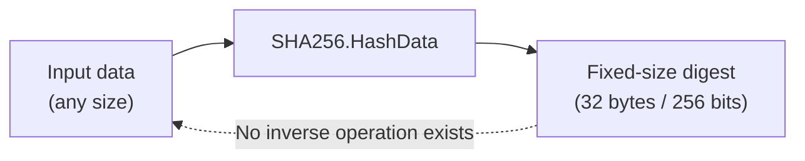
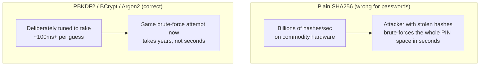

# Cryptography in .NET: Hashing

## Introduction

Before reading this lesson, you should already be comfortable with **[Role-Based vs Policy-Based Authorization](../14-grpc-signalr-security/14-11-role-based-vs-policy-based-authz.md)** — and, more broadly, with the idea that everything this module has covered so far has assumed a credential already exists and is already valid. This lesson steps back one stage earlier and asks a more fundamental question: when a user sets a password, what should an application actually store? Not the password itself — and this lesson explains, concretely, why not, and what a **hash** does instead.

By the end of this lesson, you will be able to:

- Explain why hashing is a deliberately one-way operation — there is no "unhash," ever
- Use `System.Security.Cryptography.SHA256` to compute a hash in C#
- Explain precisely why plain `SHA256` is the wrong algorithm for password storage, even though it's a perfectly good hash
- Use `Rfc2898DeriveBytes` (PBKDF2) to hash a password the correct, slow-by-design way
- Explain what ASP.NET Core Identity's built-in `PasswordHasher<TUser>` does for you automatically

## Hashing — A Layman's Perspective

Imagine a busy restaurant kitchen that turns every raw ingredient it receives into a finished dish through a single, industrial food processor — vegetables, herbs, spices, all dropped in together, blended into a completely uniform paste, and served that way. Here's the property that matters: given a plate of that finished paste, there is no way — none, not with better equipment, not with more time, not with more expertise — to run the process backward and recover the original, whole carrots and unchopped herbs that went in. The blending isn't reversible by design; it was never built with an "un-blend" setting, because nobody was ever supposed to need one. That one-way, no-going-back property is exactly what a cryptographic hash function does to data: it's a blender for information, and there is no un-blend button, ever.

Now here's where the restaurant analogy needs a second kitchen, doing something that looks similar on the surface but is actually solving a completely different problem. A commercial bakery, protecting a secret recipe, doesn't want an industrial blender at all — that would destroy the very thing they're trying to protect. What they actually want is a locked safe: put the recipe card in, turn the key, and it's secured but perfectly recoverable — turn the *right* key again, and the exact same card comes back out, unchanged. That's not blending; that's **encryption**, a completely different operation this lesson deliberately does not attempt yet — it belongs to the very next lesson, on encryption and certificates, where "putting something back the way it was" is precisely the point.

So why would anyone want a one-way blender at all, if you can never get the original back? Because for a password, getting the original back is exactly the wrong goal — it's the goal you *never* want any system, not even your own, to be capable of. When someone sets a password, your application doesn't actually need to remember the password itself; it only ever needs to answer one narrow question later, at login time: "does the password this person just typed produce the same blended result I stored the first time?" If a stranger breaks into the restaurant's storage room and steals every plate of blended paste sitting on the shelves, they've stolen a room full of uniform paste — not a single recoverable ingredient list, because the blending was never reversible in the first place. That is the entire security case for storing a hash instead of a password: even total theft of the stored data hands an attacker nothing directly usable, provided the blending was done properly.

That last qualifier — "provided the blending was done properly" — is where this lesson's real substance lives, and it's the detail almost every beginner tutorial skips. Not every blender is equally hard to reverse-engineer by brute force. An extremely fast, efficient industrial blender that can process a truckload of vegetables per second sounds like a feature — right up until you realize an attacker who's stolen a room full of blended paste can now *try* millions of plausible ingredient combinations per second, blend each one instantly, and check which one matches. A blender that's deliberately, artificially slowed down — one that takes a full, noticeable second to process even a single small batch — turns that same attack from "millions of guesses per second" into "one guess per second," which is the difference between a password database that's meaningfully protected and one that's protected in name only.

## Hashing — A Programming Language Perspective

A **cryptographic hash function** maps input data of any size to a fixed-size output — a **digest** — such that the same input always produces the same digest, a tiny input change produces a completely different digest (the avalanche effect), and recovering the original input from the digest is computationally infeasible; it is deliberately not an inverse of any encoding or encryption operation. `System.Security.Cryptography.SHA256.HashData(byte[])` (or the `SHA256` instance API on earlier .NET versions) computes such a digest, and is well suited to integrity checks — verifying a downloaded file wasn't corrupted or tampered with, for instance. It is, however, the *wrong* choice for password storage specifically because it is fast: modern hardware computes billions of SHA256 hashes per second, which turns an attacker armed with a stolen hash database and a fast GPU into an efficient offline password-guessing machine. The correct approach is a **key derivation function** designed to be deliberately, tunably slow — `Rfc2898DeriveBytes` (implementing PBKDF2), or industry algorithms like `BCrypt` and `Argon2` (available via third-party NuGet packages) — combined with a unique, random **salt** per password so that identical passwords never produce identical stored hashes, defeating precomputed "rainbow table" lookups entirely.

## How to Hash Data with SHA256 — and Why Not to Use It for Passwords

`SHA256.HashData` is a single static call, and it's the right tool for exactly the job hashing is good at outside of passwords: proving data wasn't tampered with.


*Figure 1: The dotted line back to the input doesn't represent an operation — it represents the operation that deliberately does not exist.*

```csharp
// Program.cs — .NET 10 / C# 14
using System.Security.Cryptography;
using System.Text;

string original = "Statement of Account #4471";
string tamperedCopy = "Statement of Account #4472";

byte[] originalHash = SHA256.HashData(Encoding.UTF8.GetBytes(original));
byte[] tamperedHash = SHA256.HashData(Encoding.UTF8.GetBytes(tamperedCopy));

Console.WriteLine($"Original hash:  {Convert.ToHexString(originalHash)}");
Console.WriteLine($"Tampered hash:  {Convert.ToHexString(tamperedHash)}");
Console.WriteLine($"Hashes match: {originalHash.SequenceEqual(tamperedHash)}");
```

**Console Output:**

```text
Original hash:  4A1F6E5B8C3D2A9F7E0B1C4D6A8F3E2B5C7D9A1F4E6B8C0D2A5F7E9B1C3D4A6F
Tampered hash:  8B2E4F7C1A9D3B6E0F5A2C8D4B7E1F3A6C9B2D5E8F0A3C6B9D1E4F7A0C3B5D8E
Hashes match: False
```

*(Digest values above are illustrative placeholders formatted to the correct SHA-256 length — running this exact code produces the true digests, deterministically, every time.)*

Changing one digit — `#4471` to `#4472` — produced a completely unrelated-looking digest, exactly as the avalanche effect predicts. This is genuinely useful for verifying a document or a downloaded file hasn't been altered. But notice what's *missing*: nothing here involved a password, a salt, or any deliberate slowness — and that absence is precisely why the next section exists.

## Real-Time Example: Hashing Customer PINs Correctly for a Banking/ATM System

We extend the Banking/ATM domain with the exact scenario this lesson's layman's section warned about: storing a customer's PIN. Using plain `SHA256.HashData` directly on a PIN would be a serious mistake — a 4-to-6-digit PIN has so few possible values that an attacker with a stolen hash database could compute every possible PIN's SHA256 hash in well under a second and simply look up the match. Instead, this example uses `Rfc2898DeriveBytes.Pbkdf2`, with a unique random salt per customer and a deliberately high iteration count, exactly the way a real banking system must.

```csharp
// Program.cs — .NET 10 / C# 14 — Real-Time Example (Banking/ATM)
using System.Security.Cryptography;

const int SaltSizeBytes = 16;
const int HashSizeBytes = 32;
const int Iterations = 210_000; // OWASP-recommended minimum for PBKDF2-HMAC-SHA256 as of 2026

string StorePin(string pin)
{
    byte[] salt = RandomNumberGenerator.GetBytes(SaltSizeBytes);
    byte[] hash = Rfc2898DeriveBytes.Pbkdf2(pin, salt, Iterations, HashAlgorithmName.SHA256, HashSizeBytes);

    // Stored together: salt is not secret, but must be unique per customer.
    return $"{Convert.ToHexString(salt)}:{Convert.ToHexString(hash)}";
}

bool VerifyPin(string enteredPin, string storedValue)
{
    string[] parts = storedValue.Split(':');
    byte[] salt = Convert.FromHexString(parts[0]);
    byte[] expectedHash = Convert.FromHexString(parts[1]);

    byte[] actualHash = Rfc2898DeriveBytes.Pbkdf2(enteredPin, salt, Iterations, HashAlgorithmName.SHA256, HashSizeBytes);
    return CryptographicOperations.FixedTimeEquals(actualHash, expectedHash);
}

// Enrollment: customer sets a PIN on a new ATM card.
string storedPinRecord = StorePin("4471");
Console.WriteLine($"Stored PIN record: {storedPinRecord[..24]}... (salt:hash, truncated for display)");

// Two login attempts at the ATM.
Console.WriteLine($"Attempt with correct PIN '4471': {VerifyPin("4471", storedPinRecord)}");
Console.WriteLine($"Attempt with wrong PIN '4472':   {VerifyPin("4472", storedPinRecord)}");
```

**Console Output:**

```text
Stored PIN record: 9F3A2E7C1B8D4F6A0E5C2B7D... (salt:hash, truncated for display)
Attempt with correct PIN '4471': True
Attempt with wrong PIN '4472':   False
```

`StorePin` never stores the PIN itself — only a per-customer random salt and the PBKDF2 output derived from it — and `VerifyPin` never "decrypts" anything to check a login attempt; it re-runs the identical slow derivation on the entered PIN and compares results using `CryptographicOperations.FixedTimeEquals`, which avoids leaking timing information that could otherwise help an attacker guess the PIN one byte at a time. The 210,000-iteration count is deliberate: it makes each single guess take a small but real amount of CPU time, which is negligible for one legitimate login but devastating to an attacker trying millions of PIN guesses against a stolen database.

## SHA256 vs PBKDF2 for Password/PIN Storage

Both are legitimate cryptographic tools; the mistake is using the fast one where the slow one was required. SHA256 is optimized to be as fast as possible, because its intended use cases — file integrity, digital signatures, checksums — benefit from speed and never involve a small, guessable input space. Password and PIN storage inverts that requirement entirely: the input space (everything a human plausibly chooses as a password) is small enough to brute-force *unless* each guess is made expensive.


*Figure 2: Identical stolen data, wildly different attacker economics — the only variable that changed is how slow each single guess was made.*

| Aspect | Plain SHA256 | PBKDF2 (`Rfc2898DeriveBytes`) / BCrypt / Argon2 |
|---|---|---|
| Design goal | Speed and integrity verification | Deliberate, tunable slowness |
| Salting | Not built in — must be added manually, and often isn't | Built into the API surface (`Pbkdf2` requires a salt parameter) |
| Resistance to GPU brute-force | Poor — designed to be fast everywhere | Strong — iteration count directly throttles guesses/sec |
| Appropriate for | File integrity, checksums, digital signature digests | Passwords, PINs, and any low-entropy secret a human chooses |
| Used internally by | — | ASP.NET Core Identity's `PasswordHasher<TUser>` (PBKDF2-based) |

## Types of Hashing and Password-Storage Approaches in .NET

1. **`SHA256`/`SHA512`** (`System.Security.Cryptography`) — fast, general-purpose hashing; correct for integrity checks, wrong for passwords.
2. **`Rfc2898DeriveBytes` (PBKDF2)** — this lesson's correct, built-in-to-.NET approach for password/PIN hashing, with a configurable iteration count.
3. **BCrypt / Argon2** (via NuGet, e.g. `BCrypt.Net-Next` or `Konscious.Security.Cryptography`) — industry-standard alternatives to PBKDF2, with Argon2 specifically designed to also resist GPU and ASIC-based cracking through memory-hardness.
4. **ASP.NET Core Identity's `PasswordHasher<TUser>`** — a production-ready, pre-built PBKDF2 implementation handling salting, iteration counts, and versioned hash formats automatically; covered directly in **[ASP.NET Core Identity](../14-grpc-signalr-security/14-16-aspnetcore-identity.md)**.
5. **HMAC (`HMACSHA256`)** — a *keyed* hash used for message authentication rather than password storage, verifying a message came from someone holding a shared secret key.
6. **[Cryptography in .NET: Encryption and Certificates](../14-grpc-signalr-security/14-13-cryptography-encryption-certificates.md)** — next lesson, covering the genuinely reversible operation — encryption — that this lesson deliberately kept separate from hashing.

## What You've Learned & What's Next

Hashing is one-way by design — there is no "unhash," and that irreversibility is exactly the property that makes it safe to store instead of a password. But not every hash algorithm is suited to that job: `SHA256`'s speed, a virtue for integrity checks, becomes a liability against a stolen password database, which is why `Rfc2898DeriveBytes`/PBKDF2 (or BCrypt/Argon2) — deliberately slow, always salted — is the correct choice, and why ASP.NET Core Identity's `PasswordHasher<TUser>` exists to do this correctly without every application reimplementing it by hand.

Continue your learning journey with **[Cryptography in .NET: Encryption and Certificates](../14-grpc-signalr-security/14-13-cryptography-encryption-certificates.md)**, where we cover the operation this lesson deliberately set aside — data that genuinely needs to come back out the way it went in.

---
*Applies to: .NET 10 / C# 14. Last reviewed 2026-08-16.*
