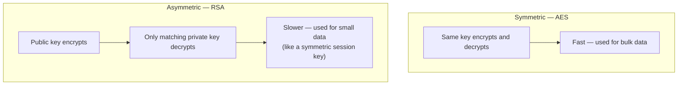
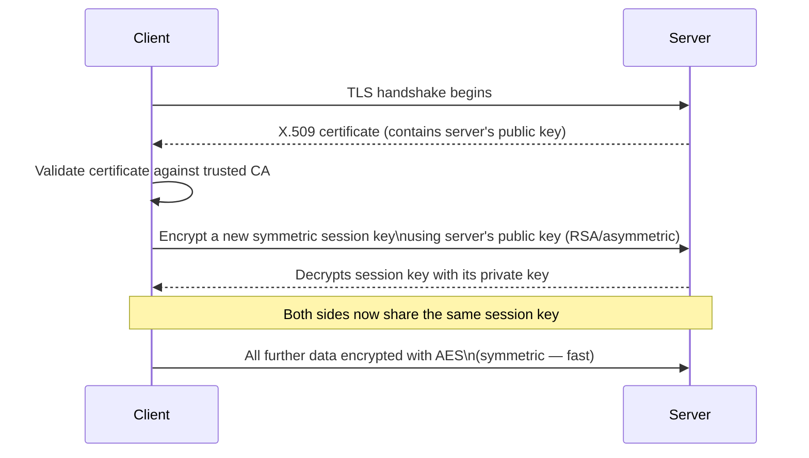

# Cryptography in .NET: Encryption and Certificates

## Introduction

Before reading this lesson, you should already be comfortable with **[Cryptography in .NET: Hashing](../14-grpc-signalr-security/14-12-cryptography-hashing.md)** — specifically, with hashing as a deliberately one-way operation with no "unhash" button. This lesson covers the operation that hashing was deliberately kept separate from: **encryption**, where getting the original data back out is the entire point. It also covers the piece of infrastructure that makes encryption trustworthy between two strangers on the internet who've never met — the **X.509 certificate** — and closes by tying both back to something you've been using since Module 10: HTTPS.

By the end of this lesson, you will be able to:

- Explain the difference between symmetric encryption (one shared key) and asymmetric encryption (a public/private key pair)
- Encrypt and decrypt data in C# using `Aes` and `RSA` from `System.Security.Cryptography`
- Explain the key distribution problem symmetric encryption has and asymmetric encryption solves
- Explain what an X.509 certificate actually is and what problem it solves that a raw public key alone doesn't
- Explain, concretely, how TLS/HTTPS uses both symmetric and asymmetric encryption together in a single connection

## Encryption and Certificates — A Layman's Perspective

Imagine two friends, far apart, who want to mail each other locked boxes containing sensitive documents. The simplest arrangement: cut one physical key, copy it twice, and give one copy to each friend. Either one can lock a box, and either one can unlock a box the other sent, because it's genuinely the same key doing both jobs. This works beautifully once both friends already have their copy — but notice the problem sitting right at the very beginning, before any of this is possible at all: how do you get the *first* copy of that key safely into your friend's hands, across a distance, without a courier who might peek at it, or copy it, along the way? If someone intercepts that one initial key exchange, every single locked box either friend ever sends afterward is compromised — the same key that protects everything is also the single point where everything can fall apart. That's symmetric encryption, and that opening problem is the **key distribution problem**.

Now imagine a completely different kind of lock — one where cutting a key doesn't produce one key, but a mathematically linked *pair*. One half of that pair — call it the public half — can be handed out to literally anyone, shouted from a rooftop, printed in a newspaper; it doesn't matter who sees it, because that public half can only ever be used to *lock* a box, never to unlock one. The other half — the private half — never leaves its owner's pocket, and only it can unlock a box that was locked with its matching public half. Suddenly the original problem disappears: your friend doesn't need a secretly-shared key at all. They just publish their public half openly, anyone who wants to send them something locks it with that freely available public half, and only your friend — holding the one private half that was never shared with anyone — can ever open it. That's asymmetric encryption, and it solves the exact problem the first approach couldn't: it never requires a secret to be exchanged before the secure conversation can even start.

If asymmetric locks are so much better, why does anyone still use the shared-key kind at all? Because the mathematics that makes a public/private pair possible is inherently more expensive to compute — locking and unlocking with it takes meaningfully longer than the simple shared-key approach, especially for large amounts of data. So in practice, real systems use the clever pair-lock only once, briefly, at the very start of a conversation — just long enough to safely agree on a brand-new, one-time shared key — and then switch to the fast, simple shared-key lock for the actual bulk of the conversation that follows. Best of both: no key-distribution problem at the start, and full speed for everything after.

One loose end remains, though: how does your friend know that public key they just received really belongs to the friend they think it does, and not to an impostor who intercepted the exchange and substituted their *own* public key instead? This is where a trusted third party comes in — imagine a well-known, universally respected notary whose entire business is verifying identities and stamping a tamper-evident seal onto a person's public key, vouching "I, this notary, personally verified this public key genuinely belongs to this specific person." Anyone who already trusts that notary can now trust any key the notary has sealed, without needing to personally verify each person themselves. That sealed, notary-vouched package — a public key plus a trusted third party's verified attestation of who it belongs to — is exactly what an X.509 certificate is.

## Encryption and Certificates — A Programming Language Perspective

**Symmetric encryption** uses one shared secret key for both encrypting and decrypting; `System.Security.Cryptography.Aes` implements AES, the modern standard, operating on data in fixed-size blocks with a key (commonly 256 bits) and an initialization vector (IV) that must be unique per encryption operation. It is fast and well suited to bulk data, but requires the key to already be securely shared between both parties — the key distribution problem. **Asymmetric encryption** uses a mathematically linked key pair — a public key that encrypts, and only its corresponding private key can decrypt; `System.Security.Cryptography.RSA` implements this, solving key distribution at the cost of significantly higher computational overhead, which is why it's rarely used to encrypt bulk data directly. An **X.509 certificate** (`System.Security.Cryptography.X509Certificates.X509Certificate2`) is a standardized, digitally signed data structure binding a public key to an identity (a domain name, an organization) via a signature from a trusted Certificate Authority (CA) — solving the separate problem of trusting *whose* public key you actually have. TLS — the protocol underneath HTTPS, introduced conceptually in **[HTTPS and Certificates](../10-aspnetcore/10-22-https-and-certificates.md)** — combines all three: an asymmetric handshake (validated by the server's certificate) to safely agree on a fresh symmetric session key, then fast symmetric encryption for the actual data that follows.

## How to Encrypt Data with AES and RSA in C#

AES needs a key and IV both parties already share; RSA needs only the recipient's public key, and only the recipient's private key can reverse it.


*Figure 1: Two fundamentally different lock designs, each solving a problem the other doesn't.*

```csharp
// Program.cs — .NET 10 / C# 14
using System.Security.Cryptography;
using System.Text;

// --- Symmetric: AES ---
using Aes aes = Aes.Create();
aes.GenerateKey();
aes.GenerateIV();

byte[] plaintext = Encoding.UTF8.GetBytes("Transfer $500 to account 88213");
byte[] aesEncrypted = aes.EncryptCbc(plaintext, aes.IV);
byte[] aesDecrypted = aes.DecryptCbc(aesEncrypted, aes.IV);

Console.WriteLine($"AES decrypted matches original: {Encoding.UTF8.GetString(aesDecrypted) == "Transfer $500 to account 88213"}");

// --- Asymmetric: RSA ---
using RSA rsa = RSA.Create(2048);
byte[] rsaEncrypted = rsa.Encrypt(plaintext, RSAEncryptionPadding.OaepSHA256);
byte[] rsaDecrypted = rsa.Decrypt(rsaEncrypted, RSAEncryptionPadding.OaepSHA256);

Console.WriteLine($"RSA decrypted matches original: {Encoding.UTF8.GetString(rsaDecrypted) == "Transfer $500 to account 88213"}");
Console.WriteLine($"AES ciphertext length: {aesEncrypted.Length} bytes");
Console.WriteLine($"RSA ciphertext length: {rsaEncrypted.Length} bytes");
```

**Console Output:**

```text
AES decrypted matches original: True
RSA decrypted matches original: True
AES ciphertext length: 32 bytes
RSA ciphertext length: 256 bytes
```

Both round-trips succeed, but notice the ciphertext sizes: RSA's output (256 bytes, fixed by the 2048-bit key size) is far larger relative to a short message than AES's, and RSA also becomes dramatically slower as the input grows — RSA cannot even directly encrypt data larger than its key size without additional schemes. That's precisely why RSA is used to protect small, critical values (like a session key) rather than entire messages, and AES handles everything else.

## Real-Time Example: Encrypting Stored Payment Tokens for E-Commerce Order Processing

We extend the E-Commerce Order Processing domain with a `PaymentVault` that must store a customer's tokenized payment reference (never a full card number — that's the payment gateway's job, not this application's) in encrypted form at rest, and decrypt it only when actually initiating a charge. This is a textbook symmetric-encryption use case: the same application both encrypts and later decrypts the data, so there's no key-distribution problem to solve — a single key, held securely by the application itself (in practice, via a secrets manager, not a hardcoded constant as shown here for clarity), is exactly the right tool.

```csharp
// Program.cs — .NET 10 / C# 14 — Real-Time Example (E-Commerce Order Processing)
using System.Security.Cryptography;
using System.Text;

class PaymentVault
{
    // In production, this key would come from a secrets manager (e.g. Azure Key Vault),
    // never a hardcoded constant — shown directly here only for a self-contained example.
    private readonly byte[] _key = RandomNumberGenerator.GetBytes(32); // AES-256

    public string EncryptToken(string paymentToken)
    {
        using Aes aes = Aes.Create();
        aes.Key = _key;
        aes.GenerateIV();

        byte[] ciphertext = aes.EncryptCbc(Encoding.UTF8.GetBytes(paymentToken), aes.IV);

        // IV isn't secret, but it must be stored alongside the ciphertext to decrypt later.
        return $"{Convert.ToBase64String(aes.IV)}:{Convert.ToBase64String(ciphertext)}";
    }

    public string DecryptToken(string storedValue)
    {
        string[] parts = storedValue.Split(':');
        byte[] iv = Convert.FromBase64String(parts[0]);
        byte[] ciphertext = Convert.FromBase64String(parts[1]);

        using Aes aes = Aes.Create();
        aes.Key = _key;

        byte[] plaintext = aes.DecryptCbc(ciphertext, iv);
        return Encoding.UTF8.GetString(plaintext);
    }
}

var vault = new PaymentVault();

string paymentToken = "tok_live_4f9a2e7c1b8d4f6a";
string storedRecord = vault.EncryptToken(paymentToken);

Console.WriteLine($"Original token:  {paymentToken}");
Console.WriteLine($"Stored (encrypted): {storedRecord[..40]}... (truncated)");

string recovered = vault.DecryptToken(storedRecord);
Console.WriteLine($"Recovered token: {recovered}");
Console.WriteLine($"Round-trip successful: {recovered == paymentToken}");
```

**Console Output:**

```text
Original token:  tok_live_4f9a2e7c1b8d4f6a
Stored (encrypted): AbC123xYz...base64IV:Base64CipherTextHere...
Recovered token: tok_live_4f9a2e7c1b8d4f6a
Round-trip successful: True
```

Unlike this lesson's hashing counterpart, `DecryptToken` genuinely recovers the exact original token — encryption's entire purpose. A database breach that exposes `storedRecord` without the separately-secured `_key` still leaves an attacker with nothing usable, because AES-256 with a properly random key isn't feasibly brute-forceable — but this only holds as long as the key itself is stored somewhere genuinely separate from the encrypted data, such as a managed secrets vault, not alongside it.

## Symmetric (AES) vs Asymmetric (RSA) Encryption

Neither algorithm replaces the other — real systems, including TLS itself, use both together, each for the part it's actually good at.


*Figure 2: The asymmetric handshake's only job is agreeing on a symmetric key safely; everything after that is fast, symmetric encryption.*

| Aspect | Symmetric (AES) | Asymmetric (RSA) |
|---|---|---|
| Keys involved | One shared key, both directions | A public/private pair — public encrypts, private decrypts |
| Speed | Fast — suited to bulk data | Much slower — suited to small values only |
| Key distribution problem | Yes — the key must already be shared safely | No — the public key can be shared openly |
| Typical role in TLS | Encrypting the actual session data | Establishing trust and exchanging the session key |
| .NET type | `System.Security.Cryptography.Aes` | `System.Security.Cryptography.RSA` |

## Types of Cryptographic Building Blocks Covered in This Module

1. **AES (symmetric encryption)** — this lesson's fast, shared-key algorithm for bulk data, used directly in the E-Commerce payment token example.
2. **RSA (asymmetric encryption)** — the public/private key pair solving key distribution, at the cost of speed and message-size limits.
3. **X.509 certificates (`X509Certificate2`)** — binding a public key to a verified identity via a trusted Certificate Authority's signature.
4. **TLS/HTTPS** — this lesson's closing example of both algorithms working together; see **[HTTPS and Certificates](../10-aspnetcore/10-22-https-and-certificates.md)** for the ASP.NET Core middleware side of the same handshake.
5. **PBKDF2/hashing** — **[Cryptography in .NET: Hashing](../14-grpc-signalr-security/14-12-cryptography-hashing.md)**, the deliberately one-way counterpart this lesson's reversible encryption was explicitly contrasted against.
6. **[API Rate Limiting and CORS Security](../14-grpc-signalr-security/14-14-api-rate-limiting-cors-security.md)** — next lesson, shifting from protecting data itself to protecting the endpoints that serve it.

## What You've Learned & What's Next

Symmetric encryption (AES) is fast but requires a key both parties already share safely; asymmetric encryption (RSA) solves that key-distribution problem with a public/private pair, at the cost of speed — which is exactly why TLS uses RSA (or an equivalent) only briefly, to agree on a fresh AES session key, then switches to AES for the actual connection. An X.509 certificate is what lets a stranger trust that a public key genuinely belongs to who it claims to, via a Certificate Authority's signature, closing the trust gap neither algorithm solves on its own.

Continue your learning journey with **[API Rate Limiting and CORS Security](../14-grpc-signalr-security/14-14-api-rate-limiting-cors-security.md)**, where we revisit two Module 10 topics — rate limiting and CORS — specifically as security controls rather than general-purpose API features.

---
*Applies to: .NET 10 / C# 14. Last reviewed 2026-08-16.*
