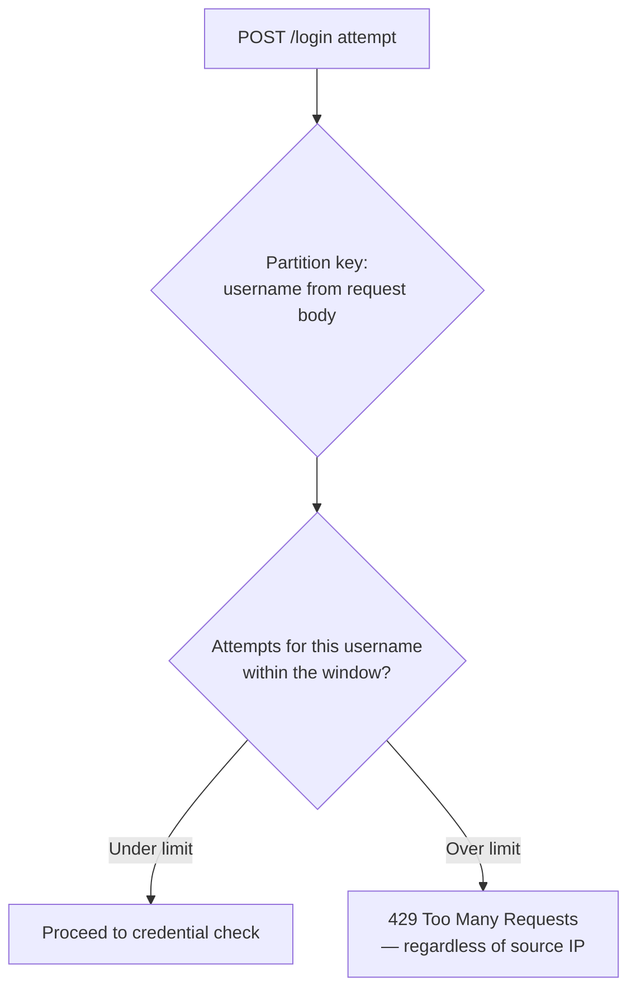
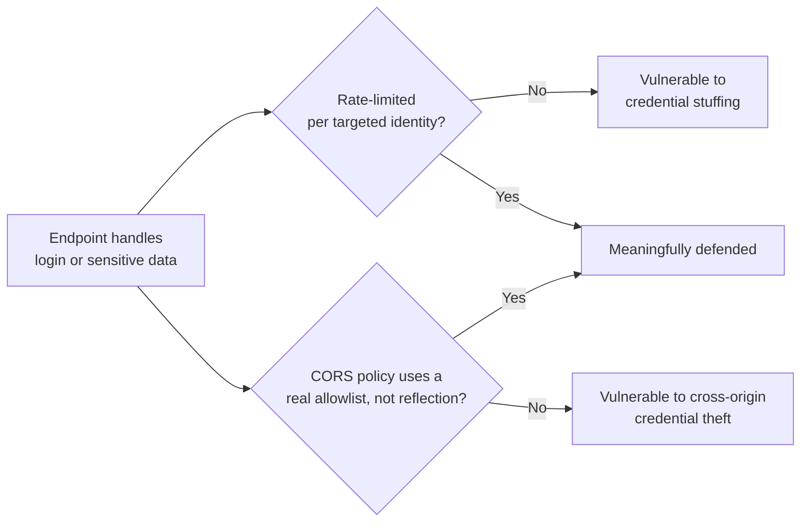

# API Rate Limiting and CORS Security

## Introduction

Before reading this lesson, you should already be comfortable with **[Cryptography in .NET: Encryption and Certificates](../14-grpc-signalr-security/14-13-cryptography-encryption-certificates.md)**, and, from Module 10, with **[Rate Limiting](../10-aspnetcore/10-14-rate-limiting.md)** and **[CORS in ASP.NET Core](../10-aspnetcore/10-16-cors-in-aspnetcore.md)**. Both of those lessons introduced their topics as general-purpose ASP.NET Core features — reliability under load, and cross-origin browser rules. This lesson doesn't repeat that introduction; it looks at the exact same two features again, deliberately, through a **security** lens: rate limiting as a defense specifically against credential-guessing attacks, and CORS misconfiguration as an actual, exploitable vulnerability class rather than just a browser annoyance.

By the end of this lesson, you will be able to:

- Explain why a login endpoint specifically needs stricter, security-motivated rate limiting than an ordinary read endpoint
- Recognize credential stuffing and brute-force attacks, and how a per-account or per-IP rate limit blunts each
- Explain concretely how an overly permissive CORS policy becomes an exploitable vulnerability, not just a development inconvenience
- Identify the specific combination of settings (wildcard origin + credentials) that turns CORS into a real security hole
- Apply a checklist of common API security misconfigurations to a real endpoint

## Rate Limiting and CORS as Security Controls — A Layman's Perspective

Picture a bank branch that installed a turnstile at its main entrance purely for crowd control — keeping the lobby from getting too crowded on a busy Friday. That turnstile happens to also slow down anyone trying to rush the entrance, but that was never the *reason* it was installed; it was a side effect of a completely different goal. Now picture a second turnstile, installed specifically at the small side door leading to the vault's combination-testing room — a door where, historically, someone occasionally shows up and tries one combination after another, hoping to eventually guess right. That second turnstile isn't there for crowd control at all; every one of its design decisions — how long the pause is, how few attempts it allows before locking entirely — was chosen specifically to make combination-guessing impractical. Same mechanism, same physical device even, but a completely different design intent depending on which door it's guarding.

That's the exact relationship between ordinary rate limiting and rate limiting as a security control. A general read endpoint gets throttled so a traffic spike doesn't take the whole system down — crowd control. A login endpoint gets throttled specifically because it is, structurally, a combination-guessing door: every failed attempt teaches an attacker one more thing they've ruled out, and a login form with no throttling at all is functionally an open invitation to try every password in a leaked list against every username until something works — an attack pattern called credential stuffing. The rate limit isn't there to keep the lobby comfortable; it's there because this specific door is the one people try to pick.

Now picture something different: the same bank branch, but its reception desk operates on an entirely separate, oddly generous policy — "any visitor, from any company, claiming to be picking up a package on someone else's behalf, gets it, no questions asked, so long as they also happen to be carrying that person's ID badge." That sounds fine in isolation — surely nobody untrustworthy would also somehow be carrying a customer's ID badge, right? — until you realize the badge itself is exactly the thing that's supposed to be hard to fake or steal, and the desk just quietly announced it doesn't actually check who's allowed to ask for deliveries on someone else's behalf at all, only whether *a* badge is present. If a scammer ever tricks a customer into handing over their badge — or forges a good enough copy — this reception desk will hand over that customer's entire mail pickup to a total stranger, unquestioned, from anywhere.

That's precisely what happens when an API's CORS policy allows any website in the world to make requests carrying a logged-in user's credentials. It sounds harmless — "we just don't want to bother configuring an origin allowlist" — right up until a completely unrelated, malicious website, visited by someone who's also separately logged into the real banking site in another tab, quietly makes a request to the real API using that still-valid login session, and the CORS policy waves it straight through. The vulnerability isn't a bug in the cryptography or the login form at all; it's a permissions door left open specifically for anyone who happens to be carrying valid credentials, with no check on where the request is actually coming from.

## Rate Limiting and CORS as Security Controls — A Programming Language Perspective

Module 10's rate limiting and CORS lessons covered the mechanics — `AddRateLimiter`/`UseRateLimiter` and `AddCors`/`UseCors` — as general reliability and browser-interoperability features. Viewed as **security controls**, the same APIs get applied with different intent: a login or password-reset endpoint gets its own, deliberately strict `PartitionedRateLimiter` policy (typically keyed per username *and* per IP, since an attacker rotating IPs against one account, or one IP against many accounts, are both real patterns) to blunt credential stuffing and brute-force attacks, distinct from any general-purpose throttling applied elsewhere in the API. CORS, meanwhile, becomes a genuine attack surface the moment `AllowCredentials()` is combined with an overly broad origin policy; ASP.NET Core actively throws an `InvalidOperationException` at startup if `AllowAnyOrigin()` and `AllowCredentials()` are configured together on the same policy specifically to prevent this — but a common workaround developers reach for under pressure, reflecting the request's `Origin` header back verbatim as the allowed origin (effectively "any origin is fine, just tell me you're fine with it"), reintroduces the identical vulnerability without tripping that safeguard, since it's technically a specific origin, chosen by whoever sent the request.

## How to Rate-Limit a Login Endpoint Specifically Against Brute-Force Attempts

A login endpoint's rate limit should be partitioned by the *username being attempted*, not just the caller's IP — an attacker can rotate IP addresses trivially, but is still trying to guess one specific account's password.


*Figure 1: Partitioning by the targeted username, not the caller's IP, is what makes this limiter resistant to an attacker simply rotating IP addresses.*

```csharp
// Program.cs — .NET 10 / C# 14
using System.Threading.RateLimiting;
using Microsoft.AspNetCore.RateLimiting;

var builder = WebApplication.CreateBuilder(args);

builder.Services.AddRateLimiter(options =>
{
    options.RejectionStatusCode = StatusCodes.Status429TooManyRequests;

    options.AddPolicy("login-brute-force-guard", httpContext =>
    {
        string username = httpContext.Request.RouteValues["username"] as string
            ?? httpContext.Request.Query["username"].ToString();

        return RateLimitPartition.GetSlidingWindowLimiter(username, _ => new SlidingWindowRateLimiterOptions
        {
            Window = TimeSpan.FromMinutes(5),
            SegmentsPerWindow = 5,
            PermitLimit = 5,   // 5 attempts per 5 minutes, per targeted username
            QueueLimit = 0
        });
    });
});

var app = builder.Build();
app.UseRateLimiter();

app.MapPost("/login", (string username, string password) =>
{
    bool valid = username == "alicia" && password == "correct-horse-battery-staple";
    return valid ? Results.Ok(new { status = "Authenticated" }) : Results.Unauthorized();
}).RequireRateLimiting("login-brute-force-guard");

app.Run();
```

**Console Output** *(HTTP responses — six rapid login attempts against username `alicia` with wrong passwords):*

```text
Attempt 1: HTTP/1.1 401 Unauthorized
Attempt 2: HTTP/1.1 401 Unauthorized
Attempt 3: HTTP/1.1 401 Unauthorized
Attempt 4: HTTP/1.1 401 Unauthorized
Attempt 5: HTTP/1.1 401 Unauthorized
Attempt 6: HTTP/1.1 429 Too Many Requests
```

Every wrong-password guess still returns an honest `401`, so the limiter doesn't change what a legitimate failed login looks like — it simply cuts off the sixth rapid attempt against this specific username entirely, regardless of which IP address it came from. A script guessing passwords against `alicia`'s account from ten different rotating IPs still gets throttled after five combined attempts, because the partition key is the *username*, not the source address.

## Real-Time Example: Auditing an E-Commerce Checkout API's CORS Configuration for a Real Vulnerability

We continue the E-Commerce Order Processing domain's storefront and admin dashboard split from Module 10's CORS lesson, but now specifically as a security audit. A junior developer, trying to unblock a stalled integration with a new partner site under deadline pressure, wrote the misconfiguration below — and it looks, at a glance, like it does something safe.

```csharp
// Program.cs — .NET 10 / C# 14 — Real-Time Example (E-Commerce, VULNERABLE configuration)
var builder = WebApplication.CreateBuilder(args);

builder.Services.AddCors(options =>
{
    options.AddPolicy("ReflectAnyOrigin", policy =>
        policy.SetIsOriginAllowed(origin => true) // reflects whatever Origin header the caller sends
              .AllowAnyHeader()
              .AllowAnyMethod()
              .AllowCredentials()); // sends the customer's auth cookie along with every request
});

var app = builder.Build();
app.UseCors("ReflectAnyOrigin");

app.MapGet("/api/customers/me/orders", (HttpContext context) =>
{
    // In a real app: read the auth cookie, look up this authenticated customer's orders.
    return Results.Ok(new[] { new { orderId = 5591, total = 249.99m, status = "Shipped" } });
});

app.Run();
```

**Console Output** *(HTTP traffic showing why this configuration is exploitable, not just permissive):*

```text
--> GET /api/customers/me/orders HTTP/1.1
    Origin: https://totally-unrelated-attacker-site.example
    Cookie: auth=eyJhbGciOi... (the logged-in customer's real session cookie)

<-- HTTP/1.1 200 OK
    Access-Control-Allow-Origin: https://totally-unrelated-attacker-site.example
    Access-Control-Allow-Credentials: true
    [{"orderId":5591,"total":249.99,"status":"Shipped"}]
```

`SetIsOriginAllowed(origin => true)` never actually says "yes to everyone" in the literal wildcard sense — it reflects back whatever origin the caller happened to send, which is precisely why it doesn't trip .NET's built-in guard against combining `AllowAnyOrigin()` with `AllowCredentials()`. Functionally, though, it's identical to allowing every origin *with* credentials: a customer who's logged into the real storefront in one browser tab, and who then visits `totally-unrelated-attacker-site.example` in another tab, will have that attacker site's JavaScript silently issue this exact request, cookie included, and the browser will hand the response straight back to the attacker's script. The fix is the same one Module 10 already taught — a genuine, hardcoded origin allowlist — applied here with the explicit understanding that this isn't a style preference, it's the difference between a secure API and an exploitable one.

## Security Misconfiguration Checklist for a Public API

The two vulnerabilities above share a pattern: a control that looks correctly configured on the surface, but fails under a specific, realistic attack scenario the developer didn't picture while writing it.


*Figure 2: Both checks ask the same underlying question — does this control hold up against someone deliberately trying to defeat it, not just against normal traffic?*

| Misconfiguration | What it looks like | Why it's dangerous | Correct approach |
|---|---|---|---|
| No rate limit on login/reset endpoints | "It's just a POST endpoint like any other" | Enables credential stuffing/brute force at unlimited speed | Partitioned limiter keyed by targeted username, per **[Rate Limiting](../10-aspnetcore/10-14-rate-limiting.md)** |
| `AllowAnyOrigin()` + `AllowCredentials()` | Blocked outright by the framework | Would leak authenticated data to any website | Framework throws at startup — a hard stop, not a silent risk |
| Origin reflection (`SetIsOriginAllowed(_ => true)`) + credentials | "Technically not a wildcard" | Functionally identical to the blocked combination above | A real, explicit origin allowlist |
| Verbose error messages on auth failures | "Invalid password for user 'alicia'" vs. generic "Invalid credentials" | Confirms valid usernames to an attacker (user enumeration) | Identical, generic error for both "no such user" and "wrong password" |
| Missing HTTPS enforcement | Relying on clients to "just use https://" | Credentials and session cookies sent in the clear over plain HTTP | `UseHttpsRedirection()` + `UseHsts()`, next lesson's topic |

## Types of Security-Motivated API Controls

1. **Per-identity partitioned rate limiting** — this lesson's login-specific defense, distinct from the general-purpose throttling in **[Rate Limiting](../10-aspnetcore/10-14-rate-limiting.md)**.
2. **A genuine CORS origin allowlist** — the fix for both the blocked wildcard-plus-credentials case and the subtler origin-reflection workaround, building on **[CORS in ASP.NET Core](../10-aspnetcore/10-16-cors-in-aspnetcore.md)**.
3. **Generic authentication error messages** — preventing user enumeration, a small but common checklist item alongside rate limiting and CORS.
4. **Account lockout after repeated failures** — a complementary, longer-horizon defense beyond a sliding rate-limit window, often paired with alerting.
5. **Security headers beyond CORS** (`Content-Security-Policy`, `X-Content-Type-Options`) — related browser-enforced protections outside this lesson's scope but worth knowing exist.
6. **[HSTS and Transport Security](../14-grpc-signalr-security/14-15-hsts-and-transport-security.md)** — next lesson, closing the "missing HTTPS enforcement" row of this lesson's checklist in full.

## What You've Learned & What's Next

Rate limiting and CORS aren't just reliability and browser-interoperability features — applied to a login endpoint or a credentialed API, they're genuine security controls, and the exact same building blocks from Module 10 need to be configured with an attacker's specific goals in mind: a per-username partition to blunt credential stuffing, and a real origin allowlist — not a technically-legal workaround like origin reflection — to prevent cross-origin credential theft.

Continue your learning journey with **[HSTS and Transport Security](../14-grpc-signalr-security/14-15-hsts-and-transport-security.md)**, where we close the last row of this lesson's checklist: making sure credentials and session cookies never travel over plain HTTP in the first place.

---
*Applies to: .NET 10 / C# 14. Last reviewed 2026-08-16.*
