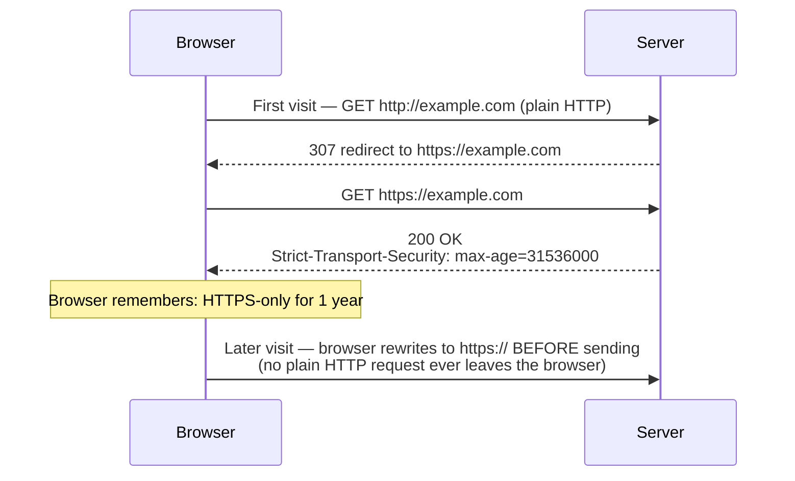
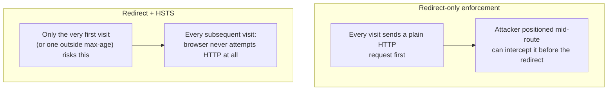

# HSTS and Transport Security

## Introduction

Before reading this lesson, you should already be comfortable with **[API Rate Limiting and CORS Security](../14-grpc-signalr-security/14-14-api-rate-limiting-cors-security.md)**, and, from Module 10, with **[HTTPS and Certificates](../10-aspnetcore/10-22-https-and-certificates.md)** — in particular, `UseHttpsRedirection()`, which answers a plain HTTP request with a redirect to the HTTPS version of the same URL. This lesson closes the last row of the previous lesson's misconfiguration checklist by asking a sharper question that redirect alone doesn't fully answer: what happens during the brief moment *before* that redirect, and can an attacker exploit exactly that moment? The answer is **HSTS** — HTTP Strict Transport Security.

By the end of this lesson, you will be able to:

- Explain what the `Strict-Transport-Security` response header actually instructs a browser to do
- Explain the SSL-stripping downgrade attack, and precisely which gap in redirect-only HTTPS enforcement HSTS closes
- Configure `UseHsts()` in ASP.NET Core, including the `max-age`, `includeSubDomains`, and `preload` settings
- Explain, at a conceptual level, what a TLS version and cipher suite are, and why both matter beyond "using HTTPS" alone
- Recognize why HSTS is typically disabled in local development

## HSTS and Transport Security — A Layman's Perspective

Recall this module's earlier picture of a bank moving sensitive paperwork by courier: an open envelope is plain HTTP, a sealed security pouch is HTTPS, and a loading dock that refuses any open envelope on sight — redirecting the courier back for a properly sealed one — is `UseHttpsRedirection()`. That dock policy is genuinely useful, but notice the gap sitting inside it: the courier still showed up carrying an *open* envelope in the first place, and for one brief moment, right at the dock, that unsealed paperwork existed in the world, in the open, before anyone caught it and sent it back for resealing. Someone positioned exactly at that loading dock, watching every delivery arrive, could potentially intercept that one, single open envelope during the instant before the dock's staff redirected the courier — read it, copy it, even quietly swap its contents — and the courier, and the recipient, might never know it happened at all.

Now imagine the bank's head office takes a different, stronger approach with one specific branch it trusts especially deeply: instead of relying on the loading dock to catch every open envelope one at a time, forever, head office sends out a standing, written instruction to every courier company that has ever successfully delivered to that branch: "starting now, and for the next year, never bring this branch anything except a properly sealed pouch — don't even attempt an open envelope, don't wait to be redirected, don't give the open envelope a chance to exist in transit at all." Once a courier company has received and filed that instruction, they simply never produce an open envelope bound for that branch again, for as long as the instruction remains in effect — there's no redirect-and-retry step anymore, because the insecure attempt is skipped from the very start, at the courier's own office, before the parcel ever leaves the building.

That standing instruction is exactly what HSTS is. The dock's "refuse and redirect" policy still requires an insecure attempt to exist, however briefly, every single time — and that brief existence is precisely the window an attacker positioned in the middle of the route (a technique called SSL stripping) can exploit: intercepting the courier before the dock ever gets a chance to redirect them, and simply keeping the conversation in "open envelope" mode indefinitely, while the sender believes it's secure the whole time. HSTS eliminates that window by telling the browser, once, via a header on an earlier secure response, "remember this specific site for the next however-many days, and never even attempt an insecure connection to it again — go straight to the sealed-pouch version from now on, before any request leaves at all."

One more detail worth carrying over from this lesson's earlier cryptography material: a sealed pouch is only as trustworthy as the quality of the seal and locking mechanism actually used to close it. A courier company using a cheap, outdated locking mechanism that's been publicly known to pop open with enough force offers far less real protection than one using the branch's own current, well-tested standard — even though, from the outside, both look identical: "sealed." That's the role TLS versions and cipher suites play underneath HTTPS: not every "HTTPS connection" uses equally strong cryptography, and part of transport security is making sure the locking mechanism itself, not just the presence of a lock, is actually still trustworthy.

## HSTS and Transport Security — A Programming Language Perspective

**HSTS** (HTTP Strict Transport Security) is a response header, `Strict-Transport-Security: max-age=<seconds>; includeSubDomains; preload`, that instructs a compliant browser to treat a given host as HTTPS-only for the specified duration — after receiving it once, the browser will not even attempt a plain HTTP request to that host again until the `max-age` expires, closing the window that redirect-based enforcement alone leaves open for an SSL-stripping downgrade attack, where an attacker positioned between the client and server intercepts the very first, still-insecure request before any redirect can occur. ASP.NET Core's `UseHsts()` middleware adds this header automatically to responses; `builder.Services.AddHsts(options => ...)` configures `MaxAge`, `IncludeSubDomains`, and `Preload`, and the middleware is conventionally skipped in the `Development` environment, since a real HSTS directive would make it awkward to test plain HTTP locally afterward — a real browser, once it has honored an HSTS header for `localhost`, will refuse plain HTTP there for the configured duration regardless of what you're currently debugging. **TLS** itself — the protocol HTTPS runs on top of — negotiates a **version** (TLS 1.2 and 1.3 are the only versions still considered secure as of .NET 10; TLS 1.0/1.1 are deprecated and typically disabled at the OS/Kestrel level) and a **cipher suite** (the specific combination of key exchange, encryption, and integrity algorithms actually used for the connection) during the handshake introduced conceptually in the previous lesson — both are typically managed by the OS and hosting platform rather than application code, but knowing they exist explains why "using HTTPS" alone doesn't automatically mean "using strong cryptography."

## How to Enable HSTS in ASP.NET Core

`UseHsts()` is one line, placed after HTTPS redirection and guarded by an environment check, exactly as Module 10's capstone lesson introduced it — this lesson focuses on what the header actually does once it reaches a browser.


*Figure 1: Only the very first visit can ever be intercepted mid-downgrade; every subsequent visit within the `max-age` window never attempts plain HTTP at all.*

```csharp
// Program.cs — .NET 10 / C# 14
var builder = WebApplication.CreateBuilder(args);

builder.Services.AddHsts(options =>
{
    options.MaxAge = TimeSpan.FromDays(365);
    options.IncludeSubDomains = true;
});

var app = builder.Build();

if (!app.Environment.IsDevelopment())
{
    app.UseHsts();
}

app.UseHttpsRedirection();

app.MapGet("/api/ping", () => Results.Ok(new { status = "pong" }));

app.Run();
```

**Console Output** *(this is an ASP.NET Core app running outside Development — "output" is the response headers on a request already using HTTPS):*

```text
GET https://api.contoso.com/api/ping HTTP/1.1

--> HTTP/1.1 200 OK
    Strict-Transport-Security: max-age=31536000; includeSubDomains
    Content-Type: application/json; charset=utf-8
    {"status":"pong"}
```

That single response header is doing all the work: any browser that receives it will remember, for the next 31,536,000 seconds (365 days), to never attempt plain HTTP to `api.contoso.com` — or any of its subdomains, per `includeSubDomains` — again, rewriting every future request to HTTPS internally before it's ever sent, rather than sending it insecurely first and waiting for a redirect.

## Real-Time Example: Enforcing HSTS for an Online Banking/ATM Portal

We continue the Banking/ATM domain from Module 10's capstone lesson, where a small balance-check API assembled routing, middleware, DI, configuration, logging, and HTTPS redirection into one program. This lesson adds the one piece that capstone's Development-environment run never actually exercised: what the `Strict-Transport-Security` header looks like once that same API is genuinely running in production, in front of real customers checking real account balances.

```csharp
// Program.cs — .NET 10 / C# 14 — Real-Time Example (Banking/ATM, production configuration)
var builder = WebApplication.CreateBuilder(args);

builder.Services.AddHsts(options =>
{
    options.MaxAge = TimeSpan.FromDays(180);
    options.IncludeSubDomains = true;
    options.Preload = true; // eligible for browser-vendor HSTS preload lists — see Types section
});

var app = builder.Build();

if (!app.Environment.IsDevelopment())
{
    app.UseHsts();
}

app.UseHttpsRedirection();

var accountBalances = new Dictionary<string, decimal>
{
    ["ACC-1001"] = 1250.75m,
    ["ACC-1002"] = 32.10m
};

app.MapGet("/api/accounts/{id}/balance", (string id) =>
    accountBalances.TryGetValue(id, out decimal balance)
        ? Results.Ok(new { accountId = id, balance })
        : Results.NotFound());

app.Run();
```

**Console Output** *(production environment — first request over plain HTTP, then the follow-up HTTPS response):*

```text
GET http://banking.contoso.com/api/accounts/ACC-1001/balance HTTP/1.1
--> HTTP/1.1 307 Temporary Redirect
    Location: https://banking.contoso.com/api/accounts/ACC-1001/balance

GET https://banking.contoso.com/api/accounts/ACC-1001/balance HTTP/1.1
--> HTTP/1.1 200 OK
    Strict-Transport-Security: max-age=15552000; includeSubDomains; preload
    Content-Type: application/json; charset=utf-8
    {"accountId":"ACC-1001","balance":1250.75}

GET https://banking.contoso.com/api/accounts/ACC-1001/balance HTTP/1.1
(browser's second visit, within the 180-day window — no plain HTTP attempt is made at all)
--> HTTP/1.1 200 OK
    Strict-Transport-Security: max-age=15552000; includeSubDomains; preload
    {"accountId":"ACC-1001","balance":1250.75}
```

The first plain-HTTP request in this trace is the *only* moment in this customer's entire relationship with the bank's portal where an SSL-stripping attacker positioned on the network could theoretically intercept an insecure attempt — and only if this were truly the customer's very first-ever visit, with no prior HSTS record and no preload-list entry already covering the domain. Every subsequent visit for the next 180 days skips the insecure attempt entirely, at the browser level, before a single byte leaves the customer's machine — a meaningfully stronger guarantee for a banking portal than "we redirect HTTP to HTTPS," which the previous, capstone lesson's example alone provided.

## Redirect-Only HTTPS Enforcement vs. HSTS

`UseHttpsRedirection()` and `UseHsts()` are not competing options — a production app needs both, because they defend different moments in the connection's lifetime.


*Figure 2: HSTS doesn't replace the redirect — it shrinks the exposed window from "every visit" down to "at most, the first visit."*

| Aspect | Redirect-only (`UseHttpsRedirection()`) | With HSTS (`UseHsts()`) |
|---|---|---|
| Insecure attempt occurs | On every single visit | Only on a genuinely first visit, or after `max-age` expires |
| Protects against SSL stripping | No — the insecure request still exists momentarily | Yes, for any visit within the remembered window |
| Where the decision lives | Server-side redirect, after the request arrives | Browser-side, before the request is ever sent |
| Safe for local development | Yes | Typically disabled — a real HSTS record can lock out plain HTTP testing |
| Strongest variant | — | `preload`, submitted to browser vendors' hardcoded lists, protecting even a true first visit |

## Types of Transport Security Concerns Beyond a Single Header

1. **`Strict-Transport-Security` header (`UseHsts()`)** — this lesson's core mechanism, eliminating the insecure-attempt window on repeat visits.
2. **HSTS preload lists** — submitting a domain to a hardcoded list shipped inside major browsers, closing the gap even on a genuinely first-ever visit; see `hstspreload.org`.
3. **TLS version negotiation** — ensuring only TLS 1.2/1.3 are enabled, typically an OS/Kestrel-level or hosting-platform configuration rather than application code.
4. **Cipher suite selection** — the specific algorithm combination a TLS connection actually uses, generally managed by the platform's default, modern cipher suite ordering.
5. **Certificate lifecycle and renewal** — covered in **[HTTPS and Certificates](../10-aspnetcore/10-22-https-and-certificates.md)**, since an expired certificate breaks HTTPS regardless of how well HSTS is configured.
6. **[ASP.NET Core Identity](../14-grpc-signalr-security/14-16-aspnetcore-identity.md)** — next lesson, where hashing (Lesson 12), authorization (Lessons 10–11), and now transport security come together inside a single, production-ready identity system.

## What You've Learned & What's Next

`UseHttpsRedirection()` catches an insecure request after it arrives; HSTS, via the `Strict-Transport-Security` header, prevents the browser from ever sending one in the first place on any visit after the first — closing the specific window an SSL-stripping downgrade attack depends on. TLS version and cipher suite strength sit one layer beneath both, determining whether "HTTPS" actually means strong, current cryptography or merely the presence of a certificate.

Continue your learning journey with **[ASP.NET Core Identity](../14-grpc-signalr-security/14-16-aspnetcore-identity.md)**, where this module's authentication, authorization, hashing, and transport security threads come together inside a single, production-grade identity framework.

---
*Applies to: .NET 10 / C# 14. Last reviewed 2026-08-16.*
