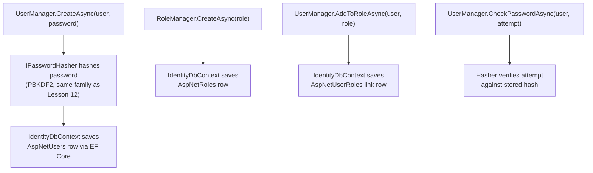
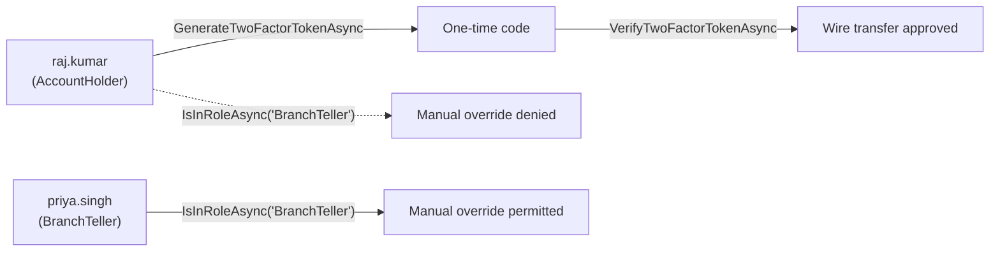
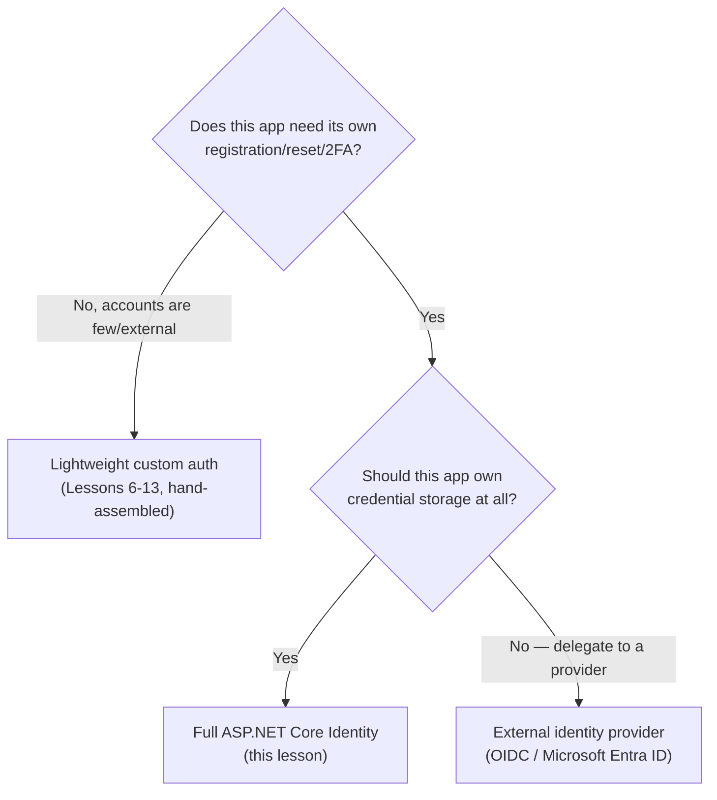

# ASP.NET Core Identity

## Introduction

Before reading this lesson, you should already be comfortable with **[HSTS and Transport Security](../14-grpc-signalr-security/14-15-hsts-and-transport-security.md)**. Every lesson since Lesson 6 of this module has built one specific piece of an authentication or authorization system by hand: a cookie carrying a session, a JWT carrying its own claims, an authorization policy checking those claims, a password hash resisting brute force, and now a transport layer that keeps all of it from leaking in transit. This lesson introduces **`Microsoft.AspNetCore.Identity`**, the framework that packages every one of those pieces — plus registration, password reset, and two-factor authentication, which this module hasn't built from scratch at all — into one cohesive, production-ready system, so a real application doesn't have to hand-assemble each piece for every project.

By the end of this lesson, you will be able to:

- Explain what `Microsoft.AspNetCore.Identity` provides out of the box, and how it builds directly on this module's hashing, cookie/JWT, and claims-based foundations
- Wire up `IdentityDbContext<TUser>` as the EF Core `DbContext` specialization that persists users, roles, claims, and tokens
- Use `UserManager<TUser>` and `RoleManager<TRole>` to register a user, assign roles, and enable two-factor authentication
- Distinguish `AddIdentityCore`, `AddIdentity`, and the newer `MapIdentityApi` minimal-API endpoints, and know when each is the right starting point
- Decide when to reach for full ASP.NET Core Identity, a lighter custom auth setup, or an external identity provider (OIDC, Microsoft Entra ID) instead

## ASP.NET Core Identity — A Layman's Perspective

Picture the last several lessons as you, personally, assembling a brand-new apartment building's front-desk operation piece by piece, hiring one specialist at a time. First you hired a locksmith to design the master lock mechanism itself — how a key is cut so it can be verified as genuine without anyone keeping a copy of every resident's exact key on file (that was hashing). Then you had wristbands printed for residents to wear at the pool, encoded with just enough information for the pool gate to recognize them without radioing the front desk every single time (that was JWTs and cookies). Then you wrote a small rulebook for the wristbands themselves — this color badge gets into the gym, this one gets into the rooftop lounge too (that was claims and policies). And most recently, you arranged for every delivery to and from the building to travel in a sealed, tamper-evident pouch rather than an open envelope (that was transport security). Each piece works. Each piece is genuinely yours, understood down to the mechanism. But you built every single one of them separately, and you're the only person who fully knows how they fit together.

Now imagine, instead, a different building down the street that simply hired a professional building-management company on day one — the kind that shows up with an entire turnkey front-desk operation already built, tested, and running in hundreds of other buildings. This company already has a registration desk that signs up new residents properly, verifying their information before handing over a key. It already has a documented lost-key replacement procedure for the inevitable resident who forgets their combination. It already asks for a second form of ID at the desk for anyone entering the vault room, not just a key card, without anyone having to invent that second-check policy from scratch. And it already color-codes badges by resident type — regular tenant, building staff, property manager — wiring those badge colors directly into the same master ledger that tracks who lives there in the first place, rather than keeping the ledger and the badge rules as two disconnected systems someone has to keep in sync by hand.

That professional management company is exactly what `Microsoft.AspNetCore.Identity` is. It isn't a new *idea* on top of everything this module already taught — it's the same locks, wristbands, badges, and sealed pouches, wired together into one coherent, already-tested operation, plus a few things this module never built by hand at all: a real registration flow, a real "I forgot my key" password-reset flow, and a genuine second-factor check at the door. The tradeoff is exactly the one you'd expect from hiring outside help instead of doing it all in-house: you give up a small amount of the deep, mechanism-level understanding you'd have from building every piece yourself, in exchange for a system that's already been battle-tested across far more buildings, far more resident types, and far more attempted break-ins than any one team could realistically test on its own.

## ASP.NET Core Identity — A Programming Language Perspective

**`Microsoft.AspNetCore.Identity`** is a NuGet-distributed membership system providing user registration, password hashing, role and claims management, and two-factor authentication as ready-made services, rather than hand-written building blocks. Its central types are `IdentityUser` (or a custom class deriving from `IdentityUser<TKey>` with additional profile properties), `IdentityDbContext<TUser>` — an EF Core `DbContext` subclass (tying directly back to Module 11) that defines the `AspNetUsers`, `AspNetRoles`, `AspNetUserClaims`, `AspNetUserRoles`, and `AspNetUserTokens` tables — and two manager classes: `UserManager<TUser>`, which handles user CRUD, password hashing via an internal `IPasswordHasher<TUser>` (a PBKDF2-based implementation, the same category of algorithm Lesson 12 built by hand), and two-factor token generation/verification; and `SignInManager<TUser>`, which performs the actual sign-in, issuing the authentication cookie Lesson 6 covered manually. `RoleManager<TRole>` manages roles the same way `UserManager` manages users. `builder.Services.AddIdentityCore<TUser>()` registers the minimal core services with no default cookie scheme; `AddIdentity<TUser, TRole>()` layers a full cookie-based authentication scheme and role support on top of that core. .NET 8 introduced `app.MapIdentityApi<TUser>()`, still current in .NET 10, which exposes ready-made `/register`, `/login`, and `/2fa` minimal API endpoints returning bearer tokens, purpose-built for SPA and mobile clients that don't want a hand-rolled token endpoint like Lesson 7's.

## How to Register and Authenticate a User with ASP.NET Core Identity

Wiring up Identity takes three steps: register an `IdentityDbContext<TUser>` backed by EF Core, call `AddIdentityCore<TUser>()` (adding roles and EF Core storage), then use the resulting `UserManager<TUser>` and `RoleManager<TRole>` to create accounts. The example below runs its checks once at startup, printing results directly to the console, so it executes end-to-end with `dotnet run` and no separate HTTP client.


*Figure 1: Every one of these calls ultimately reads or writes through the same `IdentityDbContext`, the way Module 11's `DbContext` always has.*

```csharp
// Program.cs — .NET 10 / C# 14
using Microsoft.AspNetCore.Identity;
using Microsoft.AspNetCore.Identity.EntityFrameworkCore;
using Microsoft.EntityFrameworkCore;

var builder = WebApplication.CreateBuilder(args);
builder.Logging.ClearProviders(); // keep this demo's console output limited to what we explicitly print

builder.Services.AddDbContext<AppIdentityDbContext>(options =>
    options.UseInMemoryDatabase("IdentityDemo"));

builder.Services.AddDataProtection();

builder.Services
    .AddIdentityCore<IdentityUser>(options =>
    {
        options.Password.RequiredLength = 8;
        options.User.RequireUniqueEmail = true;
    })
    .AddRoles<IdentityRole>()
    .AddEntityFrameworkStores<AppIdentityDbContext>()
    .AddDefaultTokenProviders();

var app = builder.Build();

// Simulate a registration + login flow at startup so this runs end-to-end with `dotnet run`, no HTTP client needed.
using (IServiceScope scope = app.Services.CreateScope())
{
    var userManager = scope.ServiceProvider.GetRequiredService<UserManager<IdentityUser>>();
    var roleManager = scope.ServiceProvider.GetRequiredService<RoleManager<IdentityRole>>();

    await roleManager.CreateAsync(new IdentityRole("Customer"));

    var user = new IdentityUser { UserName = "alice@example.com", Email = "alice@example.com" };
    IdentityResult createResult = await userManager.CreateAsync(user, "P@ssword123!");
    Console.WriteLine($"Create user: {(createResult.Succeeded ? "Succeeded" : "Failed")}");

    await userManager.AddToRoleAsync(user, "Customer");
    Console.WriteLine($"Roles for {user.UserName}: {string.Join(", ", await userManager.GetRolesAsync(user))}");

    bool passwordValid = await userManager.CheckPasswordAsync(user, "P@ssword123!");
    Console.WriteLine($"Password check on login attempt: {passwordValid}");

    bool wrongPassword = await userManager.CheckPasswordAsync(user, "wrong-password");
    Console.WriteLine($"Password check with wrong password: {wrongPassword}");
}

Console.WriteLine("Startup checks complete.");

class AppIdentityDbContext(DbContextOptions<AppIdentityDbContext> options)
    : IdentityDbContext<IdentityUser>(options);
```

**Console Output:**

```text
Create user: Succeeded
Roles for alice@example.com: Customer
Password check on login attempt: True
Password check with wrong password: False
Startup checks complete.
```

`userManager.CreateAsync` hashes `"P@ssword123!"` before it ever reaches `AppIdentityDbContext` — no plain-text password touches the in-memory store — and `CheckPasswordAsync` later re-derives that hash from an attempted password purely to compare it, never storing the attempt itself. `AddToRoleAsync` and `GetRolesAsync` round-trip through the exact same `IdentityDbContext`, proving that roles, users, and their relationship all live in one coherent, EF Core-backed store rather than three separate hand-wired systems.

## Real-Time Example: Roles and Two-Factor Authentication for the Banking/ATM Backend

We extend the Banking/ATM domain with two Identity-managed roles — `AccountHolder` and `BranchTeller` — and add the one capability this module has referenced but never actually built: two-factor authentication, gating a high-value wire transfer behind a second, time-limited verification step, entirely through `UserManager`'s built-in token providers.


*Figure 2: Roles and 2FA are two independent Identity features, applied here to two different operations on the same account.*

```csharp
// Program.cs — .NET 10 / C# 14 — Real-Time Example (Banking/ATM)
using Microsoft.AspNetCore.Identity;
using Microsoft.AspNetCore.Identity.EntityFrameworkCore;
using Microsoft.EntityFrameworkCore;

var builder = WebApplication.CreateBuilder(args);
builder.Logging.ClearProviders();

builder.Services.AddDbContext<BankIdentityDbContext>(options =>
    options.UseInMemoryDatabase("BankIdentityDemo"));

builder.Services.AddDataProtection();

builder.Services
    .AddIdentityCore<IdentityUser>(options => options.Password.RequiredLength = 8)
    .AddRoles<IdentityRole>()
    .AddEntityFrameworkStores<BankIdentityDbContext>()
    .AddDefaultTokenProviders();

var app = builder.Build();

using (IServiceScope scope = app.Services.CreateScope())
{
    var userManager = scope.ServiceProvider.GetRequiredService<UserManager<IdentityUser>>();
    var roleManager = scope.ServiceProvider.GetRequiredService<RoleManager<IdentityRole>>();

    await roleManager.CreateAsync(new IdentityRole("AccountHolder"));
    await roleManager.CreateAsync(new IdentityRole("BranchTeller"));

    var customer = new IdentityUser { UserName = "raj.kumar@bankdemo.com", Email = "raj.kumar@bankdemo.com" };
    await userManager.CreateAsync(customer, "Vault#Secure9!");
    await userManager.AddToRoleAsync(customer, "AccountHolder");

    var teller = new IdentityUser { UserName = "priya.singh@bankdemo.com", Email = "priya.singh@bankdemo.com" };
    await userManager.CreateAsync(teller, "Teller#Secure7!");
    await userManager.AddToRoleAsync(teller, "BranchTeller");

    Console.WriteLine($"{customer.UserName} roles: {string.Join(", ", await userManager.GetRolesAsync(customer))}");
    Console.WriteLine($"{teller.UserName} roles: {string.Join(", ", await userManager.GetRolesAsync(teller))}");

    // Simulate step-up authentication before a high-value wire transfer: issue and verify a 2FA code.
    await userManager.SetTwoFactorEnabledAsync(customer, true);
    string otpCode = await userManager.GenerateTwoFactorTokenAsync(customer, TokenOptions.DefaultPhoneProvider);
    bool codeValid = await userManager.VerifyTwoFactorTokenAsync(customer, TokenOptions.DefaultPhoneProvider, otpCode);

    Console.WriteLine($"2FA enabled for {customer.UserName}: {await userManager.GetTwoFactorEnabledAsync(customer)}");
    Console.WriteLine($"Generated wire-transfer OTP verified: {codeValid}");

    bool isTeller = await userManager.IsInRoleAsync(teller, "BranchTeller");
    bool customerIsTeller = await userManager.IsInRoleAsync(customer, "BranchTeller");
    Console.WriteLine($"Can {teller.UserName} approve manual overrides (BranchTeller role)? {isTeller}");
    Console.WriteLine($"Can {customer.UserName} approve manual overrides (BranchTeller role)? {customerIsTeller}");
}

Console.WriteLine("Identity checks complete for the ATM/Banking backend.");

class BankIdentityDbContext(DbContextOptions<BankIdentityDbContext> options)
    : IdentityDbContext<IdentityUser>(options);
```

**Console Output:**

```text
raj.kumar@bankdemo.com roles: AccountHolder
priya.singh@bankdemo.com roles: BranchTeller
2FA enabled for raj.kumar@bankdemo.com: True
Generated wire-transfer OTP verified: True
Can priya.singh@bankdemo.com approve manual overrides (BranchTeller role)? True
Can raj.kumar@bankdemo.com approve manual overrides (BranchTeller role)? False
Identity checks complete for the ATM/Banking backend.
```

`GenerateTwoFactorTokenAsync` and `VerifyTwoFactorTokenAsync` come entirely free with `AddDefaultTokenProviders()` — no custom OTP logic, no separate expiring-code table to design and maintain, unlike this lesson's earlier reflection on how much this module built by hand. `IsInRoleAsync` correctly refuses `raj.kumar`'s attempt to be treated as a teller, since role membership lives in the same `AspNetUserRoles` table `AddToRoleAsync` wrote to moments earlier — a real bank's wire-transfer approval flow would gate exactly this kind of manual override behind precisely this check.

## Full ASP.NET Core Identity vs. a Lighter Custom Auth Setup vs. an External Identity Provider

None of this module's earlier lessons were wasted effort even though Identity now packages most of them — understanding hashing, claims, and cookies/JWTs individually is exactly what lets you evaluate whether Identity, a lighter hand-rolled setup, or an external provider is the right fit for a given project, rather than reaching for the heaviest option by default. Full Identity earns its weight when an application owns its own user accounts and genuinely needs registration, password reset, and 2FA out of the box — most line-of-business apps and many consumer products. A lighter custom setup — this module's Lessons 6–13, assembled directly, without `IdentityDbContext` at all — fits a small service with a handful of hardcoded or externally-provisioned accounts, where Identity's user-management surface (registration forms, password reset emails) would be pure unused weight. An external identity provider — OIDC (Lesson 9) against a provider like **Microsoft Entra ID**, foreshadowing Module 16 — fits the moment an organization doesn't want to own credential storage at all: enterprise single sign-on, or any scenario where a dedicated identity provider's own MFA, breach detection, and compliance tooling outclasses anything a single application team would build or maintain themselves.


*Figure 3: The decision isn't "Identity is always right" — it's which of three genuinely different ownership models this specific application needs.*

| Aspect | Lightweight Custom Auth | Full ASP.NET Core Identity | External Provider (OIDC/Entra ID) |
|---|---|---|---|
| Credential storage | Wherever you put it (Lessons 6–13) | `IdentityDbContext`, via EF Core | Not stored by your app at all |
| Registration/reset/2FA UI | You build every piece | Included, ready to use | Provided by the external provider |
| Best fit | Few accounts, simple needs | Owns its own user base | Enterprise SSO, delegated trust |
| Setup effort | Lowest, but all manual | Moderate — EF Core + migrations | Low app-side, provider-side config |
| Where trust lives | Entirely in your code | In your database, via Identity | With the external provider |

## Types of Identity Building Blocks in ASP.NET Core

1. **[Authorization Policies and Claims](../14-grpc-signalr-security/14-10-authorization-policies-and-claims.md)** — the claims Identity's `UserManager` and `RoleManager` populate feed directly into these same policies.
2. **`IdentityDbContext<TUser>` and EF Core migrations** — Identity's schema is ordinary EF Core, covered from Module 11, including **[DbContext and DbSet<T>](../11-efcore/11-02-dbcontext-and-dbset.md)**.
3. **`app.MapIdentityApi<TUser>()`** — the minimal-API-first alternative to writing your own `/register` and `/login` endpoints like Lesson 7's, returning bearer tokens for SPA and mobile clients.
4. **Scaffolded Identity Razor Pages UI** — a ready-made registration/login/2FA UI for server-rendered apps, generated via the `dotnet aspnet-codegenerator identity` scaffolding tool rather than hand-written from scratch.
5. **Custom `IdentityUser<TKey>` subclasses** — adding application-specific profile properties (a customer's loyalty tier, a bank customer's branch ID) directly onto the managed user entity.
6. **[OpenID Connect](../14-grpc-signalr-security/14-09-openid-connect.md)** — the standard this lesson's "external identity provider" option is built on, and the path Module 16's Azure/Entra ID material extends further.

## What You've Learned & What's Next

`Microsoft.AspNetCore.Identity` doesn't introduce a new security model — it packages the hashing, cookie/JWT, and claims-based mechanisms this entire module already taught into one coherent, EF Core-backed system, and adds registration, password reset, and 2FA on top, ready to use rather than hand-built. Knowing what each earlier lesson built by hand is exactly what makes an informed choice between full Identity, a lighter custom setup, and an external provider possible.

Continue your learning journey with **[Securing the E-Commerce Checkout API — Real-Time Example](../14-grpc-signalr-security/14-17-securing-checkout-api-real-time.md)**, where JWT authentication, a claims-based policy, rate limiting, and HTTPS enforcement all come together to protect one real endpoint from request to response.

---
*Applies to: .NET 10 / C# 14. Last reviewed 2026-08-16.*
