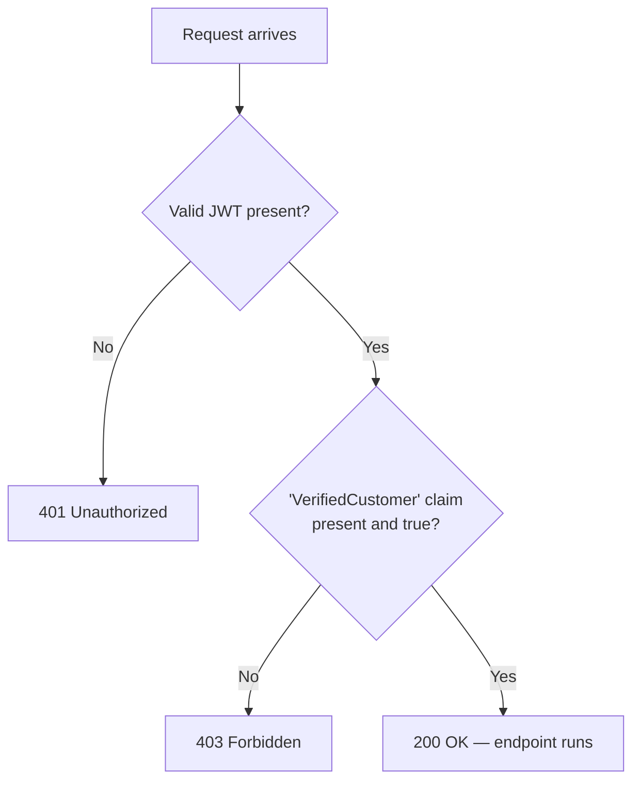
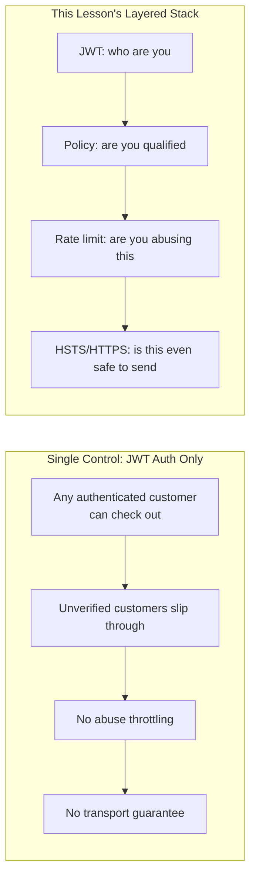

# Securing the E-Commerce Checkout API — Real-Time Example

## Introduction

Before reading this lesson, you should already be comfortable with **[ASP.NET Core Identity](../14-grpc-signalr-security/14-16-aspnetcore-identity.md)**. This lesson doesn't introduce a single new mechanism. Instead, it takes four things this module already built separately — JWT authentication (Lesson 7), claims-based authorization policies (Lesson 10), endpoint-specific rate limiting (Lesson 14), and HTTPS/HSTS enforcement (Lesson 15) — and applies all four, together, to one realistic endpoint: an E-Commerce checkout API that has to reject the wrong callers, throttle abuse, and never leak a credential in transit, all at once, the way a real production endpoint actually has to.

By the end of this lesson, you will be able to:

- Combine JWT bearer authentication with a custom claims-based policy on a single endpoint
- Apply endpoint-specific rate limiting on top of authentication and authorization, not instead of them
- Trace a request through every layer of a secured endpoint, in the exact order the layers run
- Read the difference between a `401`, a `403`, and a `429` response and know precisely which layer produced each one
- Explain why layering multiple, independent security controls on one endpoint is stronger than relying on any single one of them

## Securing the Checkout API — A Layman's Perspective

Picture a high-value pickup counter at a shipping company's back office — the kind of counter customers use to collect an unusually expensive package, not the ordinary front desk. Getting to that package requires passing through several genuinely independent checks, each one guarding against a different kind of problem, stacked in a specific order. The first check is simple: do you have any form of ID at all? No ID, you don't even get past the rope — that's the front door, checking that *someone* identifiable is standing there, without yet caring who. The second check is sharper: does your ID specifically say you're on the pre-approved pickup list for *this* package, not just that you're a customer of the shipping company in general? Plenty of legitimate customers fail this second check every day, for packages that simply aren't theirs. The third check has nothing to do with identity at all — it's a simple house rule that anyone, even someone fully approved for pickup, can only approach the counter a few times in quick succession, because someone hammering the counter repeatedly, badge or no badge, is itself a problem worth stopping. And underneath all three, the entire counter operates inside a windowless, soundproofed room specifically so that nobody standing outside can eavesdrop on any conversation happening at that counter, regardless of which of the three checks anyone passed or failed.

Each of those four checks solves a genuinely different problem, and — this is the crucial part — none of them can substitute for any other. A superb front-door ID check does nothing to stop someone who's a legitimate customer from trying to grab someone else's package; that's what the pre-approved list catches. A perfect pre-approved list does nothing to stop a nervous, over-eager approved customer from walking up to the counter six times in ninety seconds because their app glitched; that's what the "few times in quick succession" rule catches. And a flawless version of all three checks does nothing whatsoever to stop an eavesdropper listening in from just outside a room with paper-thin walls; that's what the soundproofing is for, entirely independent of who was standing at the counter or how many times.

That is exactly the shape of this lesson's checkout endpoint. JWT authentication is the front door — proving *somebody* identifiable is making this call. The claims-based policy is the pre-approved list — checking not just that the caller is *a* customer, but specifically that they've been verified as one entitled to check out at all. The rate limiter is the "few times in quick succession" rule, guarding against abuse regardless of how legitimate the caller is. And HTTPS with HSTS is the soundproofed room, protecting the entire conversation from anyone listening in on the network, independent of every other check. Stack all four, in that order, and you get an endpoint that fails safely and specifically at exactly the layer where a given problem actually occurs — which is precisely what the request trace in this lesson's Real-Time Example demonstrates, one rejection at a time.

## Securing the Checkout API — A Programming Language Perspective

This lesson's endpoint composes four independent ASP.NET Core middleware/authorization layers, applied in the order they must run to behave correctly. `AddAuthentication().AddJwtBearer(...)` populates `HttpContext.User` from a validated bearer token or leaves it unauthenticated, producing a `401` if the endpoint requires authorization and no valid token was presented at all. `AddAuthorizationBuilder().AddPolicy("VerifiedCustomerOnly", policy => policy.RequireClaim("VerifiedCustomer", "true"))`, applied via `.RequireAuthorization("VerifiedCustomerOnly")`, runs next: an authenticated caller lacking the required claim gets a `403`, distinct from the `401` an entirely unauthenticated caller receives. `AddRateLimiter(...)`, applied via `.RequireRateLimiting("policy-name")`, partitions and throttles requests independently of both prior checks — commonly keyed by the authenticated caller's own identifier here, since the goal is stopping any one customer, verified or not, from hammering the endpoint — producing a `429` when a partition's permit limit is exceeded within its window. `UseHsts()` and `UseHttpsRedirection()` sit outside this per-request decision chain entirely, operating at the transport level to ensure none of the above ever happens over an unencrypted connection in the first place. Composed correctly, each layer only ever concerns itself with the one question it was designed to answer.

## How to Combine JWT Authentication with a Claims-Based Policy

Before adding rate limiting and transport security, the core combination is just two pieces from earlier lessons: `AddJwtBearer` for authentication, and a `RequireClaim`-based policy for authorization — proving the two compose exactly as expected before layering anything else on top.


*Figure 1: Two independent checks, two independent failure codes — `401` for "who are you at all," `403` for "you're known, but not qualified for this."*

```csharp
// Program.cs — .NET 10 / C# 14
using System.IdentityModel.Tokens.Jwt;
using System.Security.Claims;
using System.Text;
using Microsoft.AspNetCore.Authentication.JwtBearer;
using Microsoft.IdentityModel.Tokens;

const string SigningKey = "demo-signing-key-at-least-32-bytes-long!";
var key = new SymmetricSecurityKey(Encoding.UTF8.GetBytes(SigningKey));

var builder = WebApplication.CreateBuilder(args);

builder.Services
    .AddAuthentication(JwtBearerDefaults.AuthenticationScheme)
    .AddJwtBearer(options => options.TokenValidationParameters = new TokenValidationParameters
    {
        ValidateIssuer = false,
        ValidateAudience = false,
        ValidateLifetime = true,
        ValidateIssuerSigningKey = true,
        IssuerSigningKey = key
    });

builder.Services.AddAuthorizationBuilder()
    .AddPolicy("VerifiedCustomerOnly", policy =>
        policy.RequireClaim("VerifiedCustomer", "true"));

var app = builder.Build();
app.UseAuthentication();
app.UseAuthorization();

app.MapPost("/auth/token", (string customerId, bool verified) =>
{
    List<Claim> claims = [new(ClaimTypes.NameIdentifier, customerId)];
    if (verified)
    {
        claims.Add(new Claim("VerifiedCustomer", "true"));
    }

    var token = new JwtSecurityToken(
        claims: claims,
        expires: DateTime.UtcNow.AddHours(1),
        signingCredentials: new SigningCredentials(key, SecurityAlgorithms.HmacSha256));
    return Results.Ok(new { token = new JwtSecurityTokenHandler().WriteToken(token) });
});

app.MapGet("/api/profile", (HttpContext http) =>
    Results.Ok($"Verified profile for {http.User.FindFirstValue(ClaimTypes.NameIdentifier)}"))
    .RequireAuthorization("VerifiedCustomerOnly");

app.Run();
```

**Console Output** *(HTTP traffic — three calls to `/api/profile`):*

```text
GET /api/profile (no Authorization header)
< HTTP/1.1 401 Unauthorized

GET /api/profile (Bearer token for cust-1, verified=false)
< HTTP/1.1 403 Forbidden

GET /api/profile (Bearer token for cust-1, verified=true)
< HTTP/1.1 200 OK
"Verified profile for cust-1"
```

With no token at all, `AddJwtBearer` never populates `HttpContext.User`, so `.RequireAuthorization` fails at the authentication stage — `401`. With a valid token that simply doesn't carry the `VerifiedCustomer` claim, authentication succeeds but `RequireClaim` fails — `403`, a meaningfully different signal for a client to act on. This exact two-layer combination is the foundation the Real-Time Example below builds the full checkout endpoint on top of.

## Real-Time Example: The Fully Secured E-Commerce Checkout Endpoint

We extend the E-Commerce Order Processing domain with `POST /api/checkout`, the endpoint a customer's cart actually submits to. Production checkout endpoints are a genuinely high-value target — they touch payment and inventory — so this version adds the two remaining layers on top of the JWT-plus-policy pair above: a rate limit partitioned per authenticated customer, and HSTS/HTTPS enforcement outside the Development environment.

```csharp
// Program.cs — .NET 10 / C# 14 — Real-Time Example (E-Commerce Order Processing)
using System.IdentityModel.Tokens.Jwt;
using System.Security.Claims;
using System.Text;
using System.Threading.RateLimiting;
using Microsoft.AspNetCore.Authentication.JwtBearer;
using Microsoft.AspNetCore.RateLimiting;
using Microsoft.IdentityModel.Tokens;

const string SigningKey = "checkout-api-shared-signing-key-32-bytes-min!";
var key = new SymmetricSecurityKey(Encoding.UTF8.GetBytes(SigningKey));

var builder = WebApplication.CreateBuilder(args);

builder.Services
    .AddAuthentication(JwtBearerDefaults.AuthenticationScheme)
    .AddJwtBearer(options => options.TokenValidationParameters = new TokenValidationParameters
    {
        ValidateIssuer = false,
        ValidateAudience = false,
        ValidateLifetime = true,
        ValidateIssuerSigningKey = true,
        IssuerSigningKey = key
    });

builder.Services.AddAuthorizationBuilder()
    .AddPolicy("VerifiedCustomerOnly", policy =>
        policy.RequireClaim("VerifiedCustomer", "true"));

builder.Services.AddRateLimiter(options =>
{
    options.RejectionStatusCode = StatusCodes.Status429TooManyRequests;
    options.AddPolicy("checkout-endpoint", httpContext =>
    {
        string customerId = httpContext.User.FindFirst(ClaimTypes.NameIdentifier)?.Value ?? "anonymous";
        return RateLimitPartition.GetFixedWindowLimiter(customerId, _ => new FixedWindowRateLimiterOptions
        {
            Window = TimeSpan.FromMinutes(1),
            PermitLimit = 3,   // 3 checkout attempts per minute, per authenticated customer
            QueueLimit = 0
        });
    });
});

builder.Services.AddHsts(options => options.MaxAge = TimeSpan.FromDays(365));

var app = builder.Build();

if (!app.Environment.IsDevelopment())
{
    app.UseHsts();
    app.UseHttpsRedirection();
}

app.UseAuthentication();
app.UseAuthorization();
app.UseRateLimiter();

app.MapPost("/auth/token", (string customerId, bool verified) =>
{
    List<Claim> claims = [new(ClaimTypes.NameIdentifier, customerId)];
    if (verified)
    {
        claims.Add(new Claim("VerifiedCustomer", "true"));
    }

    var token = new JwtSecurityToken(
        claims: claims,
        expires: DateTime.UtcNow.AddHours(1),
        signingCredentials: new SigningCredentials(key, SecurityAlgorithms.HmacSha256));
    return Results.Ok(new { token = new JwtSecurityTokenHandler().WriteToken(token) });
});

int orderCounter = 6000;

app.MapPost("/api/checkout", (HttpContext http, string cartId, decimal total) =>
{
    string customerId = http.User.FindFirstValue(ClaimTypes.NameIdentifier)!;
    int orderId = ++orderCounter;
    return Results.Ok(new { orderId, customerId, cartId, total, status = "Processing" });
})
.RequireAuthorization("VerifiedCustomerOnly")
.RequireRateLimiting("checkout-endpoint");

app.Run();
```

**Console Output** *(HTTPS traffic against `checkout.contoso-shop.example` in production; a plain-HTTP first attempt would receive HSTS's `307` redirect exactly as Lesson 15 demonstrated, omitted here for focus):*

```text
POST /api/checkout?cartId=cart-771&total=249.98 (no Authorization header)
< HTTP/1.1 401 Unauthorized

POST /auth/token?customerId=cust-2044&verified=false
< HTTP/1.1 200 OK — token issued (no VerifiedCustomer claim)

POST /api/checkout?cartId=cart-771&total=249.98 (Bearer token for cust-2044, unverified)
< HTTP/1.1 403 Forbidden

POST /auth/token?customerId=cust-9007&verified=true
< HTTP/1.1 200 OK — token issued (VerifiedCustomer claim present)

POST /api/checkout?cartId=cart-8842&total=189.50 (Bearer token for cust-9007, verified) — attempt 1
< HTTP/1.1 200 OK
{"orderId":6001,"customerId":"cust-9007","cartId":"cart-8842","total":189.50,"status":"Processing"}

POST /api/checkout?cartId=cart-8842&total=189.50 (same customer) — attempt 2
< HTTP/1.1 200 OK
{"orderId":6002,"customerId":"cust-9007","cartId":"cart-8842","total":189.50,"status":"Processing"}

POST /api/checkout?cartId=cart-8842&total=189.50 (same customer) — attempt 3
< HTTP/1.1 200 OK
{"orderId":6003,"customerId":"cust-9007","cartId":"cart-8842","total":189.50,"status":"Processing"}

POST /api/checkout?cartId=cart-8842&total=189.50 (same customer) — attempt 4, within the same 1-minute window
< HTTP/1.1 429 Too Many Requests
```

Read top to bottom, this trace is the entire module's arc compressed into one endpoint. The first call fails before any business logic runs at all — no token means `AddJwtBearer` never populates `HttpContext.User`, so the `401` comes from the authentication layer alone. `cust-2044`'s token is perfectly valid — the signature checks out, the customer ID is real — but it doesn't carry `VerifiedCustomer`, so `RequireClaim` fails it with `403`, a deliberately different code than the first rejection, because the *reason* is different: this caller is known, just not entitled to check out. `cust-9007`'s token clears both checks, and the first three calls succeed, each minting a genuine order (`6001`, `6002`, `6003`) with a strictly increasing ID, exactly as a real order-numbering scheme would. The fourth call, still from the same fully verified customer, still carrying a perfectly valid claim, gets rejected anyway — not because anything about their identity or authorization changed, but because `RateLimitPartition.GetFixedWindowLimiter`, keyed on `cust-9007`'s own customer ID, has already issued its three permits for this window. That's the point of layering: a verified, fully authorized customer submitting a checkout form six times in a row because of a slow spinner, or a script deliberately hammering the same account, gets stopped by exactly the layer built for that problem, without the authentication or authorization layers needing to know anything about it at all.

## Defense in Depth: One Control vs. This Lesson's Layered Stack

Every one of this lesson's four layers could, in principle, be the *only* control on this endpoint — plenty of real endpoints ship with just JWT authentication and nothing else, and initially seem to work fine. The gap only becomes visible against a specific attack each missing layer would have caught, which is exactly why "it works in normal testing" is a weak signal for whether an endpoint is actually secured.


*Figure 2: A single control answers one question well; the layered stack answers four different questions, none of which substitute for each other.*

| Aspect | Single Control Only (JWT auth alone) | This Lesson's Layered Stack |
|---|---|---|
| Stops a fully unauthenticated call | Yes | Yes |
| Stops an authenticated but unverified customer | No — any valid token passes | Yes — `VerifiedCustomerOnly` policy |
| Stops a verified customer hammering the endpoint | No | Yes — per-customer rate limit |
| Stops credential/token interception in transit | No guarantee | Yes — HSTS + HTTPS redirection |
| Failure mode if one layer is misconfigured | The whole endpoint is exposed | The remaining layers still hold |

## Types of Controls Combined in This Lesson

1. **[JWT Authentication](../14-grpc-signalr-security/14-07-jwt-authentication.md)** — the "who are you" layer, answering identity alone.
2. **[Authorization Policies and Claims](../14-grpc-signalr-security/14-10-authorization-policies-and-claims.md)** — the "are you qualified" layer, this lesson's `VerifiedCustomer` policy.
3. **[API Rate Limiting and CORS Security](../14-grpc-signalr-security/14-14-api-rate-limiting-cors-security.md)** — the "are you abusing this" layer, applied per-customer rather than per-IP here.
4. **[HSTS and Transport Security](../14-grpc-signalr-security/14-15-hsts-and-transport-security.md)** — the transport-level layer, independent of every request-level decision above it.
5. **[ASP.NET Core Identity](../14-grpc-signalr-security/14-16-aspnetcore-identity.md)** — where the `VerifiedCustomer` claim itself would realistically be set, once, at registration or verification time, rather than issued ad hoc as this lesson's demo token endpoint does.
6. **[Authentication vs Authorization — Comparison](../14-grpc-signalr-security/14-18-authentication-vs-authorization.md)** — next lesson, the module's capstone, formalizing the `401`-versus-`403` distinction this lesson's trace relied on throughout.

## What You've Learned & What's Next

Securing a real endpoint isn't one decision — it's several independent, layered decisions, each answering a different question and each failing in its own distinct way: `401` for no identity, `403` for insufficient authorization, `429` for abuse, and a transport layer that never lets any of it travel in the clear. This lesson's checkout endpoint combined four separate lessons' worth of mechanisms into one coherent, production-shaped whole, and the request trace above showed each layer catching exactly the problem it was built for.

Continue your learning journey with **[Authentication vs Authorization — Comparison](../14-grpc-signalr-security/14-18-authentication-vs-authorization.md)**, the capstone of Module 14, where the `401`-versus-`403` distinction this lesson relied on throughout gets formalized, and the whole module's arc — from gRPC and SignalR through cryptography, transport security, and this integrated example — is tied together before Module 15 begins.

---
*Applies to: .NET 10 / C# 14. Last reviewed 2026-08-16.*
