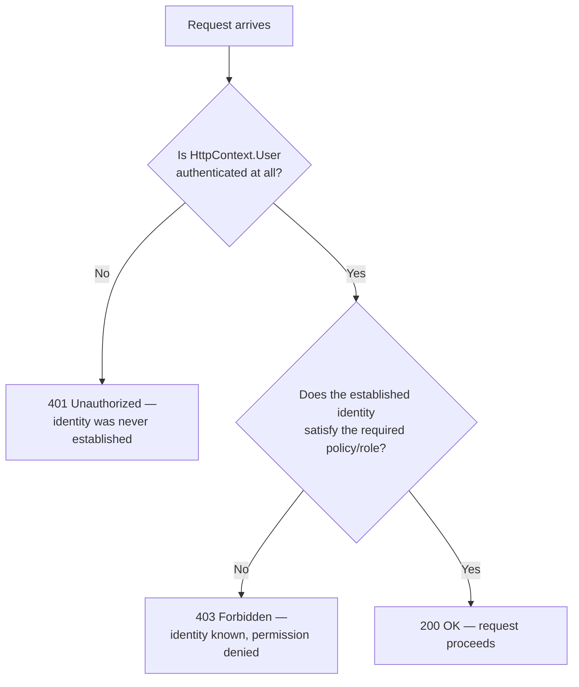
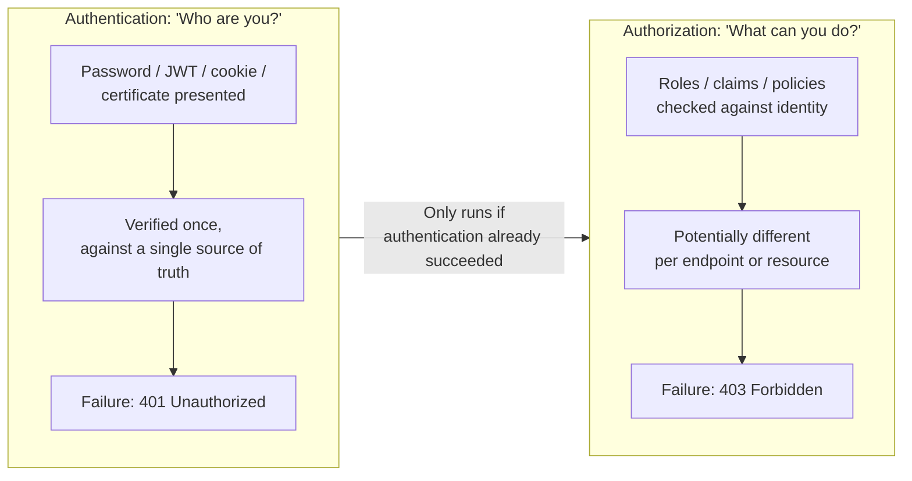

# Authentication vs Authorization — Comparison

## Introduction

Before reading this lesson, you should already be comfortable with **[Securing the E-Commerce Checkout API — Real-Time Example](../14-grpc-signalr-security/14-17-securing-checkout-api-real-time.md)**. That lesson's request trace leaned on a distinction it never fully stopped to name: a `401` and a `403` are not two flavors of the same rejection — they come from two entirely different questions, asked by two entirely different mechanisms, evaluated in a fixed order that can never be reversed. This lesson is Module 14's capstone, the 18th and final lesson of gRPC, SignalR & Security. It exists to name that distinction precisely — **authentication** versus **authorization** — and to look back across everything the module built, from gRPC's wire protocol through cryptography, transport security, Identity, and last lesson's fully layered checkout endpoint, as one continuous story rather than eighteen separate topics.

By the end of this lesson, you will be able to:

- State the precise difference between authentication ("who are you?") and authorization ("what are you allowed to do?")
- Explain why authentication must always run before authorization, and why the order can never be reversed
- Map a `401 Unauthorized` and a `403 Forbidden` response to the exact mechanism that produced each one
- Trace a single request through both checks, in order, and correctly predict which status code a given identity and claim combination produces
- Recount, at a high level, how every earlier lesson in this module contributed one piece to this final distinction

## Authentication vs Authorization — A Layman's Perspective

Picture an international airport, and two entirely separate checkpoints a traveler passes through before ever reaching a seat on a plane. The first is passport control. The officer there has exactly one job: confirm that the document in front of them genuinely belongs to the person holding it — checking the photo, the biometric chip, the signature — and answering one single question, nothing more: is this person who their passport claims they are? The officer at passport control does not know, and does not care, which flight this traveler is booked on, whether they're flying economy or business, or whether they're even allowed into the country for the purpose they've stated. If the passport doesn't check out at all — forged, expired, or simply absent — the traveler is stopped right there, at the very first checkpoint, and never gets anywhere near the terminal. They are not "the wrong kind of traveler" for this particular flight; they are, as far as this checkpoint is concerned, not verifiably anybody at all.

The second checkpoint is entirely different, and it happens much later, at the gate itself, after passport control has already done its job. The gate agent doesn't re-check the passport's authenticity — that question is already settled. Their job is a completely different one: does this specific, already-verified person hold a boarding pass for *this* flight, in *this* class of service? A traveler can sail through passport control perfectly, be genuinely who they say they are, walk confidently through the terminal, and still be turned away at the gate — not because anyone doubts their identity, but because their ticket simply doesn't cover this flight. That traveler isn't rejected as an unidentified stranger; they're rejected as a known, verified person who nonetheless doesn't have permission for this specific thing.

Those two checkpoints, in that fixed order, are exactly authentication and authorization. Passport control is authentication: establishing *who* someone is, once, with nothing else considered. The gate is authorization: given an already-established identity, deciding *what that specific identity is permitted to do*. Notice that the order can never run backwards — a gate agent checking a boarding pass is utterly meaningless work if the passport itself was never verified in the first place, because "permission for someone" presupposes you already know who that someone is. That single fact — identity first, permission second, always in that order, never reversed — is the entire distinction this lesson formalizes, and it's exactly why an HTTP request that fails the first checkpoint gets turned away with a different, more fundamental kind of rejection than one that fails only the second.

## Authentication vs Authorization — A Programming Language Perspective

**Authentication** is the process of establishing *who* a caller is — verifying a credential (a password against a hash, a cookie against a session, a JWT's signature) and, on success, populating `HttpContext.User` with a `ClaimsPrincipal` whose `Identity.IsAuthenticated` becomes `true`. **Authorization** is the process, run strictly afterward, of deciding *what that now-known identity is permitted to do* — evaluating roles, claims, or custom policies against the already-established `ClaimsPrincipal`. In ASP.NET Core's middleware pipeline, `app.UseAuthentication()` must be registered before `app.UseAuthorization()`, for exactly the reason the airport analogy makes obvious: an authorization check has nothing meaningful to evaluate against an identity that was never established. When authentication fails outright — no credential, or an invalid one, on an endpoint requiring one — the framework returns **`401 Unauthorized`**, per RFC 9110, meaning "the server doesn't know who you are, or doesn't accept the credential offered." When authentication succeeds but a subsequent authorization check (a role, a claim, a policy) fails, the framework returns **`403 Forbidden`**, meaning "the server knows exactly who you are, and that identity isn't permitted to do this." The two codes are not interchangeable, and returning the wrong one is a genuine API design defect, not a stylistic choice — it tells the calling client an entirely different thing about what to do next.

## How to Distinguish a 401 from a 403 in Code

The two failure modes come from two independent checks, evaluated in order — no credential at all short-circuits before a policy is ever consulted; a credential that simply doesn't satisfy the policy is a completely separate, later failure.


*Figure 1: Two genuinely different questions, evaluated in a fixed order — the second question is only ever reached if the first one already succeeded.*

```csharp
// Program.cs — .NET 10 / C# 14
using System.Security.Claims;
using Microsoft.AspNetCore.Authorization;

var builder = WebApplication.CreateBuilder(args);
builder.Logging.ClearProviders();
builder.Services.AddAuthorizationBuilder()
    .AddPolicy("AdminOnly", policy => policy.RequireRole("Admin"));

var app = builder.Build();

async Task Check(string label, ClaimsPrincipal? user)
{
    if (user is null)
    {
        Console.WriteLine($"{label}: 401 Unauthorized -- no authenticated identity at all");
        return;
    }

    using IServiceScope scope = app.Services.CreateScope();
    var authService = scope.ServiceProvider.GetRequiredService<IAuthorizationService>();
    AuthorizationResult result = await authService.AuthorizeAsync(user, "AdminOnly");

    Console.WriteLine(result.Succeeded
        ? $"{label}: 200 OK -- authenticated AND authorized"
        : $"{label}: 403 Forbidden -- authenticated, but not authorized");
}

await Check("No token presented", null);

var regularUser = new ClaimsPrincipal(new ClaimsIdentity(
    [new Claim(ClaimTypes.Name, "dev-jamie")], "Demo"));
await Check("Authenticated as 'dev-jamie' (no Admin role)", regularUser);

var adminUser = new ClaimsPrincipal(new ClaimsIdentity(
    [new Claim(ClaimTypes.Name, "admin-morgan"), new Claim(ClaimTypes.Role, "Admin")], "Demo"));
await Check("Authenticated as 'admin-morgan' (Admin role)", adminUser);
```

**Console Output:**

```text
No token presented: 401 Unauthorized -- no authenticated identity at all
Authenticated as 'dev-jamie' (no Admin role): 403 Forbidden -- authenticated, but not authorized
Authenticated as 'admin-morgan' (Admin role): 200 OK -- authenticated AND authorized
```

The first case never even reaches `IAuthorizationService` — with no `ClaimsPrincipal` at all, there's nothing to authorize, exactly mirroring how ASP.NET Core's real middleware pipeline short-circuits at the authentication stage before authorization ever runs. `dev-jamie` and `admin-morgan` both clear that first bar easily — both are unquestionably who they claim to be — and diverge only at the second, independent question of whether the `Admin` role is present.

## Real-Time Example: 401 vs 403 in the Library/Inventory Management Catalog API

We extend the Library/Inventory Management domain with two endpoints on the same patron-facing API: viewing your own current loans, which needs nothing beyond a valid identity, and reserving a restricted rare manuscript, which needs a valid identity *plus* the `Librarian` role — the same two-question shape this lesson has built toward throughout.

```csharp
// Program.cs — .NET 10 / C# 14 — Real-Time Example (Library/Inventory Management)
using System.IdentityModel.Tokens.Jwt;
using System.Security.Claims;
using System.Text;
using Microsoft.AspNetCore.Authentication.JwtBearer;
using Microsoft.IdentityModel.Tokens;

const string SigningKey = "library-catalog-signing-key-32-bytes-minimum!";
var key = new SymmetricSecurityKey(Encoding.UTF8.GetBytes(SigningKey));

var builder = WebApplication.CreateBuilder(args);

builder.Services
    .AddAuthentication(JwtBearerDefaults.AuthenticationScheme)
    .AddJwtBearer(options => options.TokenValidationParameters = new TokenValidationParameters
    {
        ValidateIssuer = false,
        ValidateAudience = false,
        ValidateLifetime = true,
        ValidateIssuerSigningKey = true,
        IssuerSigningKey = key
    });

builder.Services.AddAuthorizationBuilder()
    .AddPolicy("LibrarianOnly", policy => policy.RequireRole("Librarian"));

var app = builder.Build();
app.UseAuthentication();
app.UseAuthorization();

app.MapPost("/auth/token", (string patronId, bool isLibrarian) =>
{
    List<Claim> claims = [new(ClaimTypes.NameIdentifier, patronId)];
    if (isLibrarian)
    {
        claims.Add(new Claim(ClaimTypes.Role, "Librarian"));
    }

    var token = new JwtSecurityToken(
        claims: claims,
        expires: DateTime.UtcNow.AddHours(1),
        signingCredentials: new SigningCredentials(key, SecurityAlgorithms.HmacSha256));
    return Results.Ok(new { token = new JwtSecurityTokenHandler().WriteToken(token) });
});

// Authentication only: any signed-in patron may view their own loans.
app.MapGet("/library/patrons/me/loans", (HttpContext http) =>
{
    string patronId = http.User.FindFirstValue(ClaimTypes.NameIdentifier)!;
    return Results.Ok(new { patronId, loans = new[] { "The Pragmatic Programmer", "Clean Code" } });
})
.RequireAuthorization();

// Authentication AND authorization: only patrons with the Librarian role may reserve rare manuscripts.
app.MapPost("/library/rare-manuscripts/reserve", (HttpContext http, string manuscriptId) =>
{
    string patronId = http.User.FindFirstValue(ClaimTypes.NameIdentifier)!;
    return Results.Ok(new { manuscriptId, reservedBy = patronId, status = "Reserved" });
})
.RequireAuthorization("LibrarianOnly");

app.Run();
```

**Console Output** *(HTTP traffic):*

```text
GET /library/patrons/me/loans (no Authorization header)
< HTTP/1.1 401 Unauthorized

POST /auth/token?patronId=patron-4471&isLibrarian=false
< HTTP/1.1 200 OK — token issued

GET /library/patrons/me/loans (Bearer token for patron-4471)
< HTTP/1.1 200 OK
{"patronId":"patron-4471","loans":["The Pragmatic Programmer","Clean Code"]}

POST /library/rare-manuscripts/reserve?manuscriptId=MS-221 (Bearer token for patron-4471, not a Librarian)
< HTTP/1.1 403 Forbidden

POST /auth/token?patronId=lib-7002&isLibrarian=true
< HTTP/1.1 200 OK — token issued

POST /library/rare-manuscripts/reserve?manuscriptId=MS-221 (Bearer token for lib-7002, Librarian)
< HTTP/1.1 200 OK
{"manuscriptId":"MS-221","reservedBy":"lib-7002","status":"Reserved"}
```

`patron-4471` is rejected with `401` on the very first call — no identity established at all — but succeeds immediately at viewing loans once authenticated, since that endpoint asks only the first question. The same, now-authenticated `patron-4471` is rejected again on the manuscript reservation — this time with `403`, because their identity is entirely settled and accepted, it simply doesn't carry the `Librarian` role the second question demands. `lib-7002`, carrying that role, clears both checks. Same shape as passport control and the gate: one identity, two independent gates, two different ways to be turned away.

## Authentication vs. Authorization — The Core Distinction

The two are not points on a single spectrum — they are answers to categorically different questions, evaluated by different mechanisms, over different inputs, and confusing one for the other is one of the more common real-world API security defects: an endpoint that returns `403` for a missing credential (implying identity was somehow rejected, when it was never even offered) misleads a client into thinking a re-login won't help, when it's exactly what's needed; an endpoint that returns `401` for an authenticated-but-under-privileged caller wrongly suggests their login itself failed, sending them looping back through a sign-in flow that was never the problem.

Authentication answers "who are you?" and is proven through something the caller *has* or *knows* — a password, a valid certificate, a signed token — verified once per request (or once per session, for cookie-based flows) against a single source of truth: does this credential check out at all? Authorization answers "what are you allowed to do?" and is checked through roles, claims, or policies attached to an *already-verified* identity — potentially differently for every single endpoint a caller might hit, since one identity can be permitted to do some things and not others. This module built authentication first — cookies, JWTs, OAuth 2.0, OpenID Connect — because there was nothing to authorize against before an identity existed at all; only once that foundation was in place did claims, policies, and role-based checks (Lessons 10–11) have anything meaningful to evaluate.


*Figure 2: Authorization is never evaluated in isolation — it always presupposes a successfully authenticated identity from the stage before it.*

| Aspect | Authentication | Authorization |
|---|---|---|
| Core question | "Who are you?" | "What are you allowed to do?" |
| Proven via | Password, JWT signature, cookie, certificate | Roles, claims, custom policies |
| Runs | First, establishing `HttpContext.User` | Second, evaluated against that established identity |
| Failure status code | `401 Unauthorized` | `403 Forbidden` |
| Scope | Once per request/session — one pass/fail | Potentially per-endpoint — different rules for different actions |
| This module's building blocks | Cookies (6), JWT (7), OAuth 2.0 (8), OIDC (9) | Claims and policies (10), roles vs policies (11) |

Read end to end, Module 14's eighteen lessons tell one continuous story. It opened with gRPC and SignalR (Lessons 1–5) — two processes, or a server and many live clients, communicating efficiently over the network, with no security layered on yet at all. It then built authentication from the ground up (Lessons 6–9): a cookie, a JWT, and the OAuth 2.0/OpenID Connect standards that formalize how tokens like those actually get issued. Layered directly on top of that established identity, Lessons 10–11 built authorization: claims, custom policies, and the roles-versus-policies decision framework. Lessons 12–13 dropped one level further, into the cryptographic foundations — hashing and encryption — that make trustworthy authentication possible in the first place, and Lessons 14–15 hardened the transport and request layer around all of it: rate limiting, CORS, and HSTS, so credentials and abuse-prone endpoints are actually protected in practice. Lesson 16 packaged authentication, authorization, and hashing into one production-grade framework, ASP.NET Core Identity, and Lesson 17 assembled four of those pieces onto one real endpoint, tracing exactly how a `401`, a `403`, and a `429` each arise from a different layer. This lesson's distinction — authentication first, authorization second, never reversed — is the seam that runs underneath every single one of those seventeen lessons before it.

## Types of Concepts This Module Brought Together

1. **[Cookie Authentication in ASP.NET Core](../14-grpc-signalr-security/14-06-cookie-authentication.md)** and **[JWT Authentication](../14-grpc-signalr-security/14-07-jwt-authentication.md)** — the two authentication mechanisms this lesson's "who are you?" question is answered by throughout the module.
2. **[Authorization Policies and Claims](../14-grpc-signalr-security/14-10-authorization-policies-and-claims.md)** and **[Role-Based vs Policy-Based Authorization](../14-grpc-signalr-security/14-11-role-based-vs-policy-based-authz.md)** — the mechanisms answering this lesson's "what can you do?" question.
3. **[Cryptography in .NET: Hashing](../14-grpc-signalr-security/14-12-cryptography-hashing.md)** — the foundation that makes verifying "who are you" trustworthy in the first place.
4. **[HSTS and Transport Security](../14-grpc-signalr-security/14-15-hsts-and-transport-security.md)** — ensuring neither authentication credentials nor authorization decisions ever travel in the clear.
5. **[ASP.NET Core Identity](../14-grpc-signalr-security/14-16-aspnetcore-identity.md)** — where authentication and authorization, plus registration and 2FA, come packaged together as one system.
6. **[Docker Fundamentals for .NET Developers](../15-containers-blazor-maui/15-01-docker-fundamentals-for-dotnet.md)** — next lesson, opening Module 15, where the focus shifts from securing a running application to packaging and deploying it.

## What You've Learned & What's Next — Module 14 Recap

Authentication proves *who* a caller is; authorization decides *what that already-proven identity may do*; and a `401` versus a `403` is the concrete, HTTP-level signature of which of those two questions actually failed. That single distinction, simple to state, is the thread running underneath this entire module: gRPC and SignalR gave two services a way to talk, Lessons 6–9 gave a request a verifiable identity, Lessons 10–11 gave that identity enforceable permissions, Lessons 12–13 gave the whole system cryptographic integrity, Lessons 14–15 hardened it against abuse and eavesdropping, Lesson 16 packaged it into a production framework, and Lesson 17 proved all of it works together on one real endpoint. Eighteen lessons, one continuous arc, ending exactly where a real production security review would: can you say, precisely, which layer is responsible for any given rejection?

Continue your learning journey with **[Docker Fundamentals for .NET Developers](../15-containers-blazor-maui/15-01-docker-fundamentals-for-dotnet.md)**, the first lesson of Module 15, Containers & Blazor/MAUI, where the focus shifts from securing an application that's already running to packaging it so it can be deployed anywhere, consistently, in the first place.

---
*Applies to: .NET 10 / C# 14. Last reviewed 2026-08-16.*
