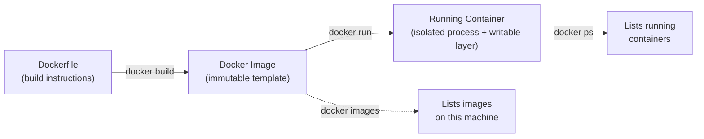
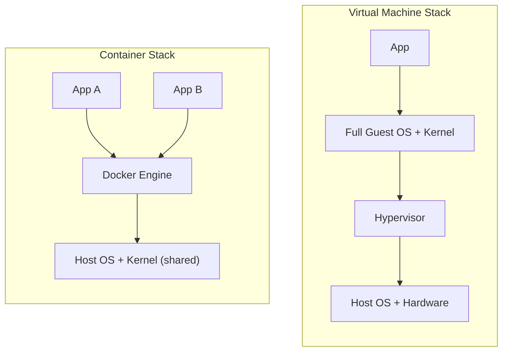

# Docker Fundamentals for .NET Developers

## Introduction

Before reading this lesson, you should already be comfortable with **[Authentication vs Authorization — Comparison](../14-grpc-signalr-security/14-18-authentication-vs-authorization.md)**. Module 14 ended by hardening an already-running ASP.NET Core application against illegitimate callers — but it quietly assumed that application was already running somewhere, consistently, in the first place. This lesson opens Module 15, Containers, Blazor & MAUI, by asking the question Module 14 skipped over: how do you actually get a .NET application from your development machine onto a server — or a hundred servers — so that it runs identically every single time? The answer this module builds toward is **containers**, and this first lesson establishes what a container fundamentally is before Lesson 2 has you package a real ASP.NET Core application into one.

By the end of this lesson, you will be able to:

- Define what a container actually is in terms of process isolation and a shared host OS kernel
- Explain precisely how a container differs from a full virtual machine, and why that difference matters for cost and speed
- Distinguish a Docker **image** (an immutable template) from a Docker **container** (a running instance of that template)
- Run, list, and inspect containers using `docker run`, `docker ps`, and `docker images`
- Articulate why containers solve .NET's classic "it works on my machine" deployment problem
- Recognize how this lesson's fundamentals feed directly into Module 16's Azure Container Apps and AKS lessons

## Docker Fundamentals — A Layman's Perspective

For most of the history of ocean freight, cargo was loaded the way it was made: barrels of one shape, wooden crates of another, sacks of grain piled loose, machinery parts strapped down however they'd fit. Every port needed its own specialized dockworkers who understood how to handle *that* port's particular mix of cargo, loading took days, and a ship's hold was really a puzzle solved from scratch each time, by hand, for every voyage. Nothing about how cargo was packed for one leg of a journey — ship to dock — told you anything about how it would need to be handled for the next leg — dock to truck, truck to warehouse. Every handoff was its own negotiation.

The shipping container changed almost nothing about the *cargo* itself and almost everything about how it moved. Whatever is inside — electronics, furniture, produce — gets sealed into a steel box built to one exact, standardized set of dimensions and corner fittings. That box doesn't care what port it lands at, what crane lifts it, what ship's hold it sits in, or what truck chassis carries it away — every crane, every ship, every truck in the entire global system was built to handle that one standard shape. The contents never have to be unpacked and reorganized at each handoff; the box itself, sealed once at the factory, is what moves, intact, through every stage.

A software container is exactly that steel box, and a Docker image is the sealed box itself before it's ever been lifted onto a ship: your application, along with the exact runtime, libraries, and configuration files it needs, packaged together into one self-contained unit. It doesn't matter whether that box eventually gets "loaded" onto a developer's laptop, a testing server, or a production cluster halfway across the world — the contents are identical every time, because nothing about them was repacked at the destination. Now contrast that with the alternative most teams used before containers caught on: a virtual machine. A virtual machine isn't a steel box riding on someone else's ship — it's like buying an entire second ship just to carry your one box, engine room, crew quarters, plumbing and all, fully duplicated, even though your box only needed a few square feet of deck space. It works, but it's an enormous amount of redundant machinery to haul around for the sake of moving one small, sealed thing.

That's the entire promise a container makes to a .NET developer: pack the application once, exactly as it will run, and every environment downstream — your laptop, a QA server, a production data center — receives the identical sealed box, with nothing left to reinterpret, reinstall, or accidentally get wrong along the way.

## Docker Fundamentals — A Programming Language Perspective

A **container** is an isolated, running process (or group of processes) that shares its host machine's operating system kernel while appearing to have its own filesystem, network stack, and process tree — isolation enforced by Linux kernel primitives called **namespaces** (isolating what a process can see) and **cgroups** (limiting what resources it can consume). This is fundamentally different from a **virtual machine**, which virtualizes hardware and boots an entire separate guest operating system, kernel included, for every instance.

A Docker **image** is an immutable, layered filesystem template — built from instructions in a `Dockerfile` — that bundles an application together with its runtime, dependencies, and configuration. A **container** is a running instance created *from* an image, with one thin writable layer added on top; you can start many containers from the same single image, each isolated from the others, the same way many objects can be instantiated from one class. The **Docker Engine** is the background daemon (`dockerd`) responsible for building images and starting, stopping, and networking containers, driven through the `docker` CLI.

## How to Run and Inspect Containers with Docker

Three commands cover the basics you'll use constantly: `docker images` lists image templates already downloaded to your machine, `docker run` creates and starts a new container from one of those images, and `docker ps` lists containers that are currently running. Because Docker/container lessons deal with shell tooling rather than a C# program, every code and output block below shows **actual shell commands and their terminal output** — not a `dotnet run` console trace — exactly as you'd see them typed into a terminal.


*Figure 1: An image is a template; a container is a running instance created from it — `docker images` inspects the templates, `docker ps` inspects the running instances.*

```bash
# Pull a ready-made .NET sample image and run it as a container
docker pull mcr.microsoft.com/dotnet/samples:aspnetapp

docker run -d -p 8080:8080 --name sample-api mcr.microsoft.com/dotnet/samples:aspnetapp

docker ps

docker images

curl http://localhost:8080/
```

**Shell Output** *(this lesson shows terminal/container output, not a C# console trace):*

```text
$ docker pull mcr.microsoft.com/dotnet/samples:aspnetapp
aspnetapp: Pulling from dotnet/samples
Status: Downloaded newer image for mcr.microsoft.com/dotnet/samples:aspnetapp

$ docker run -d -p 8080:8080 --name sample-api mcr.microsoft.com/dotnet/samples:aspnetapp
7f2a91c3d8e4b615a9d0f3c2e1b8a7d6c5f4e3d2c1b0a9f8e7d6c5b4a3f2e1d0

$ docker ps
CONTAINER ID   IMAGE                                       STATUS         PORTS                    NAMES
7f2a91c3d8e4   mcr.microsoft.com/dotnet/samples:aspnetapp   Up 3 seconds   0.0.0.0:8080->8080/tcp   sample-api

$ docker images
REPOSITORY                     TAG         IMAGE ID       SIZE
mcr.microsoft.com/dotnet/samples   aspnetapp   9c4b2e1a7f3d   217MB

$ curl http://localhost:8080/
Hello World!
```

Each command targets a different layer: `docker images` shows the immutable template sitting idle on disk, `docker ps` shows the one live, isolated process running from it right now, and the `curl` at the end proves that process is a real, reachable ASP.NET Core application — with no .NET SDK, no runtime, and no manual configuration installed on the host machine at all. Everything the application needed arrived sealed inside the image.

## Real-Time Example: Docker in E-Commerce Order Processing

Imagine your team has already built an `OrderService` API for the E-Commerce Order Processing domain — the same `Order` and `OrderItem` records this curriculum has used since the LINQ module — and packaged it into an image named `ecommerce/order-api:1.0` (Lesson 2 walks through building that image yourself; here, we treat it as already built, and focus purely on running and inspecting it as a container). A teammate on the operations side, who has never seen the C# source code and doesn't have the .NET SDK installed, needs to run this API locally to investigate a customer's order.

```bash
# Run the packaged Order API and verify it's serving real order data
docker run -d -p 8080:8080 --name order-api -e ASPNETCORE_ENVIRONMENT=Production ecommerce/order-api:1.0

docker ps

curl http://localhost:8080/api/orders/ORD-48213

docker logs order-api --tail 5

docker stop order-api
docker rm order-api
```

**Shell Output** *(container logs and HTTP behavior, not a C# console trace):*

```text
$ docker run -d -p 8080:8080 --name order-api -e ASPNETCORE_ENVIRONMENT=Production ecommerce/order-api:1.0
b3d8f1a29c47

$ docker ps
CONTAINER ID   IMAGE                    STATUS         PORTS                    NAMES
b3d8f1a29c47   ecommerce/order-api:1.0  Up 2 seconds   0.0.0.0:8080->8080/tcp   order-api

$ curl http://localhost:8080/api/orders/ORD-48213
{"orderId":"ORD-48213","customerId":"CUST-7745","status":"Shipped","items":3,"total":214.97}

$ docker logs order-api --tail 5
info: OrderService.Program[0]
      Now listening on: http://[::]:8080
info: OrderService.Endpoints.OrderEndpoints[0]
      GET /api/orders/ORD-48213 responded 200 OK in 14ms
info: Microsoft.Hosting.Lifetime[0]
      Application started. Press Ctrl+C to shut down.

$ docker stop order-api
order-api
$ docker rm order-api
order-api
```

Notice that the operations teammate never installed the .NET runtime, never opened the source code, and never touched a `csproj` file — the image already contained everything the `OrderService` needed to run identically to how it runs in the original developer's environment. Passing `-e ASPNETCORE_ENVIRONMENT=Production` demonstrates configuring behavior at container startup without rebuilding the image at all — the same image can run as `Development` on a laptop and `Production` on a server just by changing an environment variable at `docker run` time. This is precisely the deployment consistency Module 16's Azure Container Apps and AKS lessons will build on: the same sealed image, running unmodified, wherever it's deployed.

## Containers vs Virtual Machines

Both containers and virtual machines solve the same underlying problem — running an application in an isolated, self-contained environment — but they solve it at entirely different layers of the system. A virtual machine virtualizes *hardware*: a hypervisor carves out virtual CPU, memory, and disk, and a full guest operating system, complete with its own kernel, boots on top of that virtual hardware, exactly as if it were a separate physical machine. A container virtualizes nothing below the operating system — it's an isolated process that shares the *same* kernel as its host, walled off using namespaces and cgroups rather than a hypervisor. That single architectural difference is why containers start in milliseconds and measure their footprint in megabytes, while virtual machines take minutes to boot and measure their footprint in gigabytes — a VM is carrying an entire redundant "ship," while a container is just the standardized box.


*Figure 2: A virtual machine duplicates an entire operating system per instance; containers share one host kernel and isolate only the process, so far more of them fit on the same hardware.*

| Aspect | Container | Virtual Machine |
|---|---|---|
| Isolation boundary | Process-level, via kernel namespaces/cgroups | Hardware-level, via a hypervisor |
| Kernel | Shared with the host | Own full guest OS kernel per instance |
| Startup time | Milliseconds to a few seconds | Tens of seconds to minutes |
| Typical footprint | Megabytes | Gigabytes |
| Portability | Runs identically anywhere Docker runs | Tied to hypervisor/hardware compatibility |
| Typical use case | Packaging and deploying one application consistently | Running entire separate operating systems side by side |

## Types of Docker Concepts You'll Use Throughout This Module

1. **[Dockerizing an ASP.NET Core Application](../15-containers-blazor-maui/15-02-dockerizing-aspnetcore-app.md)** — writing the `Dockerfile` that turns an API project into the image this lesson only consumed.
2. **[Docker Compose for Multi-Container .NET Apps](../15-containers-blazor-maui/15-03-docker-compose-multi-container.md)** — running an API alongside a database and cache container together.
3. **[Multi-Stage Docker Builds for .NET](../15-containers-blazor-maui/15-14-multi-stage-docker-builds.md)** — keeping production images small by separating the build environment from the runtime environment.
4. **[Container Health Checks and Readiness Probes](../15-containers-blazor-maui/15-15-container-health-checks.md)** — telling an orchestrator whether a running container is actually healthy.
5. **[Azure Container Apps](../16-azure-for-dotnet-developers/16-15-azure-container-apps.md)** — the managed Azure service this module's images ultimately deploy to.
6. **[AKS Fundamentals](../16-azure-for-dotnet-developers/16-16-aks-fundamentals.md)** — running many containers at scale using Kubernetes.

## What You've Learned & What's Next

A container is a lightweight, isolated process sharing its host's kernel; an image is the immutable, sealed template a container is created from; and `docker run`, `docker ps`, and `docker images` are the three commands you'll reach for constantly to create, inspect, and enumerate them. That consistency — the same sealed image behaving identically everywhere — is exactly what solves .NET's oldest deployment headache.

Continue your learning journey with **[Dockerizing an ASP.NET Core Application](../15-containers-blazor-maui/15-02-dockerizing-aspnetcore-app.md)**, where you'll write your first `Dockerfile` and build the `ecommerce/order-api` image this lesson only ran.

---
*Applies to: .NET 10 / C# 14. Last reviewed 2026-08-16.*
