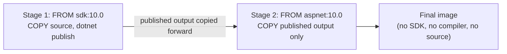
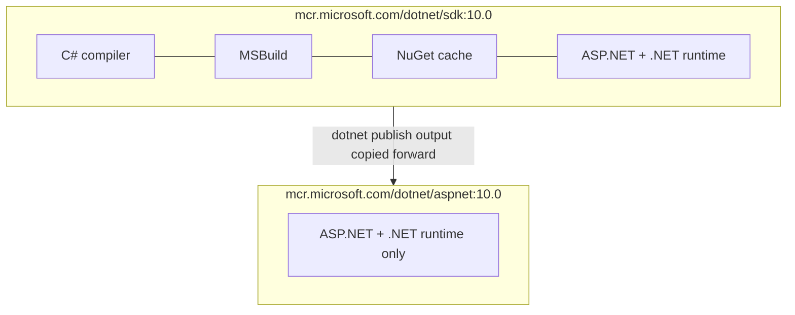

# Dockerizing an ASP.NET Core Application

## Introduction

Before reading this lesson, you should already be comfortable with **[Docker Fundamentals for .NET Developers](../15-containers-blazor-maui/15-01-docker-fundamentals-for-dotnet.md)**, where you ran and inspected an already-built container without ever seeing how its image came together. This lesson closes that gap: you'll write the `Dockerfile` that turns an ASP.NET Core minimal API project into a runnable image yourself, build it with `docker build`, and run it with `docker run -p`, mapping a container port to your host machine.

By the end of this lesson, you will be able to:

- Write a `Dockerfile` for an ASP.NET Core minimal API using a separate SDK build stage and ASP.NET runtime stage
- Explain why the build image and the runtime image are deliberately different, and why that difference shrinks the final image
- Build an image from a `Dockerfile` using `docker build`
- Run a container from that image with `docker run -p`, correctly mapping container ports to host ports
- Configure an application's behavior inside a container using environment variables, without rebuilding the image

## Dockerizing an ASP.NET Core Application — A Layman's Perspective

Picture a restaurant kitchen preparing a dish that will eventually be served at a food truck parked three blocks away. The kitchen where the dish is actually prepared is enormous and cluttered on purpose — industrial mixers, a walk-in pantry stocked with every ingredient the menu might ever call for, sharpening steels, prep tables, a dozen half-finished sauces reducing on the back burners. None of that clutter is meant to travel. Once the dish is finished, plated, and ready, what actually gets carried out to the food truck is just the plate itself — a single, finished, self-contained result. The food truck doesn't need the industrial mixer or the walk-in pantry to serve that plate to a customer; it only ever needed the *outcome* of all that kitchen machinery, not the machinery itself.

Building a Docker image for an ASP.NET Core application works the same way, and for the same reason. Compiling your C# source code into a running application requires a genuinely large toolchain — the .NET SDK, the C# compiler, NuGet's package cache, MSBuild's task graph — the equivalent of that cluttered industrial kitchen. But once compilation is finished and your application has been "published" into its final, ready-to-run form, none of that toolchain is needed to actually *run* it. Shipping the entire kitchen along with the finished plate would mean shipping something enormously larger and heavier than necessary, every single time, for no benefit — the food truck was only ever going to serve the plate.

So a well-built Dockerfile for an ASP.NET Core app deliberately uses two different "rooms." The first room, the build stage, is the big cluttered kitchen: it starts from an image that includes the full SDK, copies in your project's source code, and runs the equivalent of compiling and plating the dish. The second room, the runtime stage, is the food truck's serving window: it starts from a much smaller image that includes only what's needed to *run* an already-finished ASP.NET Core application, and the only thing carried over from the first room is the finished, published output — the plate, not the kitchen. The customer at the food truck window, like the server eventually running your container in production, never has to see, install, or pay the storage cost for the industrial mixer at all.

That's the whole shape of what you're about to write: one stage that has everything needed to *build* the application, and a second, much leaner stage that only ever has to *run* what the first stage already finished.

## Dockerizing an ASP.NET Core Application — A Programming Language Perspective

A `Dockerfile` is a plain-text set of instructions Docker reads top to bottom to assemble an image, one layer per instruction. `FROM` selects a base image to build on top of; `WORKDIR` sets the working directory inside the image; `COPY` brings files from your project into it; `RUN` executes a command (such as `dotnet restore` or `dotnet publish`) while the image is being built; `EXPOSE` documents which port the container listens on; and `ENTRYPOINT` specifies the command that runs when a container starts. A Dockerfile with more than one `FROM` is a **multi-stage build**: earlier stages (here, based on `mcr.microsoft.com/dotnet/sdk:10.0`, which bundles the full SDK and compiler) can be discarded once they've produced an artifact, while only the final stage — based on the far smaller `mcr.microsoft.com/dotnet/aspnet:10.0` runtime-only image — is kept as the resulting image. Lesson 14 revisits multi-stage builds in more depth; this lesson uses the pattern at its simplest.

## How to Write and Build a Dockerfile for a Minimal API

A minimal ASP.NET Core API needs surprisingly little to containerize: copy the project files in, restore and publish it using the SDK image, then copy only that published output into a lean runtime image.


*Figure 1: The SDK stage compiles and publishes the application; only the published output crosses into the much smaller final runtime image.*

```dockerfile
# Dockerfile — .NET 10
FROM mcr.microsoft.com/dotnet/sdk:10.0 AS build
WORKDIR /src
COPY ["GreeterApi.csproj", "./"]
RUN dotnet restore "GreeterApi.csproj"
COPY . .
RUN dotnet publish "GreeterApi.csproj" -c Release -o /app/publish

FROM mcr.microsoft.com/dotnet/aspnet:10.0 AS final
WORKDIR /app
COPY --from=build /app/publish .
EXPOSE 8080
ENV ASPNETCORE_URLS=http://+:8080
ENTRYPOINT ["dotnet", "GreeterApi.dll"]
```

```csharp
// Program.cs — .NET 10 / C# 14
var app = WebApplication.CreateBuilder(args).Build();
app.MapGet("/", () => "Hello from inside a container!");
app.Run();
```

```bash
docker build -t greeter-api:1.0 .
docker run -d -p 8080:8080 --name greeter greeter-api:1.0
curl http://localhost:8080/
```

**Shell Output** *(this lesson's blocks show shell/container output, not a C# console trace):*

```text
$ docker build -t greeter-api:1.0 .
[+] Building 12.4s (12/12) FINISHED
 => [build 1/5] FROM mcr.microsoft.com/dotnet/sdk:10.0
 => [build 4/5] RUN dotnet publish "GreeterApi.csproj" -c Release -o /app/publish
 => [final 3/3] COPY --from=build /app/publish .
 => exporting to image
 => => naming to docker.io/library/greeter-api:1.0

$ docker run -d -p 8080:8080 --name greeter greeter-api:1.0
a91f5c3e8d24

$ curl http://localhost:8080/
Hello from inside a container!
```

`docker build -t greeter-api:1.0 .` reads the `Dockerfile` in the current directory, runs both stages, and tags the resulting final-stage image `greeter-api:1.0`; the `-t` flag names it so later commands can reference it by that name instead of a raw image ID. `docker run -d -p 8080:8080` starts a container from that image in the background (`-d`) and maps host port 8080 to the container's port 8080 — the same port declared with `EXPOSE` and bound with `ASPNETCORE_URLS` inside the Dockerfile. The `curl` call proves the request actually crossed from the host, through the mapped port, into the isolated container process, and back.

## Real-Time Example: Dockerizing the Library Catalog API

We extend the Library/Inventory Management domain by containerizing a `LibraryCatalog` minimal API that exposes book availability — the same kind of catalog lookup a librarian or patron-facing app would call. The `Dockerfile` follows the identical two-stage shape as above, only now built around real domain logic instead of a placeholder greeting.

```csharp
// Program.cs — .NET 10 / C# 14 — Real-Time Example (Library/Inventory Management)
var builder = WebApplication.CreateBuilder(args);
var app = builder.Build();

var catalog = new Dictionary<string, (string Title, int CopiesAvailable)>
{
    ["ISBN-001"] = ("Clean Code", 2),
    ["ISBN-002"] = ("The Pragmatic Programmer", 0),
};

app.MapGet("/catalog/{isbn}", (string isbn) =>
    catalog.TryGetValue(isbn, out var book)
        ? Results.Ok(new { isbn, book.Title, book.CopiesAvailable })
        : Results.NotFound(new { message = $"No book found for ISBN {isbn}" }));

app.Run();
```

```dockerfile
# Dockerfile — .NET 10
FROM mcr.microsoft.com/dotnet/sdk:10.0 AS build
WORKDIR /src
COPY ["LibraryCatalog.csproj", "./"]
RUN dotnet restore "LibraryCatalog.csproj"
COPY . .
RUN dotnet publish "LibraryCatalog.csproj" -c Release -o /app/publish

FROM mcr.microsoft.com/dotnet/aspnet:10.0 AS final
WORKDIR /app
COPY --from=build /app/publish .
EXPOSE 8080
ENV ASPNETCORE_URLS=http://+:8080
ENTRYPOINT ["dotnet", "LibraryCatalog.dll"]
```

```bash
docker build -t library-catalog:1.0 .
docker run -d -p 8080:8080 --name catalog library-catalog:1.0
curl http://localhost:8080/catalog/ISBN-001
curl http://localhost:8080/catalog/ISBN-002
curl http://localhost:8080/catalog/ISBN-999
```

**Shell Output** *(HTTP responses from the running container, not a C# console trace):*

```text
$ curl http://localhost:8080/catalog/ISBN-001
{"isbn":"ISBN-001","title":"Clean Code","copiesAvailable":2}

$ curl http://localhost:8080/catalog/ISBN-002
{"isbn":"ISBN-002","title":"The Pragmatic Programmer","copiesAvailable":0}

$ curl http://localhost:8080/catalog/ISBN-999
{"message":"No book found for ISBN ISBN-999"}
```

A librarian's front-desk terminal, a patron-facing web app, and a nightly inventory-reconciliation script could all call this exact same container, on any machine that has Docker installed, without any of them needing the .NET SDK, the source code, or even knowledge of what language the API was written in. That's the practical payoff of Dockerizing an application: the `LibraryCatalog` image behaves identically whether it's running on a developer's laptop during testing or on a production server handling real patron traffic.

## Build-Time Image vs Run-Time Image

The build stage and the final stage in the Dockerfile above aren't just a style preference — they use genuinely different base images with genuinely different purposes, and confusing the two is one of the most common early Docker mistakes .NET developers make: shipping the SDK image to production, bloating the final image with an entire compiler toolchain nobody downstream will ever use.


*Figure 2: The SDK image carries the entire build toolchain; the runtime image carries only what's needed to execute an already-published application.*

| Aspect | SDK Image (`dotnet/sdk:10.0`) | Runtime Image (`dotnet/aspnet:10.0`) |
|---|---|---|
| Contains | Compiler, MSBuild, NuGet cache, runtime | ASP.NET Core + .NET runtime only |
| Typical size | ~800 MB+ | ~220 MB |
| Used to | Restore, compile, publish source code | Execute an already-published application |
| Appears in Dockerfile as | The first `FROM` (build stage) | The final `FROM` (kept as the shipped image) |
| Shipped to production? | No — discarded after publish | Yes — this is the image that actually runs |

## Types of Dockerfile and Build Concepts to Know

1. **[Docker Compose for Multi-Container .NET Apps](../15-containers-blazor-maui/15-03-docker-compose-multi-container.md)** — running this containerized API alongside a database and cache, orchestrated together.
2. **[Multi-Stage Docker Builds for .NET](../15-containers-blazor-maui/15-14-multi-stage-docker-builds.md)** — going further with multi-stage patterns: caching layers, trimming, and multi-architecture builds.
3. **[Container Health Checks and Readiness Probes](../15-containers-blazor-maui/15-15-container-health-checks.md)** — telling an orchestrator whether this running container is actually ready to serve traffic.
4. **[Containerizing the E-Commerce Order API — Real-Time Example](../15-containers-blazor-maui/15-13-containerizing-order-api-real-time.md)** — applying this exact Dockerfile pattern to a full production-shaped API.
5. **[Azure Container Registry](../16-azure-for-dotnet-developers/16-57-azure-container-registry.md)** — where a built image like `library-catalog:1.0` gets pushed so it can be pulled by cloud infrastructure.

## What You've Learned & What's Next

A `Dockerfile` for an ASP.NET Core application is built in two stages: an SDK-based stage that compiles and publishes your code, and a much leaner ASP.NET runtime stage that actually ships and runs — `docker build` produces the image, and `docker run -p` maps a container port to your host so you can reach it. Environment variables like `ASPNETCORE_URLS` let you configure that same image's behavior at startup, without ever touching the Dockerfile again.

Continue your learning journey with **[Docker Compose for Multi-Container .NET Apps](../15-containers-blazor-maui/15-03-docker-compose-multi-container.md)**, where this single container gets a database and a cache to talk to, all started together with one command.

---
*Applies to: .NET 10 / C# 14. Last reviewed 2026-08-16.*
