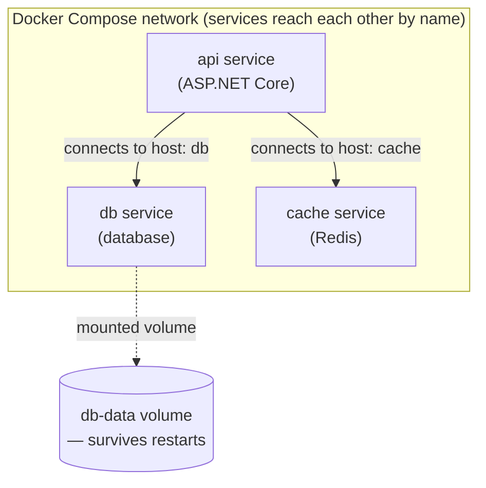
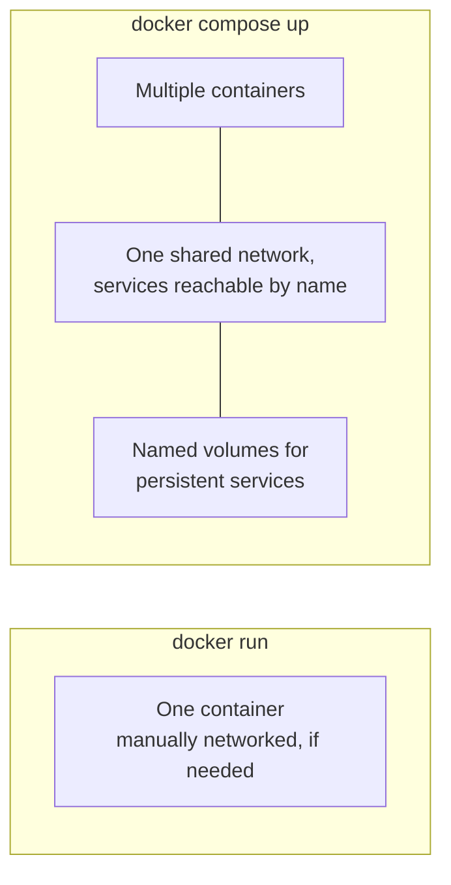

# Docker Compose for Multi-Container .NET Apps

## Introduction

Before reading this lesson, you should already be comfortable with **[Dockerizing an ASP.NET Core Application](../15-containers-blazor-maui/15-02-dockerizing-aspnetcore-app.md)**, where you built and ran a single container in isolation. Almost no real application actually runs alone, though — an API typically needs a database to persist data and often a cache to speed up repeated reads, each conventionally running in its own container. This lesson introduces **Docker Compose**, the tool that starts, networks, and stops a whole group of related containers together, as one coordinated unit, using a single declarative file.

By the end of this lesson, you will be able to:

- Explain what a `docker-compose.yml` file orchestrates, and why multi-container applications need one
- Define multiple services — an API, a database, and a cache — in a single Compose file
- Start and stop an entire multi-container stack with `docker compose up` and `docker compose down`
- Explain how containers on the same Compose network reach each other by service name, without hardcoded IP addresses
- Use named volumes to persist data — like database rows — across container restarts and recreations

## Docker Compose for Multi-Container .NET Apps — A Layman's Perspective

Picture the back-of-house of a busy restaurant on a Friday night, made up of several distinct stations: the grill station cooking mains, the walk-in cooler holding tonight's inventory, and the expediter's board where tickets get tracked as they move between stations. Each station is staffed and equipped separately, and each does one job well — but none of them is useful running alone. A grill station with no inventory to cook has nothing to serve; a walk-in cooler nobody's stations can reach might as well not exist; an expediter board nobody can see doesn't coordinate anything.

What actually makes the restaurant function as *one* kitchen, rather than three disconnected rooms, is the shift manager's opening routine: a single checklist that starts every station at the same time, at the top of service, in the right order — cooler stocked and running first, since the grill depends on it having something to pull from; then the grill fired up; then the expediter board switched on last, once there's actually something moving through the kitchen for it to track. Just as important, that same opening routine hands every station a simple internal directory: the grill doesn't need to memorize the walk-in cooler's street address to ask for tonight's inventory, it just calls out "cooler" over the kitchen intercom, and the routine's setup ensures that name reaches the right physical room every single night, even if the cooler itself gets rearranged or restocked between shifts. And when the night ends, the walk-in cooler's contents don't get thrown out with the rest of the shift's disposable prep — its shelves persist, ready for tomorrow, precisely because it was designed from the start as the one station whose contents are meant to outlive any single night's service.

Docker Compose is exactly that shift manager's checklist for a group of containers. Instead of manually running a database container, then an API container, then a cache container, in the right order, and manually wiring each one's network address into the others by hand, one `docker-compose.yml` file describes every station — every service — at once: what image each one runs from, what order they depend on, and what name each one answers to on the shared internal network. `docker compose up` is the entire opening routine executed in a single command, and a named volume attached to the database service is that walk-in cooler — the one component explicitly designed to keep its contents intact, night after night, restart after restart, even while the containers around it come and go.

## Docker Compose for Multi-Container .NET Apps — A Programming Language Perspective

**Docker Compose** is a tool, driven by a declarative `docker-compose.yml` file, for defining and running multiple related containers as a single application stack. Each top-level entry under `services:` describes one container: which image to build or pull, which ports to publish, which environment variables to set, and which other services it depends on via `depends_on`. Running `docker compose up` creates a private, isolated Docker network for the whole file and starts every defined service attached to it; within that network, Docker's embedded DNS resolves each service's name — not an IP address — to the correct running container, so an API service can reach a database service simply by using the *service name* (e.g., `atm-db`) as if it were a hostname. A **volume** declared under `volumes:` and mounted into a service is storage that lives independently of that container's own lifecycle — the container can be stopped, removed, and recreated from the same image, and the volume's contents, mounted back in, are untouched.

## How to Define and Run a Multi-Container Compose Stack

A minimal Compose file needs a `services:` block listing each container by name, the image or build context it comes from, and how it connects to the others.


*Figure 1: `docker compose up` starts every service on one private network where each is reachable by its service name; a named volume keeps the database's data alive independent of the container itself.*

```yaml
# docker-compose.yml
services:
  api:
    build: .
    ports:
      - "8080:8080"
    environment:
      - ConnectionStrings__Db=Host=db;Database=appdb;Username=postgres;Password=devpass
      - Redis__Host=cache
    depends_on:
      - db
      - cache

  db:
    image: postgres:17
    environment:
      - POSTGRES_PASSWORD=devpass
      - POSTGRES_DB=appdb
    volumes:
      - db-data:/var/lib/postgresql/data

  cache:
    image: redis:7

volumes:
  db-data:
```

```bash
docker compose up -d
docker compose ps
docker compose down
```

**Shell Output** *(container orchestration output, not a C# console trace):*

```text
$ docker compose up -d
[+] Running 4/4
 ✔ Network myapp_default   Created
 ✔ Container myapp-db-1    Started
 ✔ Container myapp-cache-1 Started
 ✔ Container myapp-api-1  Started

$ docker compose ps
NAME             IMAGE          STATUS         PORTS
myapp-api-1      myapp-api      Up 2 seconds   0.0.0.0:8080->8080/tcp
myapp-cache-1    redis:7        Up 3 seconds   6379/tcp
myapp-db-1       postgres:17    Up 3 seconds   5432/tcp

$ docker compose down
[+] Running 4/4
 ✔ Container myapp-api-1  Removed
 ✔ Container myapp-cache-1 Removed
 ✔ Container myapp-db-1    Removed
 ✔ Network myapp_default   Removed
```

`depends_on` ensures `db` and `cache` start before `api` attempts to use them, and the connection string's host segment — `Host=db` — resolves through Compose's internal DNS to whichever container is currently running the `db` service, with no IP address ever hardcoded anywhere. `docker compose down` tears down every container and the shared network in one command — but because `db-data` is a named volume rather than storage inside the `db` container itself, running `docker compose up` again afterward would restart with an empty container but the same persisted data.

## Real-Time Example: Docker Compose for the Banking/ATM Transaction Stack

We extend the Banking/ATM domain with an `atm-api` service backed by a Postgres database holding account balances, plus a Redis cache used to rate-limit repeated withdrawal attempts against the same account — three containers that must start together and reach each other reliably every time a teammate spins up the stack locally.

```yaml
# docker-compose.yml — Banking/ATM Transaction Stack
services:
  atm-api:
    build: .
    ports:
      - "8080:8080"
    environment:
      - ConnectionStrings__AtmDb=Host=atm-db;Database=atmdb;Username=postgres;Password=devpass
      - Redis__Host=atm-cache
    depends_on:
      - atm-db
      - atm-cache

  atm-db:
    image: postgres:17
    environment:
      - POSTGRES_PASSWORD=devpass
      - POSTGRES_DB=atmdb
    volumes:
      - atm-db-data:/var/lib/postgresql/data

  atm-cache:
    image: redis:7

volumes:
  atm-db-data:
```

```csharp
// Program.cs — .NET 10 / C# 14 — Real-Time Example (Banking/ATM)
var builder = WebApplication.CreateBuilder(args);
builder.Services.AddSingleton(_ =>
    StackExchange.Redis.ConnectionMultiplexer.Connect(
        builder.Configuration["Redis:Host"] + ":6379"));

var app = builder.Build();

// Simplified: real code would query atm-db via EF Core (Module 11) for the actual balance.
var balances = new Dictionary<string, decimal> { ["ACC-5521"] = 842.17m };

app.MapGet("/atm/accounts/{accountId}/balance", (string accountId) =>
    balances.TryGetValue(accountId, out var balance)
        ? Results.Ok(new { accountId, balance })
        : Results.NotFound());

app.Run();
```

```bash
docker compose up -d
curl http://localhost:8080/atm/accounts/ACC-5521/balance
docker compose logs atm-db --tail 3
```

**Shell Output** *(HTTP responses and container logs, not a C# console trace):*

```text
$ docker compose up -d
[+] Running 4/4
 ✔ Container banking_atm-db-1    Started
 ✔ Container banking_atm-cache-1 Started
 ✔ Container banking_atm-api-1   Started

$ curl http://localhost:8080/atm/accounts/ACC-5521/balance
{"accountId":"ACC-5521","balance":842.17}

$ docker compose logs atm-db --tail 3
atm-db-1  | LOG:  database system is ready to accept connections
```

Every teammate on the project runs one command, `docker compose up -d`, and receives an identical local ATM stack — API, database, and cache, all networked together automatically — without manually installing Postgres or Redis, and without ever typing a container IP address. Because `atm-db-data` is a named volume, restarting the stack between work sessions doesn't wipe out test account balances; only an explicit `docker compose down -v` (removing volumes too) would do that.

## Single Container vs Docker Compose

Running one container with `docker run` and orchestrating several with Docker Compose aren't competing tools — they're the same underlying primitive at two different scales. `docker run` is the right tool when an application genuinely stands alone; Compose becomes necessary the moment that application depends on other services it needs to reach reliably, by name, every time the stack starts.


*Figure 2: `docker run` manages one container at a time; Docker Compose manages an entire networked group as a single declared unit.*

| Aspect | `docker run` | Docker Compose |
|---|---|---|
| Scope | One container at a time | Multiple related containers together |
| Configuration | Passed as CLI flags each time | Declared once in `docker-compose.yml` |
| Networking | Manual, or none | Automatic — services reach each other by name |
| Start/stop | One `docker run` / `docker stop` per container | One `docker compose up` / `docker compose down` for the whole stack |
| Persistent data | `-v` flag per container | Named `volumes:` shared across the whole stack definition |

## Types of Multi-Container Concepts to Know

1. **[Introduction to Blazor](../15-containers-blazor-maui/15-04-introduction-to-blazor.md)** — next lesson, where the API this stack serves gets a genuine interactive UI in front of it.
2. **[Multi-Stage Docker Builds for .NET](../15-containers-blazor-maui/15-14-multi-stage-docker-builds.md)** — shrinking the `atm-api` image this stack's `build: .` line produces.
3. **[Container Health Checks and Readiness Probes](../15-containers-blazor-maui/15-15-container-health-checks.md)** — teaching `depends_on` to wait for the database to be genuinely ready, not just started.
4. **[Containerizing the E-Commerce Order API — Real-Time Example](../15-containers-blazor-maui/15-13-containerizing-order-api-real-time.md)** — applying this same multi-container shape to a full production API.
5. **[Azure SQL Database](../16-azure-for-dotnet-developers/16-20-azure-sql-database.md)** and **[Azure Cache for Redis](../16-azure-for-dotnet-developers/16-26-azure-cache-for-redis.md)** — the managed cloud equivalents of the `atm-db` and `atm-cache` containers this stack ran locally.

## What You've Learned & What's Next

Docker Compose turns a group of separately-run containers into one declared, coordinated stack: `docker-compose.yml` defines each service, `docker compose up` starts them all networked together with each one reachable by its service name, and named volumes keep data like account balances alive independent of any single container's lifecycle.

Continue your learning journey with **[Introduction to Blazor](../15-containers-blazor-maui/15-04-introduction-to-blazor.md)**, where the module's focus shifts from packaging backend services to building interactive UIs in C#.

---
*Applies to: .NET 10 / C# 14. Last reviewed 2026-08-16.*
