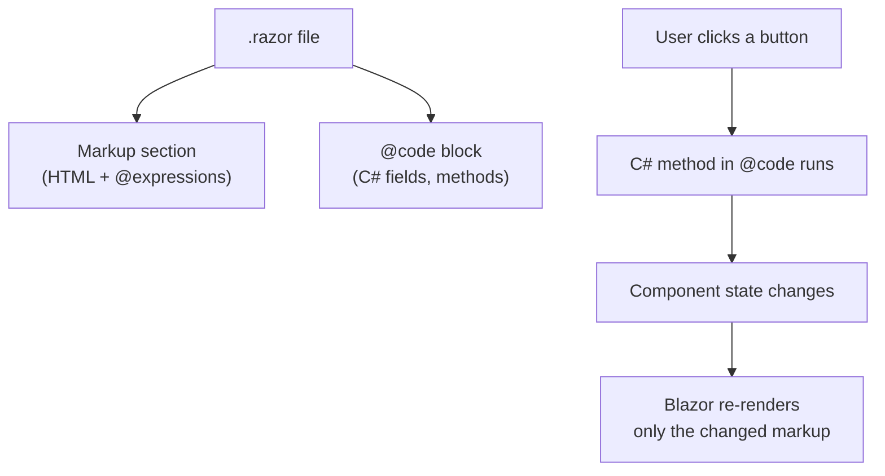
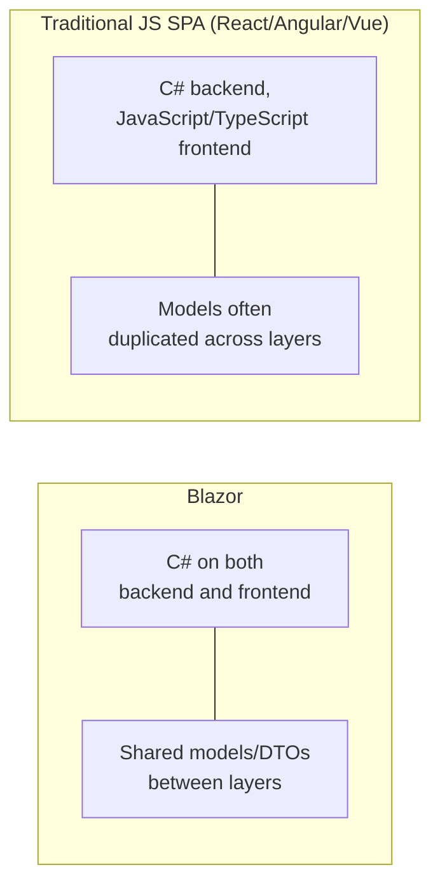

# Introduction to Blazor

## Introduction

Before reading this lesson, you should already be comfortable with **[Docker Compose for Multi-Container .NET Apps](../15-containers-blazor-maui/15-03-docker-compose-multi-container.md)**, where an API, a database, and a cache were packaged and orchestrated together. That API, however capably it's packaged, still only speaks in JSON responses — it has no interactive screen of its own. This lesson introduces **Blazor**, the part of ASP.NET Core that lets you build the interactive, in-browser user interface sitting in front of that API, written entirely in C#, without switching to a separate front-end language to make anything update live.

By the end of this lesson, you will be able to:

- Explain what Blazor is and what problem it solves for a team that already writes its backend in C#
- Read and write basic Razor component syntax — a `.razor` file mixing HTML markup with C# logic
- Describe, at a high level, the two Blazor hosting models: Blazor Server and Blazor WebAssembly
- Build a minimal interactive component and explain how a button click updates what the browser displays
- Articulate why Blazor matters specifically for a C#-first team, ahead of the deep dives in the next two lessons

## Introduction to Blazor — A Layman's Perspective

Imagine a theater company where the same writers who script every scene are traditionally *not* the people allowed to operate the stage's interactive elements — the trapdoors, the moving set pieces, the lights that respond the instant an actor hits a mark. That's historically been the job of a separate specialist, a stage electrician fluent in an entirely different signaling system than the one the writers use to draft dialogue. If a writer wants a lamp to flicker the moment a character says a certain line, they can't just write that into the script directly — they have to hand it off to the electrician, who translates the intent into signals the stage machinery actually understands. Two different crafts, two different languages, one seam running between them where miscommunication and delay creep in.

For years, building an interactive website worked exactly like that split. The people writing the actual application logic — pricing rules, order validation, account balances — typically wrote it in C#, running safely on a server. But the part of the experience a user actually *touches* — a button that responds instantly, a counter that updates without the whole page reloading, a form that validates as you type — traditionally had to be handed off to a completely different language, JavaScript, running in the browser. A C#-fluent team wanting a genuinely responsive, modern interface had two unappealing choices: become fluent in a second language and toolchain just to write the interactive layer, or keep shipping pages that reload fully for every small interaction, feeling clunky and dated by comparison.

Blazor is what happens when the theater company simply removes that seam: the same writers who already script the application's logic in C# are handed direct control over the stage's interactive machinery too, in the very same language they already think in. The lamp that flickers on a certain line, the trapdoor that opens on cue — the writer describes it once, in one script, in one familiar vocabulary, and it simply happens, with no separate electrician, no second craft, no handoff where something gets lost in translation. The audience in their seats notices nothing about *how* that happened — the show still looks and feels exactly as responsive and alive as one built the old way — but backstage, one team, one language, one continuous script now runs the entire production, front to back.

That's the whole promise of Blazor for a C#-first .NET team: interactive, modern web user interfaces, described entirely in C#, with nothing handed off to a second language along the way.

## Introduction to Blazor — A Programming Language Perspective

**Blazor** is the UI framework within ASP.NET Core for building interactive web user interfaces using C# instead of JavaScript. Its fundamental building block is the **component** — a self-contained unit of UI defined in a `.razor` file using **Razor syntax**, which freely mixes ordinary HTML markup with embedded C# via an `@code` block and inline expressions prefixed with `@`. Components can accept input through `[Parameter]`-decorated properties, hold their own local state, and re-render automatically whenever that state changes, without you manually manipulating the DOM. Blazor supports two distinct **hosting models** that run the exact same component code in fundamentally different places: **Blazor Server**, where components execute on the server and UI updates stream to the browser over a persistent SignalR connection (covered in Lesson 5), and **Blazor WebAssembly**, where components are compiled to WebAssembly and run entirely inside the browser's own sandbox (Lesson 6). Both models share the same component model — the choice between them is a deployment and execution-environment decision, not a rewrite.

## How to Build a Basic Razor Component

A `.razor` file's markup section looks like ordinary HTML, with C# expressions and directives woven directly in using the `@` symbol; an `@code` block underneath holds the component's actual C# fields, properties, and methods.


*Figure 1: A Razor component's markup and its C# logic live in one file; a state change re-renders only the affected part of the page, not the whole browser tab.*

```razor
@* Counter.razor — .NET 10 / C# 14 *@
<h3>Click Counter</h3>
<p>Current count: @currentCount</p>
<button @onclick="IncrementCount">Click me</button>

@code {
    private int currentCount = 0;

    private void IncrementCount()
    {
        currentCount++;
    }
}
```

**Browser Behavior** *(Blazor renders in-browser UI, so this lesson describes rendered behavior rather than a C# console trace):*

```text
Initial render:
  Click Counter
  Current count: 0
  [ Click me ]

After clicking "Click me" three times, with no page reload:
  Click Counter
  Current count: 3
  [ Click me ]
```

Every click invokes the C# `IncrementCount` method directly — no JavaScript event handler was written anywhere — and Blazor re-renders only the `<p>` element whose bound value actually changed, leaving the rest of the page untouched. The `@onclick` attribute is Razor syntax wiring a browser DOM event straight to a C# method; that single line is the entire seam between "user interaction" and "server-side or WebAssembly-executed logic," and it never leaves C#.

## Real-Time Example: A Live Order Status Component for E-Commerce Order Processing

We extend the E-Commerce Order Processing domain with an `OrderStatusView` component that displays a customer's current order status — the same `Order` record this curriculum has used since the LINQ module — and lets the customer manually refresh it, previewing the kind of live, data-backed screen a real storefront would put in front of the `OrderService` API from Lesson 1.

```razor
@* OrderStatusView.razor — .NET 10 / C# 14 — Real-Time Example (E-Commerce Order Processing) *@
<h3>Order Status</h3>

@if (order is null)
{
    <p>Loading order @OrderId...</p>
}
else
{
    <p>Order @order.OrderId for @order.CustomerId is currently: <strong>@order.Status</strong></p>
}

<button @onclick="RefreshOrderAsync">Refresh Status</button>

@code {
    [Parameter]
    public string OrderId { get; set; } = "ORD-48213";

    private OrderSummary? order;

    protected override async Task OnInitializedAsync() => await RefreshOrderAsync();

    private async Task RefreshOrderAsync()
    {
        // In the next lessons this calls the containerized OrderService API over HTTP.
        await Task.Delay(50);
        order = new OrderSummary(OrderId, "CUST-7745", "Shipped");
    }

    private record OrderSummary(string OrderId, string CustomerId, string Status);
}
```

**Browser Behavior** *(rendered UI states, not a C# console trace):*

```text
Immediately after the page loads:
  Order Status
  Loading order ORD-48213...
  [ Refresh Status ]

Shortly after, once the (simulated) API call completes:
  Order Status
  Order ORD-48213 for CUST-7745 is currently: Shipped
  [ Refresh Status ]

After clicking "Refresh Status" again, with no full-page reload:
  Order Status
  Order ORD-48213 for CUST-7745 is currently: Shipped
  [ Refresh Status ]
```

A customer watching this screen never experiences a jarring full-page reload, even though real data is being fetched and displayed — the `[Parameter]`-bound `OrderId` lets the same component be reused for any order simply by changing what's passed into it, and the `async` `RefreshOrderAsync` method is the same C# `Task`-based pattern from Module 7, called directly from a UI button rather than a console app. In Lesson 5, this same shape of component runs with Blazor Server's execution model; in Lesson 6, the identical component runs compiled to WebAssembly instead — the component code itself does not need to change.

## Blazor vs a Traditional JavaScript SPA Framework

Blazor is not the only way to build an interactive single-page web application — React, Angular, and Vue solve the same class of problem, but from an entirely different starting language and runtime assumption. The contrast that matters most to a C#-first .NET team isn't which framework is "better" in the abstract; it's which one lets your existing team, and your existing backend code, carry directly into the UI layer without a second language, a second type system, and a second set of tooling conventions bolted on alongside it.


*Figure 2: Blazor keeps one language across the stack; a traditional JS SPA framework introduces a second language boundary between backend and frontend.*

| Aspect | Blazor | Traditional JS SPA Framework |
|---|---|---|
| Primary language | C# throughout | JavaScript or TypeScript for the UI |
| Code/model sharing with an ASP.NET Core backend | Direct — same classes and DTOs | Requires duplicating or generating equivalent types |
| Team skillset required | Existing C#/.NET skillset | A separate front-end skillset and toolchain |
| Ecosystem maturity | Newer, growing rapidly | Extremely mature, enormous ecosystem |
| Typical fit | C#-first teams wanting one language end-to-end | Teams with dedicated front-end specialists already in place |

## Types of Blazor Concepts Covered in This Module

1. **[Blazor Server Fundamentals](../15-containers-blazor-maui/15-05-blazor-server-fundamentals.md)** — next lesson: the hosting model where components execute on the server over a SignalR connection.
2. **[Blazor WebAssembly Fundamentals](../15-containers-blazor-maui/15-06-blazor-webassembly-fundamentals.md)** — the hosting model where components run compiled to WebAssembly, entirely in the browser.
3. **[Blazor Components and Data Binding](../15-containers-blazor-maui/15-07-blazor-components-and-data-binding.md)** — going deeper into `[Parameter]`, `@bind`, and component composition.
4. **[Blazor Server vs Blazor WebAssembly — Comparison](../15-containers-blazor-maui/15-08-blazor-server-vs-wasm.md)** — a dedicated, deeper comparison of the two hosting models this lesson only previewed.
5. **[Introduction to .NET MAUI](../15-containers-blazor-maui/15-09-introduction-to-maui.md)** — the sibling C# UI framework for native desktop and mobile apps, rather than the browser.
6. **[Choosing Blazor vs MAUI vs ASP.NET Core — Decision Guide](../15-containers-blazor-maui/15-18-choosing-blazor-maui-aspnetcore.md)** — this module's capstone decision framework.

## What You've Learned & What's Next

Blazor lets a C#-first team build interactive, modern web UIs entirely in C#, using Razor components that mix HTML markup with embedded C# logic in a single `.razor` file — and the same component model runs under two different hosting models, Blazor Server and Blazor WebAssembly, without the component code itself needing to change.

Continue your learning journey with **[Blazor Server Fundamentals](../15-containers-blazor-maui/15-05-blazor-server-fundamentals.md)**, where you'll see exactly how Blazor Server executes this component's logic on the server and streams the resulting UI changes to the browser in real time.

---
*Applies to: .NET 10 / C# 14. Last reviewed 2026-08-16.*
