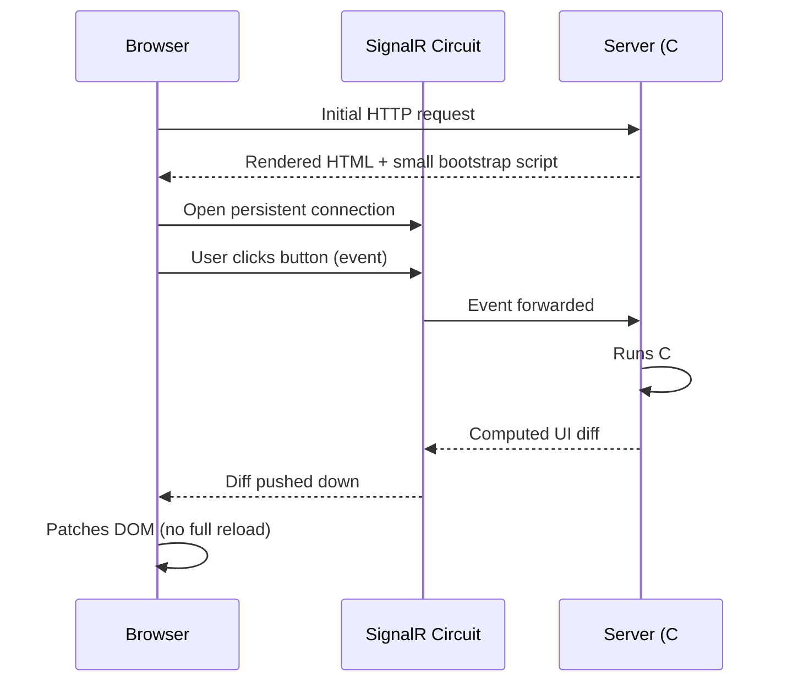
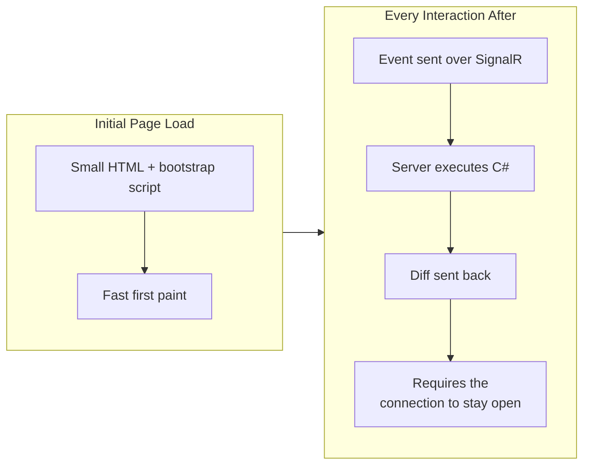

# Blazor Server Fundamentals

## Introduction

Before reading this lesson, you should already be comfortable with **[Introduction to Blazor](../15-containers-blazor-maui/15-04-introduction-to-blazor.md)**, where you built a `Counter` component and an `OrderStatusView` component without yet asking a fairly important question: when a user clicks that button, where does the C# code that responds to it actually *run*? This lesson answers that question for the first of Blazor's two hosting models — **Blazor Server** — where the answer is: on the server, the whole time, with the browser doing remarkably little beyond rendering what it's told. That "what it's told" arrives over a connection this curriculum has already met once before, in Module 14: SignalR.

By the end of this lesson, you will be able to:

- Describe Blazor Server's execution model: component logic runs entirely on the server, inside a per-client "circuit"
- Explain how a persistent SignalR connection carries UI events up to the server and UI diffs back down to the browser
- Connect this lesson directly back to Module 14's SignalR fundamentals rather than treating it as unrelated technology
- Weigh Blazor Server's fast-initial-load, thin-client advantage against its requirement of a live, continuously open connection
- Build a minimal counter component running under Blazor Server's `InteractiveServer` render mode

## Blazor Server Fundamentals — A Layman's Perspective

Picture an air traffic control tower guiding a pilot who has just taken off into thick, zero-visibility fog. The pilot's cockpit is deliberately kept simple — it doesn't need onboard radar, a full weather model, or independent route-planning software installed locally, because none of the actual thinking happens up there. Every decision — the exact heading to hold, when to descend, which runway to line up on — is worked out entirely inside the tower, by controllers watching a far more complete picture than any single cockpit could carry, and then radioed straight down to the pilot as one simple instruction at a time. The plane itself carries almost nothing extra; it's a thin, responsive vehicle that simply executes what the tower tells it, the moment it's told.

That arrangement gets the plane airborne remarkably quickly — there's no elaborate onboard system to load and calibrate before takeoff, just a radio and a pilot ready to listen. But it comes with one absolutely non-negotiable requirement: the radio channel between the tower and the cockpit has to stay open, continuously, for the entire flight. It isn't a system where the tower radios up a full flight plan once and then goes quiet — every single course correction depends on that channel being live, right now, in this moment. If the radio connection drops even briefly, the pilot isn't degraded to some fallback mode of independent judgment; they are, for that stretch of silence, genuinely flying blind, holding their last known heading and waiting for the tower's voice to return before anything can safely change again.

Blazor Server is built on exactly that arrangement, and inherits exactly that tradeoff. The browser is the cockpit: thin, quick to get airborne, carrying almost no independent logic of its own. All the actual thinking — evaluating a button click, deciding what the screen should now show, running your `@code` block's C# — happens entirely on the server, the tower, which has the full picture and does all the real work. What comes back down to the browser isn't a fresh flight plan; it's one small, specific instruction at a time: "update this text," "show this new row." And exactly like that open radio channel, this entire arrangement depends on one continuously live connection between browser and server, for as long as the page stays open. Close that connection, and the browser — like a pilot who's lost the tower's voice — is left holding its last known screen, unable to respond to anything further until the connection is restored.

## Blazor Server Fundamentals — A Programming Language Perspective

**Blazor Server** is the hosting model in which Razor component logic executes entirely on the server, inside a stateful, per-client session called a **circuit**. On first request, the server renders the initial HTML and sends down a small bootstrap script; that script immediately opens a persistent **SignalR** connection back to the server — the same SignalR this curriculum introduced in Module 14, Lessons 4 and 5, as a mechanism for pushing real-time messages from a server to connected clients. Every subsequent UI event (a button click, a keystroke bound with `@bind`) is serialized and sent up that SignalR connection to the server, where the corresponding C# handler runs against the component's live, server-held state; the server then computes a minimal diff of what changed in the render tree and pushes just that diff back down over the same connection, which the browser's small client-side runtime patches directly into the DOM. In modern .NET (8 and later, including .NET 10), a component opts into this model with `@rendermode InteractiveServer`, registered via `builder.Services.AddInteractiveServerComponents()` and `app.MapRazorComponents<App>().AddInteractiveServerRenderMode()`.

## How to Build a Component Under Blazor Server's InteractiveServer Render Mode

Enabling Blazor Server requires two small pieces: server-side service registration for interactive server components, and a `@rendermode` directive on the component (or a shared layout) that should actually run interactively rather than render statically once.


*Figure 1: Nothing after the initial page load happens without a round trip over the live SignalR connection — the browser never independently decides what to show next.*

```csharp
// Program.cs — .NET 10 / C# 14
var builder = WebApplication.CreateBuilder(args);
builder.Services.AddRazorComponents()
    .AddInteractiveServerComponents();

var app = builder.Build();
app.MapRazorComponents<App>()
    .AddInteractiveServerRenderMode();

app.Run();
```

```razor
@* Counter.razor — .NET 10 / C# 14 *@
@rendermode InteractiveServer

<h3>Server-Executed Counter</h3>
<p>Current count: @currentCount</p>
<button @onclick="IncrementCount">Click me</button>

@code {
    private int currentCount = 0;

    private void IncrementCount()
    {
        currentCount++;
        Console.WriteLine($"[Server] IncrementCount ran on the server. New count: {currentCount}");
    }
}
```

**Server Console Output** *(this executes server-side under Blazor Server, so this really is a live server-side trace — not the browser's view):*

```text
[Server] IncrementCount ran on the server. New count: 1
[Server] IncrementCount ran on the server. New count: 2
[Server] IncrementCount ran on the server. New count: 3
```

Every one of those log lines prints on the *server's* console, not the browser's — proof that `IncrementCount` genuinely executed there, over the SignalR circuit, each time the button was clicked in the browser. The browser itself never ran this method at all; it only sent the click event up and received back the tiny instruction to update `<p>Current count: 3</p>`.

## Real-Time Example: A Live Book Availability Board for Library/Inventory Management

We extend the Library/Inventory Management domain with a `BookAvailabilityBoard` component that a librarian uses at the front desk to check a book out — decrementing the available copy count in server-held state and reflecting it instantly in the browser, all without a page reload, extending the same catalog concept the Dockerized `LibraryCatalog` API served back in Lesson 2.

```razor
@* BookAvailabilityBoard.razor — .NET 10 / C# 14 — Real-Time Example (Library/Inventory Management) *@
@rendermode InteractiveServer

<h3>Book Availability — @Isbn</h3>
<p>@title — @copiesAvailable cop(y/ies) available</p>
<button @onclick="CheckOutCopy" disabled="@(copiesAvailable == 0)">Check Out a Copy</button>

@code {
    [Parameter]
    public string Isbn { get; set; } = "ISBN-001";

    private string title = "Clean Code";
    private int copiesAvailable = 2;

    private void CheckOutCopy()
    {
        if (copiesAvailable > 0)
        {
            copiesAvailable--;
            Console.WriteLine(
                $"[Server] Circuit checked out one copy of {Isbn}. Remaining: {copiesAvailable}");
        }
    }
}
```

**Server Console Output** *(server-side circuit trace, not the browser's rendered view):*

```text
[Server] Circuit checked out one copy of ISBN-001. Remaining: 1
[Server] Circuit checked out one copy of ISBN-001. Remaining: 0
```

**Browser Behavior** *(what the librarian actually sees, updating live with no full page reload):*

```text
Book Availability — ISBN-001
Clean Code — 2 cop(y/ies) available
[ Check Out a Copy ]

...after one click...
Book Availability — ISBN-001
Clean Code — 1 cop(y/ies) available
[ Check Out a Copy ]

...after a second click, the button becomes disabled...
Book Availability — ISBN-001
Clean Code — 0 cop(y/ies) available
[ Check Out a Copy ] (disabled)
```

The `copiesAvailable` count lives entirely in server memory for the duration of this librarian's circuit — the exact reason a second librarian's browser, holding its own independent circuit, would need its own round trip to the shared data source to see the updated count. This is precisely why Blazor Server pairs naturally with the SignalR concepts from Module 14: the same persistent, per-client connection model that pushed live chat messages or notifications there is now pushing live UI state changes here.

## Fast Initial Load vs the Cost of a Persistent Connection

Blazor Server's entire tradeoff comes down to when the "cost" of running your application is paid. Because almost no application logic ships to the browser — no compiled component assemblies, no runtime beyond a small SignalR client script — the very first page loads quickly, even on a modest connection. But that lightness is borrowed against a requirement that never goes away for as long as the page is open: a live, continuously connected SignalR circuit, with server memory held open per connected client, and every single interaction depending on a network round trip that a purely client-side approach (Lesson 6) would not need at all.


*Figure 2: What Blazor Server saves on the way in (a thin initial payload) it spends continuously afterward, in the form of a connection that must remain live.*

| Aspect | Initial Page Load | Live Interactions (after the circuit opens) |
|---|---|---|
| What travels over the wire | Rendered HTML + a small bootstrap script | Serialized events up, UI diffs down |
| Where UI logic executes | N/A — first render is done server-side once | On the server, inside the client's circuit |
| Network requirement | A single request, like any web page | A continuously open SignalR connection |
| Failure mode if connection drops | Not applicable yet | UI freezes on its last known state until reconnected |
| Best suited for | Users on constrained devices/networks | Applications where server proximity to data matters most |

## Types of Blazor Server-Related Concepts to Know

1. **[Blazor WebAssembly Fundamentals](../15-containers-blazor-maui/15-06-blazor-webassembly-fundamentals.md)** — next lesson, where component logic instead runs entirely client-side, with no persistent connection required.
2. **[Blazor Components and Data Binding](../15-containers-blazor-maui/15-07-blazor-components-and-data-binding.md)** — going deeper into the `@bind` and parameter patterns this lesson's components used lightly.
3. **[Blazor Server vs Blazor WebAssembly — Comparison](../15-containers-blazor-maui/15-08-blazor-server-vs-wasm.md)** — the dedicated, full comparison of both hosting models this lesson only set one half of.
4. **[Introduction to SignalR](../14-grpc-signalr-security/14-04-introduction-to-signalr.md)** and **[SignalR Groups and Scaling](../14-grpc-signalr-security/14-05-signalr-groups-and-scaling.md)** — the underlying real-time connection technology every Blazor Server circuit is built on.
5. **[Publishing a Blazor App](../15-containers-blazor-maui/15-16-publishing-a-blazor-app.md)** — deploying a Blazor Server application so its circuits run reliably in production.

## What You've Learned & What's Next

Blazor Server runs all of a component's C# logic on the server, inside a per-client circuit, and streams only the resulting UI diffs down to the browser over a persistent SignalR connection — trading a thin, fast-loading client for a hard requirement that the connection stay open for every interaction that follows.

Continue your learning journey with **[Blazor WebAssembly Fundamentals](../15-containers-blazor-maui/15-06-blazor-webassembly-fundamentals.md)**, where the same component model instead runs entirely inside the browser's own sandbox, with no server round trip needed at all.

---
*Applies to: .NET 10 / C# 14. Last reviewed 2026-08-16.*
