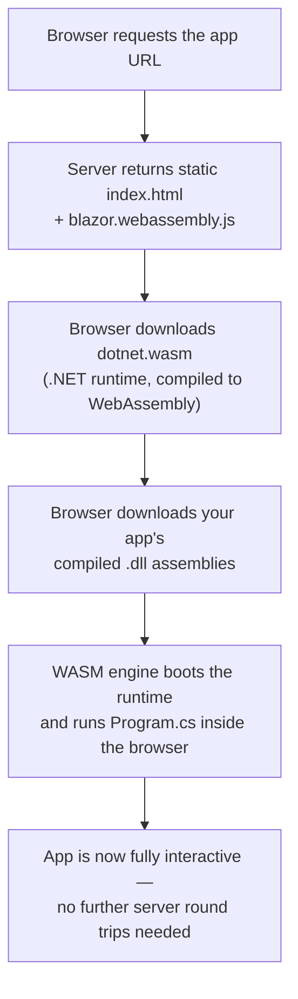
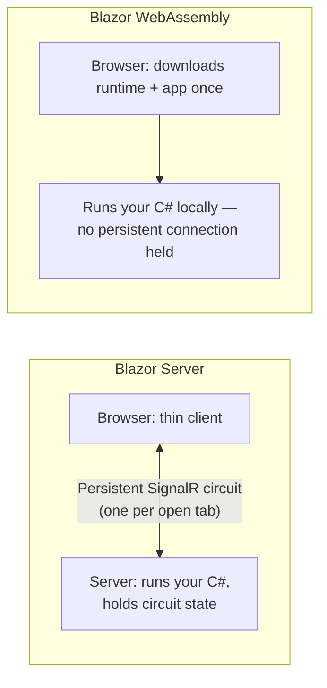

# Blazor WebAssembly Fundamentals

## Introduction

Before reading this lesson, you should already be comfortable with **[Blazor Server Fundamentals](../15-containers-blazor-maui/15-05-blazor-server-fundamentals.md)**, where the browser is a thin client and every button click travels over a persistent SignalR connection to C# code running on the server. This lesson introduces the opposite hosting model: **Blazor WebAssembly**, where your C# runs *inside the browser itself*, with no server round trip needed once the app has loaded.

By the end of this lesson, you will be able to:

- Explain what WebAssembly (WASM) is and how a browser executes it
- Describe how Blazor WebAssembly downloads and runs the entire .NET runtime client-side
- Identify why the initial download is larger, but subsequent interactions need no network round trip at all
- Create and run a minimal Blazor WebAssembly project
- Decide when Blazor WebAssembly's offline-friendly, connection-free model beats Blazor Server's low-latency server-driven one

## Blazor WebAssembly — A Layman's Perspective

Picture two very different ways to play a video game. The first is a cloud gaming service: you press a button on a cheap, low-powered device, and that button press travels over the internet to a powerful remote server, which does all the actual game rendering and sends back only a video stream of what changed. It starts up almost instantly — there's nothing to install — but every single action you take depends entirely on that connection staying up. If your internet drops for even a few seconds, the game freezes solid, because the game was never actually running on your device at all; it was only ever a window looking at a server far away doing the real work.

The second way is buying the game outright and installing it. You download one large file — the full game, all its assets, everything it needs to run — and that download takes real time and real disk space before you can even start. But once it's installed, something fundamentally different is true: the game runs entirely on your own machine. You can unplug your router entirely and keep playing without a hiccup, because nothing about pressing a button or opening a menu ever depended on a server being reachable in the first place. The cost was paid up front, once, as a download; from that point on, you owe the network nothing.

Blazor Server is the cloud gaming service. It starts fast because there's almost nothing to send the browser besides a thin shell and a live connection; but that connection is not a convenience, it's a requirement — every click, every keystroke that matters, travels over it, and if it drops, the app stops responding until it reconnects. Blazor WebAssembly is the installed game. The browser has to download something substantial before anything can happen at all — not just your app's code, but the *entire .NET runtime* that knows how to execute it, packaged up and shipped to the browser as part of that one-time download. It's a slower front door. But once that download finishes, your C# is genuinely, physically running on the visitor's own machine, inside their browser, the same way the installed game runs on their own console. Close the Wi-Fi. Walk into a basement with no signal. The app doesn't care, because it was never phoning home for permission to keep working.

That's the entire trade this lesson is about: pay a bigger cost once, up front, in exchange for a running application that afterward owes absolutely nothing to the network it was born on. Whether that trade is worth it depends entirely on what you're building — a kiosk that needs to survive a flaky in-store Wi-Fi connection has every reason to make that trade; a dashboard where users are always online and want the fastest possible first paint has good reason to make the opposite one. Neither model is "better" in the abstract; they're built for genuinely different constraints, and the rest of this lesson makes precise exactly what the browser is doing differently in each case.

## Blazor WebAssembly — A Programming Language Perspective

WebAssembly (WASM) is a low-level, binary instruction format that every modern browser can execute directly, at near-native speed, inside its existing security sandbox — it was designed as a compilation *target*, not a language anyone writes by hand. Blazor WebAssembly exploits this by shipping a WASM-compiled build of the .NET runtime itself down to the browser, alongside your compiled application assemblies (`.dll` files) and a small JavaScript bootstrapper (`blazor.webassembly.js`) that loads and starts it. Once that download completes, the browser's own WASM engine executes your C# — compiled IL, interpreted or further JIT/AOT-compiled by the shipped runtime — as first-class code running on the user's machine, with no ASP.NET Core process required merely to keep the UI alive. This is a genuinely different hosting model from Blazor Server, where your C# still executes on the server and only UI diffs cross the wire over SignalR. You scaffold a standalone Blazor WebAssembly project with `dotnet new blazorwasm`, and since .NET 8, both hosting models can also be mixed per-component under one unified "Blazor Web App" template — a choice this module returns to directly in Lesson 8.

## How to Build and Run a Blazor WebAssembly App

A Blazor WebAssembly project's entry point looks deceptively like a console app's `Program.cs`, but instead of `Host.CreateDefaultBuilder`, it configures a `WebAssemblyHostBuilder` whose job is to mount your root component into a placeholder element in `index.html` and then run entirely inside the browser's WASM sandbox.


*Figure 1: Everything after the initial download happens entirely inside the browser's own WebAssembly sandbox.*

```csharp
// Program.cs — .NET 10 / C# 14 (Blazor WebAssembly project)
using Microsoft.AspNetCore.Components.Web;
using Microsoft.AspNetCore.Components.WebAssembly.Hosting;

var builder = WebAssemblyHostBuilder.CreateDefault(args);
builder.RootComponents.Add<App>("#app");
builder.RootComponents.Add<HeadOutlet>("head::after");

builder.Services.AddScoped(_ => new HttpClient
{
    BaseAddress = new Uri(builder.HostEnvironment.BaseAddress)
});

await builder.Build().RunAsync();
```

```razor
@* Counter.razor — a root component mounted by Program.cs above *@
@page "/counter"

<h1>Counter</h1>
<p role="status">Current count: @count</p>
<button class="btn btn-primary" @onclick="Increment">Click me</button>

@code {
    private int count = 0;
    private void Increment() => count++;
}
```

**Browser Behavior** *(in place of a Console Output block — this is a client-side UI, so "output" means what DevTools and the rendered page show, not a terminal trace):*

```text
Initial navigation — DevTools Network tab:
GET /                                        200  text/html
GET /_framework/blazor.webassembly.js        200  application/javascript
GET /_framework/dotnet.wasm                  200  application/wasm      (~2.1 MB)
GET /_framework/MyApp.dll                    200  application/octet-stream
GET /_framework/System.Private.CoreLib.dll   200  application/octet-stream
... (additional runtime and framework assemblies)

[Loading... splash replaced by rendered "Counter" page]

User clicks "Click me" five times:
Current count: 1
Current count: 2
Current count: 3
Current count: 4
Current count: 5

DevTools Network tab during all five clicks: (no new requests recorded)
```

Everything after that first burst of downloads is silence on the network tab. Incrementing `count` and re-rendering the `<p>` happens entirely inside the browser's own WASM-executed C#, which is exactly why unplugging the network at this point would change nothing about the counter continuing to work.

## Real-Time Example: An Offline-Friendly Kiosk in E-Commerce Order Processing

We extend the **E-Commerce Order Processing** domain with a scenario Blazor Server genuinely struggles with: an in-store kiosk browsing the product catalog over the shop's often-unreliable Wi-Fi. Because the catalog is loaded once and filtered entirely client-side, the kiosk keeps working through momentary connectivity drops that would freeze an equivalent Blazor Server page mid-interaction.

```razor
@* ProductCatalogKiosk.razor — .NET 10 / C# 14 — Real-Time Example *@
@page "/kiosk/catalog"
@using System.Linq

<h1>Product Catalog (Kiosk Mode)</h1>

<select @bind="selectedCategory">
    <option value="">All Categories</option>
    @foreach (var category in Categories)
    {
        <option value="@category">@category</option>
    }
</select>

<ul>
    @foreach (var product in FilteredProducts)
    {
        <li>@product.Name — @product.Price.ToString("C")</li>
    }
</ul>

@code {
    private sealed record Product(string Name, string Category, decimal Price);

    // Loaded once, on initial page load, then held entirely in browser memory.
    private readonly List<Product> products =
    [
        new("Wireless Mouse", "Electronics", 24.99m),
        new("Mechanical Keyboard", "Electronics", 89.99m),
        new("Standing Desk", "Furniture", 349.00m),
        new("Desk Lamp", "Furniture", 29.50m),
        new("Notebook Set", "Office Supplies", 12.75m)
    ];

    private string selectedCategory = "";

    private List<string> Categories =>
        products.Select(p => p.Category).Distinct().OrderBy(c => c).ToList();

    private IEnumerable<Product> FilteredProducts =>
        string.IsNullOrEmpty(selectedCategory)
            ? products
            : products.Where(p => p.Category == selectedCategory);
}
```

**Browser Behavior:**

```text
Initial load — DevTools Network tab:
GET /                                200  text/html
GET /_framework/dotnet.wasm          200  application/wasm
... (runtime + app assemblies, one-time download)

[Kiosk shelf Wi-Fi drops for 40 seconds]

Staff selects "Electronics" from the category dropdown:
Wireless Mouse — $24.99
Mechanical Keyboard — $89.99

Staff selects "Furniture" from the category dropdown:
Standing Desk — $349.00
Desk Lamp — $29.50

DevTools Network tab throughout: (no requests — Wi-Fi outage has zero effect)
```

Every category switch re-evaluates `FilteredProducts` purely in local memory — no HTTP call, no SignalR circuit, nothing that a dropped Wi-Fi signal could interrupt. A Blazor Server version of this same kiosk would show a "reconnecting..." overlay the instant the connection blipped, freezing the staff mid-lookup; here, the 40-second outage never even registers, because the page was never depending on the network to answer a dropdown selection in the first place.

## Blazor WebAssembly vs Blazor Server — Connectivity and Scale

The two hosting models diverge on exactly one structural fact: where the C# actually executes. Blazor Server keeps it on the server and streams UI diffs over a *persistent, stateful* SignalR circuit — one such circuit, per connected browser tab, that the server must hold open for as long as that tab stays active. Blazor WebAssembly ships the C# itself to the browser and needs no equivalent persistent connection at all once the initial download finishes — every open tab is a fully independent, self-contained runtime that costs the server nothing beyond serving static files once.

That single difference cascades into the two questions this lesson set out to answer directly. First, **who needs offline capability?** Only Blazor WebAssembly can answer "yes" — a Blazor Server page is, by construction, inert the instant its SignalR circuit drops, because the C# actually producing its UI was never local to begin with. Second, **who is trying to minimize server-side connection count?** Blazor WebAssembly wins there too — a server hosting a thousand simultaneous WASM users holds open zero SignalR circuits for them, while the same thousand simultaneous Blazor Server users represent a thousand live circuits the server must keep resourced, all day, whether those users are actively clicking or simply idle with a tab open.


*Figure 2: Blazor Server's cost lives on the server, per open tab; Blazor WebAssembly's cost was already paid, once, at download time.*

| Aspect | Blazor Server | Blazor WebAssembly |
|---|---|---|
| Where the C# executes | On the server | In the browser |
| Connection requirement | Persistent SignalR circuit, held open | None, once the initial load completes |
| Initial download size | Small (a thin client shell) | Large (.NET runtime + app assemblies) |
| Works fully offline | No — freezes if the circuit drops | Yes — no server dependency after load |
| Server cost per active user | One held-open circuit per tab | None beyond one-time static file serving |
| Best fit | Many concurrent users; server wants a thin client and instant startup | Kiosks, offline scenarios, or minimizing server-held connections at scale |

## Types of Blazor Hosting Models Worth Knowing

1. **[Blazor Server Fundamentals](../15-containers-blazor-maui/15-05-blazor-server-fundamentals.md)** — the server-executed counterpart this lesson contrasts against.
2. **Standalone Blazor WebAssembly** — the model this lesson demonstrates: static files served from anywhere, no ASP.NET Core backend required to run the app itself.
3. **Hosted Blazor WebAssembly** — the same WASM client paired with an ASP.NET Core Web API host in one solution, useful when the app also needs authenticated server-side APIs.
4. **Blazor WebAssembly as a Progressive Web App (PWA)** — an installable variant with a service worker that caches assets, pushing the offline story this lesson introduced even further.
5. **[Blazor Components and Data Binding](../15-containers-blazor-maui/15-07-blazor-components-and-data-binding.md)** — next lesson, where we start building reusable UI on top of this execution model.
6. **[Blazor Server vs Blazor WebAssembly — Comparison](../15-containers-blazor-maui/15-08-blazor-server-vs-wasm.md)** — a dedicated deep-dive comparison later in this module.

## What You've Learned & What's Next

Blazor WebAssembly trades a larger, one-time download for a genuine independence from the network afterward — your C#, compiled to WebAssembly, runs directly in the visitor's browser, which is exactly what makes offline-friendly kiosks and connection-count-conscious servers reach for it over Blazor Server.

Continue your learning journey with **[Blazor Components and Data Binding](../15-containers-blazor-maui/15-07-blazor-components-and-data-binding.md)**, where we start building reusable, parameterized components — starting with a `ProductCard` for the E-Commerce domain — on top of the execution model this lesson established.

---
*Applies to: .NET 10 / C# 14. Last reviewed 2026-08-16.*
